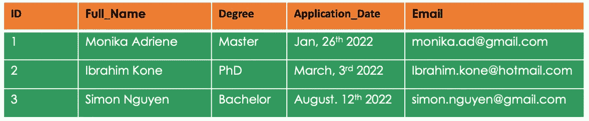
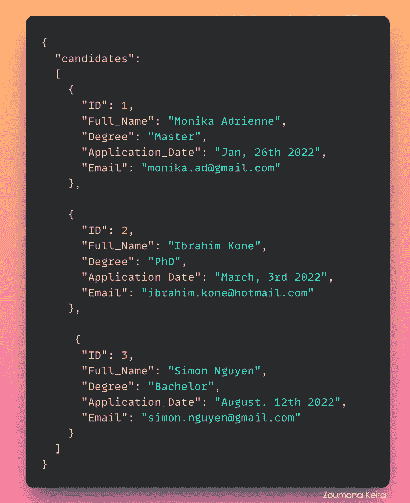

# 为我的项目选择正确数据库的指南:MongoDB 与 MySQL

> 原文：<https://towardsdatascience.com/the-guide-to-choosing-the-right-database-for-my-project-mongodb-vs-mysql-256e270d29b8>

## 本文是一个全面的指南，可以帮助您为自己的用例选择合适的数据库类型

图片由 [Daniil Silantev](https://unsplash.com/@betagamma) 在 Unsplash 上提供

# 介绍

数据类型(如关系型和非关系型)的不断变化是公司在实施数据驱动型应用程序的过程中面临的众多挑战之一，因此更难选择正确的数据库类型。

这个概念博客将试图让你的决策过程不那么繁琐，特别关注 MongoDB 和 MySQL，这两个数据库在各自的 web 应用领域中是最受欢迎和最具竞争力的。

我们将首先提供每个数据库的清晰定义。然后，我们将深入指导您为您的使用案例选择正确的解决方案。在最后一节中，我们将介绍一种技术，它可以帮助您轻松有效地管理应用程序的管理面板。

# MongoDB 和 MySQL 的快速概述

在深入对比分析之前，我们先了解一下 MySQL 和 MongoDB 数据库是什么。

## 什么是 MySQL？

MySQL 是一个开源的关系数据库管理系统(简称 RDBMS ),将数据存储在表和行中。MySQL 使用结构化查询语言(SQL)范式与数据进行交互，以访问和传输数据。下表可以说明关系数据。

结构化格式的假想候选人信息(图片由作者提供)

MySQL 最初创建于 1995 年，目前由 Oracle 拥有和维护。MySQL 中的“My”是一个开发者女儿的简称。

## 什么是 MongoDB？

MongoDB 是一个开源的非关系数据库管理系统(简称 DBMS)。

MongoDB 最初创建于 2007 年，旨在提供存储海量数据的可伸缩性和敏捷性。“Mongo”一词来源于“humongous”这个方面。

它是面向文档的，这意味着它可以将数据存储在单个文档中。这些文档类似于 JSON，如下所示。

非结构化格式的假想候选人信息(图片由作者提供)

# 什么时候应该使用 MongoDB 或 MySQL？

MongoDB 和 MySQL 都是很棒的数据库，为企业和小型企业提供了突出的优势。因此，它们之间的选择很大程度上取决于它们所应用的用例。在本节中，我们将帮助您获得做出正确选择的所有工具。

## 什么时候应该使用 MongoDB？

在以下情况下，MongoDB 应该是数据库的首选:

→ 🤷🏻‍♂️你 ***不知道你的应用将来会如何演变*** 。在这种情况下，您可能需要一个动态数据结构，这样您就可以在需要时添加新数据，而不用担心一个简单的更改会破坏整个系统。

→ ✅你 ***想构建具有即时访问和数据恢复需求的现代 web 应用*** 。这一点很重要，因为 MongoDB 在全球不同的服务器上保留了相同数据的冗余副本，这使得它具有容错性，因为单个服务器故障不会影响应用程序。

→ 🚀 ***速度是您最关心的问题*** ，因为 MongoDB 将信息存储在单个文档中，这使得读写操作比处理可能需要多个连接来检索所需数据的关系数据库更快。

→ 💵你 ***关心定价，没有足够的预算*** 由于 MongoDB 是开源的，所以能够完全免费实现。

→ 📈您的 ***应用程序需要按需扩展*** 。MongoDB 可以保证这一点，因为它可以跨多个服务器扩展以存储和处理数据，以便随着性能要求和数据量的增长而自动适应，而不是投资非常昂贵的大型机。

→ 🌏您 ***需要将您的应用程序部署为服务*** 。这项功能是由 MongoDB Atlas 提供的，它帮助用户通过多个云供应商(如 Amazon Web Services、Google Cloud 和 Microsoft Azure)将 MongoDB 作为数据库即服务来使用，而无需担心管理数据库的过程。

实现 MongoDB 的一些用例是物联网(IoT)、移动应用程序、实时分析、产品目录等。

## 什么时候应该使用 MySQL？

与 MongoDB 类似，MySQL 最流行的用例也是基于 web 的应用程序。但是，在以下情况下，您应该选择 MySQL:

→ 🎯你是 ***在处理一个固定的关系数据模式*** ，你确定它在很长一段时间内都不会改变。

→ 🎬您正处于业务的早期阶段， ***没有太多的可伸缩性和分布限制，也没有太多的数据库管理专业知识*** ，因为 MySQL 易于使用，并且要求较低的可定制性，这意味着用户需要复杂支持的机会较少。

→ 💵你关心定价，但没有足够的预算，因为 MySQL 也是开源的，这使得完全免费实现它成为可能。

→ 🔐 ***安全性是您的应用程序的一个大问题*** 因为即使 MySQL 在数据一致性和可靠性方面也超过了 MongoDB。

除了 web 应用程序开发，MySQL 的另一个主要用例是存储事务数据库、电子商务门户开发、概念验证项目等。

# 如果您不想担心管理数据库的问题，该怎么办？

无论您是在处理 MongoDB 还是 MySQL，您都必须在某个时候处理数据库管理。

> 如果您只想专注于您的业务专长，而不担心管理数据库，该怎么办？

→这就是像`[ForestAdmin](https://www.forestadmin.com/)`这样的工具派上用场的地方！

在本节中，我们将清楚地了解什么是 ForestAdmin 以及它是如何工作的。

## 什么是 ForestAdmin？

该解决方案通过提供一个管理[所见即所得](https://en.wikipedia.org/wiki/WYSIWYG) 界面编辑器来增强用户的能力，该编辑器通过一个基于 API 的框架来管理他们的应用程序，以帮助实施任何特定的业务任务，例如从关系和非关系数据库中创建、读取、更新和删除(CRUD)。

## ForestAdmin 是如何工作的？

ForestAdmin 基于以下两个主要组件的交互工作:

*   `**Forest Liana**`，它是一个托管在用户站点上的本地后端，用于分析全部数据并生成用于管理目的的 API 凭证。
*   `**Forest UI**`对应的是一个软件即服务的 web 应用程序，可以从任何浏览器访问，它的目标是使用之前生成的 API 在管理员用户和数据库之间建立通信。

ForestAdmin 使用两步身份验证来帮助管理员用户以安全的方式连接到 Forest Admin 的服务器和 API。

如今，数据隐私对于任何组织来说都是一个大问题。ForestAdmin 使用一种架构来解决这个问题，这种架构将您的数据直接传输到您的浏览器，使其对服务器不可见。

# 结论

这个概念博客通过提供它们如何工作的全球概述，涵盖了 MongoDB 和 MySQL。然后，它提供了一步一步地帮助您选择适合您的用例的数据库。最后，它涵盖了有效管理应用程序的最伟大的技术之一。

下一步将通过完整的分步教程对 ForestAdmin 进行深入解释。

你可以通过下面的链接进一步阅读。还可以在 YouTube[上关注我，了解更多互动内容。](https://www.youtube.com/channel/UC9xKdy8cz6ZuJU5FTNtM_pQ)

*   [为您的所有数据构建一个内部工具](https://www.forestadmin.com/)
*   [构建更快，构建更智能](https://www.mongodb.com/)
*   [MySQL 文档](https://dev.mysql.com/doc/)
*   关于 [ForestAdmin](https://blog.forestadmin.com/mongodb-vs-mysql/) 的原始简化出版物
*   *免费试用森林管理*并链接到[以下网址](https://app.forestadmin.com/signup?utm_source=referral&utm_medium=medium&utm_campaign=blog-mysql-vs-mongodb&utm_content=blog-mysql-vs-mongodb)。