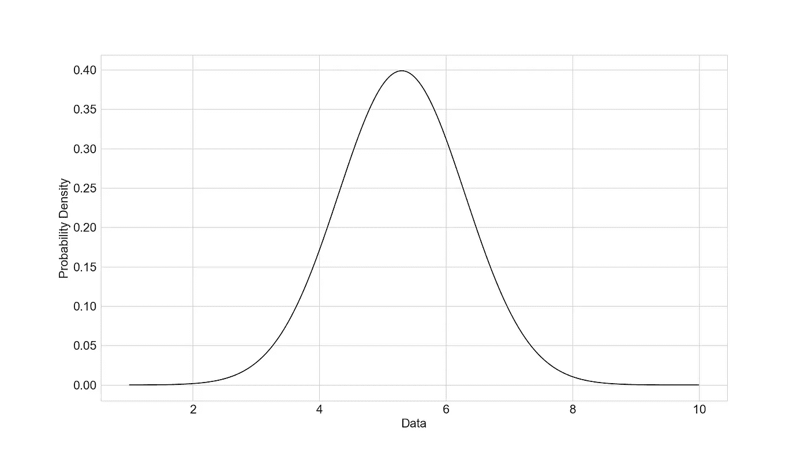

# 阻碍不同员工成功的隐藏偏见

> 原文：<https://towardsdatascience.com/the-hidden-biases-keeping-diverse-employees-from-success-d5180dce844>

## 一些鲜为人知的数学概念是如何阻碍不同的员工获得公平的机会的

有一种观点认为，商业上，或者说生活中成功的主要决定因素是努力工作和一点点运气。人们会说他们只是碰巧在正确的时间出现在正确的地方，或者他们的努力最终得到了回报。

我不会试图阻止你这样做——努力工作和运气是人生成功的关键因素。但是这种运气从何而来？什么因素导致某人在工作中得到“幸运的突破”,你如何从某人在其职位上的实际表现水平中理清这一点。

让我们从讨论一些你可能没听说过的事情开始:**马太效应**

# 马太效应

因为凡有的，还要加给他，他就有馀了。没有的，连他所有的也要夺去。

— [马修](https://en.wikipedia.org/wiki/Gospel_of_Matthew%20%22Gospel%20of%20Matthew) 25:29，RSV

马太效应是一个经济概念，以耶稣的一个寓言命名，假设一个人在生活中获得更多的东西，如声望、财富、地位等，他们在这些东西上增加的概率也增加。这真的是对世界运行方式的描述不是吗？当某人开始获得成功时，你经常会看到这种成功滚雪球般变成进一步的成功，然后滚雪球般变成其他的成功，直到这个人觉得成功几乎是不可避免的。

## 为什么会这样？

**考虑以下场景:**

简和杰克都在争取升职，他们都是同样熟练的员工，但他们之间有一个关键的区别:**杰克在**之前已经在公司得到了提升，所以当杰克和简都去和他们的经理谈话时，有趣的事情发生了…

杰克更有可能冒险。

杰克以前在公司内获得过成功的晋升，他更有可能提出大胆的想法，因为毕竟这种想法上次对他有效，所以他觉得没什么可失去的。之前在组织中的成功使杰克在组织中的安全感产生了心理上的转变，这推动了他的前进并影响了他未来的行动。

现在简。

简作为一名从未被提升过的员工，会比杰克更担心地加入谈话。她会更加自我怀疑，更加自我批评。她还没有获得“心理资源”来让自己更多地参与进来，所以她不想在谈话中冒太多风险，因为她个人觉得她会失去更多东西。

这就是马太效应

就像一个富人比穷人有更多的资源来冒险，所以他们有更大的潜在回报而不用担心破产一样，在一个组织中拥有更多心理资源的人将在晋升、认可和成功方面拥有更多优势。

这一概念与优先依附的想法紧密相连——实际上它们可以被认为是同一件事。

# 优先附件

优先依附的想法来自于长尾分布或**幂律**分布的数学概念。幂律分布描述事件超出典型正态分布的情况。正态分布是你习惯看到的典型的“钟形曲线”。



由作者创建

这个钟形很好地描述了人类的智力。平均智商集中在 100 点左右，然后两边急剧下降。一个类似的图表可能描述了美国的平均寿命——大约 76 岁的集群和两边的概率悬崖。

正态分布的信息通常有一个适当的尺度——某人只活到 5 岁被认为是悲剧，某人活到 100 岁被认为是非凡和令人惊讶的。

然而，正如我们所知，生活中有些东西不是正态分布的。事实上，生活中有些东西的分布方式甚至没有一个我们容易归类的尺度。他们似乎还在继续。这种模式就是幂律分布。

在美国，平均年收入约为 6.3 万英镑，但因为这是一个幂律分布，我们可以理解将有许多人高于或低于这一平均值。事实上，三分之二的美国人收入低于平均水平。在美国，有些人的收入如此之高，以至于他们甚至无法在这样的图表中找到合适的位置。他们打破了尺度。

## 优先附加描述了复合成功的数学模型。

基本上，有钱的越来越有钱，该升职的越来越升职。

收视率最高的电视节目收视率最高，Instagram 上最受关注的影响者最有可能获得新的关注者，最受尊敬的公司获得最多的申请人。

# 复合偏见的危险

现在我们知道了一个真实的现象，即个人已经取得了成功，而组织继续取得成功，这也应该很清楚，这是一个危险:**被机会忽略的个人，在概率上是非线性的，在未来有被忽略的危险**

偏见越来越多。

在一个组织内，如果招聘经理的偏见或招聘人员的偏见对多元化的候选人不利，那么这些偏见可能会继续对该个人产生影响，由于偏好依附和马太效应，它们可能会导致为员工创造平等机会的难度增加。

**考虑以下场景:**

我们回到杰克和简。想象一下，如果他们两个都想当 CEO。

在一个简单的数学模型中，我们可以将杰克和简的晋升机会建模为一个概率事件。每次他们获得提升时，都有 50%的提升机会.一个人可能需要 15 次晋升才能成为首席执行官，而一个人需要抓住每一次晋升机会才能成为首席执行官。

使用这个模型，我们可以将 Jane 晋升的机会设定为 40 %, Jack 晋升的机会设定为 50%——这是相当慷慨的，因为一些数据暗示女性的机会要低得多。

```
Jack  =  .5^15 = 0.000031Jane = .4^15 =0.000001
```

晋升率 10%的差异在高层变成了近 30 倍的差异。

# 关键要点:

- **在组织中获得晋升的个人将更有可能在组织中继续获得晋升。**为了确保员工得到公平的评判，有效的绩效评定指标是必不可少的。

- **小小的偏见会产生巨大的影响。**查看你的数据，真正了解你的不同人口统计群体相对于其他群体被提升的可能性，并试图了解如何解决这些偏见。

- **需要有意识地建立心理资源(心理安全、信心)来创造公平的竞争环境**——明确基于先前成就的晋升没有障碍。每个晋升周期都是一张白纸。

# 让我们来谈谈你

最后，我希望您对相对未知的小因素如何在组织中产生巨大影响有一个更清晰的认识。最终，复合偏差意味着员工获得公平晋升的机会可能取决于他们进入组织的初始条件或他们以前在组织中的成功。

因此，当你评估招聘实践、绩效管理实践或仅仅是你自己的职业生涯时，考虑一下形势会如何对你有利或不利。

如果你喜欢这篇文章，[请订阅我的时事通讯](http://stevenshoemaker.me)或者在这里关注我！