# 可解释人工智能对人类检测人工智能盲点能力的影响

> 原文：<https://towardsdatascience.com/the-impact-of-explainable-ai-on-the-ability-of-humans-to-detect-blind-spots-in-ai-6e991da400b3>

## 人与人工智能互动研究及 XAI 的贡献

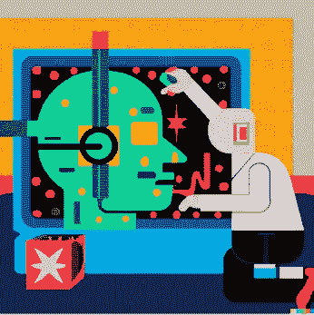

图像是使用 [DAllE-2](https://openai.com/dall-e-2/) 生成的

**TL；** 在一句俏皮话中，我的研究检验了向用户提供对人工智能决策的解释是否会影响用户识别人工智能是否有盲点的能力。

在数据科学的背景下，盲点是指人工智能由于对环境的有缺陷的表示而产生系统性错误的情况，这可能导致错误的决策和非最优的结果。关于可解释的人工智能，这个领域正在成为数据科学生命周期不可或缺的一部分，并被假设为支持数据科学家对 ML 模型决策的理解。

**关于研究**

在研究过程中，进行了两项研究，都是在自主车辆(AV)领域；参与者被要求观看一个在高速公路上驾驶时做出决策的模拟视频。

第一项研究调查了参与者在多大程度上发现了 AV 是否有盲点。第二项研究检验了为 AV 决策提供 XAI，特别是奖励分解解释，是否会提高参与者发现 AV 盲点的能力。

结果表明，参与者能够区分有盲点和无盲点的 AV，但 XAI 并没有显著改善他们对人工智能盲点的评估。然而，XAI 与学习 AV 决策的时间增加有关。

**快速介绍**

**人机协作**

人类-人工智能合作是一个相当宽泛的术语，它解决了人类和人工智能算法之间的各种交互，旨在实现一个共同的目标。这种合作涉及各个方面，涉及每一方的角色、人工智能的人类心智模型(Bansal 等人，2019 年)和任务的领域。理想的合作有望产生互补的团队绩效，有望超过各方单独的绩效(Wilder，Horvitz 和 Kamar，2020)。在实践中，很少实现互补性能，在某些情况下，联合努力甚至不如单独的人工智能性能(Bansal 等人，2020)。

与人类相比，人工智能算法执行给定任务的高级能力导致对互补性能的追求集中在另一个方面，即更好地监控人工智能代理的行动。换句话说，获得互补性能的一个潜在方法是利用人的能力来识别代理的弱点并决定如何正确地行动。

**可解释的艾(XAI)**

*图片来自 [Pexels](https://www.pexels.com/) 的 [energepic](https://www.pexels.com/@energepic-com-27411/)

近年来，XAI 领域的研究越来越受到人们的关注。XAI 的主要目标之一是以各种方式解决机器学习算法的不透明性。DARPA(国防高级研究计划局)将 XAI 定义为“能够向人类用户解释其基本原理，描述其优势和弱点，并传达对其未来行为方式的理解的人工智能系统”(Gunning 等人，2019)。

解释方法的一个例子是可视化哪些输入特征对于分类器是重要的图形(Lundberg & Lee，2017；里贝罗、辛格和盖斯特林，2016 年)。

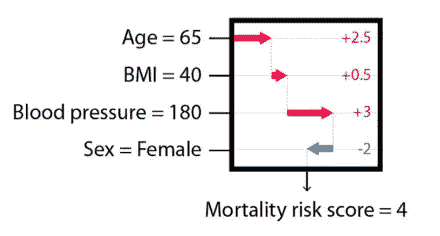

*可视化哪些输入特征对分类器重要的解释(* [*Lundberg SM 等人，2020*](https://www.nature.com/articles/s42256-019-0138-9) *)。*

虽然 XAI 方法似乎很有前途，但它们尚未证明如预期的那样有效(Kaur 等人，2020)。此外，解释可能会给用户带来过多的信息，使其难以将呈现的内容转化为有价值的见解(Poursabzi-Sangdeh，Goldstein，Hofman，Vaughan 和 Wallach，2018)。在其他情况下，用户往往不会投入所需数量的精神资源，而在这种情况下，为了充分理解 AI 的帮助，这些精神资源往往是必要的。

**关于 XAI 对人类心智模式影响的理论综述**

XAI 领域的大部分研究依赖于评估人类对该系统的心理模型。系统的心智模型是人-人工智能交互领域的基本理论构造。这个结构被定义为“人类能够产生的机制:(1)对系统目的的描述，(2)对系统功能和观察到的系统状态的形式解释，以及(3)对未来系统状态的预测(Rouse & Morris，1985)。心智模型的结构是一个动态的结构，受与系统交互的影响(Gentner，2014)。一个精确的心理模型被假设来帮助用户判断何时信任或忽略人工智能的帮助。

**盲点**

盲点是一个相当宽泛的术语，可以定义为一个人无法进行判断或辨别的区域。盲点是指决策者没有意识到决策过程中涉及的某个方面，从而导致做出非最优决策。在人工智能的背景下，盲点通常被定义为状态空间中的区域，其中代理人在现实世界中犯下系统错误，导致相当大的负面奖励(Ramakrishnan 等人，2019)。

盲点示例—一辆不区分紧急车辆和非紧急车辆的特斯拉。*照片由来自 [Unsplash](https://unsplash.com/) 的 [Josh Couch](https://unsplash.com/s/photos/josh-couch) 拍摄。

**当前研究**

这项研究旨在检验 XAI 是否能够促进人类识别人工智能盲点的能力，从而改善人类与人工智能的合作。这项研究扩展了研究的范围，通过比较 XAI 对人工智能的人类心理模型的影响，当处理有盲点的人工智能和没有盲点的人工智能时。

*主要研究问题有:*

(1)参与者能否区分有盲点和没有盲点的人工智能？

(2)XAI 能影响参与者区分有无盲点的人工智能的能力吗？

**实验领域**

*照片由 [Pavel Danilyuk](https://www.pexels.com/@pavel-danilyuk/) 从 [Pexels](https://www.pexels.com/) 拍摄。

最近，人们对自动驾驶汽车(AV)技术越来越感兴趣，这将极大地影响我们的驾驶行为。将一名人类驾驶员放入 AV 中，监控 AV 的决策，理解其决策并知道何时信任它是至关重要的。在高速公路上尤其如此，因为错误决策的代价可能是巨大的。

为了这项研究的目的，开发了一个基于自主车辆(AV)概念的虚拟模拟。该模拟示出了在三车道高速公路场景中导航的 AV，旨在完成道路行程，同时最小化行程持续时间并最大化与其他车辆的安全距离。该模拟提供了一个鸟瞰的 AV，以及其他几个传统的，人类驾驶的车辆(HDV)。

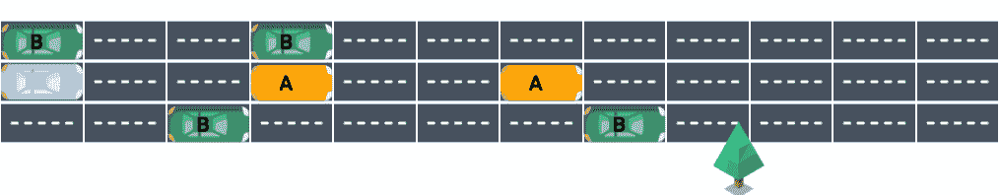

高速公路场景的图解。蓝色车辆代表 AV。

为该场景定义了三种不同的驾驶风格:标准、缓慢和危险驾驶风格。

**AV 的政策**

对于这个实验，我模拟了一个人工智能代理，而不依赖于真正的强化学习算法。AV 的策略是通过开发描述 AV 策略的决策树来设计的。定义 AV 策略的好处是控制策略的复杂性及其盲点。收到的 AV 奖励由两个子分数组成— (1)安全驾驶分数和(2)接近目的地分数。

**AV 的盲点**

我选择把重点放在人类驾驶的车辆的驾驶风格作为一个盲点。这一特定特征被选作盲点，因为与监控 AV 决策的人类驾驶员相比，AV 要考虑这一点相当现实且相当复杂。

带盲点的 AV 和不带盲点的 AV 之间的区别在于，带盲点的 AV 不区分车辆的驾驶风格，而不带盲点的 AV 可以正确地考虑其他车辆的未来位置。如下图所示，具有盲点的 AV 认为所有车辆都具有与“车辆 A”相同的驾驶风格。这种差异会影响 AV 的决策，因为它可能会导致车辆在缓慢行驶或错过移动到不太繁忙的车道的机会后被延迟。

两种自动驾驶汽车的区别:

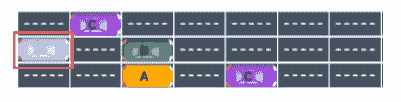

(1)没有盲点的 AV

(2)一部有盲点的 AV。

**模拟**

模拟包括 4 个场景，其中包括若干次试验；这些场景被设计为离散的顺序决策任务，其中 AV 呈现有一系列决策点，每个决策都导致后续的决策点。AV 可以执行 5 个动作:(1)加速，(2)减速，(3)换到左侧车道，(4)换到右侧车道或者(5)保持相同的速度和车道。

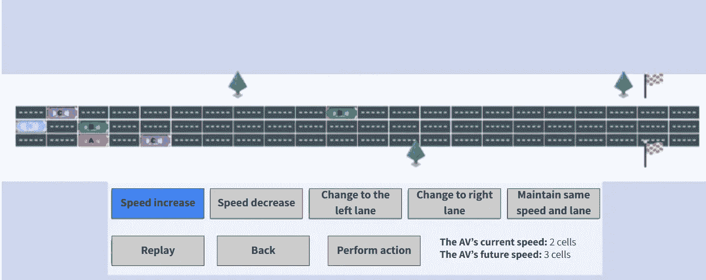

截图场景对场景的第一次测试，是主任务的一部分。该图像将高速公路可视化，包括 AV(蓝色汽车)和人类驾驶的车辆(HDV)。

**主要测量值**

***直接盲点估计。*** 旨在明确评估参与者是否识别 AV 盲点的测量。参与者被要求评价 AV 在多大程度上考虑了前方车辆的驾驶风格。

***预测正确性。*** 一种旨在评估参与者在多大程度上可以预测 AV 的动作的测量。

**参与者** 共有 163 名参与者参与了研究，其中 66 人自愿无偿参与实验，其余人参与是为了获得课程学分。

**实验设计**

用于本实验的受试者间设计，其中参与者被随机分配到两种条件之一——“有盲点的 AV”条件或“没有盲点的 AV”条件。两种情况的唯一区别是 AV 的决策是主要任务的一部分。主要任务的目标是使参与者能够推断出 AV 对公路的各种状态做出什么决定。

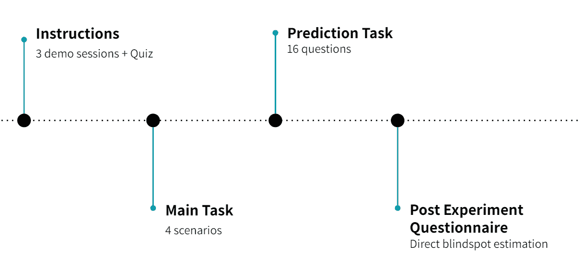

实验程序的说明。

**实验 1 —结果**

**盲点估计** —发现两组之间有显著差异(p < .001)。

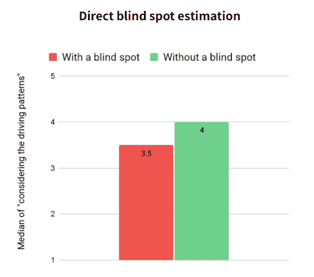

盲点估计结果。关于“AV 在多大程度上考虑了 HDV 的驾驶风格”这一问题的试验条件差异报告。

**预测任务**

可以证明,“没有盲点的 AV”组中的参与者的平均正确反应率高于“有盲点的 AV”组中的参与者的平均正确反应率。(p = .003，d=0.52)。

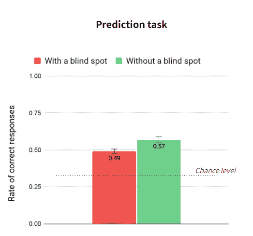

预测任务结果。实验组的准确率差异被用来预测给定一系列状态时 AV 会采取什么行动。

**研究 1 结论**

研究结果表明，参与者已经区分了有盲点和无盲点的 AI，这得到了先前研究的支持，该研究发现，参与者能够识别哪个 Atari 代理因盲点而发生故障(Olson 等人，2021)。关于预测任务，两组都预测了人工智能的决策高于机会水平。这一发现意味着，在某种程度上，与人工智能的互动足以理解人工智能政策的某些方面。

根据这些发现，剩下的问题将是——当与人工智能合作时，如何提高人类识别人工智能盲点的能力。这个问题让我们检验了向参与者提供一种可解释的人工智能技术，特别是“奖励分解解释”，是否会促进他们区分有盲点和无盲点的人工智能的能力。

**研究 2——概述和研究问题**

在这项研究中，我调查了向参与者提供解释是否会提高他们对人工智能代理决策的理解。更具体地说，我研究了当面对 XAI 时，参与者对人工智能盲点的估计和对其决策的预测是否更准确。

我用来描述自主车辆(AV)决策的解释技术被称为奖励分解解释。奖励分解解释反映了 AV 在场景结束时预测的未来累积分数。给定一个决策点，解释详细说明了三种可能行动的未来预测得分。此外，解释详细说明了每个子分数对未来预测分数的贡献。详细说明了两个子分数:(1)行程持续时间和(2)安全性。

使用奖励分解解释背后的基本原理是，当处理真实环境时，基于任务的子分数可以对应于 AI 试图实现的两个不同的目标。例如，在真实环境中，AV 可以被编程以实现多个目标，例如(1)安全驾驶，(2)在合理的时间内到达目的地，(3)遵守驾驶规则，(4)最小化燃料使用等等。

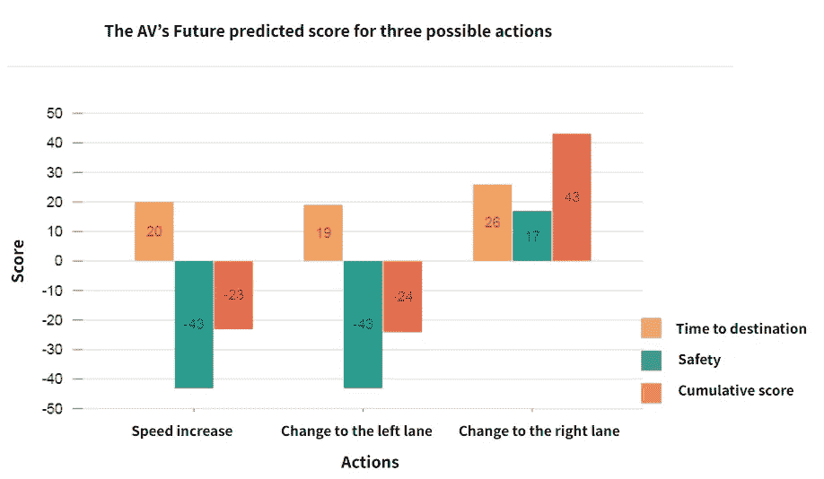

奖励分解解释的一个例子。

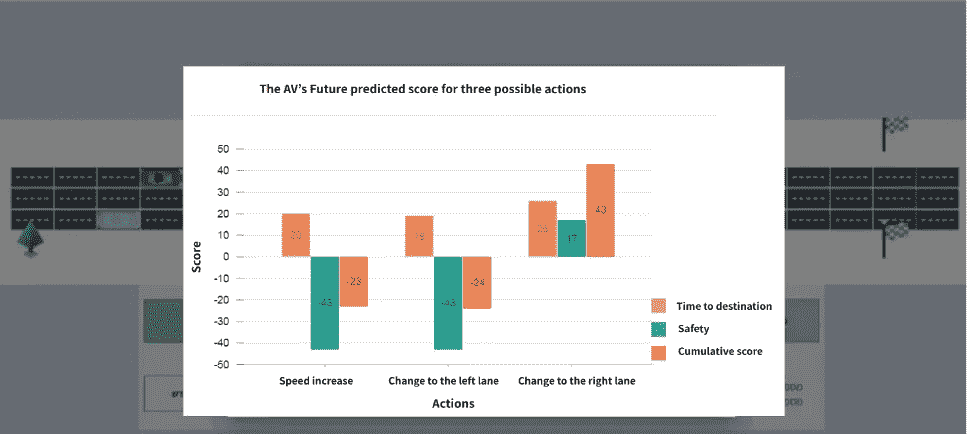

上面的屏幕截图说明了提供给参与者的解释，而下面的屏幕截图说明了如何将解释传达给参与者。

**研究 2 —方法**

共有 155 名参与者参与了这项研究，其中 46 人自愿自由参与实验，而其余的人是为了课程学分而参与的。

**测量值**

***直接盲点估计+预测正确性。*** *同实验 1。*

***间接盲点估计。***

**程序**

该程序与研究 1 的程序基本相同

**研究 2 —结果**

**直接盲点估计**

在“无盲点 AV”的参与者中，获得 XAI 的参与者的中位数略高。在“有盲点的 AV”的参与者中，获得 XAI 的参与者的中值评级是相同的。

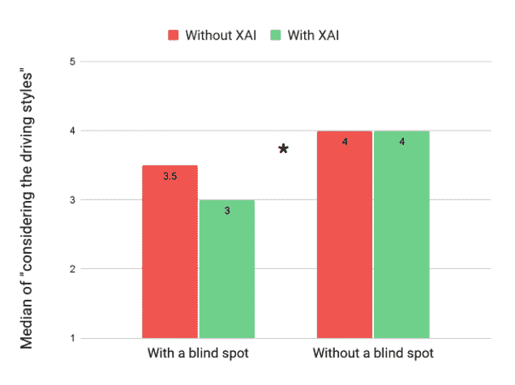

直接盲点估计报告。该图表描述了关于 AV 考虑其他车辆驾驶风格的程度的参与者中间值之间的差异。

**间接盲点估计**

在“AV 无盲点”组和“AV 有盲点”组的参与者中，获得 XAI 的参与者的平均评级略低。

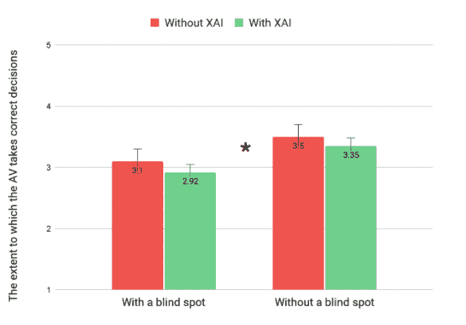

间接盲点估计报告。参与者报告之间的差异，涉及 AV 在多大程度上会针对一组状态做出正确的决定。

**预测任务**

在“没有盲点的 AV”的参与者中，获得 XAI 的参与者的平均正确率更高。在“有盲点的 AV”的参与者中，获得 XAI 的参与者的平均正确率较低。

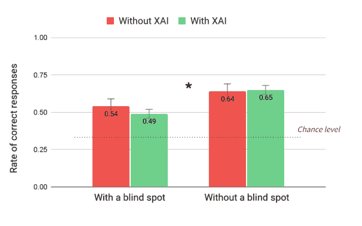

预测任务准确度。参与者在预测任务中准确性的差异。

**试用时间**

每种情况下观看审判的平均时间是分开计算的。这项计算只包括看 AV 的时间，而不包括参与者看 XAI 的时间。

可以看出，在每种情况下，观看试验的平均时间随着时间的推移而减少，与另一组相比，参与者观看 XAI 的 AV 的平均时间较高。

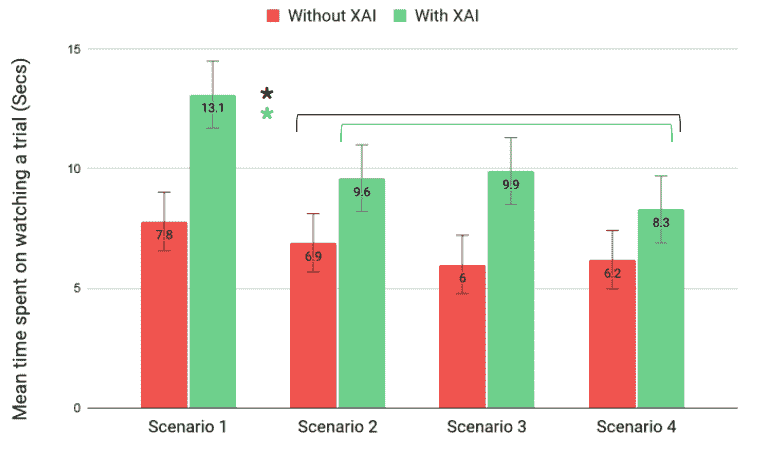

观看不同情景下的单个试验所花费的平均时间。与没有配备 XAI 的参与者相比，被分配到配备了 XAI 的 AV 组的参与者平均每次试验花费的时间更长。

**讨论和研究的主要目标**

这项研究的重点是人类是否可以识别人工智能的盲点，以及 XAI 是否可以帮助理解人工智能是否有盲点。从当前的研究中可以得出的主要结论是:(1)参与者可以区分有盲点和无盲点的人工智能。参与者可以将没有盲点的人工智能描述为比有盲点的人工智能更多地考虑其他车辆的驾驶风格，因此比有盲点的人工智能做出更好的决策。(2)当向参与者提供了奖励分解解释时，参与者没有表现出改进的表现。

**理论和实践意义**

关于为什么奖励分解解释没有促进更好地识别这项研究中的盲点，可能有几种可能的解释。XAI 的认知过程可能依赖于 XAI 的内容以及它被利用和推广到其他情况的方式。从理论的角度来看，解释人工智能以开发人工智能的准确心理模型，取决于一个人的感知、认知能力、期望和经验。

针对 XAI 技术，根据研究结果，奖励分解解释技术不能推广到其他决策点和状态。在 XAI 上花费的时间和参与者的准确性之间缺乏显著的相关性，这表明应该检查 XAI 技术的内容和向参与者传达它的方式。一个可能的含义是，如果我旨在向参与者提供对人工智能盲点的理解，我应该使用支持全局理解的解释，这种理解支持演绎推理，而不是提供支持归纳推理的局部解释。

**人类对任务的参与以及他们对人工智能的心智模型**

参与者花费在与 XAI 相关的主要任务上的认知努力可以以多种方式解释，这也可能表明参与者愿意更好地理解人工智能的决定。虽然目前的研究结果没有为这种说法提供坚实的基础，但这些结果可能会间接表明 XAI 与短期的参与度增加有关。

**限制**

目前的研究有几个局限性:

(1)与人工智能的交互量是有限的，以便实验可以在合理的时间内进行。

(2)我模拟了一个不一定具有最优策略的人工智能代理。这影响了奖励分解解释的计算方式，并可能影响参与者区分人工智能错误根本原因(非最优策略或实际盲点)的能力。

(3)从方法论的角度来看，与要求参与者比较两个代理的性能的先前研究相反，当前研究中的参与者仅观察到一个代理(有或没有盲点)。如果不与另一个人工智能代理进行比较，参与者可能很难评估人工智能代理的性能，并估计它是否有盲点。

**未来研究**

主要的公开问题是为什么参与者不能从 XAI 中受益，尽管研究结果表明他们愿意花费认知资源，如增加观看主要任务和重新播放场景的时间。未来的研究方向可以集中在 XAI 技术的检查和影响 XAI 心理过程的知觉和认知方面。

**个人动机**

今年早些时候，我从 Technion 毕业，研究人机交互和可解释的人工智能。

*在这篇博文中，我简要描述了我的研究论文，该论文是在 Avi Parush* *副教授和 Ofra Amir****副教授的指导下完成的。非常感谢他们在整个研究过程中给予的指导和支持。***

除非另有说明，所有图片均为作者所有。

**参考文献**

Bansal，g .，Nushi，b .，Kamar，e .，Lasecki，W. S .，Weld，D. S .，& Horvitz，E. (2019)。超越准确性:心智模型在人-人工智能团队绩效中的作用。人类计算和众包 AAAI 会议记录，7(1)，19。

班萨尔，g .，吴，t .，朱，j .，福克，r .，努什，b .，卡马尔，e，…韦尔德，D. S. (2020)。整体是否超过其部分？人工智能解释对互补团队绩效的影响。1(1), 1–26.

根特纳博士和史蒂文斯。).(2014).心智模型。心理学出版社。

Gunning，d .，Stefik，m .，Choi，j .，Miller，t .，Stumpf，s .，和 Yang，G. Z. (2019)。XAI-可解释的人工智能。科学机器人学，4(37)，0–1。

Kaur，h .，Nori，h .，Jenkins，s .，Caruana，r .，Wallach，h .，和 Vaughan，J. W. (2020 年)。解读可解释性:理解数据科学家对机器学习可解释性工具的使用。1–14.

Lundberg，S. M .，& Lee，S. (2017 年)。解释模型预测的统一方法。(第 2 节)，1–10。

奥尔森，M. L .，卡纳，r .，尼尔，l .，李，f .，，黄伟光(2021)。基于生成深度学习的强化学习主体的反事实状态解释。人工智能，295，103455。

Poursabzi-Sangdeh，f .，Goldstein，D. G .，Hofman，J. M .，Vaughan，J. W .，& Wallach，H. (2018 年)。操纵和测量模型的可解释性。

Ramakrishnan，r .，Kamar，e .，Nushi，b .，Dey，d .，Shah，j .，和 Horvitz，E. (2019)。克服现实世界中的盲点:利用互补能力进行联合执行。IAAI 2019 和第九届 AAAI 人工智能教育进步研讨会，EAAI 2019，6137-6145。

里贝罗，M. T .，辛格，s .，& Guestrin，C. (2016)。“我为什么要相信你？”解释任何分类器的预测。ACM SIGKDD 知识发现和数据挖掘国际会议论文集，13–17-Augu，1135–1144。

劳斯，W. B .，，莫里斯，N. M. (1985)。《透视黑箱:寻找心智模型的前景和局限》(DTIC AD-A159080)。佐治亚州亚特兰大:佐治亚理工学院。

b .怀尔德、e .霍维茨和 e .卡马尔(2020 年)。学习与人类互补。