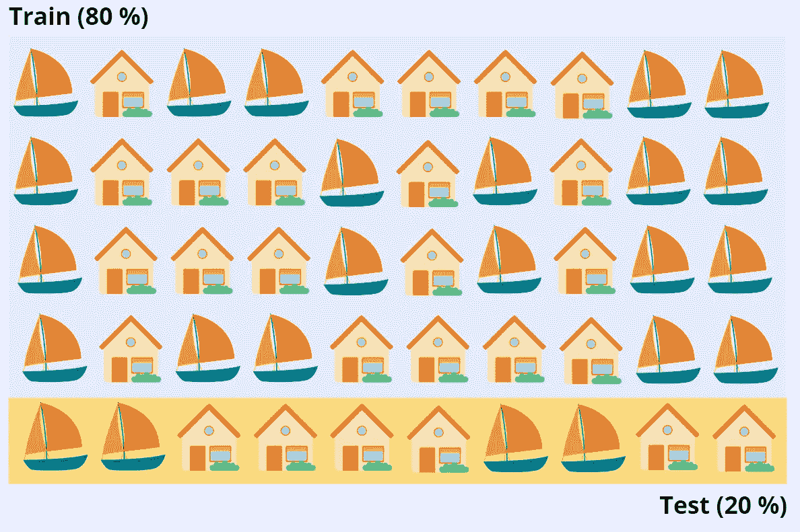
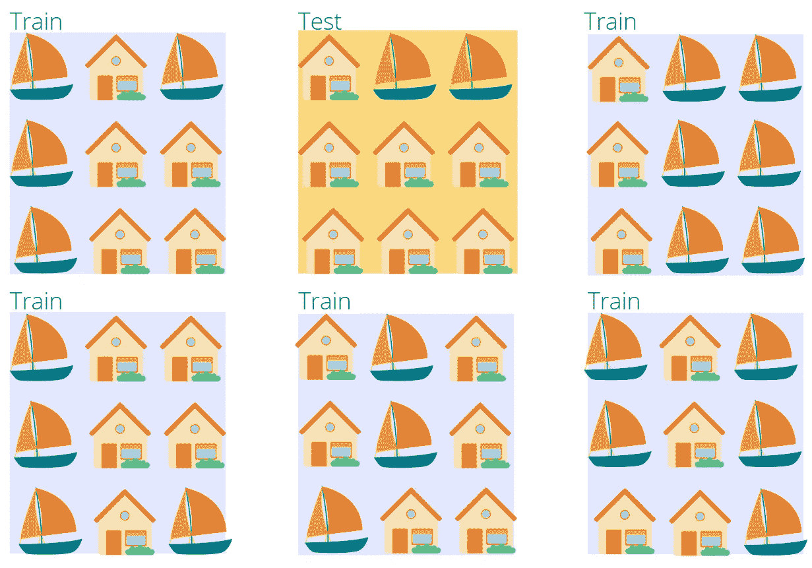

# 交叉验证在机器学习中的重要性

> 原文：<https://towardsdatascience.com/the-importance-of-cross-validation-in-machine-learning-35b728bbce33>

## 解释为什么机器学习需要交叉验证，以及如何在 Python 中完成


安娜斯塔西娅·内伦在 [Unsplash](https://unsplash.com?utm_source=medium&utm_medium=referral) 上的照片

交叉验证方法用于测试经过训练的[机器学习](https://databasecamp.de/en/machine-learning)模型，并独立评估其性能。为此，底层数据集分为训练数据和测试数据。然而，该模型的准确性是专门根据测试数据集计算的，以评估该模型对尚未看到的数据的响应程度。

# 为什么需要交叉验证？

为了训练一个通用的机器学习模型，我们需要数据集，以便模型可以学习。目标是识别和学习数据中的某些结构。因此，不应忽略数据集的大小，因为太少的信息可能会导致错误的见解。

然后将训练好的模型用于实际应用。也就是说，他们应该用人工智能以前没有见过的数据做出新的预测。例如，一个[随机森林](https://databasecamp.de/en/ml/random-forests)被训练来根据测量数据将生产零件分类为损坏或未损坏。人工智能被训练有关于以前的产品的信息，这些产品也被唯一地分类为损坏或未损坏。然而，之后，经过全面训练的模型将决定生产中新的、未分类的零件是否完美无缺。

为了在训练中模拟这种场景，数据集的一部分故意不用于人工智能的实际训练，而是保留用于测试，以便能够评估模型如何对新数据做出反应。

# 什么是过度拟合？

有针对性地扣留不用于培训的数据还有另一个具体原因。目的是避免所谓的过度拟合。这意味着该模型对训练数据集的适应性太强，因此对这部分数据提供了良好的结果，但对新的、可能略有不同的数据却不是这样。

这是一个真实的虚构的例子:让我们假设我们想要训练一个模型，该模型应该能够提供完美的床垫形状。如果这个人工智能在训练数据集上训练了太长时间，它可能会结束对训练集特征的加权。这是因为[反向传播](https://databasecamp.de/en/ml/backpropagation-basics)仍然试图最小化损失函数的误差。

在该示例中，这可能导致这样的事实，即主要是侧卧者出现在训练集中，因此模型了解到床垫形状应该针对侧卧者进行优化。这可以通过不将数据集的一部分用于实际训练，即用于调整权重，而仅用于在每次训练运行后针对独立数据测试一次模型来防止。

# 交叉验证是做什么的？

一般来说，交叉验证(CV)是指在训练过程中使用新的、未知的数据来估计模型的准确性或质量的可能性。这意味着在学习过程中已经有可能评估人工智能在现实中的表现。

在这个过程中，数据集分为两部分，即训练数据和测试数据。在模型训练期间使用训练数据来学习和调整模型的权重。反过来，测试数据用于独立评估模型的准确性，并验证模型已经有多好。据此，开始新的训练步骤或者停止训练。

这些步骤可以总结如下:

1.  将训练数据集拆分为训练数据和测试数据。
2.  使用训练数据训练模型。
3.  使用测试数据验证人工智能的性能。
4.  重复步骤 1-3 或停止训练。

要将数据集分成两组，可以根据数据量选择不同的算法。最著名的是坚持和 k 倍交叉验证。

# 拒绝交叉验证是如何工作的？

保持法是获取训练数据和测试数据的最简单的方法。许多人不熟悉这个名字，但大多数人以前都用过。这种方法只保留 80%的数据集作为训练数据，20%的数据集作为测试数据。该分割可以根据数据集而变化。



训练测试拆分示例|来源:作者

虽然这是一个非常简单快速的方法，也是经常使用的方法，但它也有一些问题。首先，训练数据集和测试数据集中的元素分布可能会非常不同。例如，可能会发生这样的情况，船只在训练数据中比在测试数据中更常见。因此，经过训练的模型在探测船只方面非常出色，但会根据其探测房屋的能力进行评估。这将导致非常差的结果。

在 Scikit-Learn 中已经定义了函数，利用这些函数可以在 [Python](https://databasecamp.de/en/python-coding) 中实现拒绝方法(例如 [Scikit-Learn](https://scikit-learn.org/stable/modules/cross_validation.html) )。

```
# Import the Modules
import numpy as np
from sklearn.model_selection import train_test_split
from sklearn import datasets
from sklearn import svm# Load the Iris Dataset
X, y = datasets.load_iris(return_X_y=True)Get the Dataset shape
X.shape, y.shapeOut:
((150, 4), (150,))# Split into train and test set with split 60 % to 40 %
X_train, X_test, y_train, y_test = train_test_split(
X, y, test_size=0.4, random_state=0)print(X_train.shape, y_train.shape)
print(X_test.shape, y_test.shape)Out:
((90, 4), (90,))
((60, 4), (60,))
```

保留交叉验证的另一个问题是，它应该只用于大型数据集。否则，可能没有足够的训练数据来找到统计上相关的相关性。

# k 倍交叉验证是如何工作的？

k-Fold 交叉验证通过允许来自训练数据的数据集也出现在测试数据中来弥补这两个缺点，反之亦然。这意味着该方法也可以用于较小的数据集，并且它还防止了训练和测试数据之间的属性的不均匀分布。

数据集被分成 k 个大小相等的块。随机选择其中一个块作为测试数据集，其他块是训练数据。到这一点，和坚守法很像。然而，在第二训练步骤中，另一个块被定义为测试数据，并且重复该过程。



交叉验证示例|来源:作者

块的数量 k 可以任意选择，并且在大多数情况下，选择 5 到 10 之间的值。过大的值会导致模型偏差较小，但过度拟合的风险会增加。太小的 k 值会导致更有偏差的模型，因为它实际上对应于保留方法。

Scikit-Learn 还提供现成的函数来实现 k 倍交叉验证:

```
# Import Modules
import numpy as np
from sklearn.model_selection import KFold# Define the Data
X = ["a", "b", "c", "d"]Define a KFold with 2 splits
kf = KFold(n_splits=2)# Print the Folds
for train, test in kf.split(X):
    print("%s %s" % (train, test))Out: 
[2 3] [0 1]
[0 1] [2 3]
```

# 这是你应该带走的东西

*   交叉验证用于测试经过训练的机器学习模型，并独立评估其性能。
*   它可以用来测试人工智能对新的，看不见的数据的反应有多好。这个特性也叫做泛化。
*   如果没有交叉验证，可能会发生所谓的过度拟合，即模型过度学习训练数据。
*   最常用的交叉验证方法是保留法和 k 折叠法。

</an-introduction-to-long-short-term-memory-networks-lstm-27af36dde85d>  </understanding-mapreduce-with-the-help-of-harry-potter-5b0ae89cc88>  </a-complete-guide-to-decision-trees-ac8656a0b4bb>  <https://medium.com/@niklas_lang/membership> 