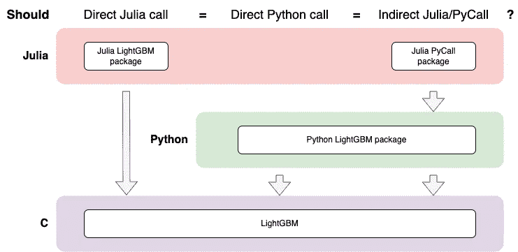
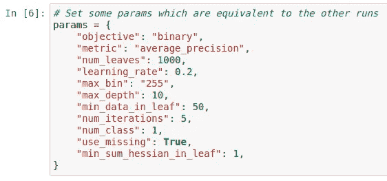
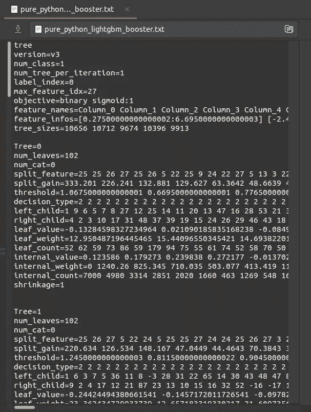
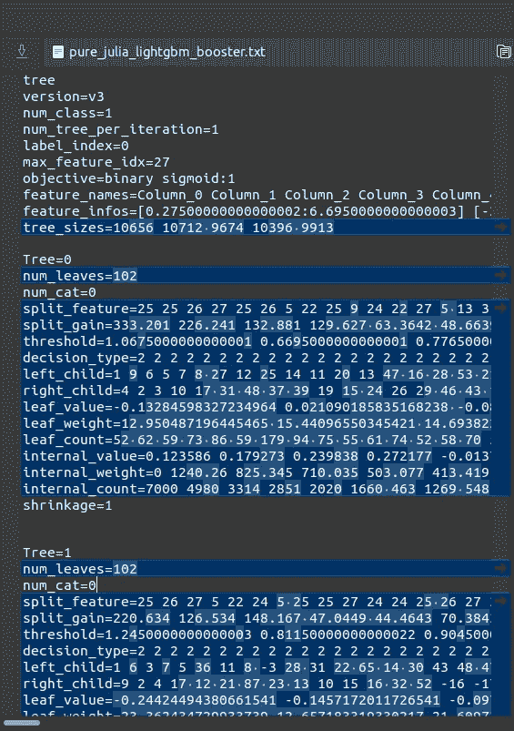
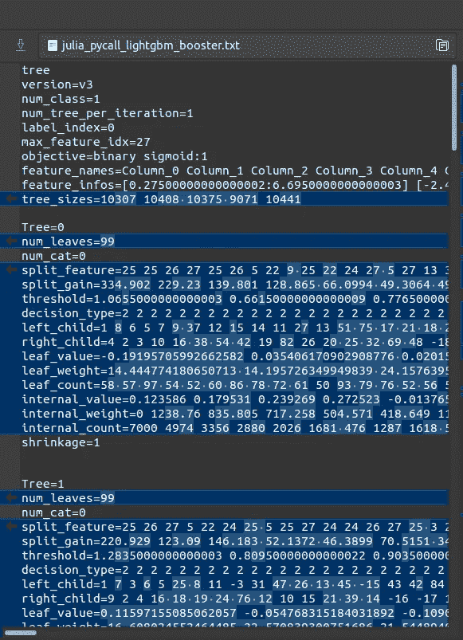

# 亲吻和测试的重要性(当混合编程语言时……以及一般情况下)

> 原文：<https://towardsdatascience.com/the-importance-of-kiss-ing-and-testing-when-mixing-programming-languages-and-in-general-3c20ead71d9f>

## 简单+经过测试的代码=问题更少

[疾控中心](https://unsplash.com/@cdc?utm_source=medium&utm_medium=referral)在 [Unsplash](https://unsplash.com?utm_source=medium&utm_medium=referral) 拍摄的照片

对于那些懒得阅读整篇文章，只想看简短的“执行摘要”的人来说，这个故事的寓意是:

*   [保持简单愚蠢(吻)](https://en.wikipedia.org/wiki/KISS_principle)！我不能过分强调这一点的重要性。你的依赖越少，你需要担心的事情就越少！
*   尽管有时不得不假设所有的包都像包装上描述的那样工作，但是如果可能的话，写一些测试来确认一下是没有坏处的！

# 混合编程语言

根据具体情况，混合编程语言有时是有益的。但是，如果可以用不同的语言分离组件，并将其容器化(例如用 docker ),那将会使生活变得容易得多。因为混合语言通常会带来额外的复杂性，这使得您的应用程序功能更难测试或调试。这不是不可能处理的，但在走这条路之前，你真的应该考虑一下是否值得。

如果你还不知道，那么肯定会有你最喜欢的语言的软件包，可以调用另一种语言并与之接口，如果你想使用另一种语言的一些现成功能，这实际上是非常方便的。一些例子是:

*   PyCall ，这是一个 julia 包，可以用来调用 python 函数
*   [pyjulia](https://github.com/JuliaPy/pyjulia) ，反过来，用 python 调用 julia 函数

这些包旨在提供语言之间的无缝转换，大多数时候都是如此。但是由于每种语言都有自己不同的方式，并且随着语言的不断更新或修补，我们不能排除会有过渡语软件包不能按照我们期望的方式工作的情况。因此，即使一种语言(例如 python)中的函数按照我们期望的方式工作，当通过另一种语言(例如 julia)调用这个函数时，编写等价测试来检查它是否以同样的方式工作也没有坏处(除了多花一点时间)。

# 在 python 和 julia 中使用 LightGBM 的案例研究

这就把我们带到了我们的案例研究，关于如何使用 python 或 julia 调用[光梯度增强机器(LightGBM)](https://lightgbm.readthedocs.io/en/latest/index.html) 。LightGBM 是微软做的机器学习框架，免费开源。有一个 python 包(由[微软在 GitHub](https://github.com/microsoft) 上维护)和一个 julia 包(目前由 [IQVIA-ML 在 GitHub](https://github.com/IQVIA-ML) 上维护)用于使用这个框架。在问之前，在 julia 或 python 中运行 LightGBM 在计算资源或时间方面应该没有任何明显的优势或劣势，因为这两个包都直接与 LightGBM 的 C API 交互。

所有参考代码都记录在[两本 jupyter 笔记本](https://github.com/chilledgeek/case-study-on-python-julia-lightgbm/tree/main/notebooks)中，可以在本 [github 报告](https://github.com/chilledgeek/case-study-on-python-julia-lightgbm)中找到。(边注:你知道吗，项目名称 [Jupyter](https://en.wikipedia.org/wiki/Project_Jupyter) 的由来是对三种核心编程语言 Julia、Python 和 R 的引用？).

在理想情况下，通过 julia 或 python 调用 LightGBM 应该是等效的。因此，当我们使用 julia 调用 python(然后调用 LightGBM)时，如果我们假设一切都可以无缝转换，那么我们也应该期待等价性。但是如果这个没有经过测试，我们怎么知道呢？

调用 LightGBM C 库的不同方法(来源:作者)

所以，下面是我们如何测试它的(详细代码见 [github repo](https://github.com/chilledgeek/case-study-on-python-julia-lightgbm) ):

*   为了测试中所有运行的一致性:
    -使用来自 LightGBM 包的相同的[样本训练数据集](https://github.com/microsoft/LightGBM/raw/master/examples/binary_classification/binary.train)
    -使用相同的参数输入(见下文):

参数输入(来源:作者)

*   我们修复了库的版本:
    -Python(3 . 8 . 5)
    -light GBM v 3 . 1 . 0
    -Julia(1 . 5 . 3)
    -light GBM v 0 . 4 . 2
    -py call v 1 . 92 . 2
*   我们测试:
    1。在 python
    2 中直接运行 python LightGBM 包。在 julia
    3 中直接运行 julia LightGBM 包。通过 [PyCall](https://github.com/JuliaPy/PyCall.jl) 在 julia 中间接运行 python LightGBM 包
*   对于每个测试，我们将 LightGBM booster 作为一个字符串写到一个文件的末尾，这样我们就可以使用类似于 [meld](http://meldmerge.org/) 的工具来比较每个运行结果的细节(见下文)

不同测试生成的 LightGBM 模型字符串比较(来源:作者)

# 思想

当我们比较仅在 python 或 julia 中运行的 LightGBM 时，输出加速器看起来几乎相同，这正是我们所期望的。然而，有趣的是，当我们使用 julia 调用 python lightgbm 包来运行框架时，输出 booster 与前两次运行不同，包括每棵树的细节和特性重要性。

我说清楚！我并不是要批评 PyCall 或 LightGBM，因为总会有边缘情况(就像这个例子……我的意思是，有多少人会这样称呼 LightGBM？)那些都不一定考的好！

现在，我们可以尝试修复 julia 的 PyCall + LightGBM 组合运行中出现的问题，但这肯定会陷入兔子洞。人们可能会找到解决办法，但我们真的需要这个吗？也可能是我在设置这个 julia -> PyCall -> python-lightgbm 调用时出错了(希望不是！)!即便如此，调用多种语言/框架的这种额外的复杂性在我们想要了解发生了什么的时候并没有帮助。如果一个本地包可以工作，为什么不直接使用它呢？

这可能是一个幼稚的案例研究，但希望它说明了为什么我总是喜欢保持事情简单。当然，在开发时，可能会有我们无法避免混合语言的情况。在这种情况下，至少编写一些等价测试会安全得多，这样我们就知道它正在做我们期望它做的事情！

# 承认

非常感谢[雅各布·阿尔万](https://www.linkedin.com/in/yaqubalwan/)和[迪内什·瓦特瓦尼](https://www.linkedin.com/in/dinesh-vatvani-6b02ab1b/)富有洞察力的讨论和这篇文章的校对。

注意事项:

*   文章最初发表于 2021 年 1 月[blog.chilledgeek.com](https://www.blog.chilledgeek.com/)
*   免责声明:本文表达的内容和观点完全是我自己的，不代表我现在或过去的雇主的观点或意见