# 理论在数据科学中的重要性

> 原文：<https://towardsdatascience.com/the-importance-of-theory-in-data-science-3487b4e93953>

## 四个例子说明了为什么数据科学家知道自己在做什么是至关重要的

数据科学是一个庞大的、定义不清的、不断变化的学科，在过去十年中已经变得非常民主化。只要对编程有一点基本的了解，并能访问 YouTube，任何人都可以在不了解算法工作原理的情况下盲目地实现算法(我已经多次成为这种情况的受害者，尽管我不愿意承认)。虽然有许多资源涵盖了数据科学概念的理论基础，但很少有人展示*为什么*拥有这些基础在实践中如此重要。本文给出了四个数据科学“陷阱”的例子，通过理解理论可以避免这些陷阱。


马。图片作者。

# 示例 1:单变量特征选择

## 问题是

特征选择的过程虽然很重要，但却常常令人疲惫和困惑。在回归设置中，最常见的第一步是分析目标和潜在特征之间的相关性。第一个例子将说明丢弃相关性小的特征的危险。

假设我们有以下数据集，具有三个潜在特征(x1、x2 和 x3)和一个连续目标(y):

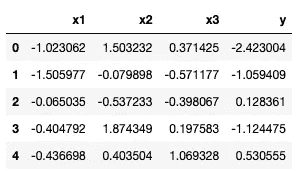

数据集的前 5 行。图片作者。

由于计算的限制和利益相关者的要求，我们只想选择对预测至关重要的特征。也许直观的开始是查看相关矩阵:

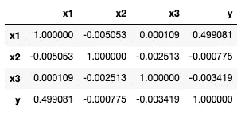

数据集的相关矩阵。图片作者。

我们立即注意到 x1 与 y 有中等相关性，而 x2 和 x3 几乎没有相关性。错误的是，我们认为 x1 是唯一有用的特性，我们把它扔进了一个随机森林。该模型适合于训练集，并在测试集上进行评估:

```
# Create training and testing sets
x_train, x_test, y_train, y_test = train_test_split(data[['x1']], data['y'], test_size=0.20)# Fit a random forest using only x1 as input
model = RandomForestRegressor(n_estimators=500, max_depth=10)
model.fit(x_train.values.reshape(-1,1), y_train)# Evaluate predictions on the test set
preds = model.predict(x_test)fig, ax = create_fig()
ax.scatter(y_test, preds)
ax.set_xlabel('Actual')
ax.set_ylabel('Predicted')
ax.set_title('Actual vs Predicted Target using $X1$ as a Feature')print(f'MAPE between actual and predicted: {mean_absolute_percentage_error(y_test, preds)}')
print(f'R-Squared between actual and predicted: {r2_score(y_test, preds)}')
```

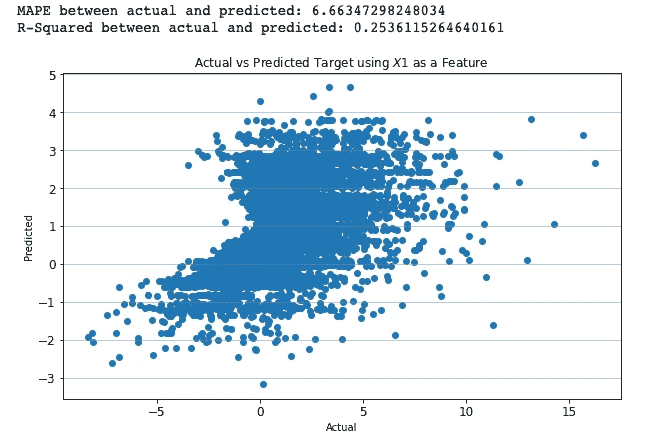

仅使用 x1 作为功能的随机林性能。图片作者。

毫不奇怪，该模型在测试集上表现不佳——在看到数据集中的低相关性后，我们(错误地)预料到了这一点。只是为了开心，我们决定将 x2 和 x3 放入模型中，看看测试性能:

```
# Create training and testing sets
x_train, x_test, y_train, y_test = train_test_split(data[['x1','x2','x3']], data['y'], test_size=0.20)# Fit random forest using all features
model = RandomForestRegressor(n_estimators=500, max_depth=6)
model.fit(x_train, y_train)# Evaluate predictions on test set
preds = model.predict(x_test)fig, ax = create_fig()
ax.scatter(y_test, preds)
ax.set_xlabel('Actual')
ax.set_ylabel('Predicted')
ax.set_title('Actual vs Predicted Target using all Features')print(f'MAPE between actual and predicted: {mean_absolute_percentage_error(y_test, preds)}')
print(f'R-Squared between actual and predicted: {r2_score(y_test, preds)}')
```

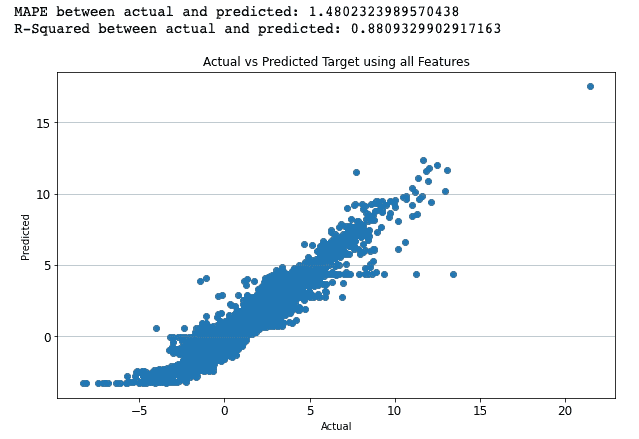

使用所有功能的随机森林性能。图片作者。

令人惊讶的是，通过添加两个与目标不相关的特征，我们观察到测试性能有了天文数字的提高(+0.63 R 平方，-5.18%平均绝对百分比误差)。这怎么可能呢？

## 解决方案

这是一个经典的例子，说明了为什么单变量特征重要性度量(如相关性)可能具有欺骗性。在该数据集中，输出与输入之间的关系如下:

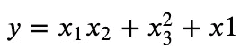

y 与输入的关系。图片作者。

数据集是用 python 创建的，代码如下:

```
Create a fake dataset
n = 50000x1 = np.random.normal(size=n)
x2 = np.random.normal(size=n)
x3 = np.random.normal(size=n)y = x1*x2 + x3**2 + x1data = pd.DataFrame({'x1':x1, 'x2':x2, 'x3':x3, 'y':y})
```

因为[皮尔逊相关](https://en.wikipedia.org/wiki/Pearson_correlation_coefficient)只能测量线性关系的大小和方向，它无法拾取 x1 和 x2 之间的交互作用，或者与 x3 的二次关系。

对于这个玩具的例子，我们可能已经完全绕过了特性选择过程，因为只有三个特性可用。然而，人们可以想象这个原理如何应用于高维数据集。最终，特征选择过程需要考虑*非线性*和*相互作用*，这些不能总是由单变量测量来考虑。

# 示例 2:基于树的模型的外推

## 问题是

在示例 1 中，读者可能已经注意到目标(y)和特征(x1、x2 和 x3)之间的关系是确定的。也就是说，对于给定的一组特征，我们可以精确地计算目标值*的值*。然而，即使将所有特征输入随机森林，结果也远非完美:


体面，但不完美的随机森林结果。图片作者。

我们知道随机森林[能够处理非线性关系](https://www.stat.berkeley.edu/~breiman/randomforest2001.pdf)，那么为什么这个模型不能完美地预测目标呢？

## 解决方案

问题是测试集包含训练集域之外的特征。因此，测试集中的相应目标值在训练集的域之外。最好通过查看目标的摘要统计信息来了解这一点:

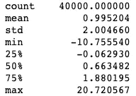

训练集的目标摘要统计信息。图片作者。

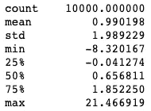

测试集的目标摘要统计信息。图片作者。

虽然这两种分布之间的差异很小(并且没有统计学意义)，但它们足以欺骗随机森林。标准回归树的输出，以及随后的随机森林，是由目标的最大值和最小值限制的[。](https://neptune.ai/blog/random-forest-regression-when-does-it-fail-and-why)这在许多应用中是可以的，因为我们通常不期望我们的模型外推至域外的例子。然而，在物理学和许多其他科学领域，外推往往是目标。

在实践中，对于这个问题有一些解决方案，但是对于这个例子，我们展示了一个线性模型如何能够给出完美的测试性能。让我们稍微欺骗一下，假设我们非常怀疑目标与示例 1 中给出的等式中的特征相关。我们向训练集和测试集添加了以下功能:

```
# Add quadratic and interaction features
x_train['x1x2'] = x_train['x1']*x_train['x2']
x_train['x3^2'] = x_train['x3']**2x_test['x1x2'] = x_test['x1']*x_test['x2']
x_test['x3^2'] = x_test['x3']**2
```

然后将这些新特性输入线性模型，并在测试集上评估结果:

```
# Fit linear model
model = LinearRegression()
model.fit(x_train, y_train)# Evaluate predictions on test set
preds = model.predict(x_test)fig, ax = create_fig()
ax.scatter(y_test, preds)
ax.set_xlabel('Actual')
ax.set_ylabel('Predicted')
ax.set_title('Actual vs Predicted Target using all Features')print(f'MAPE between actual and predicted: {mean_absolute_percentage_error(y_test, preds)}')
print(f'R-Squared between actual and predicted: {r2_score(y_test, preds)}')
```

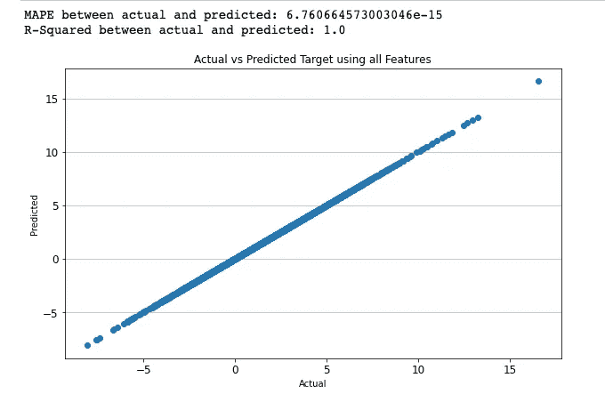

完美推断非线性关系的线性模型。图片作者。

线性模型能够完美地外推，因为它只是将方程中的每一项乘以系数 1。当然，这个例子是不现实的，因为我们事先已经知道了基本方程。然而，即使我们没有这些信息，我们也可以使用像[符号回归这样的算法获得同样的结果。](https://en.wikipedia.org/wiki/Symbolic_regression#:~:text=Symbolic%20regression%20%28SR%29%20is%20a,terms%20of%20accuracy%20and%20simplicity.)

# 示例 3 —统计显著性与效应大小

## 问题是

我们为一家健身公司工作，该公司设计了两个肌肉锻炼计划，我们的老板问最新的计划是否能帮助我们的客户在两个月内增加肌肉量。很自然，我们会观察两个项目中增加的肌肉量的分布:

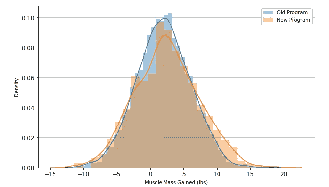

增加的肌肉质量分布(磅)。图片作者。

我们还查看了汇总统计数据:

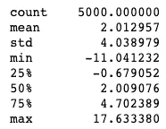

旧程序肌肉质量增加(磅)。图片作者。

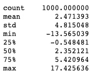

新计划肌肉质量增加(磅)。图片作者。

我们很兴奋，因为新计划比旧计划平均增加了 0.50 磅。因为我们是数据科学家，我们觉得必须检查统计意义。进行双样本 z 检验以检查旧组中增加的平均肌肉与新组中增加的平均肌肉之间的差异是否不同。这个测试的 p 值是 0.002，所以我们向老板展示了*的统计显著性*发现并庆祝。该公司决定推广这些结果，并对新程序收取更高的费用——许多客户转而购买。

在新计划实施两个多月后，该公司面临着巨大的反弹，因为客户抱怨他们没有获得旧计划中那么多的肌肉。我们的老板因为错误的发现责备我们。

## 解决方案

这里的问题触及了频率统计的核心——大样本量决定了统计意义。这在许多倾向于使用小样本的统计学入门课程中通常不会涉及。我们可以通过观察当样本量趋于无穷大时测试统计量的变化来从数学上理解这个问题:

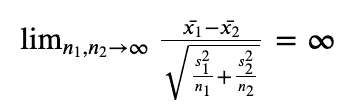

当样本量达到 z 统计量的无穷大时，限制。图片作者。

随着样本量的增加，表达式的分母趋向于 0，z 统计趋向于无穷大。当然，随着检验统计量趋向于无穷大，p 值趋向于 0。这意味着，如果样本量足够大，分布之间即使最微小的差异也可能具有统计学意义。这就是我们需要效果尺寸的地方。

统计检验的效果大小试图衡量观察结果的真实强度，而不考虑样本大小。这并不意味着不考虑样本量，而是大样本量并不主导效应量的计算。均值差异测试的一个流行的效果大小度量是 [Cohen 的 d:](https://www.statisticshowto.com/cohens-d/)

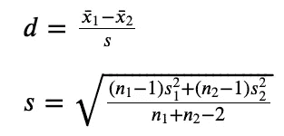

科恩的 d .作者形象。

注意平方根中的分子和分母是如何随着样本量线性增长的。这使得我们可以通过相应的样本大小来衡量每个样本的标准偏差，而不会出现问题。科恩的 d 有[普遍接受的阈值](https://doi.org/10.22237%2Fjmasm%2F1257035100)来确定影响大小有多大:

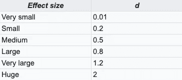

科恩的 d 效应大小阈值。图片作者。

我们可以为我们的测试计算 Cohen 的 d:

```
# Compute effect size
sd_pooled = np.sqrt(((n1-1)*old_program.std()**2 + (n2-1)*new_program.std()**2) / (n1 + n2 - 2))cohen_d = (new_program.mean() - old_program.mean()) / sd_pooled
```

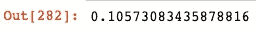

科恩的 d 为平均肌肉质量增加之间的差异。图片作者。

这告诉我们，虽然我们观察到的差异在统计上是显著的，但真正的影响可能很小。如果我们在分享我们的结果之前知道效果的大小，我们可能不会对这个新项目做出如此强烈的声明。

我们还可以通过查看考虑整个分布的统计数据来改进我们的分析，而不仅仅是平均值和标准差。例如，像[人口稳定指数](https://scholarworks.wmich.edu/cgi/viewcontent.cgi?article=4249&context=dissertations)或[Kolmogorov–Smirnov 统计量](https://en.wikipedia.org/wiki/Kolmogorov%E2%80%93Smirnov_test)这样的统计量对于比较任意分布之间的差异非常有用(即，我们不必假设正态性)。这些统计数据还带有普遍接受的效应大小阈值。

# 示例 4-基于树的特征重要性

## 问题是

在最后一个例子中，我们为一所大学工作，我们的任务是确定哪些学生可能毕业，哪些学生可能辍学。在这种情况下，我们关心特征的重要性，因为我们想知道哪些学生属性有助于毕业的可能性。我们首先读入数据集并做一些预处理:

```
# Read in academic success data
data = pd.read_csv('Dropout_Academic Success - Sheet1.csv')# Only include students that have graduated or dropped out
data = data[data['Target'] != 'Enrolled']# Convert target to a binary value
data['Target'].replace({'Graduate':1, 'Dropout':0}, inplace=True)
```

我们只会考虑已经毕业或者退学的学生。这个数据集有很多分类特征，所以我们决定建立一个 [Catboost](https://catboost.ai/) 分类器来预测一个学生是否会毕业。在此之前，我们需要确定分类特征:

```
cat_cols = ['Marital Status','Application mode','Course','Daytime/evening attendance', 'Previous qualification','Nationality',"Mother's qualification", "Father's qualification","Mother's occupation","Father's occupation",'Displaced', 'Educational special needs', 'Debtor','Tuition fees up to date','International']
```

接下来，创建添加了随机特性的训练集和测试集。随机特征是高斯分布的样本，用作比较其他特征预测性的基准。

```
# Create train/test split
x,y = data.drop('Target', axis=1), data['Target']# Add random variable to inputs to evaluate feature importance
x['rv'] = np.random.normal(size=len(x))x_train, x_test, y_train, y_test = train_test_split(x, y, test_size=0.20)
```

我们对训练数据拟合分类器，然后评估特征重要性:

```
# Evaluate feature importance
feature_importances = model.get_feature_importance()feat_imp_df = pd.DataFrame({'Feature':model.feature_names_, 'Importance':feature_importances})
feat_imp_df.sort_values("Importance", ascending=False, inplace=True)fig,ax = plt.subplots(figsize=(15,15))
sns.barplot(x=feat_imp_df['Importance'], y=feat_imp_df['Feature'])
```


预测值改变分级分类器的特征重要性。图片作者。

令人震惊的是，只有七个特征的重要性比随机特征高。我们得出结论，我们的大部分特征是噪声，并将其从模型中删除。**然而，这样做之后，模型的表现明显变差。**这怎么可能？

## 解决方案

我们在这里的陷阱是我们不明白【Catboost 是如何计算特性重要性的。【Catboost 的默认重要性类型是“预测值变化”,用于衡量输入要素发生变化时模型输出的变化程度。基于树的模型倾向于锁定高粒度特征(比如我们添加的连续随机特征)；从这些导致最终模型对其敏感的噪声特征中学习伪分区。这就是我们在这个例子中观察到的情况。该模型已经从训练集的随机特征中学习了噪声，并且作为响应正在改变其预测。

一个简单的解决方案是在 Catboost 中使用“LossFunctionChange”重要性类型。这种重要性类型查看从模型中排除要素时损失函数的变化程度。至关重要的是，这需要对测试集进行评估，这有效地揭示了随机特征没有预测能力。我们可以用下面的代码来评估这个特性的重要性类型:

```
# Create catboost pool object
test_pool = Pool(x_test, y_test, cat_features=cat_features)# Evaluate feature importance
feature_importances = model.get_feature_importance(data=test_pool, type='LossFunctionChange')feat_imp_df = pd.DataFrame({'Feature':model.feature_names_, 'Importance':feature_importances})
feat_imp_df.sort_values("Importance", ascending=False, inplace=True)fig,ax = plt.subplots(figsize=(10,10))
sns.barplot(x=feat_imp_df['Importance'], y=feat_imp_df['Feature'])
```

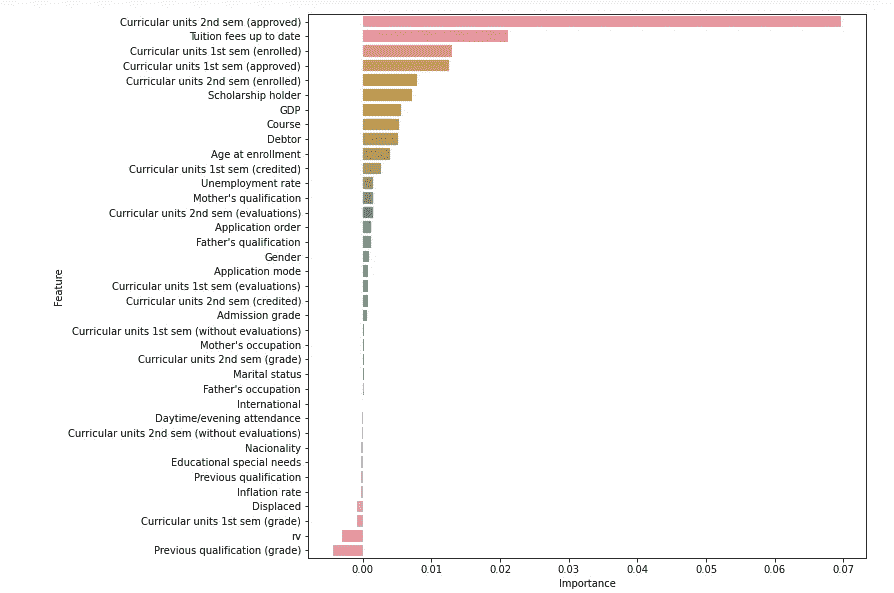

损失函数改变分级分类器的特征重要性。图片作者。

新的特性重要性图表显示，在测试集上，只有一个特性的性能比 random 差。此外，我们看到随机特征导致模型在被包含时失去预测性(如预期的那样)。这个特征重要性图表与我们的直觉更加一致，并且证实了大多数特征是可预测的。

# 最后的想法

这四个例子虽然只是表面现象，但却描述了缺乏理解如何让数据科学家陷入困境。关键的一点是，数据科学家在使用某样东西之前，应该对它的工作原理有一个坚实的(不一定完美的)理解。同样重要的是知道在应用程序中使用哪些方法。感谢阅读！

*喜欢我的文章？给我买杯咖啡:*[*【https://www.buymeacoffee.com/HarrisonfhU】*](https://www.buymeacoffee.com/HarrisonfhU)