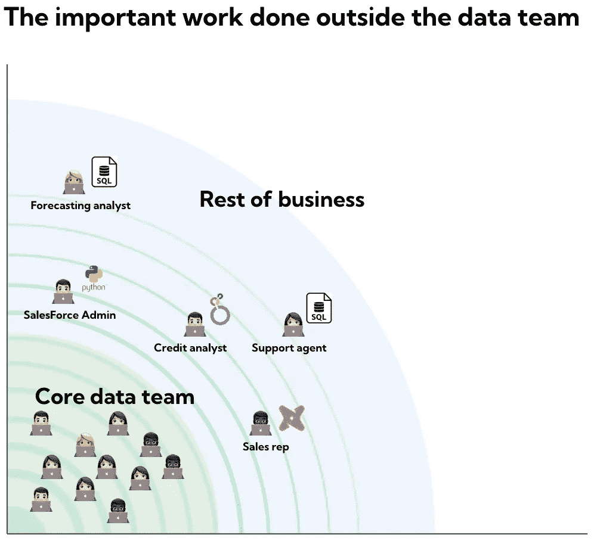
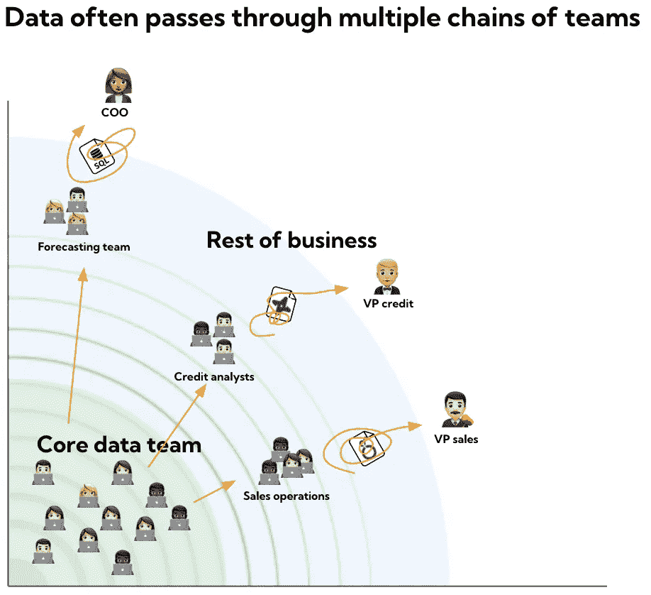
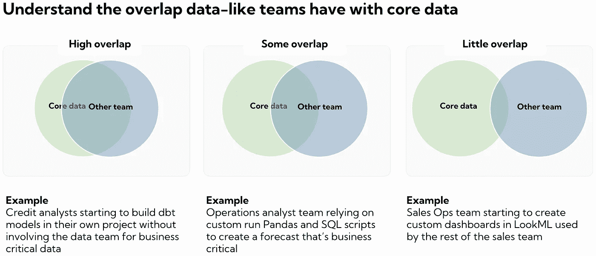

# 数据团队之外的重要紫色人

> 原文：<https://towardsdatascience.com/the-important-purple-people-outside-the-data-team-e97f4bfbc192>

## 何时将公司内的人带入数据团队，以及在这样做之前需要考虑什么

dbt [的 Anna Filippova 写了](https://www.getdbt.com/blog/we-the-purple-people/)关于我们如何需要更多“紫色”人才——能够驾驭商业环境和现代数据堆栈的通才。

我招过的一些最好的员工都是公司其他部门的紫色员工，他们想去做数据工作。他们可能在客户支持部门工作，并已成为团队中解决数据相关问题的关键人物。或者他们可能是一名客户经理，已经建立了销售团队中每个人都使用的出色的仪表板。

**这些人带来了对业务的深刻理解和学习数据的动力的独特组合。您很幸运，在许多情况下，他们希望转移到数据团队。**

他们自然会很好地调整自己，以解决推动业务投资回报的实际问题。他们了解自动化繁琐的客户健康评分流程的影响，因为他们知道手动完成这项工作有多痛苦。他们理解为什么一个为期 3 个月的项目来衡量营销活动对销售的影响是没有意义的，因为销售团队系统地不按时记录电话。

作者图片

您可能会发现自己与这些人中的一些人一起工作，并且可能已经努力将他们融入数据团队。

无论你在天平的哪个位置，我都建议你要慎重考虑如何与他们合作，为数据团队创造最佳成果，并给他们最好的职业发展机会。如果做得好，它们将作为数据团队的扩展，帮助解决重要问题和处理临时请求。

# 与数据团队以外的人一起创造成功的实用技巧

从描绘出这些人是谁开始。如果你是管理人员，你可以问你的团队，他们会知道的。

我发现这些步骤很有效

*   找出数据团队之外从事类似数据工作的每个人，并让您的团队选择最有影响力和最渴望学习的人
*   邀请一些人成为数据团队惯例的一部分。给他们一个数据团队的导师，邀请他们参加你的异地会议和每周团队会议。这能让你更好地了解他们是如何工作的，并给他们一个学习的机会
*   如果双方都很合适，而且他们的经理也同意，你可以考虑让他们加入数据团队。如果你这样做了，我建议做一个 3 个月的试用期，在此期间设定明确的期望

如果你发现这很有效，考虑把它变成一个任何人都可以申请的更正式的数据轮换计划。

# 从数据团队外部引入人员时的常见陷阱

不幸的是，当人们加入数据团队时，这并不总是有效的。我已经看到了一些常见的陷阱，您应该尽早警惕

*   他们很难放下旧角色的工作，并不断陷入 DMs 或以前的利益相关者的运营工作中
*   他们努力改变自己的思维模式，不花时间去学习第一次做正确的事情，最后抄近路
*   他们在数据团队中没有得到适当级别的支持，也没有被很好地接纳

一定要尽你所能确保他们有最好的成功条件，并利用 3 个月的试用期尽早向他们提出反馈，这样他们就有机会改进。

# 当您在数据团队之外拥有整个类似数据的团队时会发生什么？

让人们加入数据团队是一个双赢的局面。如果做得好，你将获得很大的价值，并帮助渴望和雄心勃勃的人转向数据。

当您开始看到核心数据团队之外的整个团队在做类似数据的工作时，情况就更复杂了。这些人通常从事业务关键工作，例如制作预测模型以确定哪些支持代理应该在何时工作，或者构建数据模型以确定客户的信用评分。

如果做错了，这些团队会带来数据可靠性恶化的风险，并会降低整个公司决策的质量。

作者图片

**数据的可靠性取决于链条中最薄弱的一环。**

你可以把它想成一个等式:

数据可靠性= `lowest(upstream data quality, data model quality, dashboard quality, …)`

在上面的例子中，您可能会遇到这样的情况

*   CRM(销售团队)中严格的电话记录= `high` →
*   测试覆盖率高的 dbt 模型(数据团队)= `high` →
*   有逻辑错误的零碎 LookML 代码(销售运营)= `low`

不管上游和数据建模层的质量如何，用于决策的数据都是低质量的，因为质量取决于最薄弱的环节。

就像你不能在上游生产者的不可靠数据上建立可靠的数据一样，如果下游团队没有按照你期望的标准做出决策，你也不能自信地依靠数据驱动的决策。

> “类似数据的团队经常致力于解决高度重要的业务问题，但数据团队往往不了解或不参与他们的工作。有时，高级利益相关者绕过数据团队以加快移动速度，但最终却造成了长期的数据债务”

值得一提的是，数据工作绝不应该是数据团队成员的专利。事实上，从事数据工作的人越多，你的数据文化就越强。然而，你需要清楚你期望的高质量在哪里。这可能意味着您创建一个规则，对于最关键的数据用例，数据团队至少需要得到通知。

# 如何发现做类似数据工作的团队

以下是您应该留意的一些迹象，以发现您可能希望让哪些团队更接近数据团队。

一群销售运营分析师用零碎的 LookML 代码制作仪表板，供数百人使用，而数据团队对此一无所知。

一个运营团队维护着一个预测模型，该模型决定了 Pandas 内置的工人轮班开始和结束的时间，每天早上在本地机器上手动运行。

一个商业战略团队决定使用 Google Data Studio 作为投资者的仪表板，因为有人在以前的工作中使用过它，尽管数据团队的政策是使用 Looker。

一个信用分析师团队已经开始为数据模型开发他们自己的 dbt 项目，这些数据模型用于决定允许哪些客户借钱。

不知不觉中，业务关键决策将由使用仪表板和数据模型的人做出，而数据团队对此一无所知。

你需要为团队和个人何时应该加入核心数据团队以及何时应该保持独立建立一个系统。

作者图片

**高重叠:**你冒着以混乱结束的风险，最终将回到数据团队来解决。您应该考虑让他们成为核心数据团队的一部分，对他们抱有与其他任何人一样的期望和态度。

**有些重叠:**数据和决策的质量在很大程度上取决于他们，但他们的工作与数据团队的工作大相径庭。邀请他们参加一些数据仪式，并让他们与数据团队的导师配对。

**很少重叠:**他们在构建自己的仪表板，这很好，但你不应该在这方面投入太多时间，因为你有分散精力的风险。取而代之的是，提供办公时间和每月一次的最佳实践培训。

# 结论

数据团队中一些最优秀的雇员可能已经在你公司的其他地方工作过了。

*   构建将数据团队之外的人带进来的方式。逐步让他们成为数据团队的一部分，有一个目标明确的试用期
*   数据可靠性取决于链条中最薄弱的环节。即使有很好的数据源和很好的数据建模，如果分析师做出草率的指示板，你最终会根据错误的数据做出决策
*   对于如何与数据团队之外的类似数据的团队打交道，要有一个策略。如果他们的工作与您在数据团队中的工作非常相似，您应该考虑让他们成为核心团队的一部分

如果你在如何最好地从数据团队之外引入数据类人员并创建可靠的数据链方面有经验，[我很想听听你的意见](https://www.linkedin.com/in/mikkeldengsoe)