# 浓缩咖啡的不精确过滤篮

> 原文：<https://towardsdatascience.com/the-imprecision-filter-basket-for-espresso-963d572baba2>

## 咖啡数据科学

## 专注于如何制作优质的浓缩咖啡

在我以前的摩卡壶研究中，我发现大孔对煮浓缩咖啡很有效，咖啡不会从篮子里流出来。所以我想修改一个篮子，目标是不精确。大多数浓缩咖啡社区已经转向精密篮子。最初对精密篮筐的研究是针对特定的射击时间，而不一定是提取产量。

我之前的工作是根据篮子的开口面积来观察[过滤篮子](/coffeejack-and-wafo-vs-vst-flair-and-kompresso-espresso-filter-basket-2991314b224e)。我的理论是，一个更大的空位比精准更重要。

为了进一步测试这个理论，我修改了一个旧的过滤篮(来自 Kim Express)。我还不想用新的篮子，以防这个实验是一场灾难。

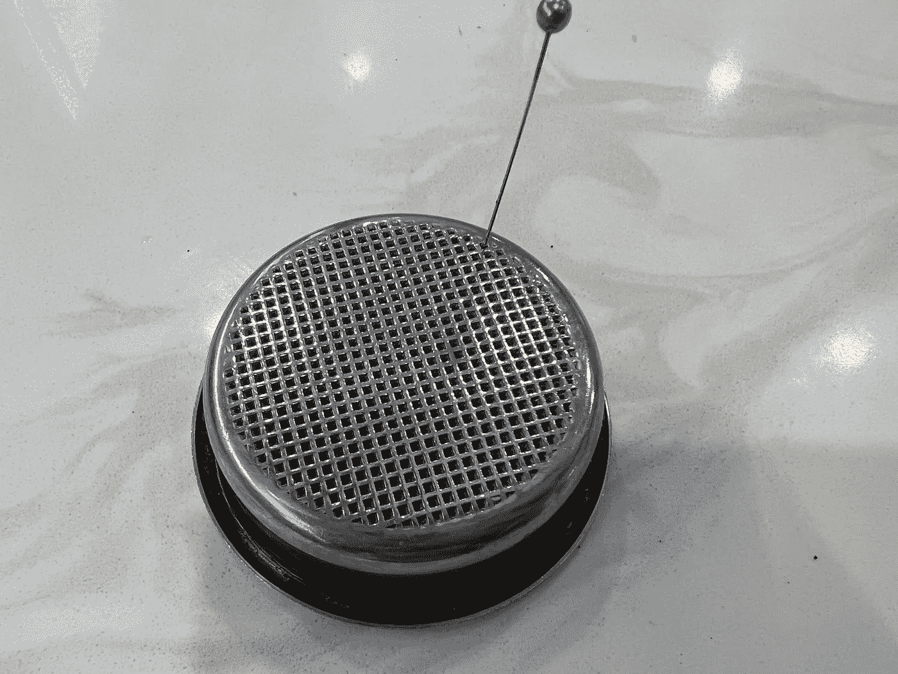

我把同一根针穿过所有的洞，然后测量前后的洞。

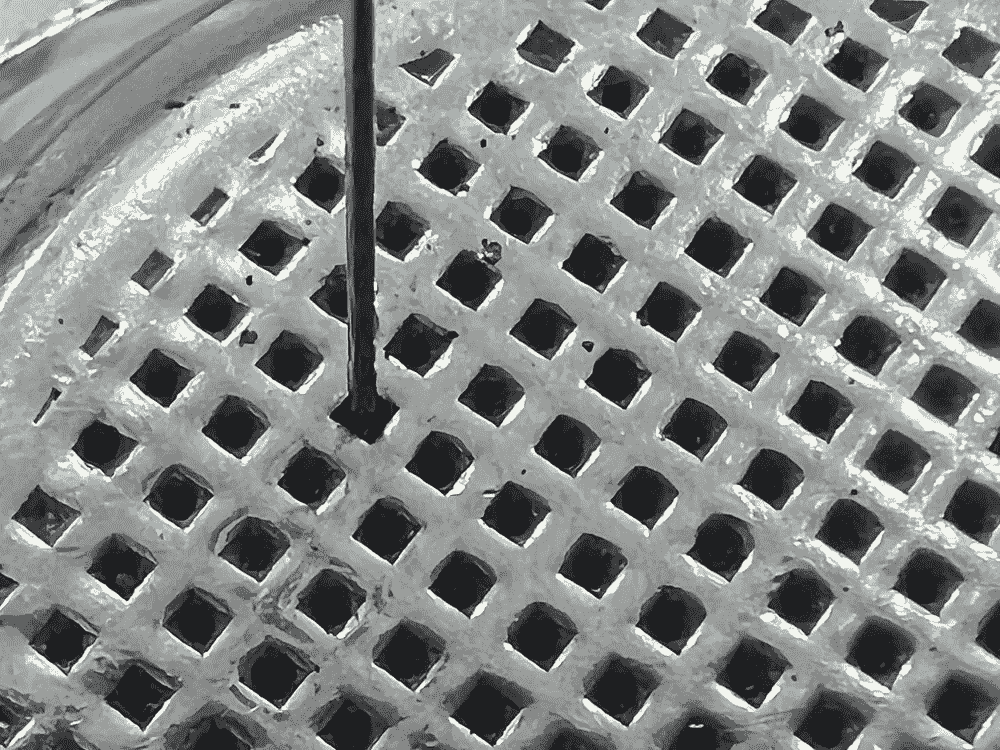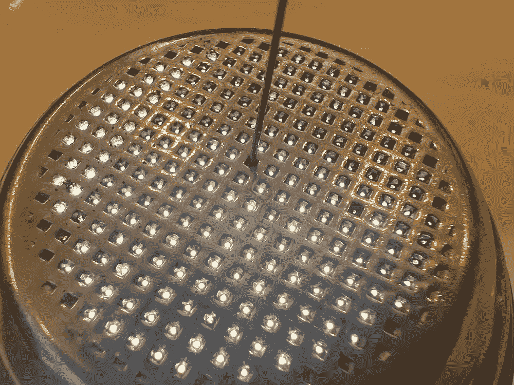

扩大孔后，我刮下顶部，因为有金属被推上来。

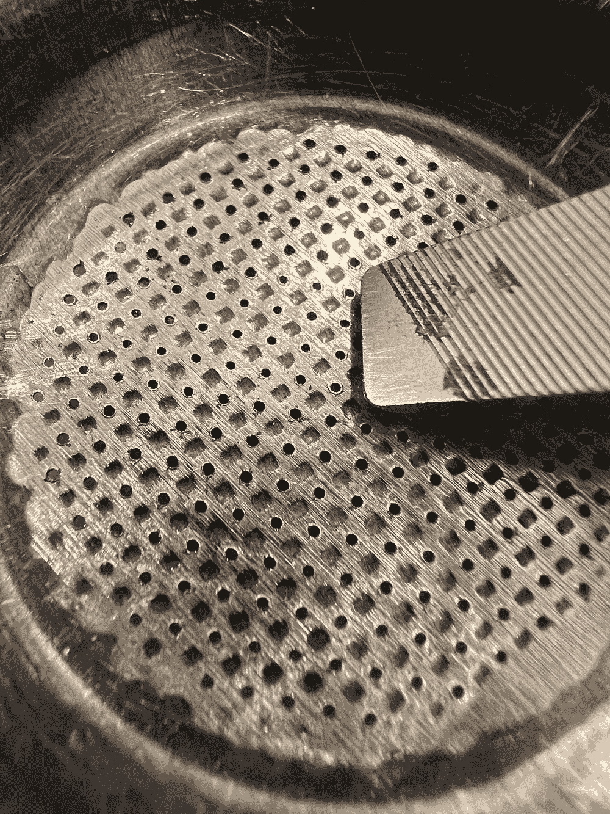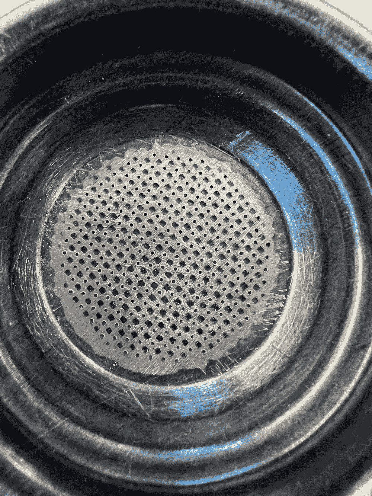

我想象了之前和之后。

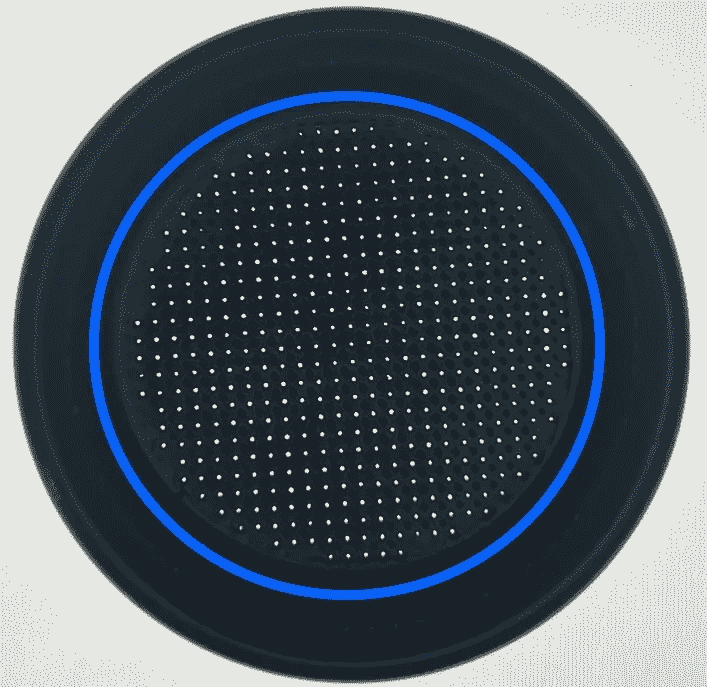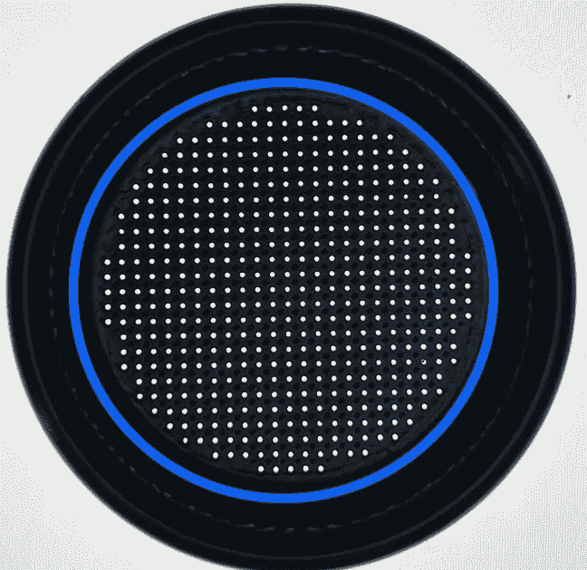

左:原来的金双篮，右:增加了洞

然后我做了一些漏洞分析。在空间上，它们有相似的随机性。

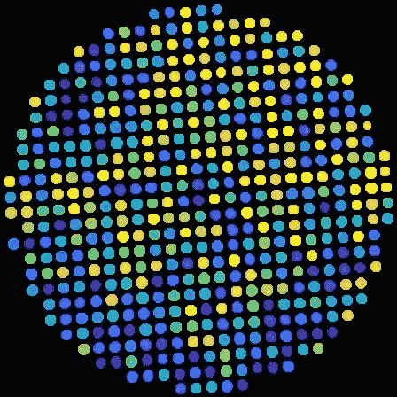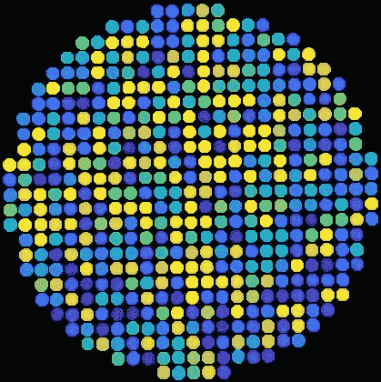

左:改装前，右:改装后。每个色标都是独立的。蓝色较小，黄色较大。

我把这些和其他的做了比较。原来的金篮子金 D 最大或金最大。我称它为 Kim D，因为它是原始的双篮。然后我做了一轮，其中孔的开口度只有 4%，所以我再做一次，以获得最大的孔尺寸(因此金最大)。

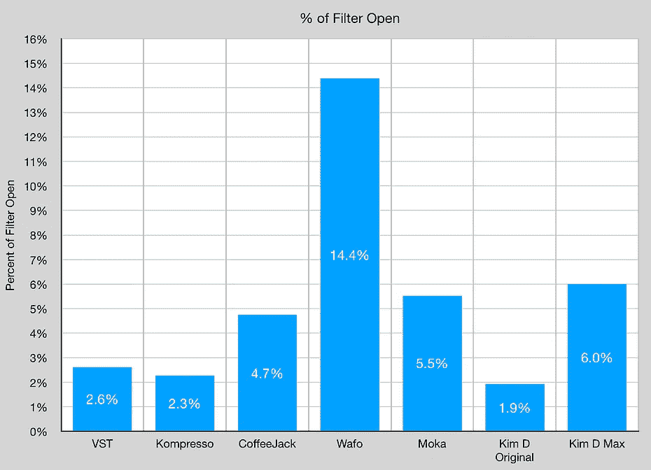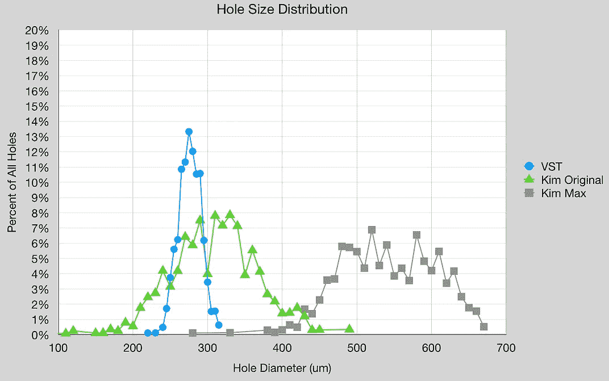

金最大过滤器的孔面积几乎是 VST 的两倍，平均孔尺寸不仅更大，而且分布更广。

然后我开了一枪。

# 设备/技术

[浓缩咖啡机](/taxonomy-of-lever-espresso-machines-f32d111688f1) : [像样的浓缩咖啡机](/developing-a-decent-profile-for-espresso-c2750bed053f)

[咖啡研磨机](/rok-beats-niche-zero-part-1-7957ec49840d) : [小生零](https://youtu.be/2F_0bPW7ZPw)

咖啡:[家庭烘焙咖啡](https://rmckeon.medium.com/coffee-roasting-splash-page-780b0c3242ea)，中杯(第一口+ 1 分钟)

镜头准备:[断奏夯实](/staccato-tamping-improving-espresso-without-a-sifter-b22de5db28f6)

[预灌注](/pre-infusion-for-espresso-visual-cues-for-better-espresso-c23b2542152e):长，约 25 秒

[过滤篮](https://rmckeon.medium.com/espresso-baskets-and-related-topics-splash-page-ff10f690a738) : 20g VST 和不精密篮。

其他设备: [Atago TDS 计](/affordable-coffee-solubility-tools-tds-for-espresso-brix-vs-atago-f8367efb5aa4)、 [Acaia Pyxis 秤](/data-review-acaia-scale-pyxis-for-espresso-457782bafa5d)

# 绩效指标

我使用了两组[指标](/metrics-of-performance-espresso-1ef8af75ce9a)来评估技术之间的差异:最终得分和咖啡萃取。

[**最终得分**](https://towardsdatascience.com/@rmckeon/coffee-data-sheet-d95fd241e7f6) 是评分卡上 7 个指标(辛辣、浓郁、糖浆、甜味、酸味、苦味和余味)的平均值。当然，这些分数是主观的，但它们符合我的口味，帮助我提高了我的拍摄水平。分数有一些变化。我的目标是保持每个指标的一致性，但有时粒度很难确定。

</coffee-solubility-in-espresso-an-initial-study-88f78a432e2c>**使用折射仪测量总溶解固体量(TDS)，该数字结合咖啡的输出重量和输入重量，用于确定提取到杯中的咖啡的百分比，称为**提取率(EY)** 。**

**[**【IR】**](/improving-coffee-extraction-metrics-intensity-radius-bb31e266ca2a)**强度半径定义为 TDS vs EY 控制图上原点的半径，所以 IR = sqrt( TDS + EY)。这一指标有助于标准化产量或酿造比的击球性能。****

# ****可行性数据****

****先来两对镜头。我在做冷却提取研究的时候拉了这些，所以我有带和不带。在口味方面，金 D Max 表现明显更好。就 TDS 和 EY 而言，这是一个组合。****

****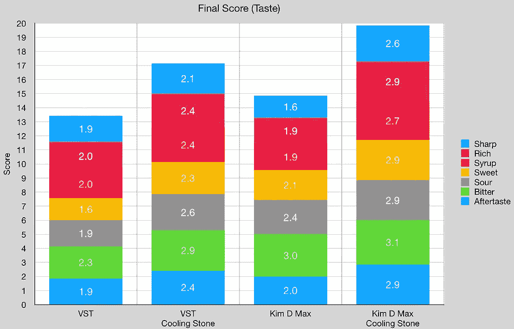********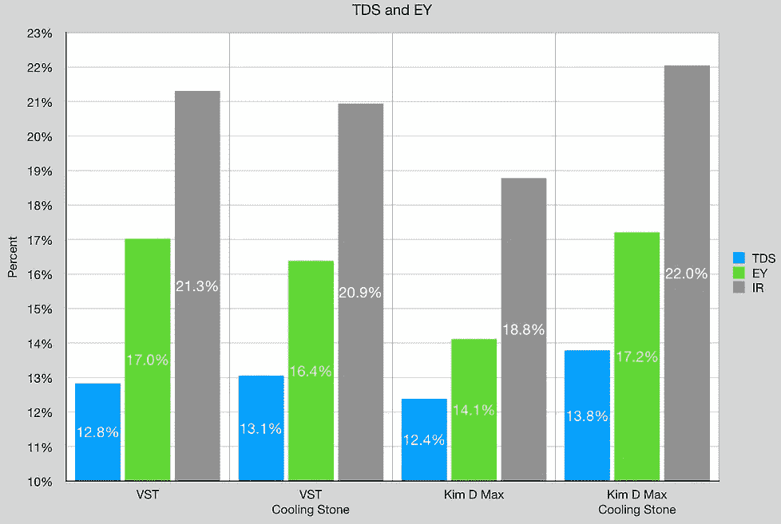****

****我在 6 组 6 次烘烤中获得了更多的数据。金有口味优势。****

****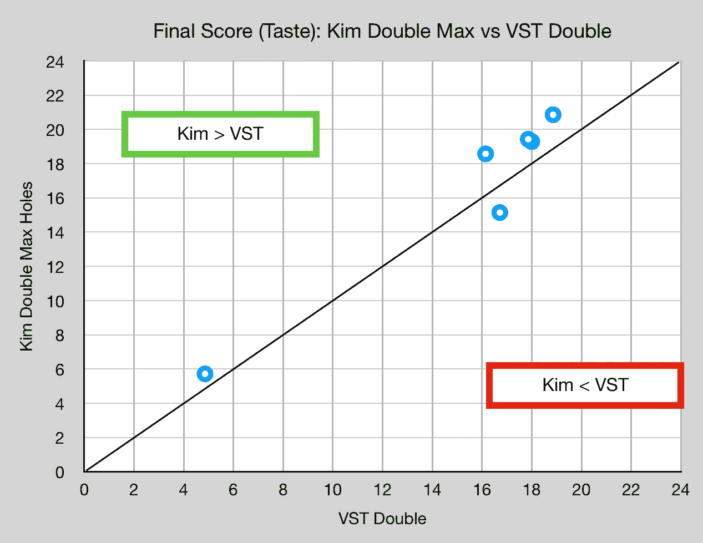****

****从个人得分来看，Kim D Max 的表现更好。TDS/EY/IR 方面，略低。****

****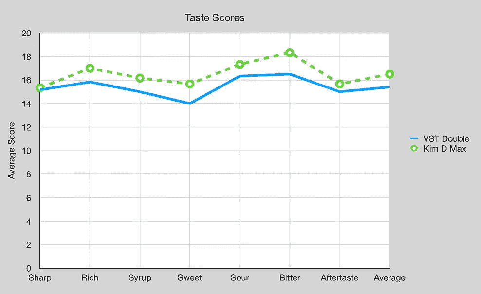********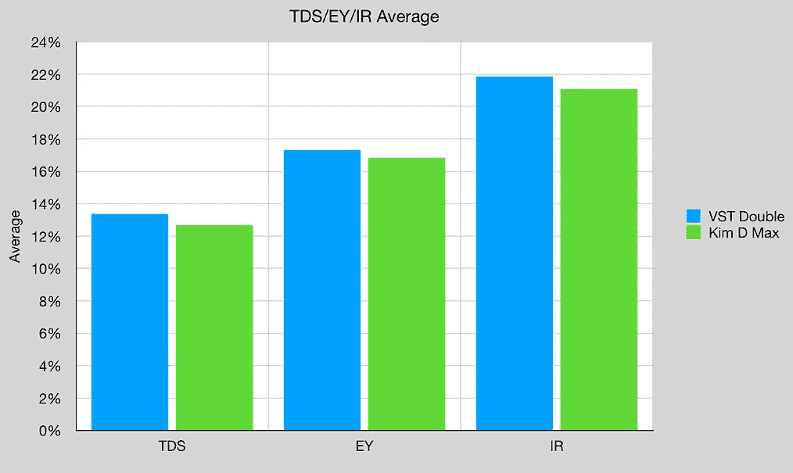****

# ****咖啡迁徙？****

****一个问题是，这个篮子可能会导致咖啡从篮子里出来，进入杯子，因为假设孔需要很小才能进行精细研磨。所以我用废咖啡重新混合了一下。****

****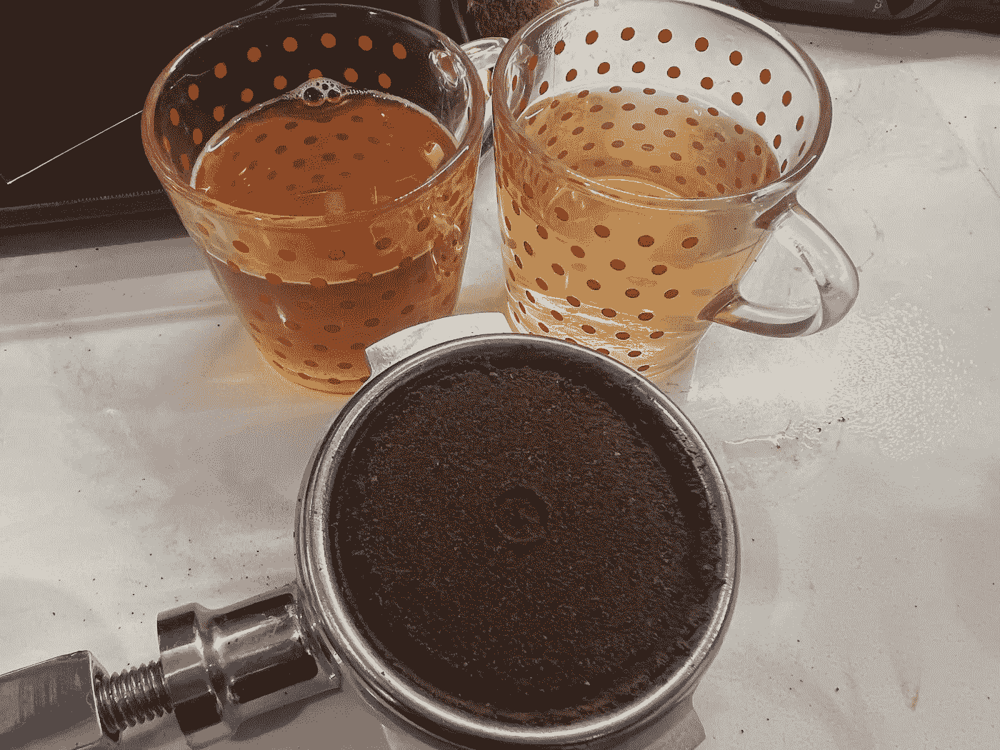****

****倒入杯中的咖啡渣样品不可测量(> 0.01 克)。****

****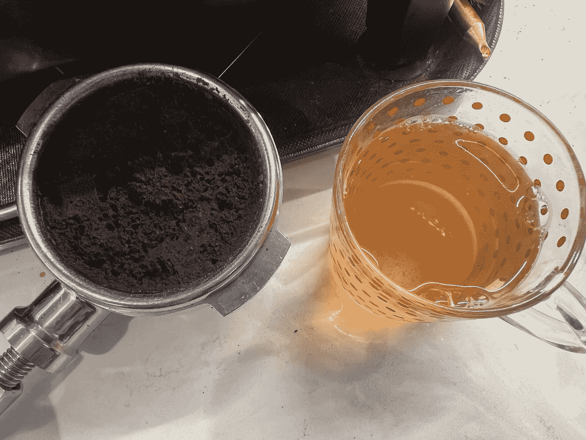****

****这些数据让我回过头来质疑过滤篮的基本功能，我认为过滤篮的设计应该重新评估，特别是对于模型浓缩咖啡的轮廓。我怀疑作为这些测试的结果，Wafo 篮子会比其他篮子表现得更好。****

****如果你愿意，可以在推特、 [YouTube](https://m.youtube.com/channel/UClgcmAtBMTmVVGANjtntXTw?source=post_page---------------------------) 和 [Instagram](https://www.instagram.com/espressofun/) 上关注我，我会在那里发布不同机器上的浓缩咖啡照片和浓缩咖啡相关的视频。你也可以在 [LinkedIn](https://www.linkedin.com/in/dr-robert-mckeon-aloe-01581595) 上找到我。也可以关注我在[中](https://towardsdatascience.com/@rmckeon/follow)和[订阅](https://rmckeon.medium.com/subscribe)。****

# ****[我的进一步阅读](https://rmckeon.medium.com/story-collection-splash-page-e15025710347):****

****[我的书](https://www.kickstarter.com/projects/espressofun/engineering-better-espresso-data-driven-coffee)****

****[我的链接](https://rmckeon.medium.com/my-links-5de9eb69c26b?source=your_stories_page----------------------------------------)****

****[浓缩咖啡系列文章](https://rmckeon.medium.com/a-collection-of-espresso-articles-de8a3abf9917?postPublishedType=repub)****

****工作和学校故事集****