# ML 模型的归纳偏差，以及为什么你应该关心它

> 原文：<https://towardsdatascience.com/the-inductive-bias-of-ml-models-and-why-you-should-care-about-it-979fe02a1a56>

## 什么是归纳偏差，它如何损害或帮助你的模型

# 归纳推理

想象一下，这是你第一次去瑞士，你在山里徒步旅行，遇到一头有斑点的牛和一个牛铃。

罗斯·索科洛夫斯基在 [Unsplash](https://unsplash.com?utm_source=medium&utm_medium=referral) 上的照片。

你可能会认为瑞士所有的斑啼鸟都有一个牛铃。这是归纳推理的典型例子。它从一个观察开始(一只有斑点的牛和一个牛铃)，并导致一个可能的概括假设(所有有斑点的牛都有一个牛铃)。

请注意，基于相同的观察，有可能得出(归纳出)其他假设。例如，瑞士有牛，所有的牛不管有没有斑点都有牛铃，瑞士只有牛，等等。正如你所看到的，基于一个观察可以做出一打假设——这是归纳推理的一个重要特性:有效的观察可能导致不同的假设，其中一些可能是错误的。

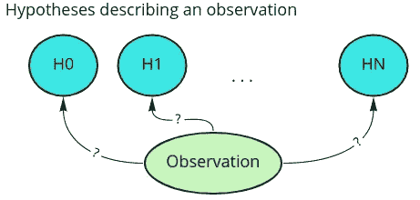

单个观察可能会归纳出一组可以解释它的无限假设(图片由作者提供)。

那么一个人如何选择一个单一的假设呢？要做到这一点，你可以选择一个最简单的假设，即“瑞士有奶牛”。它可以被视为简单，因为它对斑点或牛铃没有额外的约束，它只是一个简单的概括。这种方法被称为“[奥卡姆剃刀](https://en.wikipedia.org/wiki/Occam%27s_razor)”，可以被视为最简单的归纳偏差之一——选择描述观察结果的最简单假设。

> 奥卡姆剃刀原理来源于哲学观点，但也有一个等价的数学陈述，例如[solomonff 的归纳推理理论](https://en.wikipedia.org/wiki/Solomonoff%27s_theory_of_inductive_inference)。

## 那么它和机器学习有什么关系呢？

在大多数机器学习任务中，我们处理一些观察值(样本)的子集，我们的目标是基于它们创建一个泛化。我们还希望我们的推广对新的未知数据有效。换句话说，我们希望根据有限的样本子集，得出适用于整个样本群体的一般规则。

所以我们有一些观察结果和一组假设，可以根据观察结果归纳出来。观察集是我们的数据，假设集是 ML 算法，所有可能的参数都可以从这些数据中学习到。每个模型都可以描述训练数据，但在新的未见过的数据上提供明显不同的结果。

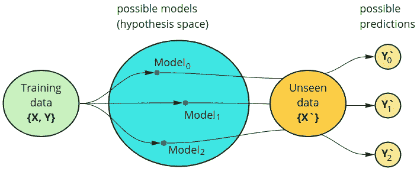

可以基于固定的训练数据来训练不同的模型。对于新的看不见的数据，所有这些模型将表现不同。

有限的样本集有无限的假设集。例如，考虑一些单变量函数的两个点的观察值。有可能拟合一个线性模型和无限数量的周期或多项式函数来完美地拟合观察结果。给定数据，所有这些函数都是有效的假设，完全符合观察结果，在没有额外假设的情况下，选择一个而不是另一个就像是随机猜测。

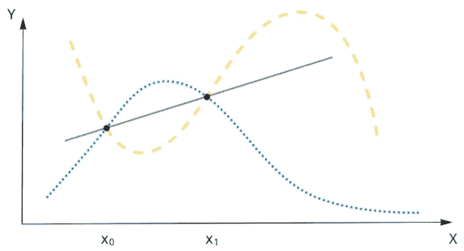

用两个 2d 点完美描述数据的不同模型(图片由作者提供)。

现在让我们从新的看不见的数据样本 X2 来推断我们的假设，结果证明大多数复杂的函数都是不准确的。然而，线性函数看起来相当精确，从[偏差-方差权衡](https://en.wikipedia.org/wiki/Bias%E2%80%93variance_tradeoff)的角度来看，你可能已经很熟悉了。

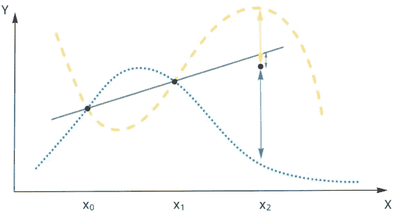

完美描述训练数据的模型对于新的看不见的数据有显著的不同(图片由作者提供)。

一些假设的优先级(假设空间的限制)是一种归纳偏差。所以这个模型偏向于一些假设。对于前面的示例，用户可以基于一些关于数据的先验知识选择线性模型，从而优先考虑线性概化。

**一个人为什么要在乎？**

从前面的例子可以看出，选择正确的模型归纳偏差会导致更好的泛化，尤其是在低数据设置中。我们的训练数据越少，归纳偏差就应该越强，以帮助模型更好地概括。但是，在一个丰富的数据设置中，可能更好的是避免任何归纳偏差，以使模型受到较少的约束，并在假设空间中自由搜索。

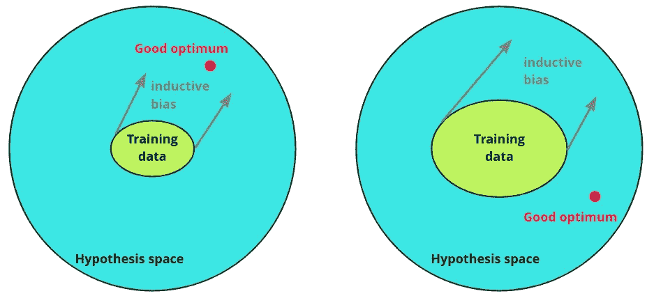

在低数据设置中，正确归纳偏差可能有助于找到好的最优值，但在丰富的数据设置中，它可能会导致不利于泛化的约束(图片由作者提供)。

给定手头的任务，我们如何选择模型？通常，答案是这样的:用 CNN 看图像，用 RNN 看序列数据，等等。同时，可以将 RNN 用于图像，将 CNN 用于顺序数据等。首选的原因是适合数据的模型的归纳偏差。选择一个有正确偏向的模型会增加用更少的数据找到更好的概括的机会，这总是可取的。人们可能很容易认为存在某种最优偏差，这种偏差总是有助于模型很好地推广，但根据[“无自由发射”定理](https://ieeexplore.ieee.org/abstract/document/585893)，不可能找到这样的偏差。这就是为什么，对于每一个特定的问题，我们应该使用特定的算法和偏见。

# **ML 模型的归纳偏差示例**

在下一节中，我们将考虑不同算法的一些基本的和众所周知的归纳偏差，以及一些不太为人知的例子。

## 回归模型

可能最直接的例子是回归模型的归纳偏差，它找到了一个特定方程的解。这种偏差将假设空间限制在单个方程族，并且仅优化它们的系数。这种方法在低数据设置中工作良好，尤其是当人们具有关于数据中函数关系的先验知识时，例如，当处理来自物理实验的数据或拟合特定概率分布时。

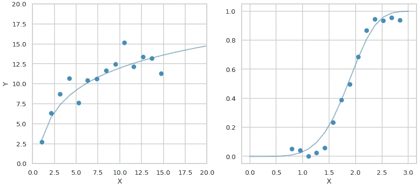

被约束为特定方程形式的模型 f(x)=k*log(m*x)(左)或 f(x)=1-exp(-(x/k)^b(右)。(图片由作者提供)。

额外的归纳偏差可以用正则化来注入，例如 L1 或 L2 正则化。它们还减少了假设空间，增加了对模型权重的约束。正则化的正确选择应该反映数据的先验知识。

## 决策树

在决策树中，一个主要的归纳偏差是假设一个目标可以通过问一系列二元问题来实现。结果，树分类器的判定边界变成正交的。

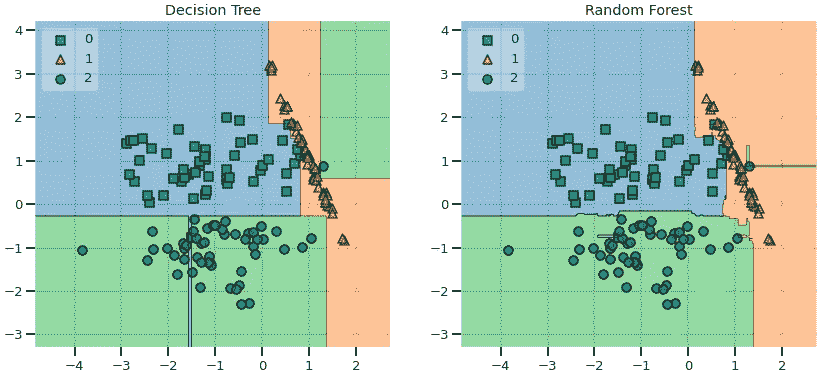

三类分类问题的决策边界(图片由作者提供)。

当使用随机森林和旋转树时，有可能减少归纳偏差，这可能导致更平滑、更灵活的决策边界。

## 贝叶斯模型

在贝叶斯模型中，可以在具有先验分布的模型中包含先验知识或假设。这和注入特定的感应偏压是一样的。考虑硬币正面朝上落地的概率估计:设`r`是正面朝上落地的概率，`Yn`是在`n`试验中正面朝上的数量。

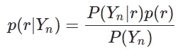

硬币示例的贝叶斯规则。

有可能使用二项式分布估计后着陆平视概率 p(r|Yn ),使用 Betta 分布估计前 p(r)。

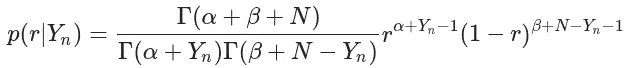

从二项式似然和 Betta 先验导出的后验密度。

考虑具有不同 Betta 先验的例子，其中硬币正面落地的地面真实概率是 0.7。如果先验分布与真实值相差甚远，就需要更多的样本来接近真实值的估计。

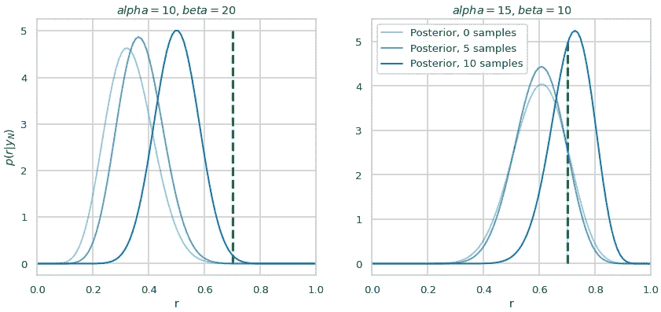

左图:初始先验密度最大似然 r=0.3。右图:初始先验密度最大似然 r=0.6。地面真相平视着陆概率 0.7(图片由作者提供)。

## 卷积神经网络

CNN 具有特定于架构的偏差和主要取决于数据和训练过程的偏差。大多数一般的 CNN 归纳偏差是局部性和权重共享。局部性意味着紧密放置的像素彼此相关。重量共享意味着寻找特定的模式。图像的不同部分应该以相同的方式处理。两个更多的归纳偏差通常被实现到 CNN 中:具有池层的平移不变性和不使用它们的平移等变。

CNN 不太明显的归纳偏差现在已经被很好地研究过了，并且有相当有趣的历史。在[ [1](https://arxiv.org/pdf/1706.08606.pdf) 中，作者在一次性学习设置中对具有形状匹配和颜色匹配的图像三元组进行了实验，并找出了 CNN 模型的形状偏差，这意味着它们更依赖于对象形状而不是对象颜色。一年后，其他研究人员认为 CNN 在设计上没有形状偏见，CNN 可以通过适当的初始化和数据扩充来训练形状分类。然后另一项研究[ [3](https://arxiv.org/pdf/1811.12231.pdf) ]显示，ImageNet 训练的模型是有纹理偏见的。

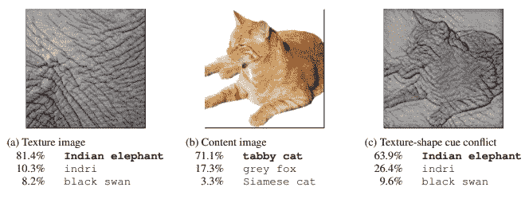

CNN 的纹理偏见，[ [来源](https://arxiv.org/pdf/1811.12231.pdf)。

作者认为这种类型的偏差是由数据集而不是模型架构引起的，并表明他们可以在取代原始图像纹理的风格化数据集上进行训练时实现基于形状的表示。

在[ [4](https://arxiv.org/pdf/1911.09071.pdf) 中，作者得出结论，在 CNN 的模型中实现纹理偏差或形状偏差是可能的。偏差主要是由数据及其扩充过程定义的，而不是模型结构本身。他们表明，数据增加，如颜色失真或模糊，会减少纹理偏差，而随机裁剪会增加纹理偏差。最后，研究人员[ [5](https://openreview.net/pdf?id=Db4yerZTYkz) ]表明，纹理和形状偏差是互补的，模型可以无偏地训练，平等地依赖于纹理和形状。为了实现这一点，该模型在具有冲突的形状和纹理图像(纹理来自一个类，形状来自另一个类)的数据集上进行训练。

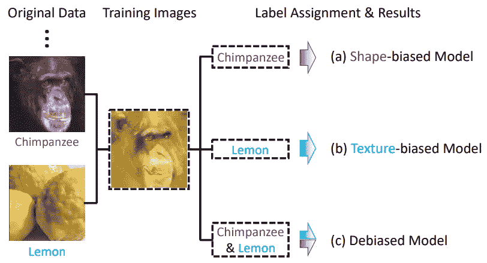

纹理-形状冲突的图像，[来源](https://openreview.net/pdf?id=Db4yerZTYkz)。

这种方法提高了识别模型的准确性和模型的鲁棒性。

CNN 的这些例子揭示了归纳偏差的重要性。根据训练程序和数据，可以偏向纹理或偏向形状来训练模型。在测试集上，这两种情况在准确性方面可能是相等的，但是基于形状的模型将对噪声破坏和图像失真更加鲁棒。

## 递归神经网络

递归神经网络有几个架构偏差:

1.  顺序偏差—输入令牌按顺序逐一处理(可通过双向 rnn 减少)。
2.  内存瓶颈——在将第一个令牌处理为隐藏状态之前，模型无法访问过去的令牌。
3.  递归-模型在每一步对所有输入数据应用相同的函数。

平面 RNN 还具有局部性偏差，这种偏差在具有较长序列记忆机制的循环体系结构中会减少，例如 LSTM 或格鲁

在 NLP 领域，研究表明，对于某些任务，RNN 诱导偏差可能是有益的。例如，在[ [8](https://arxiv.org/pdf/2006.00555.pdf) 中，作者表明 LSTM 在[主谓一致任务](https://arxiv.org/pdf/1611.01368.pdf)中优于平面变形金刚。它还表明，变压器性能可以通过 RNN 电感偏置注入来获得，例如顺序偏置(通过未来令牌屏蔽)和循环偏置(通过跨层共享参数)。

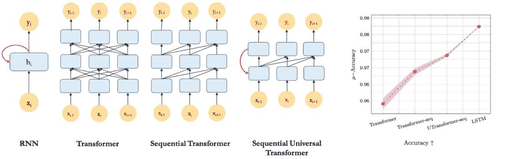

具有特定偏差的变压器架构[s [来源](https://samiraabnar.github.io/articles/2020-05/recurrence)。

其他研究表明，基于 LSTM 的模型偏向于等级归纳。

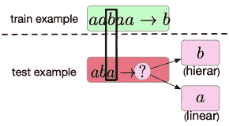

揭示学习者等级或线性偏见的任务示例[ [来源](https://arxiv.org/pdf/2006.14953.pdf) ]。

这种等级偏向被认为对 NLP 任务是有用的。

## 变形金刚(电影名)

变压器没有强烈的归纳偏差，因此它们更灵活，也更需要数据。缺乏强偏差不会给模型带来额外的约束。因此，如果提供足够的数据，它可以找到更好的优化。缺点是这种模型在低数据设置下表现较差。即使对变压器来说，注入一些偏压也是有利可图的。例如，在计算机视觉[ [7](https://ai.facebook.com/blog/computer-vision-combining-transformers-and-convolutional-neural-networks/) 中，作者提出使用“软”卷积归纳偏差，以便他们的模型可以在必要时学会忽略它。模型可以受益于低数据设置中的卷积归纳偏差，并且如果它设置了太多的约束，能够忽略它。

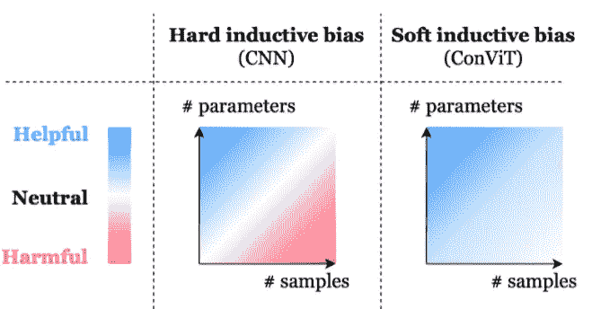

软感应偏置可以帮助控制模型约束[ [源](https://arxiv.org/pdf/2103.10697.pdf) ]。

这种偏差是通过门控位置自我注意层实现的，该层可以用学习参数α来控制卷积归纳偏差。这样的模型优于 [DeiT](https://arxiv.org/pdf/2012.12877.pdf) 并且看起来样本效率更高。作者还表明，最早的层倾向于使用卷积归纳偏差(α非零)，而最新的层倾向于完全忽略偏差(α接近于零)。

在[ [6](https://arxiv.org/pdf/2106.13122.pdf) 中，作者表明视觉变压器模型，如 ViT 或 Swin 和 MLP 混合器模型比 CNN 模型有更多的形状偏差。

## 图形神经网络

gnn 有很强的关系偏向。由于图形结构，该模型强烈依赖于对象之间的结构关系。对于可以表示为对象和关系的离散数据建模，这是一个有用的偏好，例如文档数据库、分子中的原子或双摆等。

gnn 还具有置换不变性偏差，这对于具有任意排序的数据也是一种期望的属性。在图形卷积网络中也有权重共享(如在 CNN 中)，因此图形的不同部分以相同的方式处理。

## 结论

归纳偏差可以被视为关于模型和数据属性的初始信念。正确的初始信念导致用更少的数据更好地概括。错误的信念可能会过多地限制模型，并最终阻止一个人找到一个好的最优方案，即使有大量的数据。经验法则是，如果期望偏差明确，则选择具有强归纳偏差的模型，如果期望偏差不明确，则选择具有更多数据的更灵活的模型。

从模型初始化和数据扩充到优化器甚至调度器，训练管道的每个组件都有自己的偏差，这些偏差会影响最终的优化。此外，深度神经网络模型也有隐藏和未知的偏差，这是一个相关的研究领域。从业者还应该意识到潜在的偏见，在数据损坏或域转移的情况下，这些偏见可能会导致意外的模型行为。

## 链接

1.  [深度神经网络的认知心理学:形状偏差案例研究 Samuel Ritter，David G.T. Barrett，Adam 桑托罗，Matt M. Botvinick](https://arxiv.org/pdf/1706.08606.pdf) 2017。
2.  [评估卷积神经网络的形状偏差特性 Hossein Hosseini，Baicen Xiao，Mayoore Jaiswal，Radha Poovendran 2018](http://Assessing Shape Bias Property of Convolutional Neural Networks Hossein Hosseini Baicen Xiao Mayoore Jaiswal Radha Poovendran)
3.  [IMAGENET 训练的 CNN 偏向于纹理；增加形状偏差可提高准确性和鲁棒性罗伯特·盖尔霍斯，帕特里夏·卢比什，克劳迪奥·米歇尔斯·马蒂亚斯·贝希，费利克斯·a·威奇曼，维兰德·布伦德](https://arxiv.org/pdf/1811.12231.pdf) 2019
4.  [卷积神经网络中纹理偏差的起源和流行凯瑟琳·l·赫尔曼，陈婷·西蒙，科恩布利思 2020 年](https://arxiv.org/pdf/1911.09071.pdf)
5.  [形状-纹理去偏神经网络训练，，于，谭明星，解如梅，，，谢慈航，2021](https://openreview.net/pdf?id=Db4yerZTYkz)
6.  [探索腐败鲁棒性:视觉变压器和 MLP 混频器中的感应偏差 Katelyn Morrison，Benjamin Gilby，Colton Lipchak Adam Mattioli，Adriana Kovashka 2021](https://arxiv.org/pdf/2106.13122.pdf)
7.  [ConViT:利用软卷积电感偏置改进视觉变压器夏羽·德阿斯科利斯、雨果·图夫龙、马修·l·莱维特、阿里·s·莫科斯、朱利奥·比罗利、莱文特·萨贡 2021](https://arxiv.org/pdf/2103.10697.pdf)
8.  [通过知识提炼转移归纳偏见周欣宇·阿布纳，穆斯塔法·德赫加尼，威廉·祖伊德马 2020](https://arxiv.org/pdf/2006.00555.pdf)
9.  [当有疑问时他们做什么:SEQ2SEQ 学习者的归纳偏差研究 Eugene Kharitonov，Rahma Chaabouni 2021](https://openreview.net/pdf?id=YmA86Zo-P_t)