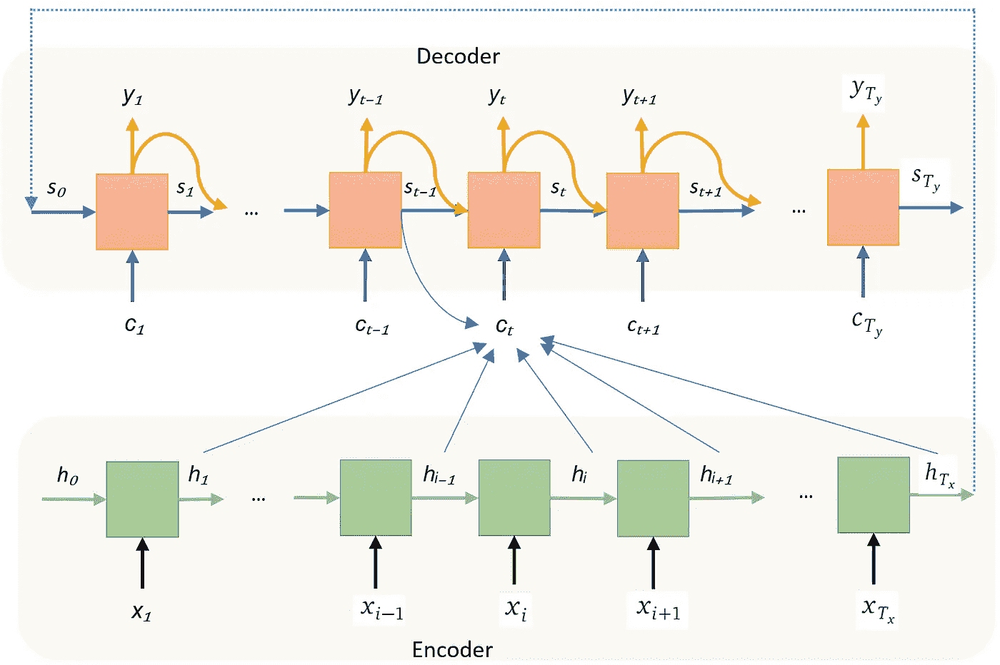
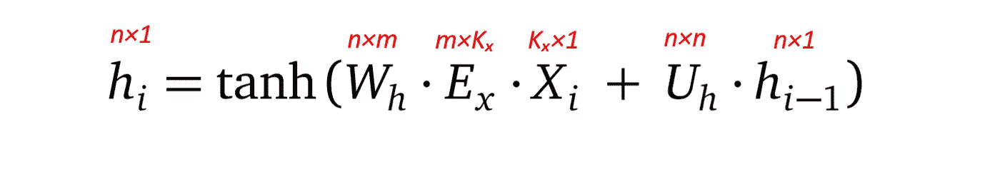
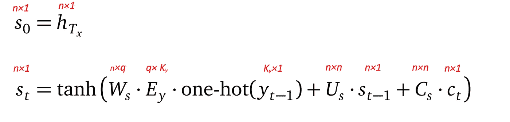
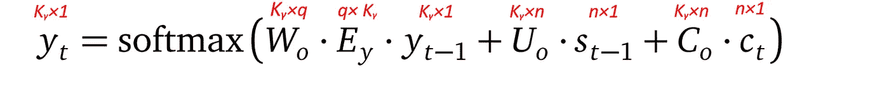
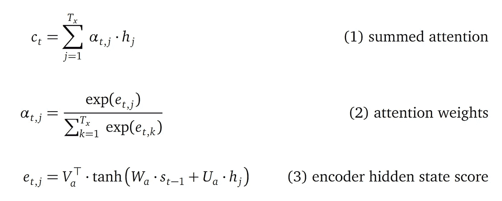
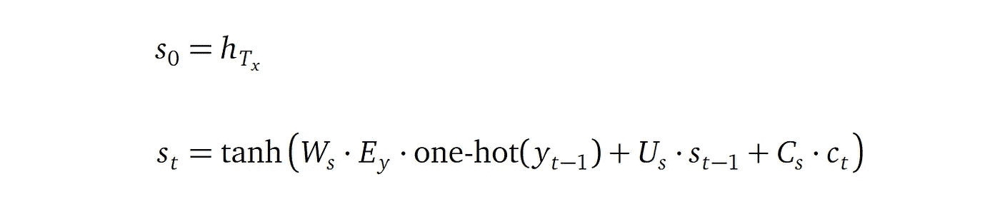

# “联合学习对齐和翻译的神经机器翻译”的输入输出注意机制

> 原文：<https://towardsdatascience.com/the-input-output-attention-mechanism-from-neural-machine-translation-by-jointly-learning-1bb00f5deb0c>

图片来自 [Pixabay](https://pixabay.com/photos/lens-camera-taking-photos-3046269/)

注意机制是深度学习中一个很有影响力的观点。即使我们经常认为注意力是在变形金刚中实现的，但最初的想法来自于 Dzmitry Bahdanau 等人的论文“ [*通过联合学习对齐和翻译*](https://arxiv.org/abs/1409.0473) 的神经机器翻译”。艾尔。

了解强大的注意力技术的起源将有助于我们掌握许多后代的想法。在这篇文章中，我将描述这种原始的注意力思想。在以后的文章中，我将涉及其他关注点，比如来自 Transformer 模型的关注点，以及更多最近的关注点，不仅仅是文本，还有图像、视频和音频。

# 语言到语言的翻译模式

本文介绍了一个将源语言中的一个句子翻译成目标语言中的一个句子的模型。该模型具有编码器-解码器架构，其中递归神经网络实现编码器和解码器。下图显示了模型架构:

基于 RNN 的语言到语言翻译模型架构

# 模型架构

我们先从下往上看图表。

## 输入

在图表的底部，编码器的输入是源语言的单词序列:

在哪里

*   *Tₓ* 是输入句子*的长度。*例如，在一句“我爱神经网络”中， *Tₓ=4.*
*   每个 *xᵢ* 都是一个单词在源语言中的独一无二的表示，带有一个 *Kₓ* 单词的字典。也就是说，每个 *xᵢ* 是一个长度为 *Kₓ、*的向量，通常在 5 万到 10 万字的范围内*。*在这个 *xᵢ* 向量中只有一个条目是 1，指示源语言中的特定单词；所有其他条目为零。

## 编码器

*   编码器是一个递归神经网络。在图表中，它显示为通常的连续区块(绿色区块)。记住，只有一个编码器模块，所有的输入字都由这个模块一个接一个地处理。
*   编码器模块获取隐藏状态和输入字，并发出下一个隐藏状态。 *h₀、h₁…、h_Tₓ* 是长度为 *n* 的隐藏状态向量。 *h₀* 是零矢量。
*   注意，这些编码器隐藏状态向量不是模型参数，它们是递归神经网络块的输出。
*   最后一个编码器隐藏状态 *h_Tₓ* 将是解码器的初始状态，即 s_ *₀ = h_Tₓ.*在图表中，青色虚线箭头建立了这种联系。

## 解码器

*   解码器也是递归神经网络，显示为粉红色块。
*   decode 块发出两件事:下一个翻译成目标语言的单词，以及下一个解码器隐藏状态。为此，它需要三个输入:前一个解码器隐藏状态(显示为蓝色箭头)、前一个输出单词(显示为黄色箭头)和一个上下文(显示为紫色箭头)。
*   语境是注意力机制的结果，也是本文的主要目的。稍后我将描述如何计算它和它的直觉。
*   解码器继续发出翻译的单词，直到它发出一个特殊的句尾单词。
*   即使我绘制了与编码器块相同数量的解码器块，在翻译过程中，输入和输出的句子很可能长度不同。

更正式地说，解码器的输出是目标语言的单词概率向量序列:

*   *Tᵧ* 是目标句子的长度，在模型完成翻译之前我们并不知道——只有当解码器输出特殊的句尾词时，我们才知道目标句子的长度。
*   每个发出的概率向量 *yᵢ* 的长度为 *Kᵧ* ，其中 *Kᵧ* 是目标语言的字典大小。向量 *yᵢ* 中的条目是 0 到 1 之间的实数，代表特定单词的概率，即第*个*个单词，其中 *i* 是目标语言中的条目索引。 *yᵢ* 中的所有条目总和为 1。惯例是使用概率最高的字作为解码器的第*个*发射字。

# 公式

了解了模型架构后，让我们深入研究模型中的公式，这有助于我们在讨论注意力机制时将直觉与相应的数学实现联系起来。

我简化了论文中的公式。我的公式版本不包括双向 RNN 和 LSTM 式指数平滑。这些简化保持了公式的简短，更容易理解主要的注意力思想。

## 编码器隐藏状态

*   每个编码器隐藏状态 *hᵢ* 是一个长度为 *n* 的向量，其中 *n* 是编码器隐藏状态的维度。 *n* 是模型的超参数，通常在几百到几千之间。
*   初始编码器隐藏状态是零向量。所有连续的编码器隐藏状态 *hᵢ* 通过参考前一个编码器隐藏状态 *hᵢ-₁* 递归定义。这就是递归神经网络的本质。

让我们来看看更有趣的 *hᵢ.的案例*它结合了来自当前输入字 *xᵢ* 和先前编码器隐藏状态 *hᵢ₋₁* 的信息:

*   *Xᵢ* 是一键向量中第*个*输入字，形状为 *Kₓ×1.*
*   *Eₓ* 为源语言的单词嵌入矩阵，形状 *m×Kₓ，*带 *Kₓ* 为源语言的单词数， *m* 为源语言嵌入的维数。
*   *hᵢ-₁* 是前一个编码器隐藏状态。
*   形状为 *n×m 的 *Wₕ* 和形状为 *n×n* 的 *U* ₕ是模型的可学习参数。*
*   双曲正切 *tanh* 是激活函数。

我把尺寸放在各种矩阵的顶部，这样你可以很容易地验证它们。

## 注意机制

注意机制为每个输出单词计算上下文向量。对于第*个*输出字，上下文 *cₜ* 是所有编码器隐藏状态 *h₁* 到 *h_Tx* 的加权平均值:

或者更简洁地说:

在上面的公式中，每个 *αₜ,ⱼ* 都是一个浮点数，代表第 j 个*输入字隐藏状态*hⱼ*第 t 个*输出字的权重。 *αₜ,ⱼ* 使用 softmax 公式定义(softmax 函数确保所有权重总和为 1):

并且 *eₜ,ⱼ* 定义为 *:*

*   *eₜ,ⱼ* 合并来自第*j*编码器隐藏状态 *hⱼ* 和第*(t-1)*解码器隐藏状态 *sₜ₋₁* 的信息。
*   *形状为*n′×n*的 Wₐ* 和形状为*n′×n*的 uₐ*是可学习的参数。*
*   形状为*n′×1*的 Vₐ(因此其转置 *Vₐᵀ* 的形状为*1×n′)*也是可学习的参数。
*   人们将上述等式右边的表达式称为注意力网络，因为它确实是一个简单的前馈网络。

**注意力机制背后的直觉**

在标准的编码器-解码器架构中，来自输入句子的信息仅通过最终编码器隐藏状态向量 *h_Tₓ、*或等效地，初始解码器隐藏状态向量 *s_₀.对解码器可用*本设计:

*   具有迫使编码器学习关于输入句子的东西的优点。这是因为解码器只能依靠来自其初始隐藏状态向量的信息来生成输出句子。只有当初始解码器隐藏状态向量包含足够的来自输入句子的信息时，decide 才能很好地生成输出句子。
*   这种设计的缺点是，当生成输出句子时，解码器不能访问特定的输入单词，它只有关于整个输入句子的信息。想象一下，我让你把一部法语小说(那是我们的输入句)翻译成英语小说(那是我们的输出句)，但是我不给你法语小说，而是给你那部小说的摘要(那是初始解码器隐态向量)，要求你做一个单词级的翻译。这是一项艰巨的任务。

注意机制的动机是引入一种新的方式来将关于输入单词的信息传递给解码器。在建立这种新方式时，我们需要考虑以下几点:

*   当我们到达解码阶段时，我们已经有了所有输入单词的信息，存储在编码器隐藏状态 *h₁、…、hⱼ、…、h_Tₓ.*
*   解码器逐字生成或解码输出句子:y *₁，…，yₜ，… y_Ty。*
*   由于在解码一个输出字时，并非所有的输入字都同等重要，所以当解码第*个第*个输出字时，我们需要决定将哪些输入字的信息，即那些编码器隐藏状态向量，传递给解码器。

鉴于上述情况，本文提供了一个巧妙的设计:

*   当解码第*个第*个输出字时，解码器以加权和的方式包括所有输入字的信息，而不是对关注或关注哪些输入字进行二元决策。那就是 c *ₜ* 向量*。*
*   然后，当解码第*个到第*个输出字时，解码器需要学习如何给每个输入字分配权重。那是第 *eₜ,ⱼ* 数量，它是一个浮点标量值，用于第 *j 个*输入字中的每一个。

**eₜ,ⱼ*数量*数量**

*eₜ,ⱼ* 量最终决定了模型使用多少来自编码器隐藏状态 *hⱼ* 的信息来解码输出字 *yₜ.*

一个 *eₜ,ⱼ* 越大，第 *j 个*编码器隐藏状态 *hⱼ* (或者等效地第*个 j 个*输入字)的权重就越高，所以来自 *hⱼ* 的更多信息被包含在计算上下文 c *ₜ* 中，用于解码第*个*输出字*。*注意力机制充当解码器的顾问。它告诉解码器，要生成第*个*个输出字，要注意哪个输入字。

现在的问题是如何估算计算出 *eₜ,ⱼ？*上式表示使用先前的解码器隐藏状态 *sₜ₋₁* 和编码器隐藏状态 *hⱼ.*这意味着:

*   我们将来自编码器隐藏状态的信息用于第*个第 j*个输入字，即*个 hⱼ* ，它表示关于输入句子直到第*个第 j*个字*的知识。*
*   并且我们使用来自先前解码器隐藏状态 *sₜ₋₁* 的信息，其表示关于输出句子直到第*个*字的知识。

这两条信息似乎是明智的选择。他们是唯一的选择吗？也许不是。这篇论文的作者决定了这些选择，并展示了它的实验成功。你可以想出其他的选择。事实上，在其他论文的许多后续关注想法中，你可以看到不同的选择。

注意机制的全部目的是计算上下文向量，以便从输入句子中向解码器提供更好的信息。现在让我们看看解码是如何使用这个上下文向量的。

## 解码器输出

解码器生成两个输出，下一个解码器隐藏状态和下一个目标语言的输出单词。

**下一个解码器隐藏状态**

*   第一个解码隐藏状态 *s_₀* 设置为最后一个编码器隐藏状态 *h_Tx* ，这就是为什么 *s_₀* 与 *h_Tx* 形状相同，都是 *n×1* 。
*   所有连续的解码器隐藏状态 *sₜ* 通过参考先前的解码器隐藏状态 *sₜ₋₁* 被递归地定义，其中包括:先前生成的输出字 *yₜ₋₁、*先前的解码器状态 *sₜ₋₁* ，以及来自注意机制的上下文 *cₜ* 。请注意下标的不同: *sₜ₋₁，yₜ₋₁* ，而 *cₜ.*
*   *yₜ₋₁* 是输出单词概率向量(在下一节定义)，其长度为 *Kᵧ.*独热运算符将 *yₜ₋₁* 转换为独热表示，将 1 分配给具有最大值的向量条目，将 0 分配给所有其他条目。这个独热向量用于在目标语言嵌入矩阵 *Eᵧ* 中为该输出单词选择嵌入向量。
*   目标语言嵌入矩阵 *Eᵧ* 的形状为 *q×Kᵧ* ，其中 *Kᵧ* 为目标语言的字数， *q* 为目标语言单词嵌入的维数。
*   *Wₛ* 、 *Uₛ* 和 *Cₛ* 是可学习的参数。

**目标语言的下一个输出单词**

*   输出单词概率向量 *yₜ* 结合了三条信息:之前生成的输出单词 *yₜ₋₁、*之前的解码器状态 *sₜ₋₁* ，以及来自注意力网络的上下文 *cₜ* 。这与解码器隐藏状态 *sₜ.相同*
*   但是不同的矩阵 *Wₒ* 、 *Uₒ* 和 *Cₒ* (而不是 *Wₛ* 、 *Uₛ* 和 *Cₛ* )被用来组合这些信息以生成 *yₜ* ，即使组合公式的结构在 *yₜ* 和 *s 中是相同的。*
*   *Wₒ* 、 *Uₒ* 和 *Cₒ* 是可学习的参数。
*   *softmax* 运算符确保对于位置 *t* 的输出单词，目标语言词典(其大小为大小 *Kᵧ* )中所有单词的概率总和为 1。

这就完成了引入原始注意机制的语言模型。

# 快速公式参考

我现在以简洁的方式列出上面的所有公式，供您快速参考:

## (1)编码器隐藏状态

## (2)注意网络

## (3)解码器隐藏状态

## (4)来自解码器的目标词概率向量

# 支持我

如果你喜欢我的故事，如果你考虑支持我，通过这个链接成为灵媒会员，我将不胜感激:[https://jasonweiyi.medium.com/membership](https://jasonweiyi.medium.com/membership)。

我会继续写这些故事。

# 结论

本文阐述了基于递归神经网络的语言到语言翻译模型，该模型首次引入了注意机制。它清楚地强调了输入输出机制是如何工作的，以及数学背后的直觉。