# 图形卷积和消息传递背后的直觉

> 原文：<https://towardsdatascience.com/the-intuition-behind-graph-convolutions-and-message-passing-6dcd0ebf0063>

# 图形卷积和消息传递背后的直觉

## 图神经网络中图卷积和消息传递之间的关系及图分类实例。

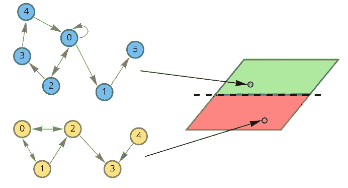

【图片由作者提供】。

## 内容

在接下来的文章中，我们将介绍图形卷积背后的基本思想和建立一些直觉，研究如何基于消息传递机制建立图形卷积神经网络，并创建一个模型来用嵌入可视化对分子进行分类。

## 问题陈述的示例

让我们想象我们设计药物来治疗某种疾病。让我们假设我们有一个数据集，其中包含成功治疗该疾病的药物和无效的药物。我们现在正在设计一种新药，想知道它是否能治疗这种疾病。如果我们可以创建一个有意义的药物表示，我们就可以训练一个分类器来预测它对疾病治疗是否有用。我们的药物是分子，可以用图表来表示。这个图的节点是原子。也可以用特征向量 ***x*** 来描述原子(它可以由原子属性组成，如质量、电子数或其他)。为了对分子进行分类，我们希望利用关于其空间结构和原子特征的知识来获得一些有意义的表示。

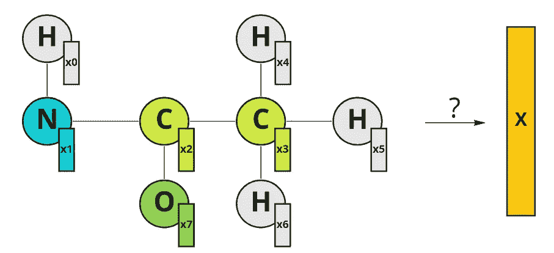

用图形表示的分子的例子。原子有它们的特征向量 x，特征向量中的索引代表节点索引[图片由作者提供]。

## 那么我们能做什么呢？

最直接的方法是聚集特征向量，例如，简单地取它们的平均值:

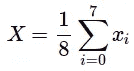

节点特征向量的平均。

这是一个有效的解决方案，但是它忽略了分子的空间结构，而空间结构是很重要的。

人们可以提出另一个想法:用[邻接矩阵](https://en.wikipedia.org/wiki/Adjacency_matrix)表示分子图，并用特征向量“扩展”其深度。结果，我们获得伪图像[8，8，N]，其中 N 是节点特征向量 ***x*** 的维数。现在有可能使用常规卷积神经网络并提取嵌入的分子。

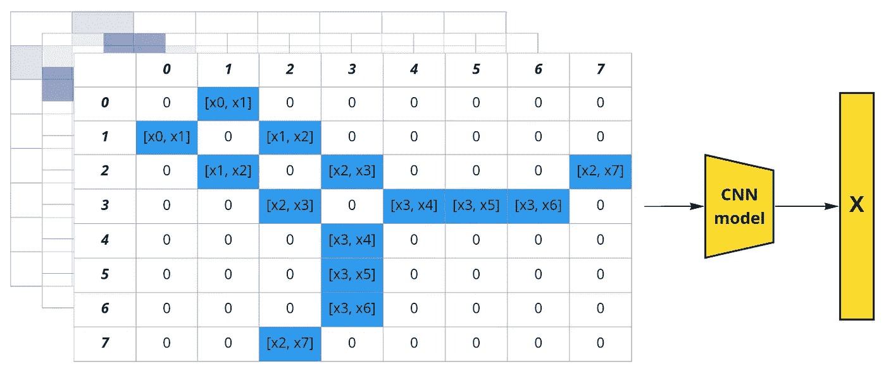

图结构可以表示为邻接矩阵。节点特征可以表示为图像中的通道(括号代表串联)[Image by author]。

这种方法利用了图形结构，但有一个巨大的缺点:如果我们改变节点的顺序，我们会得到不同的表示。所以这种表示不是置换不变量。然而，相反的情况是可取的:邻接矩阵中的节点顺序是任意的。例如，我们可以将列顺序从[0，1，2，3，4，5，6，7]更改为[0，2，1，3，5，4，7，6]，它仍然是图的有效邻接矩阵。我们可以创建所有可能的排列并将它们堆叠在一起，这将导致 1625702400 个可能的邻接矩阵(8！* 8!).那似乎是过分的，所以我们应该找到更好的。

问题是，我们如何整合空间信息，并有效地做到这一点？上面的例子可以让我们想到卷积的概念，但它应该在图形上进行。

## 图形卷积背后的直觉

当我们对图像应用正则卷积时会发生什么？相邻像素的值乘以滤波器权重并求和。我们能在图上做类似的事情吗？是的，我们可以将节点特征向量堆叠在一个矩阵 ***X*** 中，并将它们乘以邻接矩阵 ***A*** ，然后我们获得更新的特征 ***X`*** ，其结合了关于节点最近邻居的信息。为简单起见，让我们考虑一个具有标量节点特征的示例:

标量值结点要素的示例。仅针对节点 0 说明了 1 跳距离，但所有其他节点都适用[图片由作者提供]。

因此，每个节点都会获得关于其最近邻居的信息(也称为 1 跳距离)。邻接矩阵上的乘法将特征从节点传播到节点。

在图像域中，我们可以通过增加滤波器尺寸来扩展感受野。在图中，我们也可以考虑更远的邻居。如果将*乘以***X***——关于两跳距离的节点的信息传播到这些节点:*

*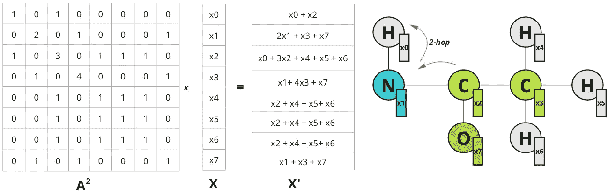*

*注意，节点 0 现在有了关于在 2 跳距离内的节点 2 的信息。仅说明了节点 0 的跳数，但所有其他节点都是如此[图片由作者提供]。*

*矩阵的高次幂*以相同的方式工作:乘以 ***A^n*** 导致从 n 跳距离节点传播特征。所以我们可以通过对邻接矩阵的高次幂增加乘法来扩展“感受野”。为了概括这个操作，可以将节点更新的函数定义为这样的乘法的和，这些乘法具有一些权重 ***w*** :**

**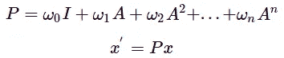**

**多项式图形卷积滤波器。a-图邻接矩阵，w-标量权重，x-初始节点特征，x '-更新的节点特征。**

**所以新特性***【x’***看起来是一些来自 n-hop 距离中节点的混合物的影响，相应的距离由权重 ***w*** 控制。这样的操作可以被认为是与由权重***【w】***参数化的滤波器 ***P*** 的图形卷积。与图像上的卷积类似，图卷积滤波器也可以具有不同的感受域，并且聚集关于节点邻居的信息，但是邻居的结构不应该像图像中的卷积核那样规则。**

**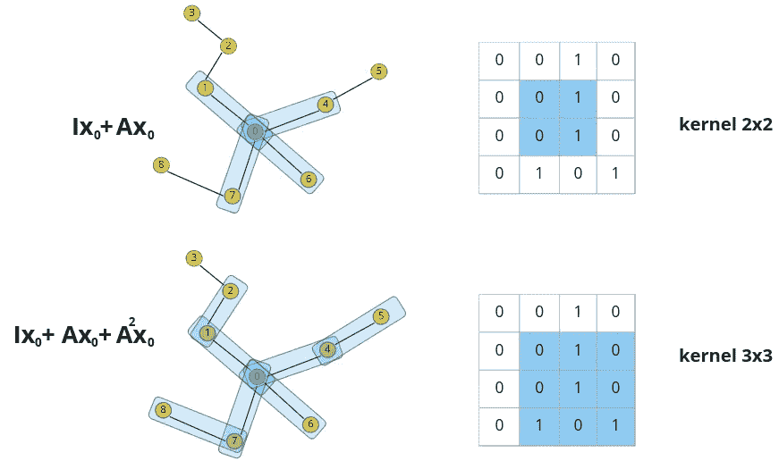**

**图形卷积和图像卷积的相似性【图片由作者提供】。**

**这种多项式满足一般卷积的置换等变。可以使用图拉普拉斯算子而不是邻接矩阵来在节点之间传递特征差异而不是特征值。也可以使用邻接矩阵或图拉普拉斯的规范化形式。**

> **将图卷积表示为多项式的能力可以从一般的谱图卷积中得到。例如，利用具有图拉普拉斯算子的切比雪夫多项式的滤波器提供了直接谱图卷积的近似[ [1](https://arxiv.org/pdf/1606.09375.pdf) ]。**

**请注意，我们可以很容易地将其推广到任何维度的节点特征，并保持相同的方程。唯一不同的是，在更高维的情况下，我们处理的是节点特征矩阵 ***X*** 而不是节点特征向量。例如对于 N 个*节点和 1 个 ***或 M 个*** 节点我们得到:***

**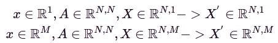**

**X-节点特征向量，X-堆叠节点特征，M-节点特征向量的维度，N-节点数量。**

**请注意，我们可以将特征向量的“深度”维度视为图像卷积中的“通道”。**

## **信息传递**

**现在让我们以稍微不同的方式来考虑同样的话题。让我们采用上面讨论的仅具有前两项的简单多项式卷积，并让 ***w*** 等于 1:**

**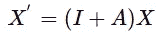**

**所以现在如果我们将图形特征矩阵 ***X*** 乘以( ***I + A*** )我们得到如下:**

**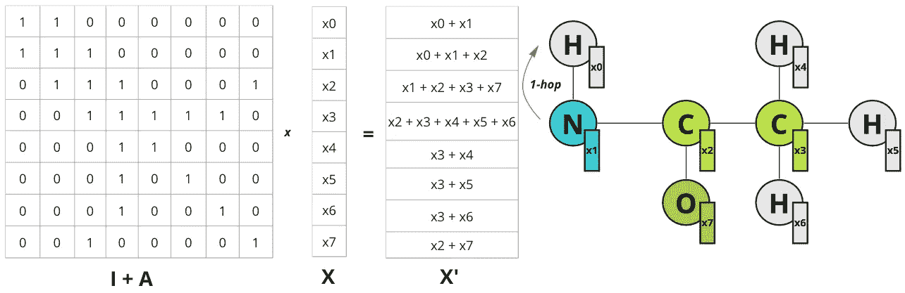**

**【图片由作者提供】。**

**可以看到所有特征发生了什么，对于每个节点，添加了相邻节点的总和。因此操作可以表示如下:**

**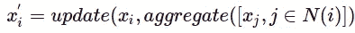**

**N(i)表示节点 I 的一跳距离邻居**

**在我们的例子中,“更新”和“聚集”只是简单的求和函数。**

**这种对节点特性更新的观点被称为消息传递机制。考虑这种消息传递的单次迭代相当于与过滤器 ***P= I + A*** 的图卷积。现在，如果我们想要从更远的节点传播信息，我们可以再次重复这样的操作几次，从而用更多的多项式项来近似图形卷积。**

> **如果重复几次图形卷积，会导致图形过度平滑，其中每个节点嵌入对于所有连接的节点都变成相同的平均向量。**

**现在，怎样才能增加表达信息传递的能力呢？您可以尝试聚合和更新功能，还可以转换节点功能:**

**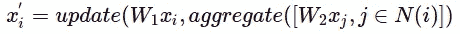**

**w1-更新结点要素的权重矩阵，W2-更新相邻结点要素的权重矩阵。**

> **请注意，可以使用任何排列不变函数进行聚合，如 sum、max、mean 或更复杂的函数，如 [DeepSets](https://arxiv.org/pdf/1703.06114.pdf) 。**

**例如，评估消息传递的基本方法之一是 [GCN](https://arxiv.org/pdf/1609.02907.pdf) 层:**

**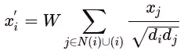**

**乍一看可能不太熟悉，但是让我们使用“更新”和“聚合”函数来看看它:**

**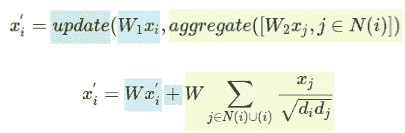**

**使用单个矩阵 W 代替两个加权矩阵 W1 和 W2。更新函数是总和，聚合函数是包括结点特征 I 在内的归一化结点特征的总和。d-表示[结点度](https://en.wikipedia.org/wiki/Degree_(graph_theory))。**

**我们有单个权重矩阵 ***W*** 而不是两个，用 [Kipf 和 Welling 归一化](https://arxiv.org/pdf/1609.02907.pdf)求和作为聚合，再加一个求和作为更新函数。注意，聚合会评估邻居和节点 ***i*** 本身，这相当于将自循环添加到一个图中。**

**因此，具有消息传递机制的 GNN 可以表示为重复多次的聚集和更新功能。消息传递的每次迭代可以被认为是一个新的 GNN 层。节点更新的所有操作都是可微分的，并且用可以学习的权重矩阵来参数化。现在，我们可以构建一个图形卷积网络，并研究它的性能。**

# **实际例子**

**现在让我们使用上面提到的 GCN 层来构建和训练图形神经网络。对于这个例子，我将使用已经实现了许多层的 [PyG](https://pytorch-geometric.readthedocs.io/en/latest/#) 库，包括一个 GCN 层。为了举例，我将使用[辅助](https://wiki.nci.nih.gov/display/NCIDTPdata/AIDS+Antiviral+Screen+Data)图形数据集【2，3】。它由 2000 个代表分子化合物的图表组成:其中 1600 个被认为对艾滋病毒无活性，400 个对艾滋病毒有活性。每个节点都有一个包含 38 个特征的特征向量。以下是来自数据集的分子图表示示例:**

**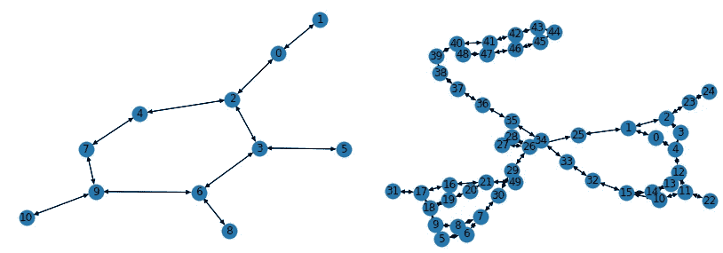**

**使用[网络 x](https://networkx.org/) 库对来自艾滋病数据集的样本进行可视化【图片由作者提供】。**

**为了简单起见，我们将建立一个只有 3 个 GCN 层的模型。对于嵌入空间可视化，最终嵌入维度将是 2-d。为了得到图形嵌入，我们将使用平均聚合。为了对分子进行分类，将在图形嵌入的顶部使用简单的线性分类器。**

**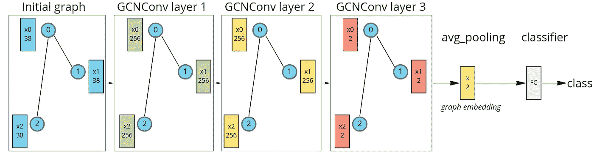**

**具有三个 GCN 层、平均池和线性分类器的图形神经网络。**

**对于第一次消息传递迭代(第 1 层)，初始特征向量被投影到 256 维空间。在第二次消息传递(第 2 层)期间，在相同维度上更新特征向量。在第三次消息传递(第 3 层)期间，特征被投影到 2-d 空间上，然后应用所有节点特征的平均来获得最终的图形嵌入。最后，这些嵌入被馈送到线性分类器。请注意，选择最终的 2-d 维度只是为了可视化，维度越高效果越好。这种模型可以使用 PyG 库来实现:**

**那么它可以被训练成通常的具有二进制交叉熵损失的 Pytorch 模型。在训练过程中，我们可以可视化图形嵌入和分类器决策边界。通过这样做，我们可以看到消息传递操作如何仅用 3 个图卷积层就产生有意义的图嵌入。注意，随机初始化的模型嵌入没有线性可分的分布:**

**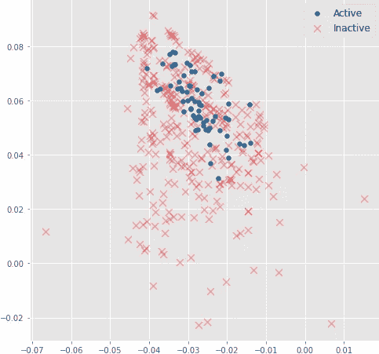**

**分子嵌入是通过正向传递随机初始化的模型获得的[图片由作者提供]。**

**但是在训练期间，分子嵌入很快变得线性可分:**

**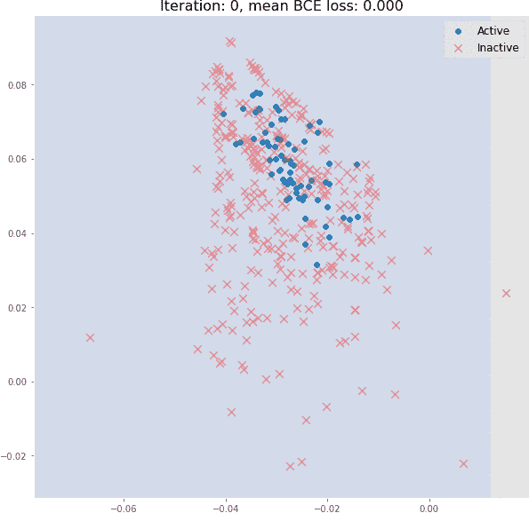**

**验证集和分类器决策边界的分子嵌入。**

**因此，即使 3 个图形卷积层也可以评估有意义的 2-d 分子嵌入，这些嵌入可以用线性模型分类，在验证集上具有大约 82%的准确性。**

## **结论**

**我们看到了如何将图卷积表示为多项式，以及如何使用消息传递机制来逼近它。这种具有附加特征变换的方法具有强大的代表性，可以用于实际应用。我们几乎没有触及图形卷积和图形神经网络的表面。有几十种不同的图形卷积层和聚合函数架构。我们也不包括可以在图上完成的其他任务，比如节点分类、边重构等等。如果你想深入了解，PyG 教程可能是一个很好的起点。**

****参考文献:****

1.  **[具有快速局部谱滤波的图上卷积神经网络。Michal Defferrard，Xavier Bresson，Pierre Vandergheynst，EPFL，瑞士洛桑，2017 年](https://arxiv.org/pdf/1606.09375.pdf)**
2.  **[图数据集:用图学习的基准数据集集合，克里斯多夫·莫利斯、尼尔斯·m·克里格、弗兰卡·鲍斯、克里斯蒂安·克斯汀、佩特拉·穆策尔、马里恩·诺依曼，2020 年](https://arxiv.org/pdf/2007.08663.pdf)**
3.  **[graphlearning.io](http://www.graphlearning.io/)**