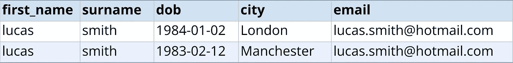
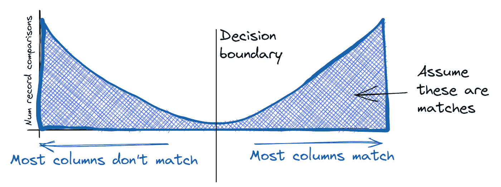

# 使用期望最大化来训练记录关联模型背后的直觉

> 原文：<https://towardsdatascience.com/the-intuition-behind-the-use-of-expectation-maximisation-to-train-record-linkage-models-5d7ac9f019ca>

## *如何使用无监督学习来估计 Splink 中的模型参数*

由[苏珊·威廉姆斯](https://unsplash.com/@scw1217?utm_source=unsplash&utm_medium=referral&utm_content=creditCopyText)在 [Unsplash](https://unsplash.com/s/photos/emerge?utm_source=unsplash&utm_medium=referral&utm_content=creditCopyText) 上拍摄的照片

Splink 是一个免费的概率记录连接库，可以预测两个记录引用同一个实体的可能性。比如下面两条记录匹配的概率是多少？

成对记录比较示例

潜在的统计模型被称为 Fellegi Sunter 模型。它通过计算部分匹配权重来工作，部分匹配权重是在计算匹配概率时不同列的重要性的度量。例如，在上面的例子中,“Smith”的匹配没有“email”的匹配重要。

然而，在训练记录链接模型的问题的核心有一个悖论:为了估计模型的参数，您需要知道哪些记录匹配。但是找到匹配的记录是你要解决的全部问题。手动标记比较容易出错且成本高，因此不是一个好的选择。

期望最大化(EM)算法为这个悖论提供了一个解决方案。这篇文章直观地解释了这是如何工作的，以及如何在我们的大规模记录链接软件 [Splink](https://github.com/moj-analytical-services/splink) 中实现的一些细节。有关更正式的处理方式，请参见 [FastLink 论文。](https://imai.fas.harvard.edu/research/files/linkage.pdf)

# 新兴市场方法

记录关联模型的参数——m 和 u 概率——可以分别从匹配记录和非匹配记录的集合特征中计算出来。(如果这个术语不熟悉，推荐阅读[这篇博文](https://www.robinlinacre.com/maths_of_fellegi_sunter/)。)一旦知道了这些值，模型通常就能够准确地预测哪些记录匹配。

EM 方法的关键是利用匹配和不匹配形成两个相当不同的“集群”这一事实:

*   在匹配记录中，两个记录中大多数或所有列的信息通常是匹配的。
*   在不匹配记录中，两个记录中大多数或所有列的信息通常不匹配

这导致记录比较的双峰分布:

成对记录比较的双峰分布的概念图。作者图解。

匹配和不匹配之间的这种分离意味着，提出一个能够正确识别大多数匹配和大多数不匹配的粗略决策规则是相对容易的。例如，我们可以简单地计算匹配的列数(名字和姓氏，等等)，并预测超过一半匹配的记录对的匹配。

既然我们已经将每个记录比较指定为匹配或不匹配，我们可以计算模型的隐含 m 和 u 参数。这使我们能够使用以下算法迭代地改进该决策规则:

**期望步骤:**使用估计的模型参数来预测哪些记录比较是匹配的

**最大化步骤:**使用预测来重新估计模型参数

在这个例子中，我们最初的决策规则通过简单地计算具有匹配信息的列的数量来工作。因此，我们对每一列都给予了同等的重视。显然，这条规则还有改进的空间——在现实中，邮政编码列的匹配比性别的匹配更重要。

期望最大化过程将立即开始学习这些权重，因为它将认识到，在不匹配的情况下，有许多记录比较在性别上匹配，但在邮政编码上匹配的很少。这将在重新计算的 m 和 u 概率中表示，并且在下一次迭代中，将对邮政编码的匹配给予更大的权重。

在每次迭代中，决策规则将随着模型错误的减少而改进，权重也因此变得更加准确。

当参数估计稳定，并且在迭代之间参数估计不再有任何变化时，收敛发生。

事实证明，这种算法相当于最大化 Fellegi-Sunter 模型的似然函数(尽管注意，它只能保证收敛到局部最大值，而不一定是全局最大值)。

# EM 方法如何在 Splink 中实施

在 Splink 中，对上述过程进行了一些修改，在实践中，这些修改导致更快的收敛和收敛到全局最大值的更大可能性。

## 估计 u 概率

虽然有可能使用 EM 方法估计 u 概率，但我们建议使用 Splink 中的[替代估计程序](https://moj-analytical-services.github.io/splink/linker.html#splink.linker.Linker.estimate_u_using_random_sampling)，该程序通常更准确。

回想一下，u 概率表示我们在真正不匹配的记录中观察到匹配列的概率。例如，我们观察到两个不同的人有相同的名字的巧合有多频繁？

我们可以通过随机两两比较记录来估计 u 概率，假设它们不匹配，并计算这些巧合发生的频率。由于两个随机记录相匹配(代表同一实体)的概率通常很低，因此这将产生 u 值的良好估计。

这种方法的另一个好处是，如果 u 概率是正确的，它“锚定”EM 估计过程，并大大提高它收敛到全局最大值而不是局部最大值的机会。

## 起始值和初始决策边界

在上文中，我们为 EM 的第一步建议了一个简单的决策规则:计算匹配列的数量，并将超过一半的字段匹配的任何比较指定为匹配。

实际上，有可能从通常更准确的决策规则开始，从而导致更快的收敛。具体来说，初始决策规则使用已经使用上述随机抽样程序估计的 u 个概率，以及 m 个概率的“合理默认”初始值。

你可以在我们的一些[示例笔记本](https://moj-analytical-services.github.io/splink/examples_index.html)中看到所有这些在实践中的工作。

# 结论

EM 是估计 Fellegi Sunter 框架中概率连锁模型参数的有力工具。根据我们的经验，EM 方法在使用随机抽样估计 u 概率之后，仅用于估计模型的 m 概率时效果最佳。