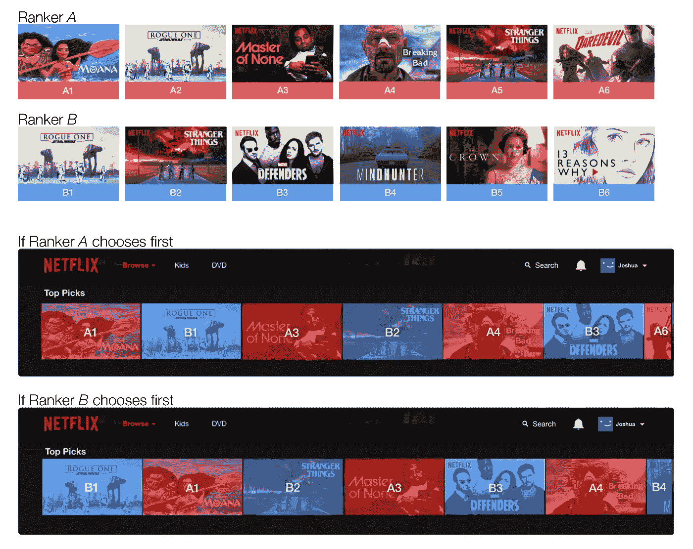

# A/B 测试的乐趣，第二部分:高级主题

> 原文：<https://towardsdatascience.com/the-joy-of-a-b-testing-part-ii-advanced-topics-6c7f6cf71e4c>

## Cookies 和隐私、交叉实验、干净的拨号和测试指标

美国宇航局在 [Unsplash](https://unsplash.com?utm_source=medium&utm_medium=referral) 拍摄的照片

A/B 测试是机器学习生产中最关键的步骤之一:我们只希望推出一个新的 ML 模型，如果它可以在生产中被证明是更好的。[在本系列的第一部分](/the-joy-of-a-b-testing-theory-practice-and-pitfalls-de58acbdb04a)中，我们介绍了如何建立一个人口分割的 A/B 实验，如何用统计意义解释测试结果，以及什么样的错误是可以预期的。在第二部分中，我们将深入一些实际的考虑。我们将涵盖:

*   cookies 和隐私:如何对未登录的用户进行 A/B 测试，
*   交叉实验:一种快速获得推荐模型测试结果的有效方法，
*   干净的拨号上网:如何避免测试结果中的统计偏差
*   通用模型性能度量:测量什么来确定新模型是否更好。

让我们直接开始吧。

## Cookies 和隐私

如果用户使用自己的帐户登录，例如在亚马逊、脸书、Instagram、Twitter、网飞或谷歌上，那么将用户分配给控制或治疗就很简单:只需将用户 id 散列成一个二进制指示符，0 表示控制，1 表示治疗。

然而，用户并不总是登录。例如，人们可以作为访客用户在谷歌或亚马逊上搜索。在这种情况下，我们仍然可以用**浏览器 cookie**唯一地识别这些用户。提醒一下，cookie 只是用户第一次访问网站时生成的文本文件，并存储在用户的计算机上。在 A/B 测试中,“分析 cookie”可以简单地指定用户是在控制组还是治疗组。

基于 cookie 的 A/B 测试的一个缺点是 cookie 的寿命有限。例如，Safari 的智能跟踪预防(ITP)会在 7 天后删除一些 cookie[，因此如果测试运行超过一周，那么用户将在每周后被重新分配。这使得很难衡量一个新的 ML 模型的长期用户影响。](https://cookiesaver.io/archives/analytics-guides/how-safari-itp-impacts-cookies/)

此外，还有用户隐私法规的作用。例如，欧盟的一般数据保护法规( [GDPR](https://gdpr.eu/cookies/) )规定，网站所有者在使用任何 cookies 之前，必须得到用户的明确同意，除非是“绝对必要的”(很难说 A/B 测试对于运行一项服务是绝对必要的)。如果用户不同意，那么我们就不能使用分析 cookies，不可能进行人口分割的 A/B 测试。不遵守 GDPR 的规定会导致公司被罚款数亿欧元(T2)。

## 交叉实验

交错是人口分割 A/B 测试的一种强有力的替代方法。基本的想法是向每个用户提供控制和处理，并查看他们更喜欢哪个版本。这就像让他们直接在可口可乐和百事可乐之间选择，而不是一次只给他们一个选项:由此产生的信号要直接得多。

这个想法的一个具体实现是用于两个(或更多)推荐器模型的**团队草案交错**算法。在该方法中，向用户显示的推荐混合了来自模型 A 和模型 B 的结果:这两个模型简单地轮流贡献它们的排名最高的视频，该视频还不在交错列表中，如下例所示。通过抛硬币的方式选出最先挑选的模型。

交错排列来自排序模型 A 和 B 的结果。A 和 B 各自轮流挑选尚未选择的排名最高的项目。(来源:[奈芙丽丝](https://netflixtechblog.com/interleaving-in-online-experiments-at-netflix-a04ee392ec55))

交错背后的直觉是，因为每个用户可以直接从对照和治疗中选择，所以与两个群体的传统 A/B 测试相比，我们应该更快地获得测试结果。事实上，这种直觉已经在实验中得到证实:[网飞](https://netflixtechblog.com/interleaving-in-online-experiments-at-netflix-a04ee392ec55)报告称，与传统的基于群体的 A/B 测试相比，他们需要少 100 倍的用户来实现 95%的实验功效(相当于 A/B 实验中的回忆)。这是一个巨大的优势:这意味着他们可以运行 100 倍以上的实验，这使他们能够更快地了解用户的偏好。

## 干净的拨号

另一个重要的考虑是如何保守地运行 A/B 实验，而不损害可能更糟的新模型的业务指标(还记得在[第一部分](/the-joy-of-a-b-testing-theory-practice-and-pitfalls-de58acbdb04a)中讨论的 S 型错误)。一个解决办法是逐渐提高你的 A/B 测试，例如从 1%的治疗开始，一周后提高到 5%，然后到 10%，25%，最后到 50%。

这种逐步拨号方法的问题是，你不能在 A/B 测试中使用拨号期本身的数据，因为它可能会受到季节影响的影响。举个极端的例子，假设你建立了一个新的电子商务搜索排名模型，并在第一周将其上调至 1%，在第二周上调至 50%，而第一周恰好是全网站打折的一周。然后，当然控制组会比治疗组有更高的总购买率，因为它在打折周接触到了更多的流量。A/B 测试设计违反了同一性假设:各组并不相同。

补救办法可能是丢弃拨号期间的数据，只考虑 50/50 拨号期间获得的数据。然而，由于**预暴露效应**，这种方法也可能产生有偏差的测试结果:治疗组中的一些用户之前已经暴露于该治疗，并且这种预暴露可能在测量的测试期间改变他们的行为。例如，如果一个新的电子商务搜索模型好得多，增加了用户回来的可能性，那么测试期间的治疗组不再完全是随机的，它包括因为已经看过新模型而回来的用户。这再次违反了同一性假设。

因此，更好的做法是所谓的**门控拨号**:对于每个用户，首先随机决定他们是否会成为实验的一部分。这个群体在开始时可能只是总人口的 1%,然后从那里开始增加。然后，对于实验中的用户，以等概率随机分为对照组和治疗组。瞧，你已经解决了季节偏差问题(因为实验中的两个群体在任何时候都是一样大的)和预暴露问题(因为治疗中没有参与者被预暴露)。拨号可以被认为是“干净的”。

## 您应该衡量哪些指标？

最后，让我们考虑在 ML 模型的 A/B 测试期间应该跟踪什么度量。这种选择取决于你要解决的问题，比如分类或排名，以及你到底想优化什么。

例如，考虑一个要么通过要么取消交易的信用卡欺诈检测模型。在这种情况下，您可以测量两件事，(1)从假阴性中收到的总退款量，以及(2)假阳性的总数——这些当然分别是召回率和精确度的代表。然后，如果新模型在这些指标中的一个或两个方面更好，您可能会认为它更好。除了退款金额之外，您可能还希望跟踪退款*计数*，这将表明受漏报影响的客户数量，而不仅仅是总的货币损失。如前所述，度量标准的选择取决于您到底想要优化什么。

在用于搜索、广告选择或推荐的[排名模型](/learning-to-rank-a-primer-40d2ff9960af)中，您可以测量和比较 MAP@k，即排名最高的前 k 个印象中的平均精度。这里，对 k 个等级取“平均值”,对用户取“平均值”(例如，如果用户观看了等级为 1、2、3 和 5 的电影推荐，而不是 4，则该用户的 AP@5 将是(1/1 + 2/2 + 3/3 + 3/4 + 4/5)/5 = 0.91)。更好的模型会有更好的地图@k，如何选择 k？一个好的选择可能是第一页显示的结果数，比如 Google 的 k=10。毕竟大部分人连第二页都不访问。

此外，还有一些特定于问题的衡量标准，例如:

*   在广告排名中:广告点击总数和广告总收入，
*   在电商搜索排名:总销售计数，总销售金额，总收入，
*   在网站搜索排名中:会话成功率和平均会话时间:用户找到他们要找的东西需要多长时间？
*   在视频推荐系统中:总点击量和平均观看时间:用户在一个视频上花费了多少时间？

任何模型比较还需要考虑我们模型选择的短期收益**和长期影响**之间的权衡，后者可能不会立即显现。例如，如果一个新的视频推荐模型推广更多的短片(如抖音推广的那样)，点击量可能会在短期内上升，但用户可能会发现更没有意义的内容，并在长期内变得不满意。

## 结论

总结一下:

*   在没有登录用户的用户 id 的情况下，可以使用浏览器 cookies 运行 A/B 测试。然而，cookies 受隐私法规的约束，如欧盟的 GDPR。
*   与传统的群体分割测试相比，交错是一种更快获得 A/B 测试结果的强大方法。基本的想法是给每个用户提供控制和治疗，看他们自己选择哪个版本。团队草稿交错是网飞在制作中使用的一种特殊实现。
*   在拨号过程中，有几个统计效应会使您的 A/B 测试结果产生偏差。一个好的解决方案是门控拨号，我们只允许一小部分用户参与实验，控制和治疗各占一半。这种方法被认为是“干净的”拨号。
*   A/B 测试指标的选择取决于问题和我们试图优化的确切指标。我们还需要了解模型的长期影响，这可能无法从 A/B 测试结果中立即看到。

## 在你走之前…

*享受这个内容？在我的* [*个人资料页面*](https://medium.com/@samuel.flender) *找到更多我的文章。关注/订阅这样以后就不会错过我写的新帖了。* [*成为中等会员*](https://medium.com/@samuel.flender/membership) *这样就可以无限查看文章了。并确保在*[*LinkedIn*](https://www.linkedin.com/in/sflender/)*和/或*[*Twitter*](https://twitter.com/samflender)*上关注我！*