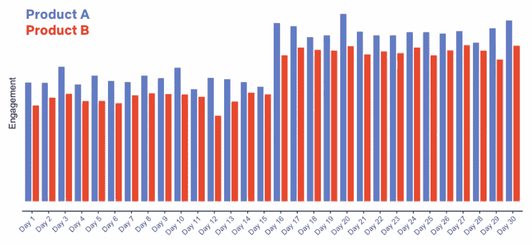
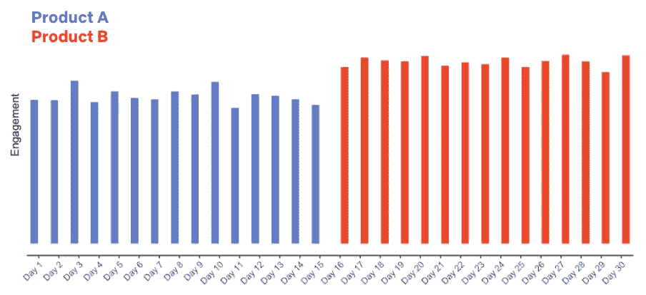
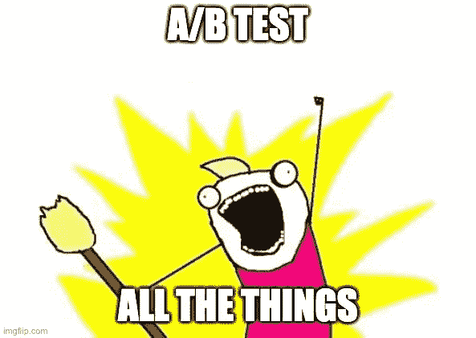

# A/B 测试的乐趣:理论、实践和陷阱

> 原文：<https://towardsdatascience.com/the-joy-of-a-b-testing-theory-practice-and-pitfalls-de58acbdb04a>

## 今天的科技公司如何在机器学习生产中做出数据驱动的决策

Marcelo Leal 在 [Unsplash](https://unsplash.com?utm_source=medium&utm_medium=referral) 上拍摄的照片

A/B 测试在现代科技公司中根深蒂固，使他们能够不断改进产品，以保持对消费者偏好的了解，并击败竞争对手。一篇 [Lyft](https://eng.lyft.com/challenges-in-experimentation-be9ab98a7ef4) 文章指出:

> 标准是测试每一个产品变化，建立证据来推动重大决策，并使用因果数据来支持战略方向。

[DoorDash](https://doordash.engineering/2022/05/24/meet-dash-ab-the-statistics-engine-of-experimentation-at-doordash/) 写道:

> 对于任何数据驱动的公司来说，通过实验测试每一项变化以确保其对关键绩效指标产生积极的可衡量的影响是非常重要的。

或者考虑一下网飞的这句话:

> 网飞经营着一种 A/B 测试文化:几乎我们对产品和业务做出的每一个决定都是由测试中观察到的成员行为所引导的。

A/B 测试在**机器学习产品**中尤为重要，因为模型性能会对业务指标和用户体验产生巨大影响。例如，广告排名模型中转化率的微小提高可以带来数百万美元的额外收入。我们需要 A/B 测试这些模型变化，因为静态测试集上的离线性能并不是生产性能的良好指标:有时一个模型在离线时可能表现得更好，但是在生产中[表现得更差](/is-my-model-really-better-560e729f81d2)。

在这篇文章中，我们将深入探讨 ML 模型的 A/B 测试理论、最佳实践和常见陷阱。您将了解到:

*   如何分割你的流量进行 A/B 测试，
*   测试结果在统计学上的显著性意味着什么，
*   可能的测试结果和 4 种测试错误，以及
*   要避免的常见陷阱。

让我们跳进来。

## 如何为 A/B 测试划分流量

A/B 测试背后的基本思想是将用户群分成一个处理组和一个控制组。为了测试新的 ML 生产模型，您将让治疗组接触新模型，让对照组接触现有模型。

A/B 测试依赖于两个重要的统计假设，即**同一性**和**独立性**:

*   **一致性**:对照组和治疗组的统计特性相同。当你有相似的组时，那么你可以确信组的任何度量的变化都可以归因于治疗，而不是其他。用统计学术语来说，你已经控制了所有的**混杂因素**。
*   **独立性**:这两个组是相互独立的。这意味着对照组的用户行为对治疗组的用户行为没有影响，反之亦然。如果是这样的话，那么我们就引入了一个额外的混杂因素，使得解释测试结果变得更加困难。

A/B 测试中最常见的方法是**人群分割**，我们将用户随机分为控制组和治疗组。在实践中，这可以通过将一个用户 id 散列成一个整数来确定它的组来实现。或者，我们可以使用**会话分割**，在每个项目会话开始时，我们将用户分配到两个组中的任何一个。

要了解我们为什么使用人口分割，考虑一个替代方案，即**时间分割**。假设我们有两个电影推荐模型，如下图红色和蓝色所示。人口分割清楚地向我们表明，与红色模型相比，蓝色模型推动了更多的参与，如顶部的图所示。然而，如果我们在第 16 天进行时间分割，我们可能会错误地得出红色模型更好的结论。用统计学术语来说，时间分割违反了同一性假设，因此测试结果是不确定的。换句话说，人口分割让我们能够确定**因果关系**，而不仅仅是相关性。

超过 30 天的 A/B 测试，有人口分割(来源:[网飞](https://netflixtechblog.com/what-is-an-a-b-test-b08cc1b57962))

A/B 测试在相同的 30 天内分时段进行(来源:[网飞](https://netflixtechblog.com/what-is-an-a-b-test-b08cc1b57962))

最后，治疗组和对照组应该有多大？在实践中，我们可以随着时间的推移改变大小。如果我们最初不确定新模型会带来改善，我们可以从 1%或更低的治疗组规模开始，然后如果测试结果看起来不错，就逐渐增加流量。

## **A/B 测试中的统计显著性**

一般来说，在任何 A/B 测试中，我们需要问的问题是，结果(例如，新模型导致广告点击率提高 1%)是否可能是偶然造成的。这是**无效假设**，即假设治疗根本没有效果。如果 A/B 测试结果在统计上是显著的，那么我们可以自信地排除零假设。

使用 **p 值**计算统计显著性，即我们看到的结果是偶然结果的概率。在实验之前，我们需要设置一个 p 值阈值，低于该阈值时，我们将排除零假设，通常为 0.05 或 0.01。例如，如果点击率提高 1%的 p 值为 0.02，我们设置的阈值为 0.05，那么我们可以得出结论，A/B 测试结果在统计上是显著的(并排除了无效的零假设)。

p 值可以通过**排列分析**来计算:在 A/B 测试完成后，多次洗牌并测量每次排列的测试结果。然后，计算排列的比率，在这个比率中，你看到的结果至少和实际的(未混淆的)A/B 测试结果一样极端。这个数字就是 p 值。在实际操作中，你不必亲自动手，可以用一个 A/B 测试[计算器](https://www.surveymonkey.com/mp/ab-testing-significance-calculator/)来代替。

## 测试结果和 4 种测试错误

A/B 测试可能有 3 种结果:

*   您确认新模型明显优于现有模型。在这种情况下，您将希望向所有人推广新模型，这样您就可以从模型改进中受益。
*   你会发现相反的情况，即新模型明显比现有模型差。在这种情况下，您会想要中止实验并回到离线模型开发。
*   测试结果是不确定的:两个模型之间的差异在统计上不显著。在这种情况下，您可以中止实验，或者延长实验时间以收集更多数据。

重要的是，A/B 测试并不完美，因此会导致错误的结果。一般来说，我们区分 [4 种类型的错误](https://netflixtechblog.com/experimentation-is-a-major-focus-of-data-science-across-netflix-f67923f8e985):

**I 型错误**(又名假阳性):这些模型表现得一样好，但是 A/B 测试仍然产生了统计上显著的结果。因此，你可能会推出一款性能并不真正更好的新机型。这是假阳性。您可以使用 p 值阈值来控制此类错误的发生率。如果你的 p 值阈值是 0.05，那么你可以预期在大约 20 次实验中有 1 次出现 I 型错误，但是如果是 0.01，那么你只能预期在大约 100 次实验中有 1 次出现 I 型错误。p 值阈值越低，第一类错误就越少。

**第二类错误**(又名假阴性):新模型事实上更好，但是 A/B 测试结果没有统计学意义。从统计学的角度来说，你的测试是**不足**，你应该收集更多的数据，选择更敏感的指标，或者在对变化更敏感的人群中进行测试。

**S 型误差**(符号误差):A/B 测试显示新模型明显优于现有模型，但实际上新模型更差，测试结果只是统计上的侥幸。这是最糟糕的错误，因为您可能将一个更差的模型投入生产，这可能会损害业务度量。

**Type M error**:(magnitude error):A/B 测试显示新模型带来的性能提升比它实际能够提供的要大得多，因此您会高估新模型对您的业务指标的影响。

## 常见陷阱

最后，这里有一些你应该知道的 A/B 测试中的常见陷阱。

**HARKing(结果已知后的假设)**。在进行 A/B 测试之前，你应该有一个假设。这可以是一些简单的事情，比如“我假设新模型更好，因为它在更多的功能上进行了训练”。如果你在没有事先假设的情况下随机测试大量的模型，你会将自己暴露在[看别处效应](/the-statistics-of-the-improbable-cec9a754e0ff)之下，也就是说，你可能会发现一个具有统计学意义的结果，而这个结果仅仅是偶然的。

> 如果你在没有明确假设的情况下测试 A 对 B，B 赢了 15%，那很好，但是你学到了什么？没什么。— [窥视 Laja](https://cxl.com/blog/12-ab-split-testing-mistakes-i-see-businesses-make-all-the-time/#early)

**分析瘫痪。**在实验开始时就成功标准达成一致也很重要，避免在 A/B 测试完成后转入冗长的分析。例如，假设您已经训练了一个全球电子商务产品分类模型，并在 A/B 测试中显示它比当前的生产模型工作得好得多(在固定召回的精确度方面)。太好了！但现在，产品团队正在询问，在该模型运作的 50 个细分市场中的每个细分市场上，以及每个细分市场中的 20 种产品类型上，这种比较看起来如何。我们在这 1000 个细分市场中的表现如何？检查长的度量列表会减慢决策的速度，并增加在数据中发现统计错误的机会。毕竟，A/B 测试结果只是真实生产性能的一个嘈杂的代理。

**溢出效应。**溢出效应，也称为交叉污染，发生在治疗组对对照组产生次级效应时，违反了独立性假设。例如，考虑一个广告排名模型，它将一个特定的广告(比如说耐克鞋)的排名远远高于现有的生产模型，并推动该广告的高转化率。然后，治疗组中的用户可能会很快用完广告商用于广告投放的所有预算(在这种情况下，是耐克的预算)，给对照组留下较小的预算。因此，治疗组对对照组的行为有间接影响，造成溢出效应。

**随机分配可能无法平均分配重度用户。**如果您的用户群中有几个用户会产生大量的用户活动，那么随机的 A/B 分配不能保证平均分配这些用户。这可能违反了同一性假设，并使测试结果模式难以解释。

**不一致的取舍。**您的 A/B 测试可能会导致一种情况，即一个指标提高了，而另一个指标变得更差，从而导致不同业务目标之间的冲突。例如，假设您建立了一个新闻排名模型，该模型对点击诱饵标题进行惩罚(降低排名)。随着用户发现更多吸引人的内容，用户满意度可能会更高，但整体点击量可能会下降。

**待遇自选。如果用户自己可以选择加入一个治疗组，A/B 测试违反了身份假设:两个组并不相同，而是治疗组由一个特定的用户子集组成，即那些更愿意参与实验的用户。在这种情况下，我们将无法判断两组之间的差异是由于治疗还是由于样本差异。**

**不是 A/B 测试。最后，另一个陷阱是根本不进行 A/B 测试。假设您在开发一个新的信用卡欺诈检测模型，而不是 A/B 测试新模型，在生产中您只是先用旧模型然后用新模型评估交易，如果任一模型产生足够高的分数，则认为交易是欺诈。这听起来像是一种保守的方法，但是它是不可伸缩的:如果您在一个月内构建了一个新版本的模型，而一个月后又构建了一个，以此类推，该怎么办？随着时间的推移，所有这些模型将产生巨大的维护和基础设施成本。**

来源:[网飞](https://netflixtechblog.com/netflix-a-culture-of-learning-394bc7d0f94c)

## 结论

总结一下:

*   A/B 测试是 ML 生产中的一个关键部分。模型性能的微小变化会对业务指标产生巨大影响，只有在我们确信新模型更好的情况下，我们才希望推出新模型。[线下测试没有定论](/is-my-model-really-better-560e729f81d2)。
*   使用人口分割将用户分为控制组和治疗组，并使用现有模型进行控制，使用新模型进行治疗。时间分割会导致不确定的结果，因为我们无法知道变化是由新模型还是其他因素驱动的。
*   如果 A/B 测试的 p 值低于您在实验之前设置的阈值，例如 0.01，则该测试的结果具有统计学意义。如果测试结果在统计上是显著的，你可以确信新模型确实更好。p 值可以用置换分析来计算。
*   测试结果可能有 4 种类型的错误:类型 I(假阳性)、类型 II(假阴性)、类型 S(符号错误)和类型 M(幅度错误)。在这些错误中，S 型错误是最严重的，因为它可能会导致一个劣质模型投入生产。
*   注意常见的陷阱，如倾听、分析瘫痪、溢出效应、重度用户的不平等分布、不一致的权衡、治疗自我选择，以及首先避免 A/B 测试。

## 在你走之前…

*享受这个内容？在 Medium 上关注/订阅，这样你就不会错过我以后写的新帖。* [*成为中等会员*](https://medium.com/@samuel.flender/membership) *这样就可以无限查看文章了。并确保在*[*LinkedIn*](https://www.linkedin.com/in/sflender/)*和/或*[*Twitter*](https://twitter.com/samflender)*上关注我！*

**下潜更深的参考:**

*   实验中的挑战
*   [什么是 A/B 测试？](https://netflixtechblog.com/what-is-an-a-b-test-b08cc1b57962)(网飞)
*   [实验是网飞数据科学的一大焦点](https://netflixtechblog.com/experimentation-is-a-major-focus-of-data-science-across-netflix-f67923f8e985)(网飞)
*   [解读 A/B 测试结果:假阳性和统计显著性](https://netflixtechblog.com/interpreting-a-b-test-results-false-positives-and-statistical-significance-c1522d0db27a)(网飞)
*   [解读 A/B 测试结果:假阴性和权力](https://netflixtechblog.com/interpreting-a-b-test-results-false-negatives-and-power-6943995cf3a8)(网飞)
*   [A/B 测试中的统计显著性(以及人们如何曲解概率)](https://data36.com/statistical-significance-in-ab-testing/)
*   [运行 A/B 测试的 8 个常见陷阱](https://medium.com/towards-data-science/online-controlled-experiment-8-common-pitfalls-and-solutions-ea4488e5a82e)

 [## 不可能的统计

### 圣经代码、投资基金、彩票和“看别处”效应的诅咒

towardsdatascience.com](/the-statistics-of-the-improbable-cec9a754e0ff)  [## 我的模型真的更好吗？

### 为什么理论上看起来不错的 ML 模型不能保证在生产中很好地工作

towardsdatascience.com](/is-my-model-really-better-560e729f81d2)  [## 机器学习:科学还是炼金术？

### 经验领域的科学严谨性始于假设

towardsdatascience.com](/machine-learning-science-or-alchemy-655bea25b227)