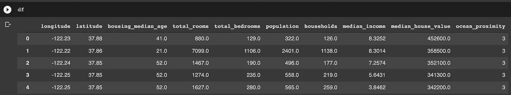
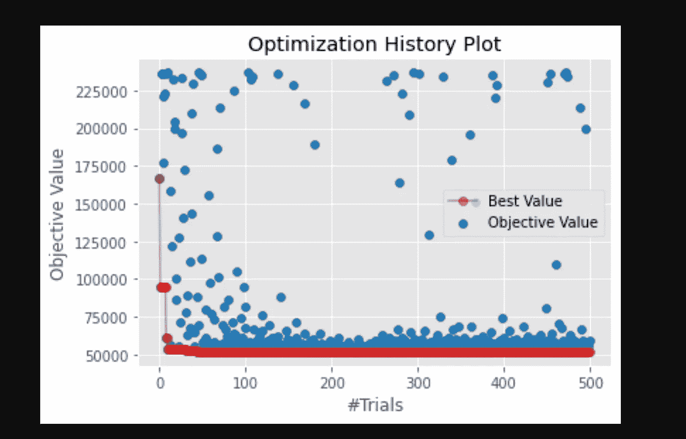

# 用 Optuna 调整超参数的 Kaggle 方法

> 原文：<https://towardsdatascience.com/the-kaggle-way-to-tune-hyperparameters-with-optuna-285e59a0b95a>

## 使用 Optuna 和一个小型项目轻松高效地优化模型的超参数


约书亚·索蒂诺在 [Unsplash](https://unsplash.com?utm_source=medium&utm_medium=referral) 上拍摄的照片

一周前，我发表了我最受欢迎的一篇文章，其中包含了一个你绝对应该知道的数据科学工具和库的[列表。今天，我将讨论列表中的一个很棒的工具。](/26-github-repositories-to-inspire-your-next-data-science-project-3023c24f4c3c)

[Optuna](https://github.com/optuna/optuna) 是一个轻量级的通用工具，可以方便地为您的 ML 算法执行超参数优化。随着最新版本 3.0 的发布，我觉得这是一个很好的时机让您了解该库最突出的特性，并将其应用到一个真实的迷你项目中。

但首先，让我们讨论一下房间里的大象。

# 为什么 Optuna 应用如此广泛？

以下是这个工具流行的一些最重要的原因。理所当然地，我会说:

*   这是一个独立于平台的库，也就是说——您可以在 scikit-learn、Tensorflow/Keras、Pytorch、XGBoost 等中使用它，几乎不做任何修改。
*   Optuna 使您能够在超参数优化管道中使用简单的 Python 循环和条件语句。
*   它还允许您轻松地在代码中实现并发。
*   最后，内置的使用各种绘图功能检查优化历史的支持非常有用。

## **注:**

我说**“优化历史”:**是的！那是有趣的部分！没有`**GridSearch**`实现允许您在搜索超参数时保留您进行的所有试验的所有历史。Optuna 有，这样的推论提供了一个很大的优势。

在本教程中，我将在一个迷你项目中使用 Optuna 和 XGBoost，以便让您了解所有的基础知识。

我们开始吧👇

# 设置我们的项目

第一步是创建一个虚拟环境并安装 XGBoost:

```
pipenv shellpipenv install xgboost
pipenv install scikit-learn
```

然后导入我们将要使用的库，就像这样:

```
import xgboost as xgb
import numpy as np
import pandas as pd
import matplotlib.pyplot as plt
```

我们将利用一个预处理过的加州住房数据集来构建一个回归模型，这是我已经准备好的(链接到最后的代码+数据集)。我们将首先以正常方式训练一个模型并计算 RMSE，然后使用 Optuna 尽可能优化我们的模型。

# 为 simpleXGBoost 模型定型

预处理数据集可以简单地导入:

```
df = pd.read_csv('preprocessed_housing.csv')
```



由预处理数据集授权的图像

最后，我们将继续训练一个简单的 XGBoost 模型，并计算验证 RMSE:

输出是这样的:

```
RMSE: 53119.69904403545
```

做完这些，让我们继续进入这篇文章的主要部分！

# 制作光学目标函数

这个目标与你从机器学习理论中回忆起来的有点不同。

Optuna 中的目标函数包含以下操作:

*   它接受我们想要优化的不同超参数的**字典**
*   模型在函数中被**训练**
*   **根据训练好的模型对测试/验证数据进行预测**
*   **精度**或**误差**最终从功能**返回**。

在我们的例子中，我们希望**最小化**我们的 RMSE 分数，所以我们返回 RMSE，然后我们将在“**研究**中使用它来最小化。

让我们创建一个目标函数吧！

我们的目标函数

n_trials 表示目标函数执行的每个试验，参数由`**suggest_int**`、`**suggest_float**`等给出。

我们可以方便地指定开始、结束和步数，以及一个`**log**` 参数，该参数指示我们的值是否表示对数仓。学习率超参数使用`**log**`，可以看到。

现在，让我们创建一个**病历报告**。

# 做一项研究，并把它整合在一起

Optuna 中的**研究**是基于目标函数的整个优化过程。

让我们创建一个并开始调整我们的超参数！

```
# make a studystudy = optuna.create_study(direction="minimize")
study.optimize(objective, n_trials=500)
```

我们将“最小化”放在`**direction**`参数中，因为我们想要使用目标函数来最小化我们的 RMSE 误差。如果您正在执行分类任务，您可以使用**最大化**和您计算的准确度分数！

你会看到在 Google Colab 上 500 次试用不到两分钟！很了不起，不是吗？

让我们看看最好的分数和参数并打印出来:

```
print(f"Optimized RMSE: {study.best_value:.4f}")print("Best params:")
for key, value in study.best_params.items():
    print(f"\t{key}: {value}")
```

最后，让我们把它们放在一起:

```
Output:Optimized RMSE: 51774.6284
Best params:  
n_estimators: 1800  
learning_rate: 0.2982950878173913  
max_depth: 11
```

我会说这看起来是一个非常好的改进！

## 奖励实验:

最后，尝试用下面的代码片段看看优化历史是什么样子的:

```
from optuna.visualization.matplotlib import plot_optimization_historyplot_optimization_history(study)
```

您的输出应该类似于以下内容:



按作者分类的图像—优化历史图

就是这样！是时候为自己一路过关斩将而感到自豪了！

# 几句临别赠言…

感谢您的阅读。

我希望这个关于 mini 项目的快速教程有助于认识到使用 Optuna 与手动常规超参数优化相比所提供的绝对优势。在阅读完本教程后，我建议您尝试使用这个或另一个数据集构建新的管道。

快乐学习！:)

您可以在这里找到所有的[代码以及预处理过的数据集](https://github.com/yashprakash13/data-another-day/blob/main/README.md#a-data-scientists-life-hacks)。

我希望在我的下一篇文章中再次见到你。在那之前，[请跟随我，不要错过我的下一篇文章](https://ipom.medium.com/)。我确实每周都写！

## [我还建议成为一名中等会员，不要错过我每周发表的任何数据科学文章。](https://ipom.medium.com/membership/)在此加入👇

<https://ipom.medium.com/membership/>  

**我的另外几篇文章你可能会感兴趣:**

</the-nice-way-to-deploy-an-ml-model-using-docker-91995f072fe8>  </31-datasets-for-your-next-data-science-project-6ef9a6f8cac6> 