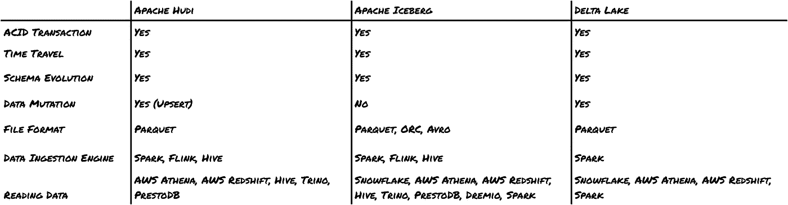
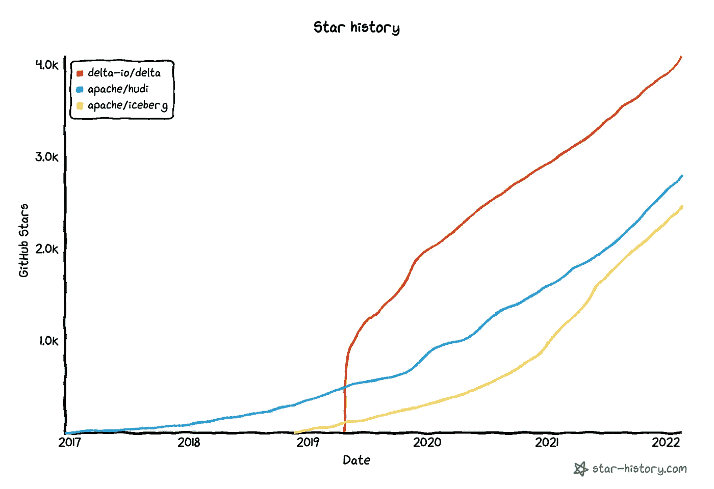
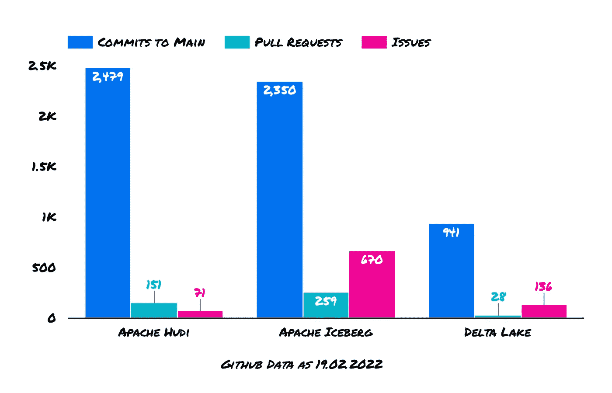

# Lakehouse 数据架构背后的关键特性

> 原文：<https://towardsdatascience.com/the-key-feature-behind-lakehouse-data-architecture-c70f93c6866f>

## 了解现代表格格式及其当前状态

通常的表格格式疑点— ' *帽衫'(胡迪)*、冰山、三角洲【图片由作者提供】

Data Lakehouse 是由 [Databricks 论文](https://databricks.com/wp-content/uploads/2020/12/cidr_lakehouse.pdf)于 2020 年 12 月提出的下一代架构。Data Lake 可以使用 Parquet 或 ORC 等开放格式运行，并利用云对象存储，但缺乏数据仓库的丰富管理功能，如 ACID 事务、数据版本控制和模式实施。今天，就现代表格格式而言，我们比以往有更多的选择。他们都旨在解决这些问题，并为湖屋架构提供动力。让我们了解一下这些表格格式给表格带来了什么…😉

# 为什么？拼花不够吗？🤔

数据湖以最高的成本提供了良好的灵活性。您可以在 lake 中加载(几乎)您想要的任何内容(视频、图像、JSON、CSV 等)，但是治理丢失了。我们在数据湖中错过的最想要的特性是 **ACID** 事务。让我们通过几个例子来理解这一点:

*   托米奇:交易要么成功，要么失败。这意味着任何读取器或写入器都不会看到任何可能导致数据处于损坏状态的部分成功的事务。
*   一致性:从读者的角度来看，如果一个列有惟一的值，那么无论在数据源上做什么操作(对值的约束)，这个值都会被保留。如果提交了一组事务:2 个读者将看到相同的数据。
*   **I** 解决方案:如果两个并发的事务正在更新同一个数据源，那么将会一个接一个地进行。
*   可维护性:一旦事务被提交，它将保留在系统中，即使紧接着发生崩溃。

这是我们过去在单个数据库上拥有的东西，但是在分布式系统(在数据湖设置中)上，一切都在对象存储上，读取器和写入器之间没有隔离，它们直接在数据文件上工作，并且我们几乎没有帮助我们实现 ACID 事务的元数据。

湖边小屋的建筑采用了这种 ACID 范式，需要一种现代的表格格式。

# 三大现代表格格式📑

你可能已经猜到了，现代的表格格式大量使用`metadata`文件来实现 ACID。有了这些功能，他们可以实现不同的功能，例如:

*   时间旅行
*   并发读/写
*   模式演变和模式实施

当然，存储始终独立于计算引擎，因此您可以在您喜欢的云提供商上插入任何存储模型。比如:AWS S3，Azure 博客存储，GCP 云存储。

## 阿帕奇胡迪

[阿帕奇胡迪](https://hudi.apache.org/)于 2016 年在优步创立，更专注于流媒体流程。它有内置的数据流，事务模型是基于时间线的。这一个包含了在不同时刻对表的所有操作。时间轴可以通过帽衫提交时间提供时间旅行。

*   ➕支持不同的数据接收引擎:Spark、Flink、Hive
*   ➕非常适合流式处理
*   ➕支持很多阅读引擎:AWS 雅典娜，AWS 红移，…

## 阿帕奇冰山

[阿帕奇冰山](https://iceberg.apache.org/)始于 2017 年的网飞。事务模型是基于快照的。快照是文件和元数据文件的完整列表。它还提供乐观并发控制。时间旅行基于快照 id 和时间戳。

*   ➕它有伟大的设计和抽象，使更多的潜力:不依赖于火花，多种文件格式的支持。
*   ➕ It 在管理大型表上的元数据方面表现出色(例如:在+10k 分区上更改分区名)
*   ➕支持很多阅读引擎:AWS 雅典娜，AWS 红移，雪花…
*   ➖缺失和数据突变仍然是初步的

## 三角洲湖

[Delta Lake](https://delta.io/) ，2019 年开源，由 data bricks(Apache Spark 的创造者)打造。毫不奇怪，它与 Spark 深度集成，可用于读写。它现在是 Databricks 的主要产品，它的某些部分(如 Delta Engine)不是开源的。其他产品，如 [Delta sharing](https://delta.io/sharing/) 听起来很有前途。

*   ➕它得到了 Databricks 的支持，data bricks 是目前数据领域的顶级公司之一
*   ➖确实紧抓星火不放(尽管根据他们公布的[路线图](https://databricks.com/blog/2021/12/01/the-foundation-of-your-lakehouse-starts-with-delta-lake.html)这将在 2022 年改变)

## 高级摘要📓

高级功能 as 19 . 02 . 2022[图片由作者提供]

# 一般兴趣是什么？Github 一览👀

由于所有项目都是开源的，评估兴趣和增长的一个很好的数据源是查看 Github 本身。

Github 将历史设定为 2022 年 2 月 19 日，由 star-history.com 生成[图片由作者提供]

正如我们所看到的，在主流数据用户的眼中，这些表格格式仍然非常年轻。大部分的吸引力出现在过去的两年里，当*湖边小屋*的概念开始出现的时候。

另一个有趣的见解是查看当前提交、拉请求和问题的数量。

Github 公开数据截至 2022 年 2 月 19 日[图片由作者提供]

如上所述，三角洲生态系统的一些功能不是开源的——这解释了与牵引相比提交数量低的原因。

# 每个人都是赢家，因为未来是互操作性⚙️

无论你选择哪种格式，也无论谁将赢得最终的比赛，它都在朝着正确的方向前进:我们需要在数据格式方面更加开放的标准，以实现互操作性和用例。

很高兴看到计算和阅读引擎普遍采用所有这些格式。例如，AWS 红移在 2020 年 9 月增加了对德尔塔湖和阿帕奇胡迪的支持。最近，雪花[宣布支持阿帕奇冰山](https://www.snowflake.com/blog/expanding-the-data-cloud-with-apache-iceberg/)。

另一件好事是它们都有开源社区的支持。互操作性至关重要，因此支持这些格式的计算引擎越多，我们就越不需要选择锁定我们的东西。

# 迈赫迪·瓦扎又名迈赫迪欧·🧢

感谢阅读！🤗 🙌如果你喜欢这个，**请在**跟我来🎥 [**Youtube**](https://www.youtube.com/channel/UCiZxJB0xWfPBE2omVZeWPpQ) ，✍️ [**中**](https://medium.com/@mehdio) ，或者🔗 [**LinkedIn**](https://linkedin.com/in/mehd-io/) 了解更多数据/代码内容！

**支持我写作** ✍️通过加入媒介通过这个[**链接**](https://mehdio.medium.com/membership)