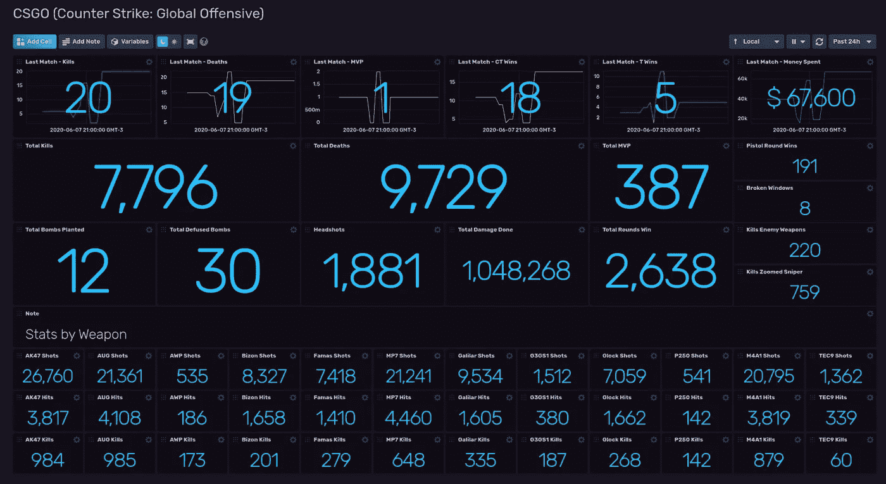
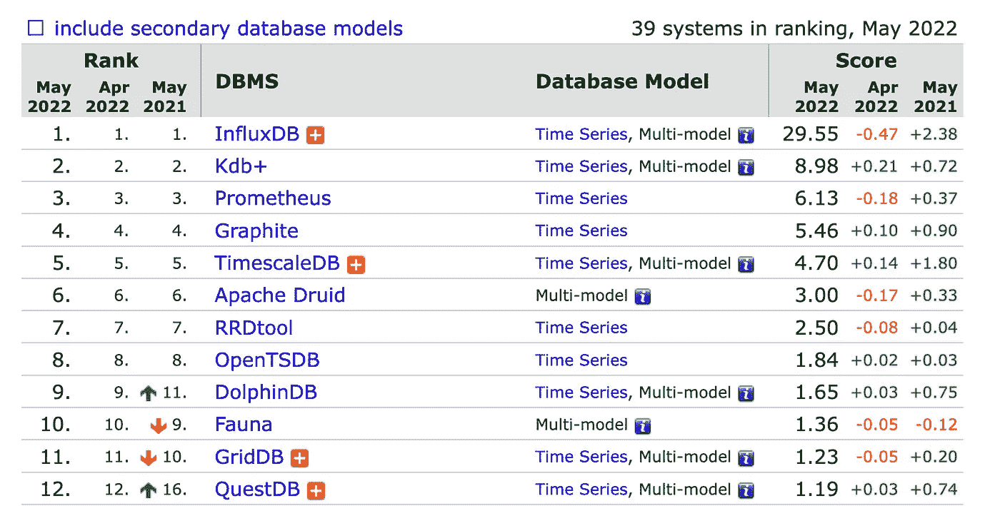

# 时间序列数据库的前景

> 原文：<https://towardsdatascience.com/the-landscape-of-timeseries-databases-95cd7f7ee64d>

纳赛尔·塔米米在 [Unsplash](https://unsplash.com/s/photos/fast?utm_source=unsplash&utm_medium=referral&utm_content=creditCopyText) 上的照片

## 数据工程

## 当今时间序列数据库概述

*本文最后更新于 2023 年 1 月 25 日。*

# 背景

在使用过一些重要的时间序列数据库产品，并从技术爱好者的角度探索过其他产品之后，我认为在一篇快速的文章中总结一下我所学到的东西可能会有所帮助。当我在 2017 年开始为一个同事想要建立的算法期权交易平台摆弄 InfluxDB 时，我变得喜欢上了时间序列数据库。我们进行了几天的头脑风暴。除了我摆弄 InfluxDB 激发了我对时间序列数据库的兴趣之外，没有任何结果。从那以后，我一直关注着 TSDBs 世界的最新动态。

我以前写过关于时序数据库的文章。我报道了它们空前的受欢迎程度，以及其他一些专门的，或者 AWS 喜欢称之为“T9”的专用数据库。我还谈到了一些流行数据库的具体特性，如 InfluxDB(流入线协议)、TimescaleDB(使用 TSBS 进行比较)和 QuestDB(摄取模式)。在本文中，我将介绍最流行的时间序列数据库，以及几个不是专门为解决时间序列问题而构建的、能够很好地处理时间序列问题的数据库。所以，事不宜迟，让我们开始吧。

# 时间系列数据库

## [InfluxDB](https://github.com/influxdata/influxdb)

*用于指标、事件和实时分析的可扩展数据存储。*

InfluxDB 是一个开源数据库。到目前为止，这是世界上最流行和最常用的时序数据库。InfluxData 通过提供企业版的本地数据库和云中的 T2 来赚钱。像大多数其他 TSDBs 一样，您可以在三个主要云平台上部署 influx db—[AWS](https://aws.amazon.com/marketplace/pp/prodview-4e7raoxoxsl4y)、 [Google Cloud](https://cloud.google.com/community/tutorials/influxdb-google-data-studio) 和 [Azure](https://www.influxdata.com/blog/how-run-time-series-database-azure/) 。

InfluxDB 还为您提供了流行用例的模板。一个有趣的用例是监控反恐精英的游戏指标，如下图所示:

图片由 Ignacio Van Droogenbroeck 提供。许可证— APLv2。

毫无疑问，在过去的几年里，InfluxDB 在时间序列数据库的加速发展中发挥了重要作用。一个这样的例子是 [InfluxDB line 协议](https://www.youtube.com/watch?v=nfVCKIs_MY0)，这是一个轻量级协议，用于将时间序列数据存储和传输到时间序列数据库中。另一个主要的 timeseries 数据库 QuestDB 支持 PostgreSQL wire 协议，由于其实现和性能，它决定支持并推动 InfluxDB line 协议。

你可以在这个博客上阅读更多关于他们的旅程[。](https://www.influxdata.com/blog/)

## [QuestDB](https://github.com/questdb/questdb)

*旨在更快处理时序数据的开源 SQL 数据库*

Vlad Ilyushchenko 于 21 世纪初在金融服务行业工作，他对低延迟在金融领域的重要性有很好的认识。他启动 QuestDB 是为了创建一个大规模运行的超高速时间序列数据库。最近，Vlad 在卡内基梅隆大学数据库组谈到了 QuestDB 的架构和令人兴奋的用例:

QuestDB 的 CTO Vlad 在卡内基梅隆大学谈论 QuestDB 的架构和用例。

QuestDB 使用列结构来存储数据。QuestDB 在每一列的底部附加任何新数据，以保持所接收数据的自然时间顺序。该数据库还支持时间序列数据的关系建模，这意味着您可以编写连接并使用 SQL 查询来读取数据。

像今天的许多其他 timeseries 数据库一样，QuestDB 受到开源关系数据库巨头 PostgreSQL 的启发。就像在 Redshift 中运行大多数 PostgreSQL 查询一样，您也可以在 QuestDB 中运行这些查询。这在 QuestDB 中是可能的，因为它支持 Postgres 有线协议。这种 Postgres 兼容性也意味着您用来连接 PostgreSQL 的大多数驱动程序也可以与 QuestDB 一起工作。你可以在这里找到 QuestDB 的 PostgreSQL 兼容性[的优点和局限性。](https://questdb.io/docs/reference/api/postgres/)

已经有一段时间了，但是我写了关于使用 TSBS(时间序列基准测试套件)进行[基准测试 QuestDB & TimescaleDB 性能](/questdb-vs-timescaledb-38160a361c0e)的文章。实际上，您可以使用 TSBS 来比较大多数时间序列数据库。这是 GitHub 的回购协议。

## [时间刻度 B](https://github.com/timescale/timescaledb)

*开源时序 SQL 数据库，针对快速接收和复杂查询进行了优化。它被打包成一个 PostgreSQL 扩展。*

PostgreSQL 的一大特点是它的可扩展性。许多令人惊叹的数据库都建立在 PostgreSQL 之上，这并不是巧合。比如红移就是一个。TimescaleDB 是众多例子中的另一个。TimescaleDB 本质上是 PostgreSQL 之上的一个包扩展，解决时间序列数据的特定读写模式。在下面的视频中，[Erik nord strm](https://se.linkedin.com/in/eriknordstrom)讲述了 TimescaleDB 的工作原理，以及它与其他竞争对手相比的优势:

从 PostgreSQL 构建 TimescaleDB。

TimescaleDB 可以下载并自托管。它也可以通过多云管理平台 Aiven 托管在您选择的平台上的云中。我已经讨论了 AWS 上针对本文中讨论的许多数据库的不同部署选项:

 [## AWS 上的时间序列数据库

### 以及 AWS 市场上最新的 TSDBs

aws .平原英语. io](https://aws.plainenglish.io/timeseries-databases-on-aws-236677f739db) 

TimescaleDB 还提供了 [Promscale](https://www.timescale.com/promscale) ，一个为 [Prometheus](https://prometheus.io) 高效处理 OpenTelemetry 数据的数据库后端。你可以在官方博客的[上了解更多关于 TimescaleDB 与 PostgreSQL 和其他产品的不同之处。](https://blog.timescale.com)

## [kdb+](https://github.com/KxSystems/kdb)

这是独一无二的。kdb+是一个支持关系建模和内存计算的柱状时序数据库。在高科技金融交易行业已经有相当一段时间的知名度了。kdb+是用一种很少使用的编程语言 k 编写的，这种语言以其数组处理能力而闻名。查询语言也是基于 k 的一个变体，称为 q。在本教程中，您可以亲自了解这两种语言的深奥本质。

老实说，我不知道谁在或曾经在 kdb+上工作，但这说明这是一个远离主流的小众产品。你会发现足够多的公司将它与不太常见的架构模式一起使用，比如这里描述的，它涉及将 [Amazon FSx for Lustre](https://aws.amazon.com/fsx/lustre/) 与许多 EC2 实例、S3 桶等一起使用。，用于 kdb+的服务，如 Tickerplant、实时数据库、历史数据库、复杂事件处理(CEP)和网关。类似的架构在 Azure、 [Google Cloud](https://code.kx.com/q/cloud/gcpm/) 和 Digital Ocean 上也是可能的。

 [## 用 KX 和数据布里克斯进行高速金融时间序列分析

### 这是一篇嘉宾合著的帖子。我们感谢 KX 合作伙伴工程主管 Connor Gervin 所做的贡献。KX…

databricks.com](https://databricks.com/blog/2021/05/25/time-series-data-analytics-in-financial-services-with-databricks-and-kx.html) 

Databricks 与 kdb+合作，使用 Spark 实现了[超快速的金融时间系列数据分析。您可以使用几个选项将 Databricks 与 kdb+结合使用，包括 PyQ、Databricks APIs、使用 JDBC 的联邦查询等。数据库排名网站 db-engines.com 在时间序列数据库类别中排名第二，仅次于 InfluxDB。虽然我有理由怀疑你在下一份工作中是否需要 kdb+-](https://github.com/hughhyndman/kdbspark)

## [德鲁伊](https://druid.apache.org/)

Druid 不一定只是一个 timeseries 数据库，而是通常用于对时序数据进行超快速聚合。因此，Druid 更适合作为基于时间的分析数据库。正因为如此，德鲁伊的架构壮举在于它所服务的各种用例。一些用例与 InfluxDB 和 TimescaleDB 等时间序列数据库重叠，例如网络遥测分析和应用性能分析。由于这种重叠，Druid 组合了[一个数据仓库、一个时间序列数据库和一个搜索系统](https://druid.apache.org/technology)。

 [## Apache Druid 架构指南

### 在我们组建 Rill 数据团队的过程中，我们经常会遇到一些不熟悉 Apache Druid 的人，他们正在寻找各种方法来提高自己…

www.rilldata.com](https://www.rilldata.com/blog/guide-to-apache-druid-architectures) 

它的核心重点是成为一个具有列存储、实时和批量接收能力的分布式 MPP 系统，这对于您的数据工程堆栈来说是一个令人兴奋的工具。对于超快速查询，Druid 使用[压缩位图索引](https://roaringbitmap.org/)和基于时间的分区来删除不需要的数据。Druid 使用基于 JSON 的查询语言，类似于您可能在 MongoDB 或 Cassandra 中看到的。尽管如此，因为每个人都知道 SQL 并使用 SQL 与数据交互，所以 Druid 还提供了 Druid SQL，这是一个在原生查询引擎之上的包装器。

像网飞、Airbnb、Salesforce、Booking、Appsflyer、Criteo 和 PayPal 这样的公司在生产中使用 Druid。这里有一个来自网飞科技博客的案例研究，讲述了他们如何将德鲁伊与卡夫卡结合使用，以实时传递洞察力:

 [## 网飞如何利用德鲁伊的实时洞察力来确保高质量的体验

### 本·赛克斯

netflixtechblog.com](https://netflixtechblog.com/how-netflix-uses-druid-for-real-time-insights-to-ensure-a-high-quality-experience-19e1e8568d06) 

我还建议由[罗曼·莱文托夫](https://medium.com/u/6ce225eafe47?source=post_page-----95cd7f7ee64d--------------------------------)撰写的另一篇博文，讨论德鲁伊、皮诺和点击屋之间的区别。

# 结论

时间序列数据库非常适合许多用例，尤其是当默认情况下数据具有自然的时间顺序时。由于这种需求，时不时需要支持的时间序列数据库的数量有所上升。这也导致一些云平台推出了他们的 timeseries 数据库，部分或全部受到了开源数据库的启发。在接下来的几年中，我们将会看到更多的应用出现在 timeseries 数据库领域。作为一个 SQL 人，我可能会有偏见，但我确实认为大多数 timeseries 数据库会尝试支持 ANSI SQL 标准。让我们看看。

如果你觉得我的文章有用，请订阅并查看我的文章🌲 [**Linktree**](https://linktr.ee/kovid) 。你也可以考虑通过[使用我的推荐链接购买中级会员](https://kovidrathee.medium.com/membership)来支持我。干杯！