# 慵懒的断奏浓缩咖啡

> 原文：<https://towardsdatascience.com/the-lazy-staccato-espresso-34aa743bed96>

## 咖啡数据科学

## 双重研磨和粗筛:浓缩咖啡的另一种选择

不连续浓缩咖啡的挑战之一是筛选需要时间。我已经研究了多种方法来减少工作流程时间，并且仍然获得了一些断奏的好处。这个想法来自于我对双面研磨的一些研究。

典型的[双磨](/regrinding-coffee-particle-distributions-add74209992e)会先磨粗(小生零点设置 50)，然后再磨细(设置 8)。通常，当设置为 50 时，10%到 20%的粉末会比其余部分更细(直径小于 500 微米)。我[之前提出理论](/fines-in-coffee-grinds-searching-for-a-source-326c3eba2bb4)设置 50 产生的微粒来自咖啡豆内部，因为它们更软。这就产生了从里到外不连续浓缩咖啡，但是这种方法仍然需要大量的筛选。

那么，如果你粗磨，用更大的孔径如 500 微米或 600 微米过筛，然后把筛上的东西磨得更细呢？筛选会快得多。所以，我们来试试吧。

所有图片由作者提供

我把设置调成了 50，我甚至能把它调到 30。罚款的数量增加了，但我不需要在表盘上做这么多的改变，因为我变得更精细了，这通常需要每 10 次设置改变就停止/研磨几个部分。

我快速看了一下粒子分布，以便从粒子大小上更好地理解这张照片。这是针对在烘焙前后添加了水分的咖啡混合物，因此它会磨得更细，通常设置为 0。我做了几次测试。

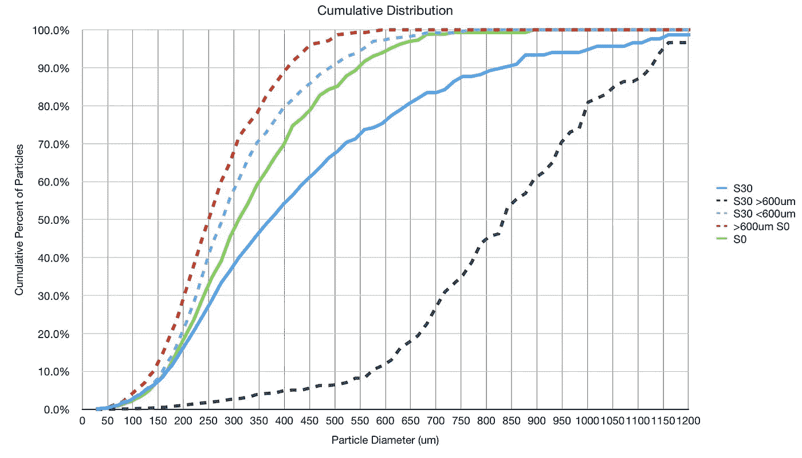

# 过程

我从设置 50 或 30 开始粗磨。

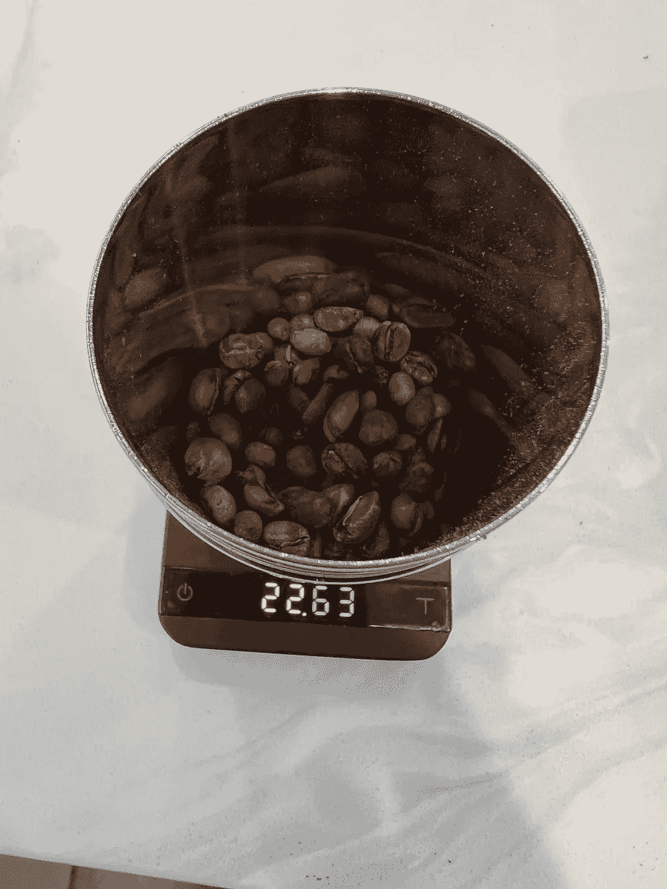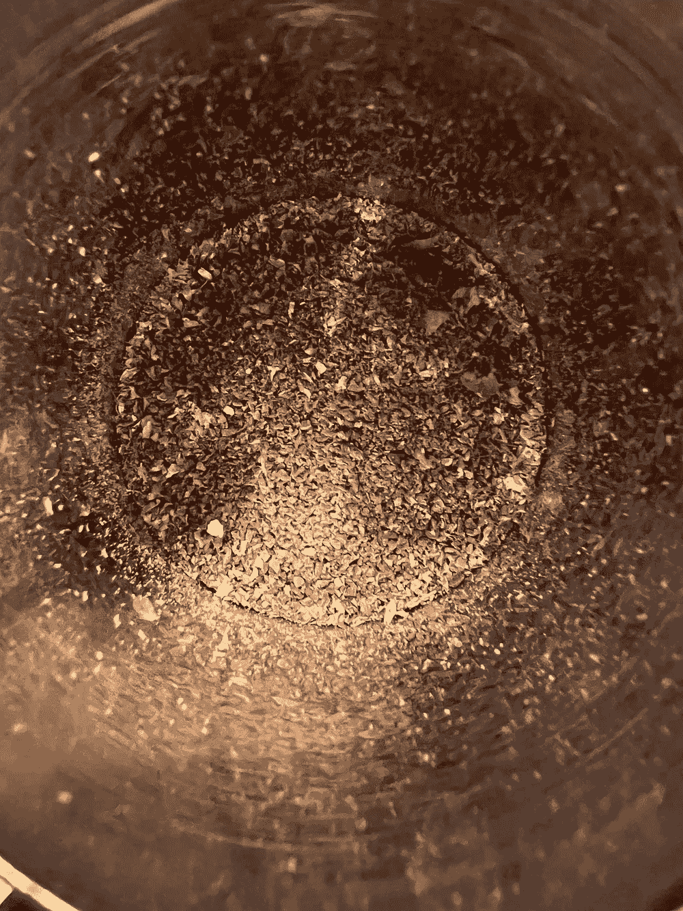

对于这些测试中的一些，我也[去除了干扰](https://rmckeon.medium.com/does-chaff-impact-taste-in-espresso-d2c2b0b4f938)，因为它是如此直截了当地吹掉它。这无助于公平的比较，但我的目的是拍出最好的照片。当我用 500 微米的筛筛咖啡渣时，我轻轻地吹掉了谷壳。

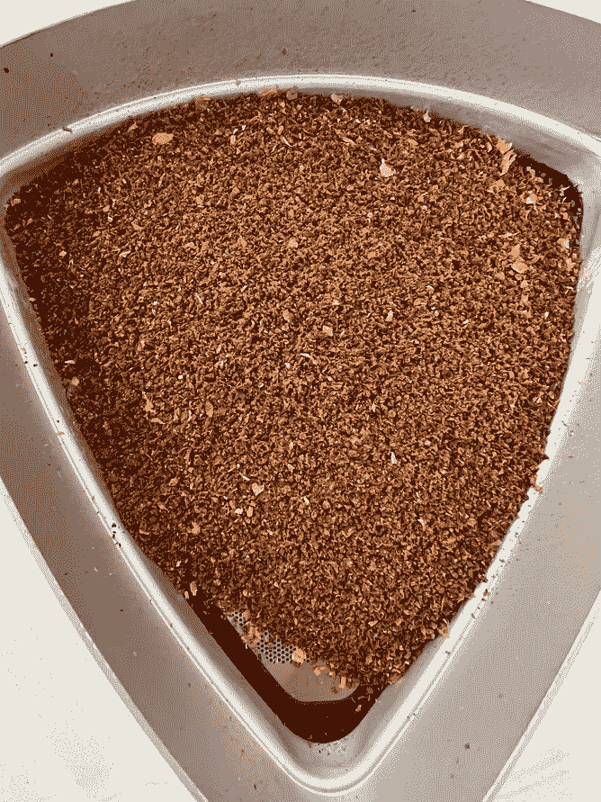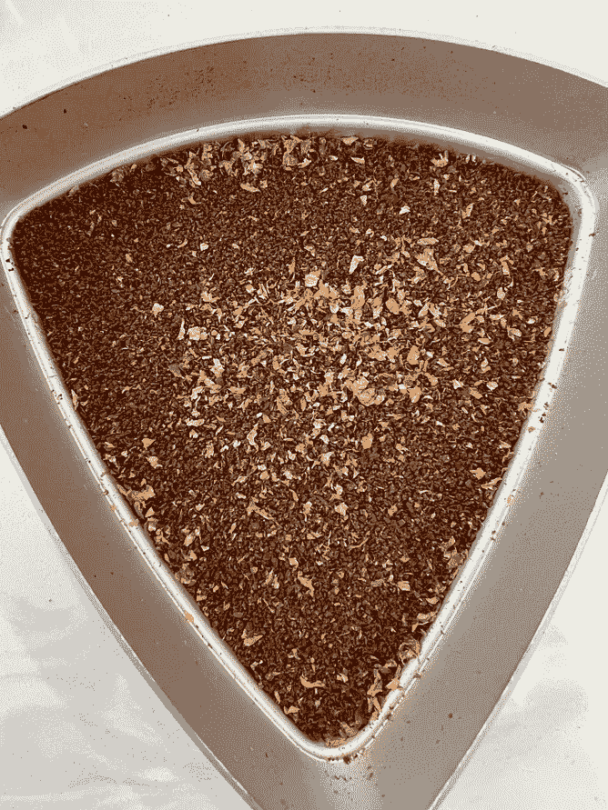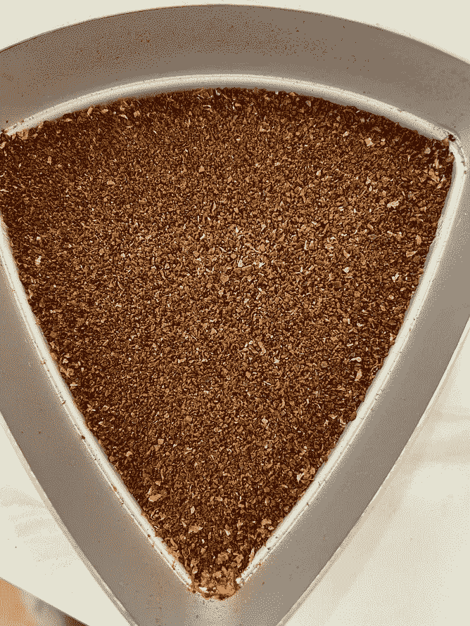

左:研磨咖啡，中:经过一些筛选后，谷壳沉淀在顶部，右:谷壳去除后，筛选结束。

然后我把 500 微米的上等咖啡放在第 8 档，我把它放在最上面。

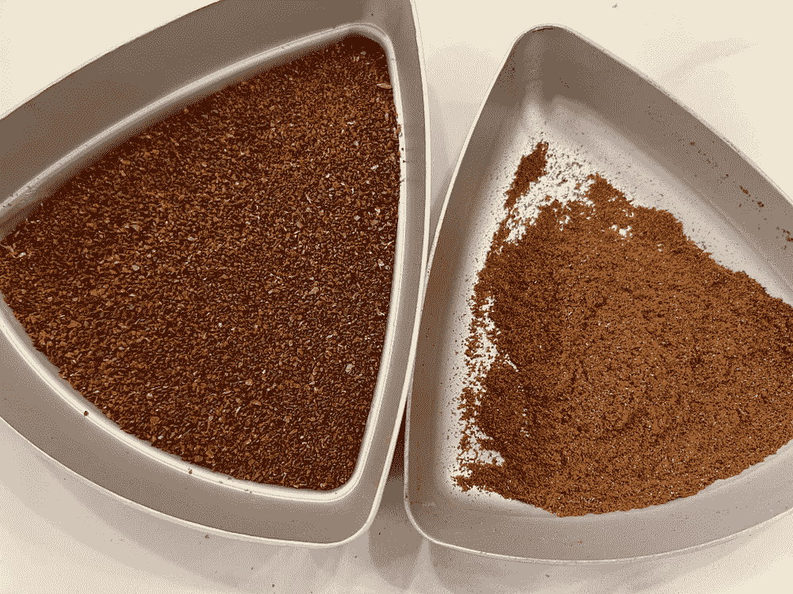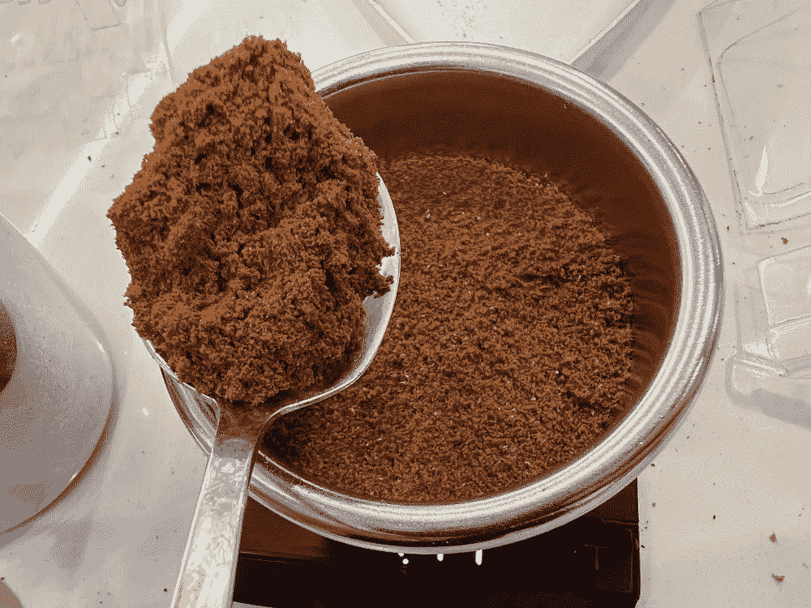

# 绩效指标

我使用两个[指标](/metrics-of-performance-espresso-1ef8af75ce9a?source=your_stories_page----------------------------------------)来评估技术之间的差异:最终得分和咖啡萃取。

[**最终得分**](https://towardsdatascience.com/@rmckeon/coffee-data-sheet-d95fd241e7f6) 是记分卡 7 个指标(尖锐、浓郁、糖浆、甜味、酸味、苦味和回味)的平均值。当然，这些分数是主观的，但它们符合我的口味，帮助我提高了我的拍摄水平。分数有一些变化。我的目标是保持每个指标的一致性，但有时粒度很难确定。

**用折射仪测量总溶解固体量(TDS)，这个数字结合咖啡的输出重量和输入重量用于确定提取到杯中的咖啡的百分比，称为**提取率(EY)** 。使用均方根(RMS)距离将这两者结合起来，得到**强度半径**，这有助于比较不同比率的提取质量。**

# **设备/技术**

**浓缩咖啡机:[金特快](/taxonomy-of-lever-espresso-machines-f32d111688f1)**

**咖啡研磨机:[小生零](/rok-beats-niche-zero-part-1-7957ec49840d)**

**咖啡:[家常烘焙咖啡](https://rmckeon.medium.com/coffee-roasting-splash-page-780b0c3242ea)，中杯(第一口+ 1 分钟)**

**输液:[压力脉动](/pressure-pulsing-for-better-espresso-62f09362211d)**

**[过滤篮](/espresso-filter-comparison-pesado-vs-vst-18a1321e62d) : 20g VST**

**其他设备: [Atago TDS 计](/affordable-coffee-solubility-tools-tds-for-espresso-brix-vs-atago-f8367efb5aa4)、 [Acaia Pyxis 秤](/data-review-acaia-scale-pyxis-for-espresso-457782bafa5d)**

# **表演**

**我做了一些配对拍摄，看看它如何对断奏咖啡表现。我发现它与断奏浓缩咖啡不相上下，而且似乎可以在厨房里用便宜的筛子做一些事情。我看了几个烤肉做对比。**

**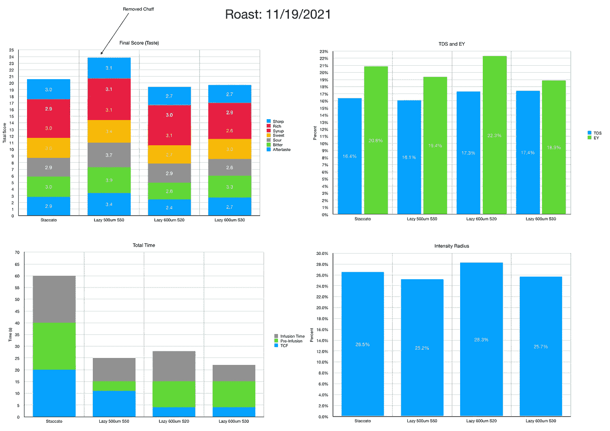**

**注意拍摄时间缩短了很多。**

**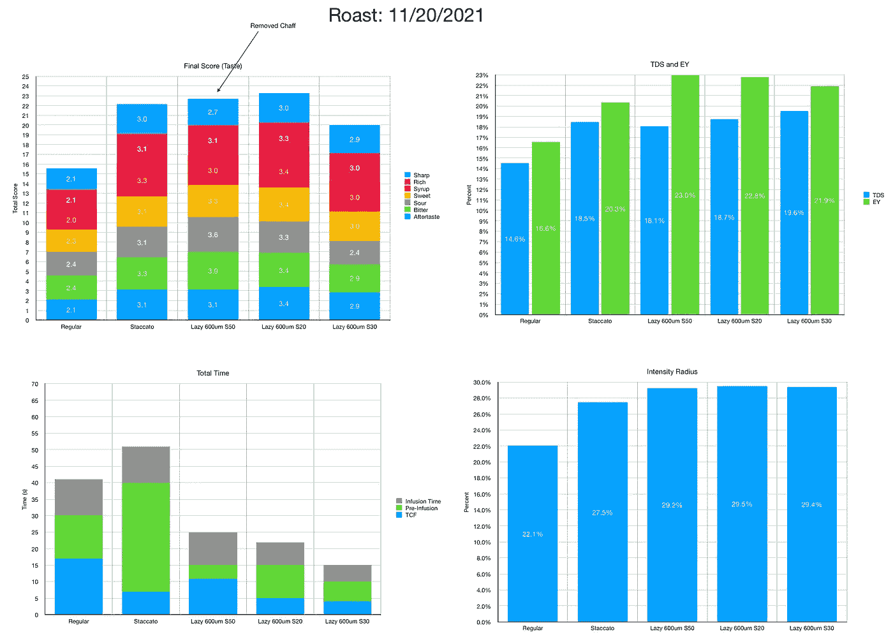**

**同样，水在缓慢的断奏中流动得非常快。这意味着咖啡豆内部的细小颗粒与其他咖啡粉之间的相互作用减缓了流动，而这种作用在它们被分离时不会发生。**

**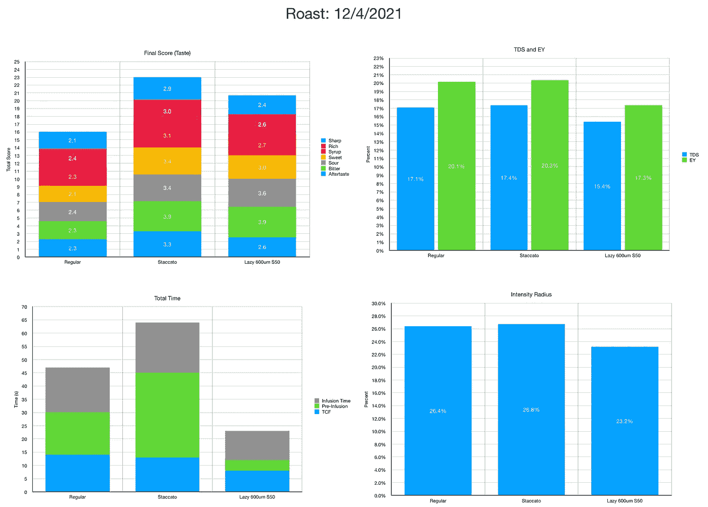**

**同样，模式继续，但懒惰的断奏仍然只是缺乏筛选断奏。**

**我很惊讶断奏和懒惰断奏之间的味道差异如此相似。我特别惊讶的是 EY 更高。这似乎表明，断续发射的真正好处是将内豆细粒与较大的颗粒分开。他们肯定更柔软，更容易化为尘土。**

**我认为这个实验不仅仅是一个奇怪的实验，更确切地说，我认为它表明我们对咖啡中的微粒知之甚少。我们将咖啡豆视为同质结构，但事实并非如此。我们将细颗粒视为同质的，而它们并非如此。那么，这将如何影响我们煮咖啡的方式呢？我认为这暗示了一些学习的机会:**

**内部和外部微粒的颗粒分布有何不同？**

**内细和外细如何提取？此外，它与外部中音和粗调相比如何？**

**-这可以通过使用废咖啡渣的实验来回答，该实验类似于使用[不同研磨尺寸](/measuring-extraction-and-tds-across-coffee-grind-settings-49dfd66d8203)的实验。**

**内部和外部的细颗粒是否以不同的方式流动和/或引导？**

**-这可以通过在断奏击球中用另一个替换内/外罚分来实现。**

**这也能解释为什么涡轮增压能起作用吗？目前还不清楚为什么涡轮丸会有更高的提取率，但通过研磨更粗，大多数细粒应该来自咖啡豆的内部而不是外部。**

**-这也可以通过替换涡轮弹丸中的粉末来进行试验。**

**最后，断奏和懒惰断奏之间的配对比较可以表明懒惰断奏更好或者相同。对于商业实施，带有筛子的双研磨机很可能比单研磨机和自动筛子更快。惰性断奏对于在自动机器和商业环境中实现可能更实用。**

**如果你愿意，可以在推特、 [YouTube](https://m.youtube.com/channel/UClgcmAtBMTmVVGANjtntXTw?source=post_page---------------------------) 和 [Instagram](https://www.instagram.com/espressofun/) 上关注我，我会在那里发布不同机器上的浓缩咖啡照片和浓缩咖啡相关的视频。你也可以在 [LinkedIn](https://www.linkedin.com/in/dr-robert-mckeon-aloe-01581595) 上找到我。也可以关注我在[中](https://towardsdatascience.com/@rmckeon/follow)和[订阅](https://rmckeon.medium.com/subscribe)。**

# **[我的进一步阅读](https://rmckeon.medium.com/story-collection-splash-page-e15025710347):**

**[我未来的书](https://www.kickstarter.com/projects/espressofun/engineering-better-espresso-data-driven-coffee)**

**[浓缩咖啡系列文章](https://rmckeon.medium.com/a-collection-of-espresso-articles-de8a3abf9917?postPublishedType=repub)**

**[工作和学校故事集](https://rmckeon.medium.com/a-collection-of-work-and-school-stories-6b7ca5a58318?source=your_stories_page-------------------------------------)**

**个人故事和关注点**

**[乐高故事启动页面](https://rmckeon.medium.com/lego-story-splash-page-b91ba4f56bc7?source=your_stories_page-------------------------------------)**

**[摄影飞溅页面](https://rmckeon.medium.com/photography-splash-page-fe93297abc06?source=your_stories_page-------------------------------------)**

**[使用图像处理测量咖啡研磨颗粒分布](https://link.medium.com/9Az9gAfWXdb)**

**[改进浓缩咖啡](https://rmckeon.medium.com/improving-espresso-splash-page-576c70e64d0d?source=your_stories_page-------------------------------------)**

**[断奏生活方式概述](https://rmckeon.medium.com/a-summary-of-the-staccato-lifestyle-dd1dc6d4b861?source=your_stories_page-------------------------------------)**

**[测量咖啡磨粒分布](https://rmckeon.medium.com/measuring-coffee-grind-distribution-d37a39ffc215?source=your_stories_page-------------------------------------)**

**[咖啡萃取](https://rmckeon.medium.com/coffee-extraction-splash-page-3e568df003ac?source=your_stories_page-------------------------------------)**

**[咖啡烘焙](https://rmckeon.medium.com/coffee-roasting-splash-page-780b0c3242ea?source=your_stories_page-------------------------------------)**

**[咖啡豆](https://rmckeon.medium.com/coffee-beans-splash-page-e52e1993274f?source=your_stories_page-------------------------------------)**

**[浓缩咖啡用纸质过滤器](https://rmckeon.medium.com/paper-filters-for-espresso-splash-page-f55fc553e98?source=your_stories_page-------------------------------------)**

**[浓缩咖啡篮及相关主题](https://rmckeon.medium.com/espresso-baskets-and-related-topics-splash-page-ff10f690a738?source=your_stories_page-------------------------------------)**

**[意式咖啡观点](https://rmckeon.medium.com/espresso-opinions-splash-page-5a89856d74da?source=your_stories_page-------------------------------------)**

**[透明 Portafilter 实验](https://rmckeon.medium.com/transparent-portafilter-experiments-splash-page-8fd3ae3a286d?source=your_stories_page-------------------------------------)**

**[杠杆机维护](https://rmckeon.medium.com/lever-machine-maintenance-splash-page-72c1e3102ff?source=your_stories_page-------------------------------------)**

**[咖啡评论和想法](https://rmckeon.medium.com/coffee-reviews-and-thoughts-splash-page-ca6840eb04f7?source=your_stories_page-------------------------------------)**

**[咖啡实验](https://rmckeon.medium.com/coffee-experiments-splash-page-671a77ba4d42?source=your_stories_page-------------------------------------)**