# 似然比检验

> 原文：<https://towardsdatascience.com/the-likelihood-ratio-test-463455b34de9>

## 通过 R 中的一个实例直观地解释了似然比检验

克里斯·布里格斯在 [Unsplash](https://unsplash.com?utm_source=medium&utm_medium=referral) 上的照片

*本文使用的所有图片均由作者创作，除非另有说明*

似然比检验(LRT)是一种统计检验，用于根据两个模型的似然比来比较它们的拟合优度。本文将使用 LRT 来比较两个旨在预测一系列硬币翻转的模型，以便直观地理解 LRT 是什么以及它为什么有效。我将首先回顾一下*可能性*和的概念，我们如何找到一个参数的值，在这种情况下，翻转头部的概率，这使得观察我们的数据最有可能。然后，我将展示添加独立参数如何扩展我们的参数空间，以及在某些情况下，一个简单的模型如何构成一个更复杂模型的子空间。最后，我将讨论如何使用维尔克定理来评估一个更复杂的模型是否比一个更简单的模型更适合数据。

我嵌入了用于生成本文中所有图形的 R 代码。

## 抛硬币

让我们从随机抛 25 美分硬币开始，抛正面的概率θ未知:

p(人头)= θ

让我们把硬币翻转十次:

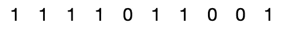

我们翻转它十次，得到 7 个正面(表示为 1)和 3 个反面(表示为 0)。

我们想知道什么参数θ使我们的数据，上面的序列，最有可能。为了找到θ的值，即翻转头部的概率，我们可以计算在给定特定θ值的情况下观察到该数据*的*可能性*。从数学上讲，我们将观察到数据 d 的可能性表示为:L(d|θ)。我们想找到使 L(d|θ)最大化的θ的 to 值。*

凭直觉，你可能会猜测，因为我们有 7 个头和 3 条尾巴，所以我们对θ的最佳猜测是 7/10=.7

让我们写一个函数，通过计算我们在参数空间θ中看到一些可能值的特定头尾序列的可能性，来检验这种直觉。由于每一次硬币投掷都是独立的，观察到特定硬币投掷序列的概率是观察到每一次单独硬币投掷的概率的乘积。在下面的函数中，我们从可能性 1 开始，每次遇到正面，我们就用可能性乘以正面的概率。每当我们遇到一条尾巴，我们就乘以 1 减去翻转头的概率。

既然我们已经有了一个函数来计算观察到一系列抛硬币的可能性，给定一个θ，即正面的概率，让我们来绘制几个不同θ值的可能性。

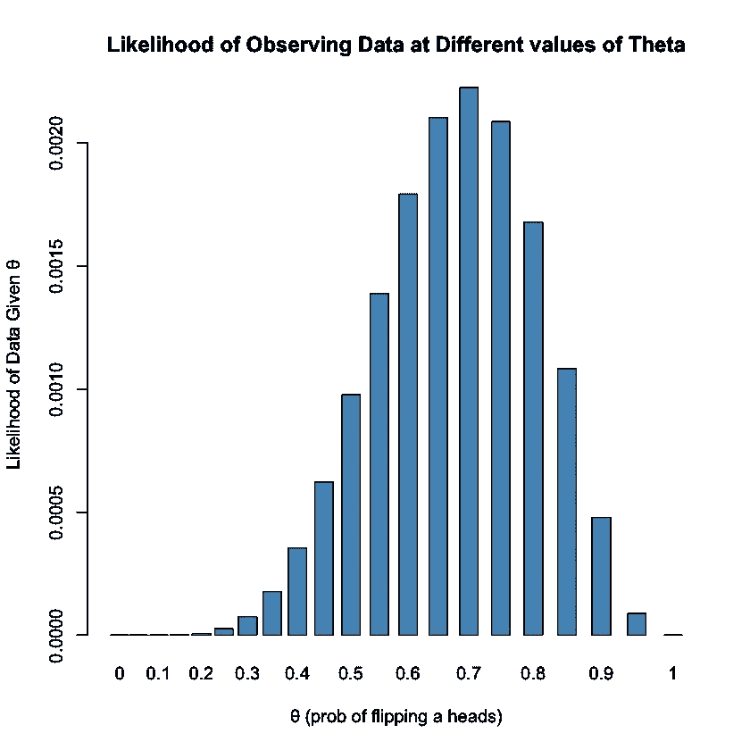

在此图中，我们可以看到，当θ等于 0.7 时，观察数据的可能性最大。我们已经证实了我们的直觉，当θ= 0.7 时，我们最有可能看到数据序列

现在让我们做同样的实验，掷一枚新硬币，例如一便士，同样是正面着地的概率未知。我们可以将我们对 25 美分硬币和 1 美分硬币的翻转组合起来，形成一个 20 次翻转的单一序列。

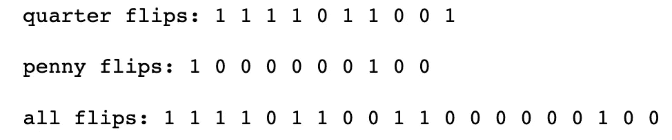

如果我们不知道硬币是不同的，我们按照我们的程序，我们可能会更新我们的猜测，并说，因为我们有 20 个头像中的 9 个，当我们让头像的概率为. 45 时，我们的最大可能性就会发生。我们用下图来证实我们的直觉。

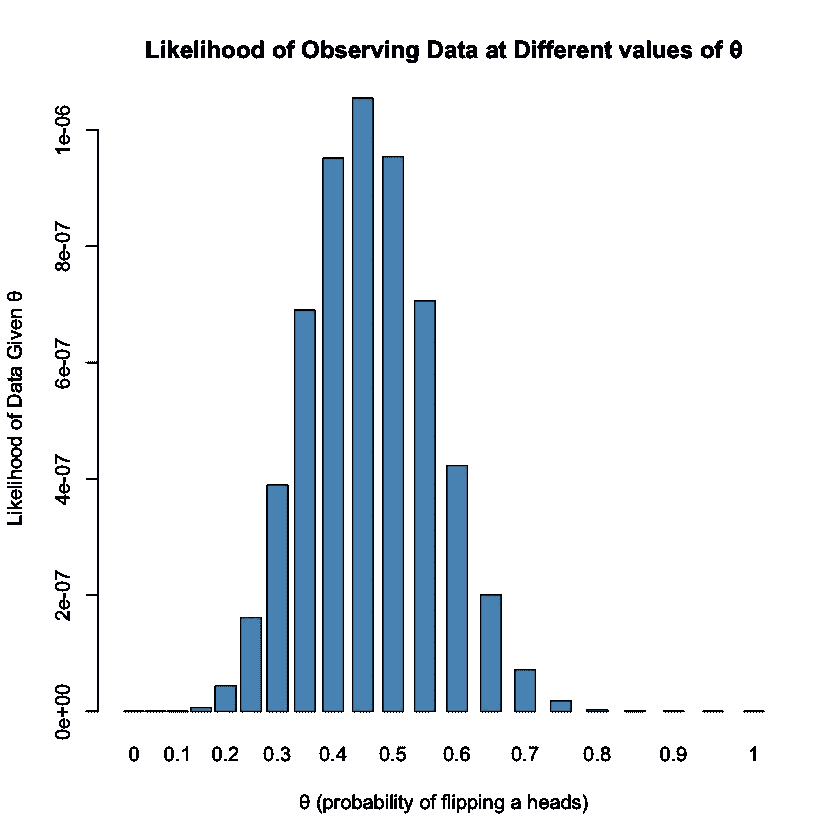

在上面的场景中，我们用一个θ模拟了两个硬币的翻转。也许我们可以通过增加一个额外的参数来改进我们的模型。如果我们知道有两个硬币，并且知道我们什么时候去翻转它们，会怎么样？然后，我们可以尝试使用两个参数来模拟这一系列的翻转，每个硬币一个参数。添加一个参数也意味着向我们的参数空间添加一个维度。让我们想象一下新的参数空间:

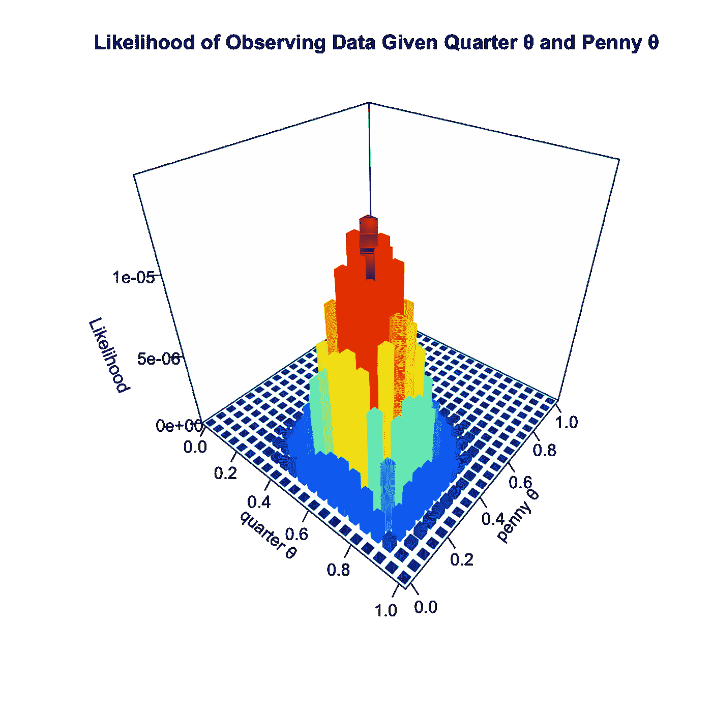

上图显示了在给定两个参数的不同值的情况下，观察我们的数据的可能性。观察使用一个参数相当于说 quarter_θ和 penny_θ的值相同。在上图中，quarter_θ和 penny_θ沿对角线相等，因此我们可以说单参数模型构成了双参数模型的*子空间*。在这种情况下，子空间沿着对角线出现。如果我们将上面的图沿对角线切片，我们将重新创建原始的二维图。

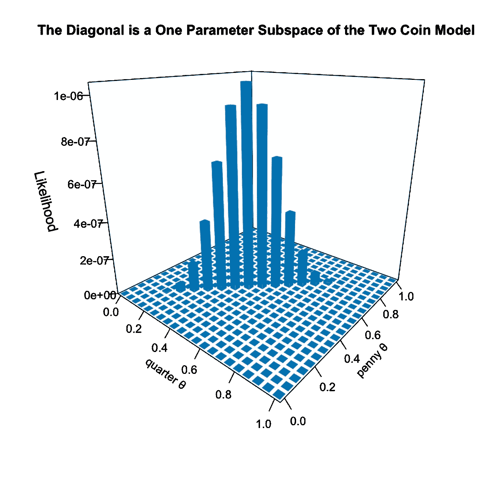

上面的图形与我们假设硬币和便士有相同的正面着地概率时生成的图形相同。我们可以把自己想象成比较两个模型，其中基础模型(掷一枚硬币)是一个更复杂的完整模型(掷两枚硬币)的子空间。

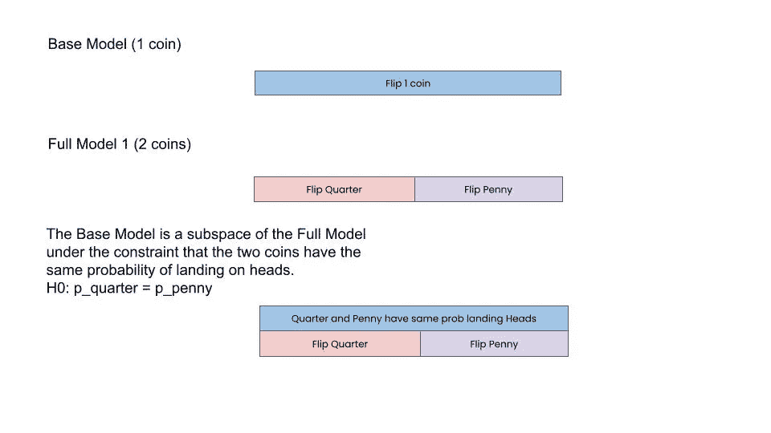

为了直观地显示当我们添加一个参数时，我们观察到数据的可能性有多大，让我们在上图中绘制两参数模型的最大可能性。

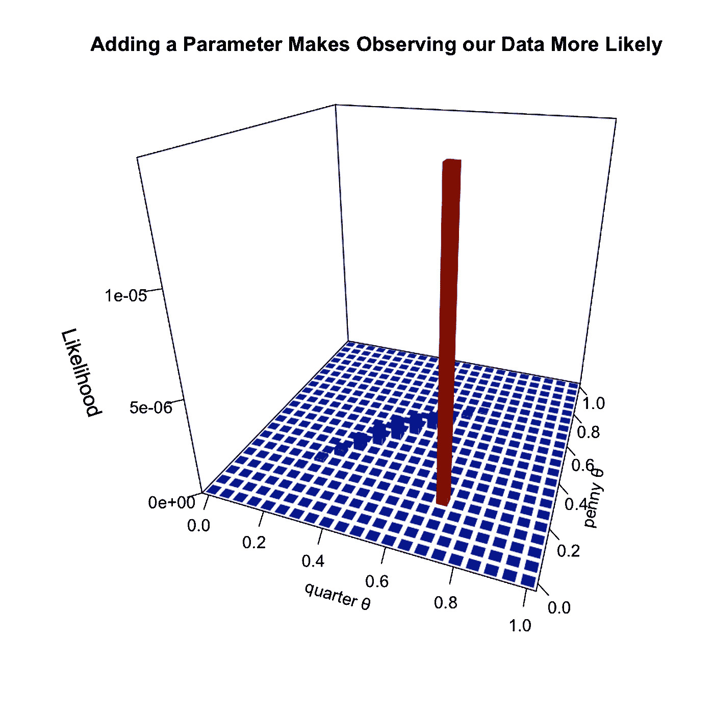

在这种情况下，添加第二个参数使得观察我们的 20 次抛硬币序列更有可能。

# 从似然到似然比检验

我们可以在上面的图表中看到，在双参数模型中观察到数据的可能性比在单参数模型中高得多。然而，如果我们掷的每一枚硬币都有相同的正面概率呢？那么添加第二个参数可能没有好处。那么，我们如何量化地确定添加一个参数是否会使我们的模型更好地拟合数据呢？自然的第一步是获取**似然比**:它被定义为简单模型的最大似然比复杂模型 ML_simple/ML_complex 的最大似然**T3 的比值**

让我们也为我们的例子定义一个零假设和另一个假设:

**零假设:**硬币正面概率=硬币正面概率

**备选假设:**正面四分之一的概率！概率头便士

双参数模型的 ML 与单参数模型的 ML 的似然比是:LR = 14.15558

基于这个数字，我们可能会认为复杂模型更好，我们应该拒绝我们的零假设。但是我们还在用眼球直觉。为了进一步量化这一点，我们需要借助**维尔克定理**，该定理指出，当零假设为真时，随着样本大小(本例中为翻转次数)接近无穷大，2log(LR)呈卡方分布。(在这里阅读维尔克定理[的局限性)。根据维尔克定理，我们将**似然比检验统计量**定义为:λ_ LR = 2[log(ML _ null)log(ML _ alternative)]](https://en.wikipedia.org/wiki/Wilks%27_theorem)

为什么似然比检验统计量是卡方分布？首先回忆一下卡方分布是 k 个独立的标准正态随机变量的平方和。下面是不同自由度(k 值)的卡方分布图。

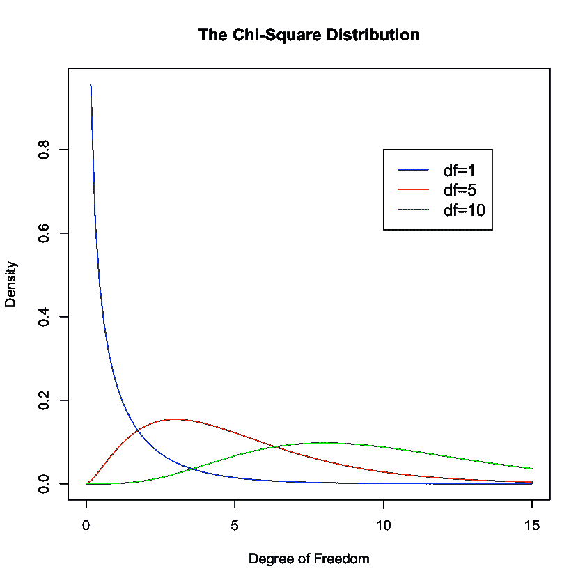

我们如何转换我们的似然比，使其遵循卡方分布？首先，请注意，在上面的柱状图中，我们的每个参数图都是近似正态分布的，因此我们有正态随机变量。我们可以通过取对数把比率变成总和。

这样做得到 log(ML _ alternative)log(ML _ null)。

但是我们不想要正态的 R.V .我们想要正态变量的平方。

log[ml_alternative^2]−log[ml_null^2]

根据对数法则，我们得到:

2∫[log(ML _ alternative)log(ML _ null)]

或者是维尔克所使用的形式

-2[log(ML _ null)-log(ML _ alternative)]

维尔克定理告诉我们，上述统计量将渐近地服从卡方分布

让我们用抛硬币的例子来实践这一点。

首先让我们写一个函数来抛硬币，正面着地的概率为 p。我们还将创建一个名为翻转的变量，在 1000 个独立的实验中模拟硬币翻转 1000 次，以创建 1000 个 1000 次翻转的序列。

现在让我们来纠正一个函数，它计算给定数量的参数的最大似然。这个函数的工作原理是将数据分成均匀的块(把每个块想象成代表它自己的硬币)，然后计算在每个块中观察到数据的最大可能性。例如，如果给定该函数十次翻转的序列:1，1，1，0，0，0，1，0，1，0，并被告知使用两个参数，则它将返回与前五次翻转(五次中的三次头部= .6)和后五次翻转(五次中的两次头部= .4)的最大似然估计相对应的向量(. 6，.. 4)。如果我们传递相同的数据，但告诉模型只使用一个参数，它将返回向量(. 5)，因为我们有 10 次翻转中的 5 次翻转。

现在我们需要一个函数来计算在给定 n 个参数的情况下观察我们的数据的可能性。该函数的工作原理是根据参数的数量将数据分成均匀的块，然后计算在给定参数值的情况下观察到每个序列的可能性。例如，如果我们将序列 1，1，0，1 和参数(. 9，.. 5)传递给此函数，它将返回 0.2025 的可能性，这是通过计算得出的:假定着陆头的概率为 0.9，观察到两个头的可能性为 0.81，假定着陆头的概率为 0.5，则一个尾巴接着一个头着陆的可能性为 0.25。由于这些是独立的，我们将每个可能性相乘，得到观察数据的最终可能性，给定我们的两个参数. 81 x .25 = .2025。

现在我们写一个函数来求似然比:

最后，我们可以编写一个函数，根据一组数据(我们在下面的函数中称之为翻转)和两个不同模型中的参数数量返回似然比检验统计量，从而将所有这些放在一起。

现在我们准备证明似然比检验统计量是渐近卡方分布的。让我们在 1000 次实验中，每次实验投掷硬币 1000 次，然后绘制测试统计值的频率直方图，比较 1 参数模型和 2 参数模型。

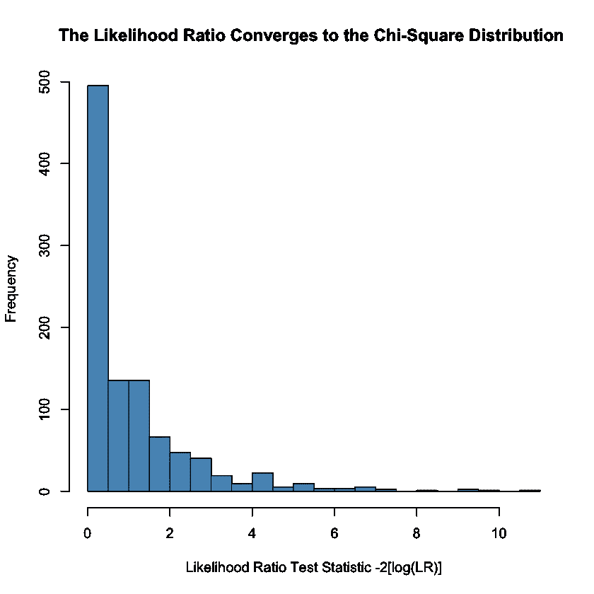

下面的密度图显示了以 1 个自由度收敛到卡方分布。

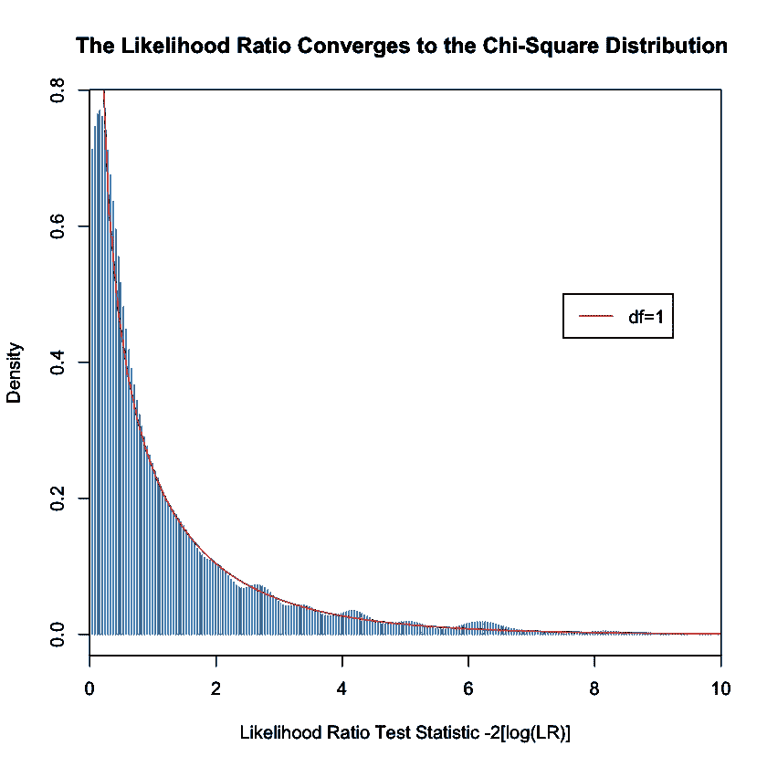

如果我们比较一个使用 10 个参数的模型和一个使用 1 个参数的模型，我们可以看到检验统计量的分布变化为自由度等于 9 的卡方分布。

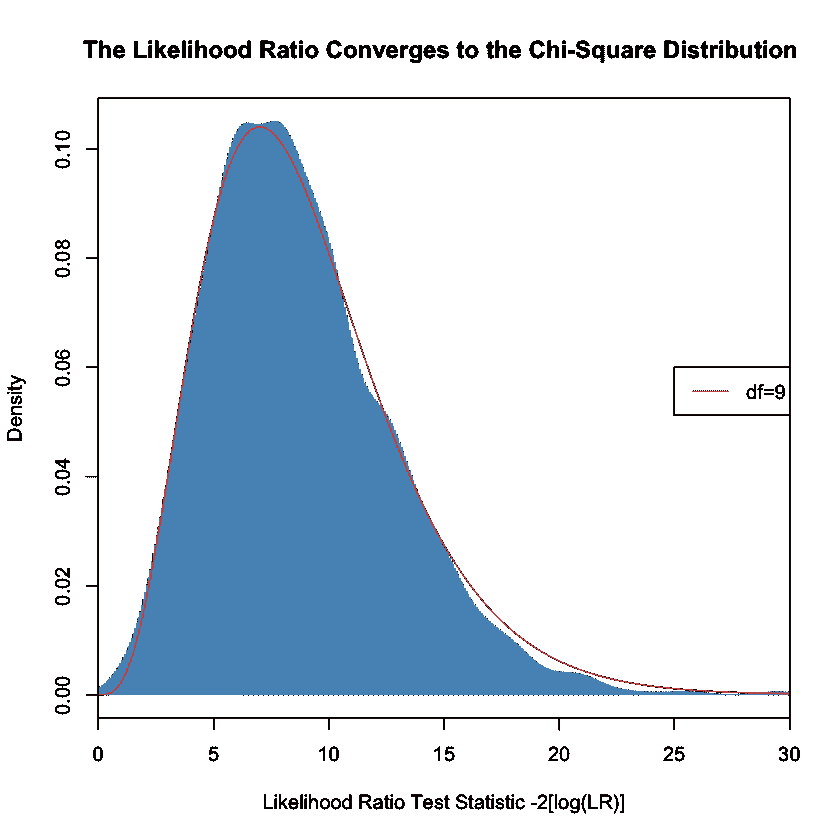

上图显示了检验统计值是卡方分布的。回到硬币和便士的例子，我们现在能够准确地量化双参数模型比单参数模型更好的拟合。回想一下我们的似然比:ML_alternative/ML_null 是 LR = 14.15558。如果我们取 2[log(14.15558 ),我们得到一个测试统计值 5.300218。

我们可以使用卡方 CDF 来查看，假设零假设为真，则在该值下有 2.132276%的机会观察到似然比统计数据。所以在这种情况下，当α为 0.05 时，我们应该拒绝零假设。

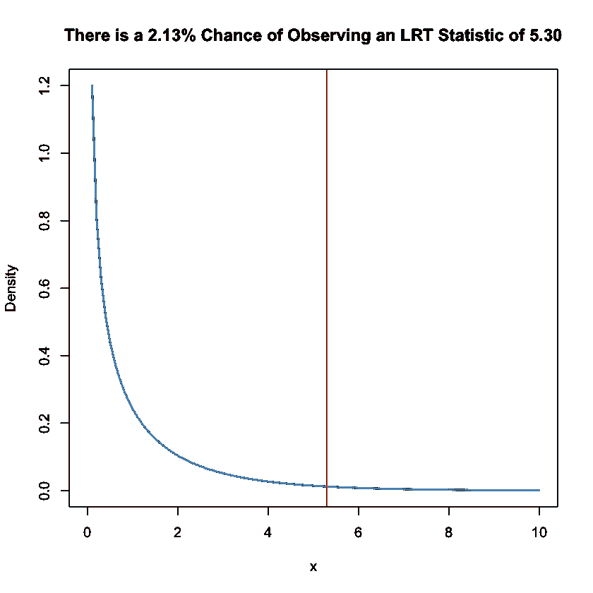

上图显示，假设零假设为真，并且每枚硬币与正面硬币有相同的落地概率，我们只会在大约 2.13%的时间里看到 5.3 的测试统计。

## 结论

本文使用模拟一枚或多枚硬币翻转的简单示例来演示如何使用似然比检验来比较两个模型对一组数据的拟合程度。我们讨论了模型“嵌套”的含义，考虑了在一个硬币对两个硬币的假设下，对一组硬币翻转进行建模的情况。最后，我们实证研究了维尔克定理，以证明 LRT 统计量是渐近卡方分布的，从而允许 LRT 作为一个正式的假设检验。