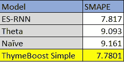
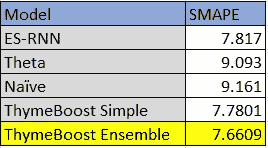
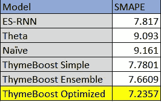

# 用百里香增强软件进行 M4 时间序列预测竞赛

> 原文：<https://towardsdatascience.com/the-m4-time-series-forecasting-competition-with-thymeboost-b31196fc319>

## 第 1 部分:每周数据集


乔恩·泰森来自 [Unsplash](https://unsplash.com/photos/FlHdnPO6dlw) 的图片

**TLDR:** 在本文中，我们来看看百里香的一些不同实现，看看它在 M4 竞赛中的竞争力如何。主要的竞争是 ES-RNN 模型(获胜)和 Theta 模型，后者是表现最好的基准。在每周数据集之后，某些 ThymeBoost 实现脱颖而出。

如果你需要百里香的介绍，看看这篇[文章](/thymeboost-a0529353bf34)。

[百里香增强 GitHub](https://github.com/tblume1992/ThymeBoost)

# 介绍

M4 比赛是过去 40 年来定期举行的 M 比赛中的又一个参赛项目。几十年来，他们一直被期待作为时间序列预测方法的基准，M4 竞赛也不例外。它由 100k 个时间序列组成，跨越几个领域和频率，提供了一个不错的基准。虽然，一些频率被低估，这可能有利于某些方法。在讨论基准测试时，我将继续让您知道这并不意味着对百里香增强进行基准测试，相反，这是对百里香增强功能的回顾。我会将学到的知识应用到“自动调整”预测方法中。与 ARIMA 或其他传统方法不同，增强时间序列分解方法没有指南，我希望找到几个问题的答案，例如:

1.  哪些趋势方法有效？
2.  什么方法在框架中作为“生成器”工作得很好？
3.  组件学习率呢，它们有什么作用吗？

带着这些问题，让我们开始吧。

# 数据

这些数据集都是开源的，并且在 M-competitions [github](https://github.com/Mcompetitions/M4-methods/tree/master/Dataset) 上直播。它被标准训练和测试分割，因此我们将使用训练 csv 进行拟合，而测试仅用于使用 SMAPE 进行评估。让我们继续将数据和百里香一起导入，如果您还没有安装它，请从 pip 中获取它。

```
pip install ThymeBoost
```

有频繁的更新，所以即使你以前安装了它，你可能想继续下去，并更新！

现在我们有了百里香和数据集，让我们开始编码。

```
import matplotlib.pyplot as plt
import numpy as np
from tqdm import tqdm
import pandas as pd
from ThymeBoost  import ThymeBoost as tbtrain_df = pd.read_csv(r'm4-weekly-train.csv')
test_df = pd.read_csv(r'm4-weekly-test.csv')
train_df.index = train_df['V1']
train_df = train_df.drop('V1', axis = 1)
test_df.index = test_df['V1']
test_df = test_df.drop('V1', axis = 1)
```

在这里，我们只需导入所有必需的包，并将数据作为标准数据帧读入。接下来，让我们创建 SMAPE 函数，该函数将返回给定预测和实际值的 SMAPE:

```
def smape(A, F):
    return 100/len(A) * np.sum(2 * np.abs(F - A) / (np.abs(A) +       np.abs(F)))
```

在我们的实验中，我们将采用所有时间序列的平均值来与其他模型进行比较。对于健全性检查，我们还将获得“幼稚”的平均得分，以确保我们所做的与竞争中所做的一致。也就是说，我们将简单地遍历数据帧并进行惰性拟合和预测。代码可以通过**而不是**执行 for 循环来优化，但是这样做也很好！

# 实现#1:简单

第一个参数设置集中于使用趋势估计器的“生成器”变量。这意味着我们将在每一轮中改变趋势估计值，并在提供的列表中循环。通过:

```
trend_estimator=['linear', 'ses']
```

这往往做得很好，它有一个非常“theta-ey”的外观。第一轮(不是初始化轮)符合一条简单的趋势线。接下来是简单的指数平滑。全拟合函数将如下所示:

```
output = boosted_model.fit(y.values,
                                seasonal_period=[0, 52],
                                trend_estimator=['linear', 'ses'],
                                seasonal_estimator='fourier',
                                fit_type='global',
                                global_cost='mse',
                                seasonality_lr=.9,
                                additive=False,
                                )
```

该设置的另一个有趣部分是为“季节性周期”传递的“生成器”变量。这与 trend_estimator 的工作原理相同，在 trend _ estimator 中，第一轮使用 **no** 季节性，然后使用周期 52，然后回到 0，以此类推。参数“加法”为假基本上意味着采用了对数，最后对季节性进行了一点调整，达到了 0.9。

如前所述，这个实现将用于一个简单循环中的每个系列。让我们继续运行它:

```
seasonality = 52
smapes = []
naive_smape = []
j = tqdm(range(len(train_df)))
for row in j:
    y = train_df.iloc[row, :].dropna()
    y = y.iloc[-(3*seasonality):]
    y_test = test_df.iloc[row, :].dropna()
    j.set_description(f'{np.mean(smapes)}, {np.mean(naive_smape)}') boosted_model = tb.ThymeBoost(verbose=0,
                                  normalize_seasonality=True)
    output = boosted_model.fit(y.values,
                                seasonal_period=[0, 52],
                                trend_estimator=['linear', 'ses'],
                                seasonal_estimator='fourier',
                                fit_type='global',
                                global_cost='mse',
                                seasonality_lr=.9,
                                additive=False,
                                )
    predicted_output = boosted_model.predict(output,
                                             len(y_test),
                                             trend_penalty=True)
    smapes.append(smape(y_test.values, predicted_output['predictions'].clip(lower=0)))
    naive_smape.append(smape(y_test.values, np.tile(y.iloc[-1], len(y_test))))
print(f'Weekly {np.mean(smapes)}')
print(f'Naive {np.mean(naive_smape)}')
```

输出是:

```
Weekly 7.780101701503696
Naive 9.161286913982
```

平均 SMAPE 是 7.78，这实际上是对 ES-RNN 和 Theta 的改进:



作者图片

我们可以通过稍微改变季节周期来获得更多的收益:

```
seasonal_period=[0, 52, 52]
```

这有点奇怪，所以肯定不是一个可以广泛使用的设置。

使用简单线性回归和简单指数平滑的这种来回推进看起来对该数据做得不合理地好。请记住，这个提升过程将适合每个趋势近似值之间的季节性，因此它不像只是去趋势化并将其交给简单的指数平滑器那么简单。但是，它也没有明显更复杂，所以拟合是相当爽快的。

# 实现#2:集成

我们可以做的另一件事是平均多个预测。这可以在 ThymeBoost 中通过将所有内容作为一个列表传递给“ensemble”方法来实现。让我们仔细看看我们将尝试的内容:

```
trend_estimator=[['linear', 'ses'],
                 ['linear', 'damped_des'],
                 ['linear', 'des']]
output = boosted_model.ensemble(y.values,
                                seasonal_period=[[0, 52]],
                                global_cost=['mse'],
                                fit_type=['global'],
                                additive=[False],
                                seasonality_lr=[.9],
                                seasonal_estimator=['fourier']
                                )
```

注意所有的东西都是作为一个列表传递的！为了在这个方法中使用一个“生成器”变量，就像我们之前在 fit 方法中所做的一样，我们现在必须将它作为一个列表列表来传递。在这种情况下，trend_estimator 由 3 个“生成器”变量组成。在这里，我们注意到了以前行之有效的方法以及 M4 竞赛中的“基准”方法。这种方法是简单双指数平滑法和阻尼双指数平滑法的平均值。

让我们运行这个循环的完整代码块，看看它是如何工作的:

```
smapes = []
naive_smape = []
j = tqdm(range(len(train_df)))
seasonality = 52
trend_estimator=[['linear', 'ses'],
                 ['linear', 'damped_des'],
                 ['linear', 'des']]
for row in j:
    y = train_df.iloc[row, :].dropna()
    y = y.iloc[-(3*seasonality):]
    y_test = test_df.iloc[row, :].dropna()
    j.set_description(f'{np.mean(smapes)}, {np.mean(naive_smape)}')
    boosted_model = tb.ThymeBoost(verbose=0,
                                  normalize_seasonality=True)
    output = boosted_model.ensemble(y.values,
                                    seasonal_period=[[0, 52]],
                                    trend_estimator=trend_estimator,
                                    global_cost=['mse'],
                                    fit_type=['global'],
                                    additive=[False],
                                    seasonality_lr=[.9],
                                    seasonal_estimator=['fourier']
                                    )
    predicted_output = boosted_model.predict(output,
                                             len(y_test),
                                             trend_penalty=True)
    smapes.append(smape(y_test.values, predicted_output['predictions'].clip(lower=0)))
    naive_smape.append(smape(y_test.values, np.tile(y.iloc[-1], len(y_test))))
print(f'Weekly {np.mean(smapes)}')
print(f'Naive {np.mean(naive_smape)}')
```

输出是:

```
Weekly 7.660902293272987
Naive 9.161286913982
```

比 ES-RNN 和 Theta 有更大的改进，尽管这样的集合会增加计算时间。

当前结果:



作者图片

# 实施#3:优化

到目前为止，我们已经看了一个简单的百里香增强配置和一个更复杂的平均 3 个输出的集合方法。下一步是选择使用哪种方法，并希望找到“最佳”方法。为此，我们将使用百里香优化方法。这个方法非常简单，它接受一个标准拟合参数列表(就像 ensemble 一样)，但这次它将根据维持精度选择一个输出。您可以选择“维持”或“滚动”优化策略，其中滚动利用时序交叉验证。这意味着将有几轮装配和测试。

在运行完整的循环之前，让我们仔细看看这个优化方法:

```
trend_estimator=[['linear', 'ses'],
                 ['linear', 'damped_des'],
                 ['linear', 'des']]
output = boosted_model.optimize(y.values,
                            seasonal_period=[[0, 52], 0],
                            trend_estimator=[['linear', 'ses'],    boosted_model.combine(trend_estimator)],
                            seasonal_estimator=['fourier'],
                            fit_type=['global'],
                            global_cost=['mse'],
                            seasonality_lr=[.9, .1],
                            additive=[False],
                            optimization_steps=4,
                            optimization_strategy='rolling',
                            lag=28,
                            verbose=0,
                            )
```

首先，对于季节性周期，我们将使用上次运行良好的[0，52]以及 0，表示完全没有季节性。此外，我们将尝试通过 0.9 的学习率进行**轻度**季节性调整，以及通过 0.1 进行**重度**调整。最有趣的是这种“组合”方法被混合使用。这只是意味着百里香增强将使用该设置作为一个整体，同时优化。除了这些设置，我们还看到了新的优化相关参数，这些参数表示如何对每种方法进行分级。在这里，我们将进行 4 轮拟合和测试，总共维持过去 28 个周期(显然，您应该根据数据频率来改变这一点)。这意味着 4 轮中的每一轮都将测试 7 个数据点，并通过 28 的整个维持延迟。

说了这么多，让我们看看完整的代码和输出:

```
smapes = []
naive_smape = []
j = tqdm(range(len(train_df)))
seasonality = 52
trend_estimator=[['linear', 'ses'],
                 ['linear', 'damped_des'],
                 ['linear', 'des']]
for row in j:
    y = train_df.iloc[row, :].dropna()
    y = y.iloc[-(3*seasonality):]
    y_test = test_df.iloc[row, :].dropna()
    j.set_description(f'{np.mean(smapes)}, {np.mean(naive_smape)}') boosted_model = tb.ThymeBoost(verbose=0,
                                  normalize_seasonality=True) output = boosted_model.optimize(y.values,
                                seasonal_period=[[0, 52], 0],
                                trend_estimator=[['linear', 'ses'], boosted_model.combine(trend_estimator)],
                                seasonal_estimator=['fourier'],
                                fit_type=['global'],
                                global_cost=['mse'],
                                seasonality_lr=[.9, .1],
                                additive=[False],
                                optimization_steps=4,
                                optimization_strategy='rolling',
                                lag=28,
                                verbose=0,
                                ) predicted_output = boosted_model.predict(output,
                                             len(y_test),
                                             trend_penalty=True)
    smapes.append(smape(y_test.values, predicted_output['predictions'].clip(lower=0)))
    naive_smape.append(smape(y_test.values, np.tile(y.iloc[-1], len(y_test))))
print(f'Weekly {np.mean(smapes)}')
print(f'Naive {np.mean(naive_smape)}')
```

和打印报表:

```
Weekly 7.235682291017231
Naive 9.161286913982
```

在这里，我们看到了相对于之前实现的另一个改进，但是在计算方面又一次付出了巨大的代价。对于每个时间序列，我们拟合了几种不同类型的模型，并在优化时做了 4 次。

该数据集的最终排名:



作者图片

相对于之前的百里香增强实现，我们确实看到了另一个改进。

# **结论**

显然，这整个“促进时间序列分解”的想法是有道理的。主要瓶颈是参数空间巨大。当我们浏览 M4 数据集时，我的目标之一是想出有意义的测试来尝试在 autofit 方法中使用。一个必要的测试是为了限制参数空间的季节性，但我仍然不知道什么类型的数据适合什么类型的趋势估计。时间序列的哪些特征与增强的平滑器相关？一辆增压 ARIMA 怎么样？

不知道，但是可以肯定的说，smoothers 在这个框架中做得很好。

在以后的文章中，我们将继续浏览不同的数据集和有趣的百里香增强实现，包括在增强循环中利用外源估计器。

现在，如果你在使用百里香的过程中发现了什么有趣的东西，一定要让我知道！