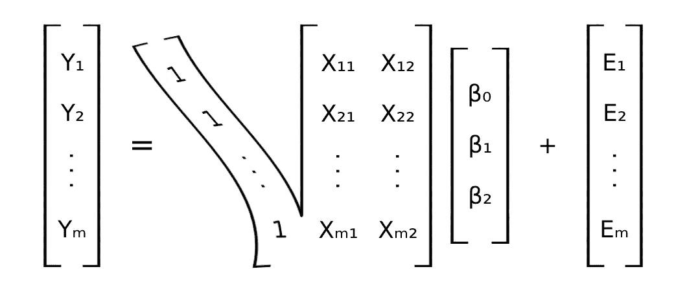
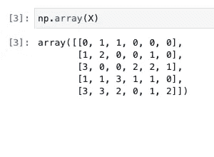
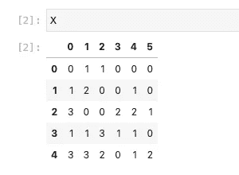
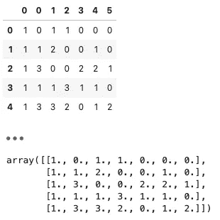
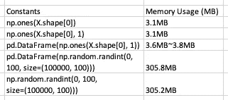
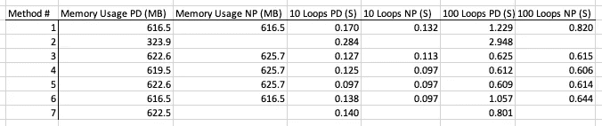

# 为拦截换肤的多种方式

> 原文：<https://towardsdatascience.com/the-many-ways-to-re-skin-an-intercept-cbfd59c8728c>

## 数据争论/机器学习/ Python

# 为拦截换肤的多种方式

## 向数据集添加截取列的方法



图片作者:Karsten Cao

如果你和我一样，你无疑在你的数据科学之旅中遇到过线性回归。也许为了理解这个模型，你决定从头开始编写一个，或者至少用一些公共库，比如 Pandas 或 NumPy。不知何故，我总是忘记在我的截距数据集上添加一个恒定的 1 列的步骤，最终不得不查找这个过程，却发现一个与以前不同的方法。为了让您和我永远不会走得太远，这里有几种方法可以将截取列添加到现有数据集。

对于那些好奇的人来说，这些方法后面是额外的时间和记忆评估部分。pd.concat 被认为是内存效率最高的，它产生了一个 Pandas 数据帧，而 np.concatenate 在速度方面是最好的，它产生了一个 NumPy 数组。

# 1.创建数据

我从一个 Pandas 数据框架开始，因为它与提供的所有方法一起工作。也可以使用 NumPy 数组，但它仅限于 NumPy 进程。



这里，我们用[2]熊猫数据帧和[3]2D 数组表示数据。Karsten Cao 的图片

# 2.对截取进行“重新换肤”

下面我列出了我在向现有数据集添加截取列时遇到的 7 种方法。它们似乎可以分为三类:分配优先、连接和插入。结果在熊猫数据帧或 NumPy 2D 阵列中，截距在最左列，为一些线性代数和机器学习做好准备。



任一方法的一般输出。熊猫数据帧在上面，NumPy 数组在下面。图片作者:Karsten Cao

# 3.一般讨论

在这一节中，我将探究每一种方法，并对每一个过程进行高层次的描述。

第一种方法是按照原始数据集的形状分配一个多一列的矩阵。然后，非截距位置被替换为来自 x 的数据。这可能会感觉很慢，因为在被覆盖之前会生成许多 1 并且未使用。输出是一个 np.array。

```
tempX = np.ones((X.shape[0], X.shape[1] + 1))
tempX[:,1:] = X
```

第二种方法使用串联。它生成一个截取列，将其转换为 DataFrame 对象，然后将该列与原始数据集连接起来。这种方法的内存使用量非常惊人，因为它几乎没有使用比原始数据集更多的内存。输出是 pd.DataFrame。

```
pd.concat([pd.DataFrame(np.ones(X.shape[0])), X], axis=1)
```

第三、第四和第五种方法是使用 NumPy 的串联方法。除了所需参数的不同，这只是将截距追加到数据集的三种不同方法。在组合新输出的结果之前，每个都创建一个新的截距列。输出是 np.arrays。虽然有所不同，但是本文并不探讨这些不同之处。

```
np.c_[np.ones(X.shape[0]), X]np.hstack([np.ones((X.shape[0], 1)), X])np.concatenate([np.ones((X.shape[0], 1)), X], axis=1)
```

第六种方法是插入。它通过提供索引和轴方向来指定列，选择要插入的值，然后继续。它使用 np.array(X)将 DataFrame 转换为 NumPy 数组。这类似于 Python list 内置函数，但它确实会带来一些混乱，因为您可以添加一个值来传播数组中的一列。同样，您可以在第三个参数中传递[1]来获得完全相同的输出。输出是一个 np.array。

```
np.insert(np.array(X), 0, 1, axis=1)
```

第七种方法是插入和交换。它会制作一份拷贝，这样原始数据帧就不会受到影响。使用类似于第六种方法的特殊 Pandas 过程添加一个截距，在第六种方法中，我们将一个列设置为标量，创建一个用所提供的标量填充的列。DataFrame 的列被取出、重新排序，然后传递给 reindex 方法。输出是 pd.DataFrame。

```
tempX = X.copy()
tempX['intercept'] = 1
columns = list(tempX.columns)
columns[0], columns[1:] = columns[-1], columns[0:-1]
tempX.reindex(columns=columns)
```

这些是我发现的几种使用 Pandas 或 NumPy 向现有数据集添加截距的方法。由于这个过程对每个数据集只进行一次，并且只是为线性回归等模型准备数据，因此这些选项中的任何一个都非常适合刚刚进入机器学习和数据科学的人。

但是如果毫秒和兆字节很重要呢？继续读。

# 4.事实真相

在被告知“这些选项中的任何一个都非常合适”后，有些人可能会不满意。在这一节中，我将探讨每个模型的时间和空间效率，并比较它们的性能。

## **方法论**

我使用了一个 Pandas 数据帧和一个带有(100_000，100)个随机初始化变量的 NumPy 数组。
为了避免 Python 缓存数组和矩阵，我单独运行并计时了每个方法。创建了一个 base()函数来初始化和计算数据集和截距列的常量内存使用。此外，基本内存使用量用于验证哪些变量正在被缓存。
所有的拦截方法都放在一个函数中，这个函数被封装在一个[内存分析器](https://pypi.org/project/memory-profiler/)中，用来测量增量数据的使用情况。下面的内存使用是使用 profiler decorator 计算的。为了给每个函数计时，我创建了一个时间装饰器，循环遍历每个截取方法，计算运行时间，并记录结果。

## **结果**



用于循环计算和建立基线的恒定内存使用量。图片作者:Karsten Cao



每种方法的内存使用和时间评估。图片作者:Karsten Cao

## 以下是我注意到的一些事情:

*   Pandas 和 NumPy 之间最初的数据使用差异可以忽略不计。
*   除了 np.concatenate 有 10 次迭代之外，np.array 的初始开销更小，运行速度更快。
*   令人惊讶的是，使用 pd.concat 的第二种方法是**最有效的内存方法**,它只使用了 323.9MB 的 ram。似乎是将指针合并到返回的数据帧中，而不是为副本分配新的空间。不幸的是，它花费的时间最长，是 np.concatenate 的 2-5 倍。
*   最快的方法因迭代而异。经过 10 次迭代，np.concatenate、np.hstack 和 np.insert 以 0.097 秒打平。经过 100 次迭代，NumPy 串联方法(3，4，5)的次数达到了 1%。
*   如果您希望输出是数据帧，那么第七种带有插入和重新索引的方法非常快，100 次迭代 0.801 秒，10 次迭代 0.130 秒。否则，np.concatenate 在两种数据集类型上的速度都是一致的。

# 结论

总而言之，我建议坚持使用您开始使用的数据对象或适合您的用例的数据对象。毕竟，如果你正在用 Python 编码，那么对你来说最重要的可能是你编码和思考的时间，而不是你将向数据集添加截距的过程从毫秒缩短到最小的能力。

我知道我只会用我记得的那个。

感谢您的阅读！随意查看代码[这里](https://github.com/karagain/Intercept-Profiler/blob/main/profiler.py)！