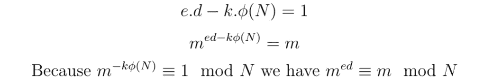

# RSA 背后的数学原理

> 原文：<https://towardsdatascience.com/the-math-behind-rsa-910f88b94c36>

## RSA 及其算法背后的数学原理的详细演示


在 [Unsplash](https://unsplash.com?utm_source=medium&utm_medium=referral) 上由[Towfiqu barb huya](https://unsplash.com/@towfiqu999999?utm_source=medium&utm_medium=referral)拍摄的照片

我们通常发现数学结果在计算机科学中令人着迷的应用。 *RSA* 就是这样一个应用。

*RSA* 是*非对称加密*的实现，也叫*公钥加密*，由 Diffie 和 Hellman 在*密码学新方向【1】*中介绍。

非对称加密背后的想法是每台机器 **A** 生成两个函数 ***f*** 和 ***g*** 使得:

```
***g(f(message)) = message***
```

函数 ***f*** 用于加密消息，并由 **A** 公开*。每台要向 **A** 发送消息的机器计算 *f(消息)*、*、*，并将结果发送给 **A** 、*。**

***g*** 用于解密，由 **A** 保密。在接收到加密消息 *f(消息)*，**A** 后，计算 *g(f(消息))=消息*并检索初始消息。

为了使通信安全，从 ***f*** 导出 ***g*** 在计算上应该是不可行的。

基于这种革命性的想法， *RSA* 被发明出来。 *RSA* 基于简单却神奇的数学结果。在接下来的部分中，我们将探索基础数学。

在下面， *N* 是大于 0 的正整数。除非另有说明，所有整数都是正数。

# 欧拉极限函数

考虑***【N】***比*N***与 *N* 互质**。

比如 *φ(8) = 4* ，因为有 4 个小于 8 且与 8 互质的整数分别是 1、3、5、7。

可以看出，对于任意两个**互质**整数 *p* 和 *q* :


想想吧。通过知道有多少个整数互质且小于 *p，*以及有多少个整数互质且小于 *q* ，我们就知道有多少个整数互质且小于 *N=p.q* 而无需处理 *p* 和 *p.q* 之间以及 *q* 和 *p.q* 之间的整数。

一个例子可能有助于突出这个神奇的等式。

走 72 路。它等于 8×9 互质。

*   *φ* (8) = 4:与 8 互质的整数是 1，3，5，7
*   *φ* (9) = 6:与 9 互质的整数是 1，2，4，5，7，8

上面的等式告诉我们，有 4x6=24 个数互质且小于 72。我们甚至没有考虑这些数字以及它们与 72 的关系，但是我们知道有多少是互质的，并且少于 72。这就是数学的魔力。

我将在以后的文章中展示这个等式是如何工作的。现在，我们关注的是 *RSA* 背后的所有结果以及它们是如何协同工作的。

# 欧拉定理

欧拉定理规定，对于任意正整数*m*与 *N 互质，我们有:*


这意味着，如果我们将*的任意一个正整数 *m* 与 *N* 互质到 *φ(N)* 的幂，然后除以 *N* ，除法的余数将等于 1。*

因此，对于任何正整数 k，我们有:


将每条边乘以 m 得到:


公式 ***k.φ(N) + 1*** 提醒 **Bezout** **恒等式**，它说明对于每一个数 *e* **与 *φ(N)* 互质**，都有两个整数 *d* 和 *k* 这样:


如果 Bezout 的身份现在还不直观，请不要担心，我们将在下一篇文章中回到这个问题。

通过替换上面的公式，我们得到:


也可以写成:


通过考虑 ***f*** 映射 *x* 到 ***f(x) = x^e mod N，*** 和*映射 *x* 到 ***g(x) = x^d mod N，* 【T80***

*细心的读者会注意到，Bezout 等式中出现的 *k* 是一个整数，可能是也可能不是正的。但是，只有一个正的 *k* 给出***m^kφ(n)*≡*1 mod n***。在负的 *k* 的情况下，我们只需将 ***k.φ(N)*** 移到等式的另一部分:*

**

*我们现在有两个函数 ***f*** 和 ***g*** ，当我们计算 ***g(f(m))*** 时，这两个函数给出了初始整数 *m* 。整数 *m* 将作为要发送的消息。
***f*** 会公开， ***g*** 会私有。这意味着整数 *e* 和 *N* 将是公共的，而整数 *d* 是私有的。对 *(e，N)* 是公钥，对 *(d，N)* 是私钥。**我们需要选择 *N* ，这样在只知道 *e* 和 *N*** 的情况下计算 *d* 是不可行的。*

# *N 的选择*

*为了从 *e* 中导出 *d* ，攻击者必须首先计算 *φ(N)* 。*

*如果我们选择 *N* 为质数， *φ(N)* 就简单地等于 *N-1* 因为 *1* 和 *N-1* 之间的所有数都与 *N* 互质。在这种情况下，因为 *N* 是公开的，所以 *φ(N)* 对攻击者来说是不费力就知道的。*

*一个质数的平方*N*p:***N = p***怎么样？
嗯，可以很容易的看出 ***φ(p ) = p(p-1)*** 。于是，知道 *p* 就足以知道 *φ(N)* 。通过在 *1* 和 *N* 之间执行二分搜索法，可以在对数时间复杂度内获得 *p* 。*

*在这种情况下，通过选择两个不同的质数 p*和 q*:***N = p . q .***的乘积 *N* 可以很容易地改善这一点:*

**

*为了计算 *φ(N)* ，应该知道 *p* 和 *q* 。计算 *p* 和 *q* 的时间复杂度相对于 *N* 来说不只是线性的。如果攻击者达到每秒测试超过 10 个⁰数的惊人速度(想象一下 1000 个谷歌大小的公司，使用他们所有的服务器进行搜索，每个服务器以每秒 100 亿个数字的速度执行)，如果选择大的 *p* 和 *q* (例如 2048 位宽，这是今天使用的大小)，他们仍然需要超过 10 个⁹⁰世纪才能导出 *p* 和 *q* 。所以选择 ***N=p.q*** 两个素数的乘积就足以安全 *RSA* 。*

*就是这样！*

*我们来总结一下 *RSA* 。*

*每台机器通过执行以下操作生成其*(公共、私有)密钥对*:*

1.  *随机生成两个 2048 位的大素数 *p* 和 *q**
2.  *计算 *N=p.q* 和 *φ(N) = (p-1)。(q-1)**
3.  *选择一个数字 *e* 与 *φ(N)* 互质*
4.  *使用[欧几里德扩展算法](https://en.wikipedia.org/wiki/Extended_Euclidean_algorithm)，计算*d*e 模 *φ(N)* 的倒数*
5.  *将 *(e，N)* 存储为公钥，将 *(d，p，q，N)* 存储为私钥。*

*然后，在 **A** 和 **B** 之间的消息的加密和解密如下:*

1.  ***A** 将消息表示为小于 *N* 的整数 *m**
2.  ***A** 计算 ***c=m^eB mod NB*** 其中 *(eB，NB)* 是 **B** 的公钥。c 是加密的信息。*
3.  ***A** 将 *c* 发送给 **B***
4.  ***B** 计算***c^db mod nb****其中 *dB* 是其私钥*，*并检索由 **A** 加密的初始整数 *m* 。**
5.  ****B** 将整数 *m* 转换为初始消息**

**就是这样，这就是 *RSA* 的基本算法。这不难理解，但我仍然无法想象发明者是如何想出这个绝妙的主意，即可以用这个数学来发明一种革命性的加密方式。**

**在以后的文章中，我们将对我们看到的每一个数学结果有更多的直觉。敬请期待！**

# **参考**

**[1] W. Diffie，M. E. Hellman，密码学的新方向(1976)，IEEE 信息论汇刊**

**[2] R. Rivest，A. Shamir，L. Adleman，获得数字签名和公开密钥密码系统的方法(1978 年)，美国计算机学会通讯**

**[3]维基百科，欧拉的全能函数，[https://en.wikipedia.org/wiki/Euler%27s_totient_function](https://en.wikipedia.org/wiki/Euler%27s_totient_function)**

**[4]维基百科，欧拉定理，【https://en.wikipedia.org/wiki/Euler%27s_theorem **