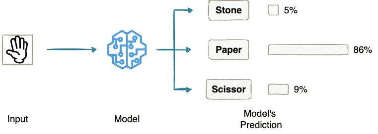
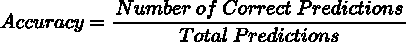
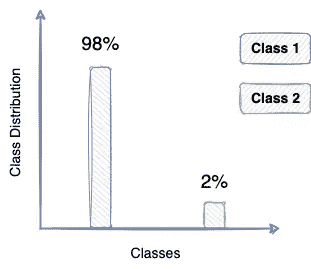
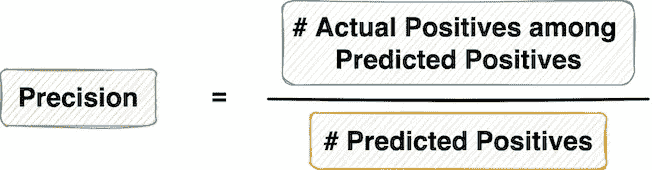
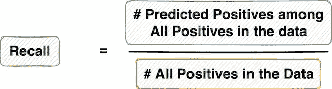
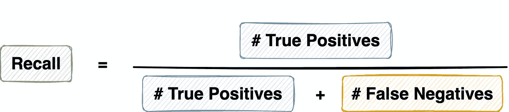
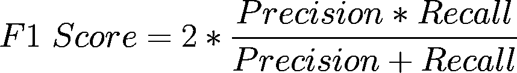

# 思维技巧，以前所未有的方式理解精确和回忆

> 原文：<https://towardsdatascience.com/the-mindset-technique-to-understand-precision-and-recall-like-never-before-1a4b80ac551b>

## 通过示例情况详细说明精确度和召回率


阿菲夫·库苏马在 [Unsplash](https://unsplash.com?utm_source=medium&utm_medium=referral) 上拍摄的照片

```
**·** [**Introduction**](#7597) **·** [**Precision and Recall**](#1ed1) **·** [**Precision**](#f471) **∘** [**Understanding the Precision Mindset**](#4915) **·** [**Recall**](#d519) **∘** [**Understanding the Recall Mindset**](#1398) **·** [**Precision vs Recall**](#ce2e) **·** [**Conclusion**](#9738)
```

# 介绍

利用一组正确的评估指标来评估数据驱动的**分类模型**的性能，对于构建和交付可靠的机器学习解决方案/产品来说非常重要。

顾名思义，分类模型是一类机器学习算法，专门用于预测给定输入的正确类别。



分类概述(按作者分类的图片)

马上，你会看到几乎每个机器学习工程师用来评估他们模型的标记性能的第一个性能指标是“准确性”——模型做出正确预测的百分比。



准确性公式(图片由作者提供)

简单的计算和可解释性使准确性成为最常用的性能指标之一。

然而，在实践中，准确性通常因为隐藏了关于模型性能的重要信息而臭名昭著。

这在不平衡数据的情况下变得尤其具有挑战性，在这种情况下，数据主要偏向特定的类。例如欺诈检测、垃圾邮件分类等。



班级分布示例(图片由作者提供)

在这种情况下，盲目地预测多数类，如上图所示，会导致 **98%** 的准确性——即使模型没有从数据中学到任何东西。

然而，这样一个简单的分类器并不适用于眼前的问题——这表明需要一个更好的性能指标。

介绍精确度和召回率！

# 精确度和召回率

在评估基于分类的机器学习模型的性能时，精确度和召回率是最常用的两个分类指标，尤其是在数据不平衡的情况下。

在不平衡数据的情况下，我们希望建模的主要是我们最感兴趣的少数阶级，并将其视为我们打算解决的问题。

在这方面，有利于少数类的预测通常被称为**正**预测，而有利于多数类的预测被称为**负**预测。


具有正负约定的类分布示例(图片由作者提供)

下图显示了一个流行的交叉列表，该列表显示了模型预测和地面真实标签:


在分类问题中将模型预测分类为 TP、TN、FP 和 FN(图片由作者提供)

先来了解一下精度。

# 精确

Precision 回答了以下问题:

> ****正面预测*** *实际正确的比例有多大？**

*从系统做出的所有**正面** **正面**预测池中，Precision 找到那些实际上是正面预测的分数。*

*例如，在电子邮件垃圾邮件分类器的情况下，如果系统将 10 封电子邮件分类为垃圾邮件(预测为肯定的)，但只有 5 封实际上是垃圾邮件(实际肯定的)，则精度为 **50%** 。*

**

*精度公式(图片由作者提供)*

*这里要注意的一点是，精度作为一种度量标准，只关注 ML 系统预测为阳性的那些样本(或数据点)。*

*因此，它忽略了被模型归类为负面的所有实际正面。*

*您也可以将精度定义为模型对所有正面预测的准确性。*

**

*精度公式(图片由作者提供)*

*总而言之，精度是指 ML 系统发现的阳性结果中实际阳性结果的比例。*

## *理解精准思维*

*当你遵循一种精确的思维模式时，你本质上向模型传达的是，不要浪费我的时间，通过产生假阳性来试图找到那里的每一个积极的东西。*

*相反，无论你做出什么积极的预测，实际上都应该是积极的。*

*换句话说，在这里，即使模型错过了一些实际的积极因素，并将它们归类为消极因素，只要积极的预测实际上是积极的，你也是平静的。*

*然而，让你愤怒的是那些实际上是负面的正面预测。*

*再次回顾电子邮件示例，如果您的目标是高精度，那么如果一封实际的垃圾邮件被归类为非垃圾邮件(实际的肯定预测为否定)也没问题。*

*但是，您不能容忍的是一封非垃圾邮件被标记为垃圾邮件。*

**

*精度公式(图片由作者提供)*

*考虑到上面的数学公式，提高精度的一种方法是尽可能降低“假阳性”。也就是说，拥有最少数量的实际上并不积极的积极预测。*

# *回忆*

*回忆回答了以下问题:*

> *模型正确识别实际阳性的比例是多少？*

*从**所有实际阳性**的池中，Recall 找到那些被模型分类为阳性的分数。*

*再举一个垃圾邮件分类器的例子，如果整个数据集中有 10 封垃圾邮件(实际为阳性)，并且模型将其中 7 封分类为垃圾邮件(预测为阳性)，则召回率为 **70%** 。*

**

*回忆的公式(作者图片)*

*这里要注意的一点是，作为一种度量，召回只关注那些在数据集中实际为阳性的样本(或数据点)。*

**

*回忆的公式(作者图片)*

*简而言之，您也可以将召回定义为模型对数据集中所有正面示例的准确性。*

## *理解回忆心态*

*在遵循回忆思维的同时，你本质上传达给模型的是从数据集中捕捉所有积极的例子。*

*换句话说，在这里，即使模型将一些原本是阴性的样本分类为阳性，只要它正确地对数据集中的所有阳性样本进行分类，您也不会感到不安。*

*然而，让你怒不可遏的是数据集中正面例子的错误分类。*

*再看一下电子邮件的例子，如果你的目标是高召回率而不是精确度，那么只要所有实际的垃圾邮件被捕获，非垃圾邮件被归类为垃圾邮件也没问题。*

*然而，你不能容忍的是错过任何真正的垃圾邮件。*

**

*回忆的公式(作者图片)*

*考虑到上面的数学公式，提高召回率的一个方法是尽可能降低“假阴性”。也就是说，拥有最少数量的实际上是正面的负面预测。*

# *精确度与召回率*

*总结一下:*

*   *一个具有高精度的系统可能会遗漏一些实际的正类，但是它想要返回的是正类的高精度。*
*   *另一方面，一个具有高召回率的系统可能会给你许多实际否定的错误分类，但它几乎总是会从数据集中正确地分类实际肯定。*

*选择哪一个是一个艰难的决定，完全取决于你使用机器学习解决的问题。*

*一般来说，优化精度通常会降低召回率，反之亦然。因此，许多应用程序考虑从精确度和召回率(称为 F-score)中导出的度量来测量机器学习情况的性能。*

**

*F1 分数的公式(图片由作者提供)*

*下面，让我们考虑一些示例情况，以决定在精确度和召回率中您应该更喜欢哪个指标，以及为什么。*

## *情况 1*

*假设你正在建立一个课程推荐系统。这个想法是根据学生的个人资料向他们推荐课程。*

*一个学生的时间很关键；因此，你不想浪费他们宝贵的时间推荐他们可能不喜欢或不相关的课程。*

*你会优化什么？精准还是召回？*

## *回答:*

*在我看来，精度是你应该更喜欢优化的。不推荐好的课程是可以的。*

*然而，你的系统推荐的应该是高质量的，因为学生不应该花时间看与他们无关的课程。*

## *情况 2*

*接下来，假设您要列出一个职位空缺的候选人名单，看看他们是否应该被选中参加面试。由于您的组织正在寻找有才华的候选人，您不想错过可能成为潜在雇员的候选人。*

*你现在会优化什么？精准还是召回？*

## *回答:*

*拥有没有经验或不相关的候选人不会有什么坏处，只要你抓住所有相关和有才华的人。*

*因此，召回是您应该优化的指标。如果你改为优化精度，有可能排除有才华的候选人，这是不可取的。*

## *场景 3(承蒙:凯西·科济尔科夫)*

*假设你是一个小偷，你闯入了一所房子。你的目标是抢劫金钱、珠宝和所有你认为“有价值”的东西*

*抢的时候，你是精准思维还是回忆思维？*

*请在回复中张贴您的答案！*

## *情况 4*

*我们都在一起玩过，不是吗？*

*如果不是，目的是在一组玩家中识别出冒名顶替者。*

*你会用精确思维还是回忆思维来玩这个游戏？*

*请在回复中告诉我！*

# *结论*

*精确度和召回率之间的选择可能是高度主观的，它完全取决于您正在构建的应用程序，同时考虑什么对您的业务/个人用例有价值。*

*如果您想要高质量的结果，并且您接受错过一些好的项目，请选择 Precision。*

*如果你想要所有的好结果，选择回忆，但是同时，你不介意任何错误的分类作为好结果中的冒名顶替者。*

*如果两者对您的业务问题都有价值，请选择两者(F-measure)。或者，从其他广泛使用的性能指标中进行选择，或者为您自己的问题设计一个。*

***感谢阅读！***

*[🧑‍💻**成为数据科学专家！获取包含 450 多个熊猫、NumPy 和 SQL 问题的免费数据科学掌握工具包。**](https://subscribepage.io/450q)*

*✉️ [**注册我的电子邮件列表**](https://medium.com/subscribe/@avi_chawla) 不要错过另一篇关于数据科学指南、技巧和提示、机器学习、SQL、Python 等的文章。Medium 会将我的下一篇文章直接发送到你的收件箱。*

**

*Osita meme(作者 Gif)*