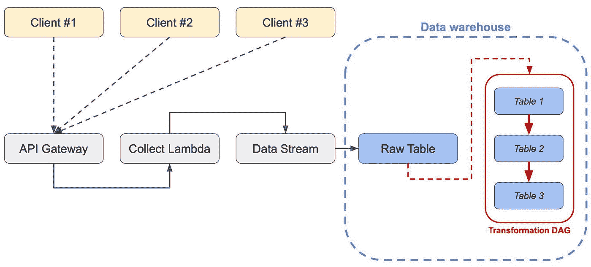
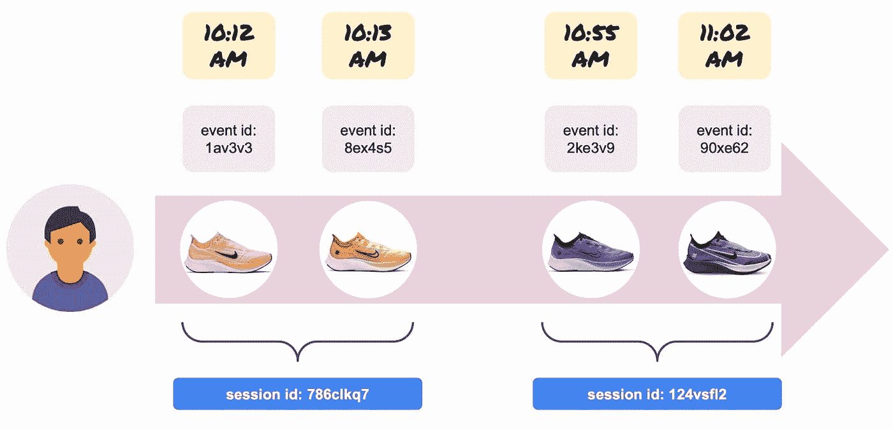
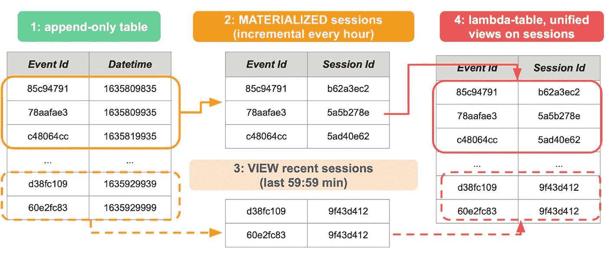

# 现代数据模式

> 原文：<https://towardsdatascience.com/the-modern-data-pattern-d34d42216c81>

## [在启动阶段有效地进行 ML](https://towardsdatascience.com/tagged/mlops-without-much-ops)

# 现代数据模式

## 利用无服务器、雪花和 dbt 实现可重复的大规模数据处理和接收

没有太多操作的 MLOps 第 4 集，壮举。[雅格布·塔利亚布埃](https://medium.com/@jacopotagliabue)、[西罗·格列柯](https://medium.com/@ciro.greco)和[安德里亚·波洛尼奥利](https://medium.com/@apolonioli)

## **简介**

正如我们在[前几集](/hagakure-for-mlops-the-four-pillars-of-ml-at-reasonable-scale-5a09bd073da)中所讨论的，数据是 ML 管道不可或缺的一部分:遵循以数据为中心的方法，然后稍微概括一下，我们可以说一个数据公司的健全管道由两个主要部分组成，数据操作(摄取、标准化、准备、可视化、监控等。)，以及 MLOps(培训、测试、部署、监控等)。).

在一些哲学文章之后，我们回到了实际的(开源)代码(是啊是啊，“空谈是廉价的，给我看看代码”)。我们将展示如何使用开源和 PaaS/SaaS 技术的组合来摄取、存储和转换数据:遵循我们的信条——“m lops without more Ops”——我们提供一个即插即用的模板，在“合理的规模”上对万亿字节的数据进行了尝试和测试。

我们利用三种主要技术:

*   *Pulumi* ，它允许我们管理代码形式的基础设施(在 Python 中)。
*   *雪花*，它允许我们存储原始数据，并通过强大的查询来操纵它，抽象出分布式计算的复杂性。
*   *dbt* ，它允许我们将数据转换定义为版本化的、可重放的 Dag，以及混合匹配的物化策略，以满足我们的需求。

虽然我们提出了一个非玩具电子商务场景的工作管道(以立即利用我们的[真实世界开放数据集](https://github.com/coveooss/SIGIR-ecom-data-challenge)和[经验](https://dl.acm.org/doi/10.1145/3460231.3474604))，但我们分享的一切都很容易适用于大量的用例:即使是中等规模的商店也可以生产和运行复杂的 ML 流程，我们发现通过电子商务技术栏的工具通常在大多数行业中表现良好。

[克隆 repo](https://github.com/jacopotagliabue/paas-data-ingestion) ，跟着做:我们首先向完全陌生的读者展示基本块，然后展示更高级的模式，以展示更高级用例中的堆栈灵活性。

## **版本数据，而不仅仅是代码**

为了做好准备并阐明一些初步观点，让我们想象一个典型的电子商务用例，即为*myshop.com*提供推荐(推荐是一种常见的数据驱动功能，大多数从业者应该能够很容易地想象自己处于我们的位置)。

在讨论摄取本身之前，我们想确定一个更*一般*的模式是清楚的。每天，*myshop.com*都会向我们提供其库存的数据转储，即 *myshop* 当天在售的所有产品。因此，在第一天，我们收到这些产品:

```
+------------+-------+--------------------+
| PRODUCT ID | PRICE |       COLORS       |
+------------+-------+--------------------+
|        123 |    12 | Blue / White       |
|        456 |    45 | Black              |
|        789 |    33 | Red / Blue / White |
+------------+-------+--------------------+
```

在第二天，我们收到了一个略有不同的目录:456 现在有更多的颜色，789 的价格稍低:

```
+------------+-------+--------------------+
| PRODUCT ID | PRICE |       COLORS       |
+------------+-------+--------------------+
|        123 |    12 | Blue / White       |
|        456 |    45 | Black / **Blue**       |
|        789 |    **28** | Red / Blue / White |
+------------+-------+--------------------+
```

*获取和存储这些信息的正确方式是什么？“朴素 ETL”方式将有一个存储位置——比方说，一个表、Elasticsearch 中的一个索引等等。—包含 *myshop* 的产品:当收到第 2 天的目录转储时，相应的项目会被更新/覆盖，因此我们始终保证使用“最新”的版本。虽然这听起来很吸引人，但它有一个主要缺点:*它永远摧毁了过去*，因为现在，在第 2 天，没有简单的方法来恢复 456 的原始颜色。这有几个含义:*

*   我们不能在我们的数据堆栈中进行“时间旅行”:我们不能在数据驱动的系统中调试上周的错误，该系统的输入是目录——数据现在可能已经改变，并且再现系统的状态是不可能的；
*   由于失去了对原始状态的跟踪，任何更新或修改都很难撤销，以防业务逻辑出错；
*   测试新代码并对其进行迭代变得更加困难，因为不同的运行会产生略微不同的结果。

一个更好的模式是只追加日志模式，即维护一个只写的表，该表在一个不可变的分类帐中存储与我们在其中运营的宇宙相关的所有数据(在本例中，是 *myshop* 的电子商务数据):由于我们不能改变过去，我们类似日志的表将是我们在任何给定时间点的宇宙状态的永久记忆。实际上，这意味着在第 2 天有类似下面的原始表:

```
+------------+-----+--------------------------------------------+
|  TIMESTAMP | PID |                    RAW                     |
+------------+-----+--------------------------------------------+
| 1638139610 | 123 | {"price":12,"colors":"Blue / White"}       |
| 1638139610 | 456 | {"price":45,"colors":"Black"}              |
| 1638139610 | 789 | {"price":33,"colors":"Red / Blue / White"} |
| 1638226021 | 123 | {"price":12,"colors":"Blue / White"}       |
| 1638226021 | 456 | {"price":45,"colors":"Black / Blue"}       |
| 1638226021 | 789 | {"price":28,"colors":"Red / Blue / White"} |
+------------+-----+--------------------------------------------+
```

时间戳将事件(在本例中，是产品及其元数据的摄取)放入分类帐中，原始数据作为 JSON 转储:product 789 有两行——每个摄取事件一行——和预期的一样，有两个相关的元数据集合。从*这个表示*，总是可以将“第 2 天表格”恢复为这个流的*视图，也就是说，捕捉每个产品的最新信息的“照片”。但是拥有最新的表并不会破坏以前的信息，就像运行从 git 获取的最新代码不会破坏以前的版本一样:这种结构在我们的产品堆栈中被昵称为“git for products”并不是偶然的。*

当然，结合永无止境的日志表和实用的快照，捕捉宇宙在特定时间点的状态，现在比以前更容易实现*的方式，这是三个主要趋势的结果:*

1.  数据存储越来越便宜，
2.  现代数据仓库具有卓越的查询性能和强大的 JSON 支持，
3.  像 dbt 这样的开源工具使得拥有广泛技能的人更容易以版本化、可重复、可测试的方式转换数据。

## **建造 noOps 摄取平台**

既然已经解释了 log+snapshot 模式，我们可以更深入地研究这个项目:虽然我们将细节留给了 repo，但是提供工具和功能层的高级概述是很有用的。摄取管道模拟了数据驱动应用程序的典型数据流:客户端发送事件，端点收集事件并将其转储到流中，最后数据仓库存储事件以供进一步处理。



*摄取管道的功能概述:*我们使用 AWS lambda 作为端点，AWS firehose 作为流，雪花作为数据仓库，dbt 组织 DAG。整个基础设施由 Pulumi *用代码管理(图片由作者提供)。*

在我们的示例中，我们为*myshop.com*提供建议，因此:

*   发送事件的客户端是购物者浏览器:当用户在*myshop.com*上浏览产品时，一个 Javascript SDK 向我们的端点发送分析，以收集行为信号(稍后将用于我们的推荐器！).为了模拟这些现场事件，存储库包含了一个 *pumper* 脚本，它将真实的有效负载传输到云；
*   端点用一个*像素*进行响应，这是一个用于处理客户端-服务器跟踪的 1x1 透明 gif(例如 Google Analytics)；
*   行为信号被转储到雪花中的原始表中；
*   SQL 驱动的转换(通过 dbt)获取原始事件并构建特性、中间聚合、规范化视图等。虽然详细描述下游应用超出了本文的范围(但请参见[这个](https://github.com/jacopotagliabue/you-dont-need-a-bigger-boat)的详细示例)，您可以想象人工智能工具和 ML 管道使用这些精心准备的表格作为自己工作流的输入。

像往常一样，我们想指出的是*没有 devOps 的人因为运行这个平台而受到伤害(甚至被叫去):端点以一种无服务器的方式运行，并且由于 AWS lambda 将自动扩展(同样适用于 Firehose 上的数据流)；如果需要，雪花计算能力可以根据查询*调整*，无需任何维护或神秘配置(火花，想到你了！);dbt 流可以在 SaaS orchestrator(例如，Prefect)中运行，甚至可以通过“本地”dbt 云运行。*

> 我们的建议再次处于中间位置，介于运行“不可能的规模”负载的技术巨头的定制基础设施和对可用功能几乎没有控制的整体端到端企业平台之间。

我们将底层基础设施层交给第三方，这并不需要花费太多时间，但是它是无限可扩展的，因为当我们达到另一个规模或大幅改变我们的需求时，我们可以挑选不同的工具(例如，用 Kafka 切换消防软管，运行您自己的 dbt 作业，等等)。).

换句话说，对于快速增长的公司来说，完整的“消化故事”不太可能就此结束，但可以肯定的是，这是一个从*开始的好地方*。

## **奖励:在一个堆栈中重新创建 lambda 架构**

在大数据时代， [lambda 架构](https://en.wikipedia.org/wiki/Lambda_architecture) (to *not* 与 AWS 或 Python lambdas 混淆！)是数据驱动型应用程序的流行解决方案，在这些应用程序中，历史数据(过去 30 天的聚合和计数)和新数据(过去一小时的聚合和计数)对于可视化、监控或 ML 目的都很重要。简而言之，您并行运行批处理和流式系统，并为下游客户连接结果:仪表板将通过读取部分由慢速批处理和快速流式处理构建的表格来呈现收入趋势。Lambdas 的影响力有所减弱，一方面，许多批评者提倡不涉及维护事实上的两个堆栈的更精简的解决方案，另一方面，今天很多 ML 仍然没有真正使用实时数据——即使使用，也经常是“[在线预测和批量特性](https://huyenchip.com/2022/01/02/real-time-machine-learning-challenges-and-solutions.html#session-based-prediction)”的场景。我们还能再做一次 lambda 梦，并利用现代数据堆栈来得到蛋糕并吃掉它吗？

再次考虑用户分析中的一个流行问题，即会话化，即获取原始事件流，按用户对其进行划分，然后根据某个时间阈值对连续活动窗口(“会话”)中的事件进行分组的问题。例如，下图中的购物者在*myshop.com*上与四双运动鞋进行了互动:



*会话化示例:行为事件基于时间戳临时聚合(图片由作者提供)。*

在摄取时(上面灰色框中的原始事件)，管道在四个交互之间没有区别；会话化稍后的工作是根据 30 分钟的阈值将这些交互分组为两个会话，就像在 Google Analytics 中一样:因为第二次和第三次交互之间有超过 30 分钟(42)，所以第三次事件标志着购物者新会话的开始。

在后端，会话化需要一些繁重的窗口函数，所以我们喜欢在没有太多延迟约束的情况下批量运行计算；另一方面，如果最近的事件(例如会话计数)在堆栈中仍然是可操作的，那就更好了。下面的程式化流程展示了如何重用我们之前介绍过的相同概念——仅附加表、基于 DAG 的处理、物化视图和运行时视图等。—用单个堆栈解决λ难题*。*



一个风格化的 lamba 实例，带有物化的表和视图(图片由作者提供)。

直觉上，不断增长的日志表(绿色)在逻辑上可以分为两部分:遥远的过去(橙色)，不可改变，并且已经为其一劳永逸地分配了会话；以及最近的过去(粉色)，其中新事件仍在不断出现，事物仍在不断变化。然后，我们可以在一个堆栈中运行相同的 SQL 逻辑，从而避免了原始 lambda 架构的两大缺点。dbt 使表达模式变得容易，然后利用最终的下游表(red)将两个会话化表统一为一个最佳记录集，用于下游应用程序，如我们的内部度量仪表板，或现在能够根据新数据重新训练的 ML 模型。

虽然这种模式不会取代成熟的低延迟流解决方案，但它开启了对 TB 级数据进行几乎实时(约 5 分钟)分析的可能性，其规模和速度是原始 lambda 架构及其复杂性只能梦想的。

> 如果您已经采用了 Snowlake、dbt 和 log 模式，它还可以帮助您以一种温和的方式弥合批处理和实时之间的差距，然后再投资一个并行堆栈来进行流式传输，如果您的可接受延迟是以分钟为单位来衡量的，则您可能不需要该堆栈。

正如我们在上面强调的，这可能不是您数据之旅的终点，但可能是一个起点:这是该领域取得的令人难以置信的进步的又一证明，如此复杂的转换现在可以由一个小团队大规模运行，几乎没有前期基础架构支出。

## 下一步是什么？

一旦所有的数据都被清理、标准化并处于正确的位置(只有到那时)，大规模的高效机器学习才能发生。在我们系列的下一集[中，我们将从我们离开这里的地方(也就是说，在数据仓库中)开始，并讨论现代 ML 工具如何能够让您立即从数据到 API。](https://towardsdatascience.com/tagged/mlops-without-much-ops)

如果你喜欢这篇博文，请[在 Github](https://github.com/jacopotagliabue/paas-data-ingestion) 上加一颗星，分享给你的团队:和往常一样，我们欢迎其他做“合理规模的 ML”的同行的任何反馈、评论和战争故事。

## **致谢**

感谢 [Fabio Melen](https://www.linkedin.com/in/fabiomelen/) ， [Amir Sadoughi](https://www.linkedin.com/in/asadoughi/) ， [Chip Huyen](https://www.linkedin.com/in/chiphuyen/) ，[钟真徐](https://www.linkedin.com/in/zhenzhong-xu-0243003/)， [Ryan Vilim](https://www.linkedin.com/in/ryanvilim/) ， [Leopoldo Garcia Vargas](https://www.linkedin.com/in/leopoldo-garcia-vargas-29932a89/) 对本项目的宝贵反馈。