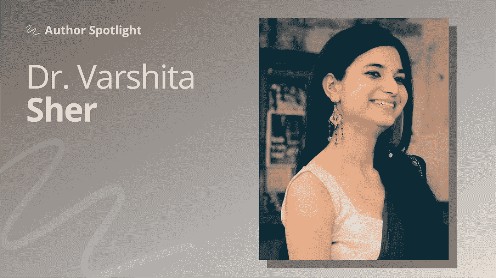

# 你写得越多，你就越能更好地解释你的工作

> 原文：<https://towardsdatascience.com/the-more-you-write-the-better-you-are-at-explaining-your-work-708be316defc>

## [作者聚焦](https://towardsdatascience.com/tagged/author-spotlights)

## 瓦什塔·谢尔博士:“我对完全初学者的第一个建议是从任何地方开始。”

*在 Author Spotlight 系列中，TDS 编辑与我们社区的成员谈论他们在数据科学领域的职业道路、他们的写作以及他们的灵感来源。今天，我们很高兴与* [*瓦什塔·谢尔*](https://medium.com/u/f8ca36def59?source=post_page-----708be316defc--------------------------------) *博士分享我们的对话。*

*谢尔博士目前在艾伦图灵研究所应用研究中心担任数据科学家，利用深度学习技术解决 NLP 和计算机视觉领域的问题。她拥有牛津大学的计算机科学硕士学位和西蒙弗雷泽大学的学习分析博士学位。她在过去八年中的工作重点是 AI/ML 算法在无数领域的研究和实施的交叉，包括教育科技、金融科技和医疗保健。*

## **是什么激励你选择目前的职业道路？**

我从小就对数学和统计学非常感兴趣，从解决数独谜题和魔方到代数、微积分等等。直到我在硕士论文(人机交互和视觉分析)期间开始研究大数据可视化，我才真正意识到数据的力量，以及视觉如何在揭示模式和见解方面如此有用。

我现在意识到，data viz 只是广泛的数据科学光谱的一个子集，但这个冰山一角足以激起我对该领域的兴趣。

硕士毕业后，我有机会参与一个欧盟项目，其中包括建立一个复杂的仪表板，并进行自然主义用户研究，以评估其对公众的可用性。就在那时，我知道数据是我真正的使命。我喜欢从数据挖掘到 EDA(探索性数据分析)再到建模的整个过程的创造性。此后，我又转向了核心 ML 和(最近)DL 领域，但我最喜欢的是，没有一种适用于所有数据类型和所有问题陈述的通用方法。

## 在这一过程中，您是否发现数据科学的任何方面特别难以解决？

在我开始 DS 之旅的时候，我发现对要学习的东西和概念进行优先排序是一个挑战。如您所知，DS 领域一直在不断发展，知道从哪里开始会让人不知所措。直到我决定接触一些数据集，我才意识到有重复出现的主题，以至于我能够将概念和技术放入“必须知道”、“可能知道”和“应该知道”的桶中。

## 如今你更喜欢关注什么样的项目？

虽然数据科学是解决复杂问题的不可思议的工具，但我在简单中发现了美。因此，对我来说，DSSG(社会公益数据科学)项目是最有趣的阅读项目之一。对于那些感兴趣的人来说， [Datakind](https://www.datakind.org/) 在这个领域做得非常出色，该团队一直在做的一些项目也非常出色。我想到的一个是[利用卫星图像自动识别村庄](https://www.datakind.org/projects/using-the-simple-to-be-radical/)来分配资金帮助。这是因为与乡村里那些有金属屋顶的家庭相比，有茅草屋顶的家庭通常更穷。

所有这些项目的一个共同主题是，它不是关于实现最复杂的算法，而是关于通过探索性分析找到洞察力，完成工作，并看到及时的影响。

## 你认为有什么特别有前途的领域吗？

我很高兴看到包容性的 ML 和 DS 技术。例如，最先进的自然语言处理模型大多是用英语训练的，但其他语言和方言无法利用类似 GPT 的模型。Prompt engineering 是另一个需要注意的领域，因为与大多数类似 GPT 的模型的交互对措辞或措辞很敏感，有时需要反复试验才能表现良好。

## **在非常忙碌的工作生活中，你为什么决定开始** [**公开撰写**](https://varshitasher.medium.com/) **关于数据相关的话题？**

我开始写作主要是在疫情时期。写作是记录我为未来学习的一切的一种方式。这一点直到今天仍然成立——我想没有人比我读我的文章读得更多！

我希望我的写作风格清晰，没有专业术语，容易理解(至少对我来说)，这就是为什么我能够如此轻松地开始写作。随着时间的推移，写作成了我测试自己对某个特定话题理解程度的一种方式——因为除非你能以 ELI5(像我一样解释)的方式解释某事，否则你自己真的能理解吗？

## 你在图灵研究所的工作会影响你在 TDS 上为更广泛的读者写的文章吗？

事实上，恰恰相反。我倾向于写一些主题，这些主题更广泛地适用于和我不在同一个部门工作的人。这非常有用，因为可转移技能在数据科学领域非常重要。然而，我应该提到，我的一些更受欢迎的帖子是基于我在典型的一天工作中遇到的事情——导入文件、git 提交、设置虚拟环境等。

## **你如何决定你要写的主题？如果有人想写自己的作品，但又不知道从何下手，你会给他们什么建议？**

我对质量重于数量有严格的政策。所以，在我开始写作之前，我会快速浏览一下潜在主题的谷歌搜索结果。如果找不到相关的东西，我就开始写*或者*，如果我觉得我可以通过写作更好地解释它。此外，我也有一些我完全信任的博客和虚拟博客，如 [MachineLearningMastery](https://machinelearningmastery.com/) 、 [Jay Allamar 的博客](https://jalammar.github.io/)、 [Yannic Kilcher](https://www.youtube.com/c/YannicKilcher/about) 、 [Aleksa Gordic](https://www.youtube.com/c/TheAIEpiphany/about) 等。，在我开始写作之前，我侦察这些。这对我来说是有意义的，因为如果有人已经用我只能想象的方式解释了一切，我看不出增加过多资源有什么意义——事实上，我宁愿让我的读者知道。

说了这么多，我对完全初学者的第一个建议是从任何地方开始——不管关于这个主题已经写了多少，不管你的文章有多长，不管你认为它会被你的读者接受到什么程度。选择一个你有信心向你的父母、兄弟姐妹或朋友解释的话题，然后写下来。

这个主题甚至不必是一个成熟的算法(对我来说，它是解释一个 p 值应该如何解释)；它可能是小众的，比如一个常见的运行时错误(你可以在 GitHub 问题中找到很多)和它的修复。如果选择一个主题似乎很难，选择一种数据形式(图像、音频、视频等。)并收集一些局外人应该了解的常用分析技术。例如，计算机视觉中的数据增强技术。

很快你就会意识到:你写得越多，你就越能更好地解释你的工作。这是你在面试中绝对应该提到的良好沟通技巧的例子。

## **作为一个着眼于未来的话题，您希望在未来几年内看到数据科学领域的哪些变化？**

我认为，在未来几年中，有希望为医疗保健、自动驾驶汽车等高风险领域使用的 ML 模型制定 FDA 级评估协议。就在上个月，[美国政府处罚了一家应用程序供应商](https://www.protocol.com/policy/ftc-algorithm-destroy-data-privacy)，因为其构建的算法违反了数据收集法律。

类似的措施将被证明对在这些系统中嵌入信任非常有用，并允许在事情变糟时进行适当的审计。XAI(可解释的人工智能)已经为解码这些黑盒模型铺平了道路，但它仍然有很长的路要走。

我也很高兴看到这个领域摆脱了更大的模型导致更好的结果的趋势，并希望看到更多类似 GPT 3 或武道 2.0 的模型，它们要小一个数量级。至于登月一厢情愿的想法，我也很兴奋地看到雷·库兹韦尔关于奇点(当机器变得比人更聪明时，人工智能的人类级思维能力)[的预测是否会在我们的有生之年](https://research.aimultiple.com/artificial-general-intelligence-singularity-timing/)发生。

要探索谢尔博士的工作，你可以在 [Medium](https://varshitasher.medium.com/) 、 [Twitter](https://twitter.com/vishi222) 和 [LinkedIn](https://www.linkedin.com/in/varshitasher) 上关注她。如果你想深入了解她的作品，这里有一些她杰出的 TDS 文章:

*   [**如何在 VSCode 中充分利用你的 Python 调试器**](/how-to-make-most-of-your-python-debugger-in-vscode-9e05dfce533f)(2022 年 2 月，12 分钟)
*   [**数据科学家用 Python 高效编码指南**](/data-scientists-guide-to-efficient-coding-in-python-670c78a7bf79)**(2021 年 7 月，11 分钟)**
*   **[**Git 命令科学家日常使用的数据**](/git-commands-data-scientists-use-on-a-day-to-day-basis-40d588cd63f7)(2021 年 4 月，19 分钟)**
*   ****端到端深度学习项目、** [**第一部分**](/end-to-end-deep-learning-project-part-1-930af1e1e191)**(2021 年 11 月 19 分钟)和 [**第二部分**](/deploying-an-end-to-end-deep-learning-project-with-few-clicks-part-2-89009cff6f16)(2021 年 11 月 8 分钟)****

****想和广大观众分享一些你自己的作品吗？我们很乐意收到你的来信。****

*****这个 Q & A 是为了长度和清晰而稍加编辑的。*****