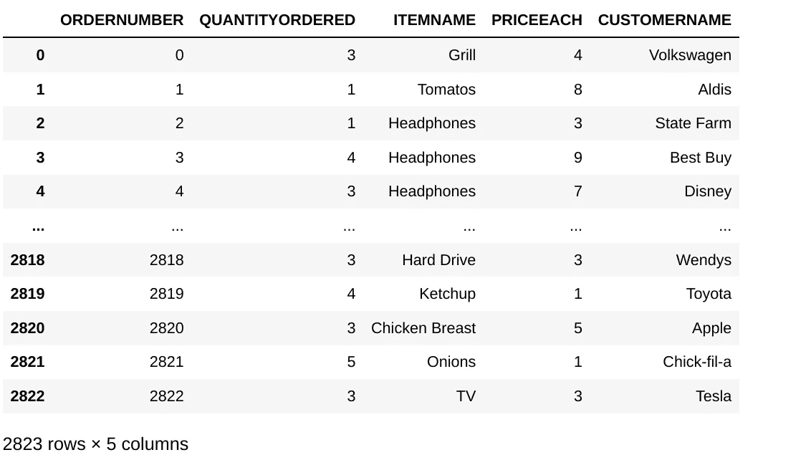
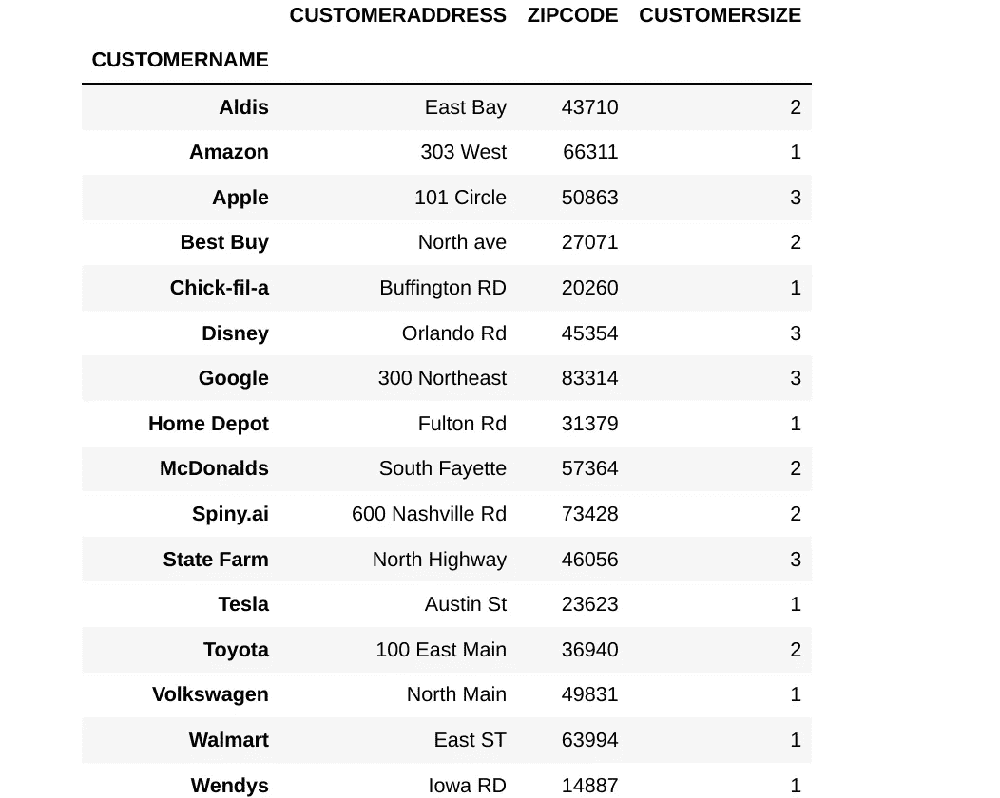

# 我一直在合并熊猫数据帧，完全错了

> 原文：<https://towardsdatascience.com/the-most-efficient-way-to-merge-join-pandas-dataframes-7576e8b6c5c>

## 为什么几乎每个人都在低效地写它们，以及一些解决它的技巧！


卡斯帕·卡米尔·鲁宾在 [Unsplash](https://unsplash.com?utm_source=medium&utm_medium=referral) 上的照片

对于大多数数据科学家来说，更令人困惑的熊猫概念之一是熊猫合并和熊猫加入之间的区别。大多数人亲自告诉我“使用合并就好了”，网上很少有资源解释哪一个肯定更好。正因为如此，我决定对这两个功能进行压力测试，在我的结果中…我意识到我多年来一直在错误地合并。

## 设置问题

为了测试这个问题，我创建了一个 2823 行 8 列的假销售数据数据帧。因为我想测试合并，所以我将简单地将这个单个数据帧转换成 2 个更精简格式的数据帧。从 SQL 表中提取数据时可能会看到的格式。其中一个表是 Orders，由 ORDERNUMBER 字段索引，另一个表是 Customers 表，由 CUSTOMERNAME 索引，包含关于客户的所有元数据。我们的目标是连接这两个表，以确定每个订单应该运送到哪里。它们唯一重叠的列是 CUSTOMERNAME 字段。下面的代码显示了我是如何执行分割的！

```
#Create the dataframe (random lists not shown, in github)
df = pd.DataFrame(index=range(2823),columns=["ORDERNUMBER", "QUANTITYORDERED", "ITEMNAME", "PRICEEACH", "CUSTOMERNAME", "CUSTOMERADDRESS"])df["ORDERNUMBER"] = df.index
df["QUANTITYORDERED"] = np.random.randint(1, 6, df.shape[0])
df["ITEMNAME"] = np.random.choice(list(item_ordered), len(df))
df["PRICEEACH"] = np.random.randint(1, 10, df.shape[0])
df["CUSTOMERNAME"] = np.random.choice(list(customers), len(df))
df["CUSTOMERADDRESS"] = df['CUSTOMERNAME'].map(customers)
df.set_index("ORDERNUMBER")#create the ORDERS table, selecting the first 4columns
df_orders = df.iloc[:, : 4]#Create the CUSTOMERS table by selecting the last columns and indexing by unique customers
df_unique_customers = df.iloc[:, 4:]
df_unique_customers = df_unique_customers.groupby("CUSTOMERNAME").first()#Create a duplicate of the customer dataframe, but indexed from 0 instead of by customer (for testing)
df_unique_customers_unindexed = df_unique_customers.reset_index()
```

您会注意到，我还创建了一个客户数据框的副本，它的索引为 0，而不是用于测试目的的客户索引。以下是我们的数据框的示例！(你也可以在这里查看完整的笔记本)



按作者排序数据框|图像



客户数据框|作者图片

## 合并与连接

除了语法之外，表面上的差异并不显著。 [Join](https://pandas.pydata.org/docs/reference/api/pandas.DataFrame.join.html) 充当连接两个数据帧的方法，但它只对正确数据帧的索引起作用。对于左侧数据框，可以选择左侧索引或列(在我们的示例中我们需要使用列，因为客户在我们的订单数据框中不是唯一的)。

[合并](https://pandas.pydata.org/docs/reference/api/pandas.DataFrame.merge.html)本质上是一样的东西，但是更加灵活。可以在任一数据框中指定用于连接的任何列或索引。本质上，就语法而言，merge 只是一个更易于使用的连接。但这并不一定适用于他们的表现。

对于这个例子，我想执行一个左连接，左边是订单数据框，右边是客户数据框。我能够用 1 种方式用 Join 正确地做到这一点，用 4 种方式用 merge 做到这一点。如果您不熟悉不同类型的联接之间的区别，[这里有一个复习工具](https://www.w3schools.com/sql/sql_join.asp)！(或者，如果你正在寻找一个完整的课程，[试试这个](https://datasciencedojo.com/python-for-data-science/?ref=jdibattista3)

为了测试这些不同连接的熟练程度，我将在一个循环中运行每个连接 10000 次，以获得一个连接的平均成本。

## 执行左连接/合并的 5 种方式

首先，我将从几个合并开始，因为这是非常容易产生低效查询的地方

## 错误的合并方式—在非索引列上合并

*   df_combined = df_orders。**合并**(df _ unique _ customers _ un indexed，how='left '，on="CUSTOMERNAME ")

```
Time for 10000 joins
18.28343653678894
average time per join
0.001828343653678894
```

*   df_combined = df_orders。**合并**(df _ unique _ customers _ un indexed，how='left '，left_on="CUSTOMERNAME "，right_on="CUSTOMERNAME ")

```
Time for 10000 joins
18.183201789855957
average time per join
0.0018183201789855957
```

以上两种方法都从每个表中选择列 CUSTOMERNAME。这是相当简单的，我假设大多数人使用合并，以及人们如何在合并时失去很多速度。这些通常是等价的查询，底部给出了相当一致的 1–2%的提升。

根据一般经验，使用非索引列确实会导致相当大的速度损失，我们将在下面的合并中解决这个问题。

## 莫名其妙的次优方式

*   df_combined = df_orders。**合并** (df_unique_customers，how='left '，on="CUSTOMERNAME ")

```
Time for 10000 joins
16.125476121902466
average time per join
0.0016125476121902466
```

通过简单地为我们计划加入的列设置索引(可以使用 set_index(“客户名称”)来完成)，我们看到速度比没有索引的列立即提高了 10–15%。

但是，因为 merge 必须推断“on”是指列还是索引，所以这仍然不是最理想的，而且我和大多数人都认为，**从来不知道**！我在任何地方都没有看到这种解释，通过避免这种情况，您可以创建下面的最佳查询！

## 最快的方法

*   df_combined = df_orders。**合并** (df_unique_customers，how='left '，left_on="CUSTOMERNAME "，right_index=True)

```
Time for 10000 joins
14.555766582489014
average time per join
0.0014555766582489014
```

*   df_combined = df_orders。**加入** (df_unique_customers，on="CUSTOMERNAME "，how="left ")

```
Time for 10000 joins
14.551718711853027
average time per join
0.0014551718711853028
```

最后，我们得出了正确且最快的编写连接的方法。事实证明，如果语法是最优的，那么 join 的性能总是很好，merge 的性能几乎完全相同。编写完美的查询比没有索引的查询提高了 20%以上，比正确索引但编写糟糕的查询提高了 10%。

## 结论

如果您可以编写一个 join 语句，我建议您这样做，因为它几乎可以保证最佳的性能。

然而，这并不意味着合并没有用。当左右两列都不唯一，因此不能作为索引时，可以使用 Merge。只要满足以下条件，合并也和联接一样有效:

1.  如果可能的话，在索引上进行合并
2.  避免了“on”参数，取而代之的是，使用关键字 left_on、left_index、right_on 和 right_index(如果适用)显式地*声明要合并的两列。*

我希望这篇短文能帮助你加快加入熊猫的步伐！如果您认为需要回来参考，请务必保存/标记该故事！如果你喜欢这篇文章，欢迎[关注我](https://jerdibattista.medium.com/)，阅读我写的更多内容。我倾向于每个月深入一个主题一次，这通常涉及数据科学技巧、新的包或 ML 空间中我认为需要更好解释的任何东西！

[](/the-most-efficient-if-elif-else-in-pandas-d4a7d4502d50) [## 熊猫中效率最高的 if-elif-else

### 以及为什么你写的效率很低

towardsdatascience.com](/the-most-efficient-if-elif-else-in-pandas-d4a7d4502d50)