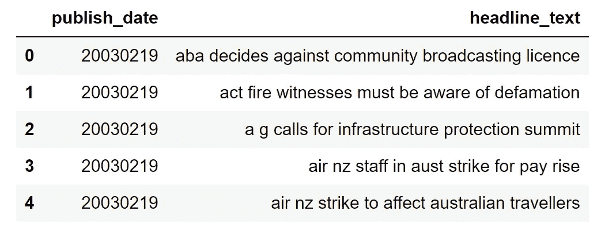
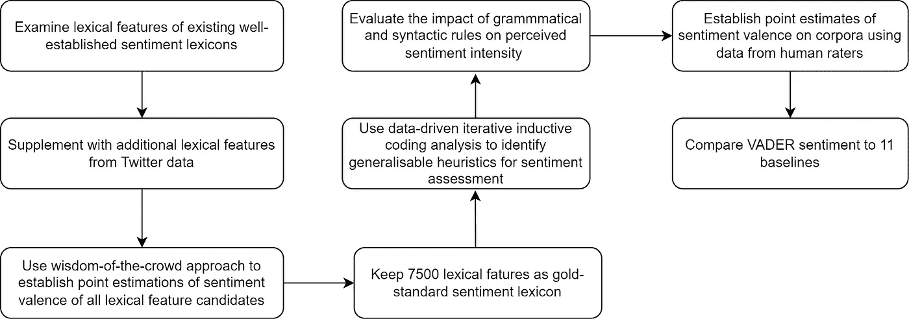
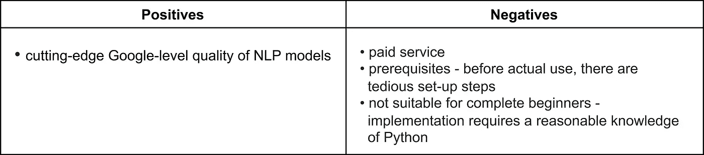
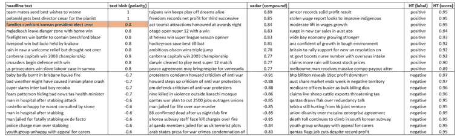

# Python 中最受欢迎的预训练情感分类器

> 原文：<https://towardsdatascience.com/the-most-favorable-pre-trained-sentiment-classifiers-in-python-9107c06442c6>

## 考察 Vader、Happy Transformer、TextBlob 和 Google NL API 的性能，讨论它们的局限性和选择最佳应用的技巧

马克·戴恩斯在 [Unsplash](https://unsplash.com?utm_source=medium&utm_medium=referral) 上的照片

情感分析是自然语言处理(NLP)中的一个大领域，它使用技术从文本数据中识别、提取和量化情感。在公司中，情绪分析方法有助于自动理解客户反馈，评估社交媒体对话，还可能有助于优先考虑与客户关怀部门的客户沟通。

在过去的一二十年里，自然语言处理和情感研究也融合了 A 级杂志中的经济研究。[例如，Antweiler 和 Frank (2005)](https://onlinelibrary.wiley.com/doi/abs/10.1111/j.1540-6261.2004.00662.x) 对互联网股票留言板上发布的信息内容进行了量化。 [Algaba 等人(2020)](https://onlinelibrary.wiley.com/doi/full/10.1111/joes.12370) 在《经济调查杂志》的一篇论文中调查了许多情感方法的应用。

就方法而言，数据科学家通常有两种选择来构建他们的情感分类器，这两种选择各有利弊。**从零开始训练模型**通常涉及这些组件中的一个或多个:利用广泛接受的情感词汇，由人类专家对情感评分，由机构承包商或研究助理标记数据，以及调整在数据集的其余部分上表现良好的模型。这一过程可能既费钱又费时。

另一方面，使用**预训练分类器**节省了大量时间。这些模型易于使用，只需几行代码，但是它们的训练数据集的特殊性可能会限制它们。本文将关注后一种选择，并展示在 Vader、Happy Transformer、TextBlob 和 Google cloud NL API 中实现的四种预训练情感分类器的可能性。

您将了解更多关于:

*   用 Python 实现
*   培训数据和模型架构
*   每个分类器的优缺点。

为了对比所有分类器的性能，我将使用新闻标题的数据，这些数据不同于所有测试算法的原始训练数据集。

# 数据

*一百万条新闻标题*包含澳大利亚广播公司(ABC)十八年来发布的新闻标题数据。数据集[可从 Kaggle](https://www.kaggle.com/therohk/million-headlines) 处获得[公共许可证](https://creativecommons.org/publicdomain/zero/1.0/)。

超过 120 万条记录包含出版日期和新闻标题。这里有几个例子:

图片 1 —一百万条新闻标题数据(图片由作者提供)

由[拥有的摄影](https://unsplash.com/@possessedphotography?utm_source=medium&utm_medium=referral)在 [Unsplash](https://unsplash.com?utm_source=medium&utm_medium=referral) 上拍摄的照片

# 维德

*VADER (Valence Aware 字典和情感推理器)*是一个基于词典和规则的情感分析工具，专门用于检测社交媒体中表达的情感。

推特推文补充了 [LIWC](http://liwc.wpengine.com/) 、[新](https://pdodds.w3.uvm.edu/teaching/courses/2009-08UVM-300/docs/others/everything/bradley1999a.pdf)和[普通问询者](https://tapor.ca/tools/250)的词汇，以调整模型的准确性。在最初的论文中，[休顿和吉尔伯特(2014)](https://ojs.aaai.org/index.php/ICWSM/article/view/14550) 使用八步方法论来构建和验证分类器:

图片 2——VADER 建设的方法论(来源:[休顿和吉尔伯特，2014](https://ojs.aaai.org/index.php/ICWSM/article/view/14550) ，draw.io)

这些分数是 VADER 的输出:

*   `pos`、`neu`和`neg`分数是属于每个类别的文本比例的比率(因此这些应该全部加起来是 1 或者用浮点运算接近它)。
*   `compound`分数是通过对词典中每个单词的化合价分数求和计算出来的，根据规则进行调整，然后归一化到-1(最极端的负面)和 1(最极端的正面)之间。如果你想对一个给定的句子进行单一的情感测量，这是最有用的度量。

以下是 Python 实现:

据我所知，VADER 是脸书或 Twitter 等社交媒体对话的最佳预训练情感分类器。它免费且易于使用。它的方法在[的原始论文](https://ojs.aaai.org/index.php/ICWSM/article/view/14550)中有清晰的描述，这样每个人都可以引用它，看看它是如何工作的。另一方面，社交媒体使用特定的语言，在一些特定的数据集上使用分类器可能会导致结果的偏差。

照片由[拉尔夫·哈特](https://unsplash.com/@pixelfreund?utm_source=medium&utm_medium=referral)在 [Unsplash](https://unsplash.com?utm_source=medium&utm_medium=referral) 上拍摄

# 文本 Blob

*TextBlob* 是一个简单的 Python 库，用于处理文本数据和执行诸如情感分析、文本预处理等任务。

情感属性为元组提供了**极性**和**主观性分值。**极性评分是[-1.0，1.0]范围内的浮动，主观性是[0.0，1.0]范围内的浮动，其中 0 表示非常客观，1 表示非常主观。

*   简单来说，极性意味着用一句话表达的情感——消极还是积极
*   主观性表达了一些个人的感受、观点或信念——客观还是主观

我们需要从方法论的角度研究源代码，找出 TextBlob 是如何构造的。 [Aaron Schumacher (2015)](https://planspace.org/20150607-textblob_sentiment/) 深入研究了每个情绪指标的提交代码。它严重依赖于 [NLTK](http://nltk.org/) 和[模式](https://github.com/clips/pattern/)库，并实现了它们的许多功能。

用户可以从两个内置分类器中进行选择:

*   `Pattern Analyzer`–建立在[模式](https://github.com/clips/pattern/)库上的默认分类器
*   `Naive Bayes Analyzer`–在电影评论语料库上训练的 NLTK 分类器

下面是 Python 中使用默认分类器的**实现**:

现在让我们提一下**的优点**和**的缺点**。Textblob 是一种简单的情感分析方法，编程能力有限的每个人都可以使用。如果我们想把它用于更先进和更科学的项目，就会受到相当大的限制。没有我们可以用来引用方法论的论文，如果我们不想把它作为一个黑盒模型来使用，就需要一些时间来了解更多关于内部架构的信息。

照片由[托尼·汉德](https://unsplash.com/@mr_t55?utm_source=medium&utm_medium=referral)在 [Unsplash](https://unsplash.com?utm_source=medium&utm_medium=referral) 上拍摄

# 快乐变形金刚

*快乐变形金刚*是建立在[抱抱脸的变形金刚库](https://huggingface.co/transformers/)之上的一个包。[官方文档](https://happytransformer.com/)清晰有用，包括很多教程和代码示例。它首次出现在 2020 年 [CUCAI 会议](https://cucai.ca/)的会议记录中，并获得了最佳论文奖。

文本分类器的输出是这些分数:

*   `label`–“积极”、“消极”或“中性”描述了情绪的极性
*   `score`–反映情绪强度的浮动值，范围为[0:1]

有了拥抱脸的变形金刚，我们可以导入许多为特定目的而调整的预训练模型。例如，[芬伯特](https://huggingface.co/ProsusAI/finbert)被设计用来处理金融领域的自然语言处理任务。在拥抱脸项目网站上，你会找到关于模型架构的详细信息，包括原始论文的链接，这是一件很棒的事情。

一个好的视频胜过千言万语。查看 t [his one](https://www.youtube.com/watch?v=Ew72EAgM7FM) 了解 Python 中**实现**的概述。

Happy Transformer 在技术上非常先进，但仍然很容易实现 NLP 库。在可能的**约束**方面，让我们提一下文本分类器不支持多类概率，并且只为`label`和`score`提供单个值。一些其他分类器(例如 VADER)也分别显示其他两个类别的情感分数。这对于某种分析很重要，在这种分析中，我们不仅着眼于整体情绪，还特别关注负面或中性情绪。

由 [David Pisnoy](https://unsplash.com/@davidpisnoy?utm_source=medium&utm_medium=referral) 在 [Unsplash](https://unsplash.com?utm_source=medium&utm_medium=referral) 上拍摄的照片

# 谷歌云自然语言 API

谷歌提供情感分析和实体情感分析，作为其云服务的一部分。[*Google Cloud NL API*](https://cloud.google.com/natural-language/docs)*是一个高度开发的基础设施，它借鉴了许多天才工程师和研究科学家的工作成果。*

*为了访问云技术，我们可以在电脑上远程使用[谷歌云客户端库](https://cloud.google.com/apis/docs/cloud-client-libraries)，或者[云外壳](https://cloud.google.com/shell)，一个可以在任何地方通过浏览器访问的在线开发环境。*

*情感分析用数字`score`和`magnitude`值识别整体态度。*

*   *`score`情感的范围在-1.0 和 1.0 之间，对应于文本的整体情感倾向*
*   *`magnitude`表示给定文本中情感(积极和消极)的总体强度，介于 0 和+无穷大之间。*

*[本情感分析教程](https://cloud.google.com/natural-language/docs/sentiment-tutorial)包含一个完整的 python **实现。下面是我对积极和消极方面的总结:***

**

*图 3——Google NLP API 的优缺点总结(来源:draw.io)*

**

*布雷特·乔丹在 [Unsplash](https://unsplash.com?utm_source=medium&utm_medium=referral) 上的照片*

# *如何为我的项目选择合适的分类器？*

*方法方面、数据集和它们被设计来关注的领域预先确定模型在其他项目中对情感进行分类的有效性。在决定情感方法之前，**验证**它对我们处理的数据有效总是很重要的。*

*一个好的技术是在我们的数据上运行文本分类，并且**查看尾部，**包括正的和负的。我取了 ABC 数据集的前 1000 条记录，用 Vader、TextBlob 和 Happy Transformer 进行文本分类。接下来，我整理了数据，检查了前 10 个负面和正面记录的情绪结果是否有意义。*

*结果如下所示:*

**

*图 4-验证 TextBlob、Vader 和快乐变形金刚*

*Vader 的复合分数与人类评分员可能标记数据的方式没有明显不同。正面和负面的分数都反映了标题中的普遍情绪(“胜利”、“梦想”、“雄心勃勃”与“杀戮”、“恐怖分子”、“战争”)。快乐变形金刚也显示分数(HT 标签和 HT 分数)与我自己的评分一致。*

*作为 TextBlob 的人工评分者，句子“家庭对抗韩国当选总统”不会得到 0.8 分(=非常积极)。我在这篇短文中看不到任何积极情绪的迹象。这表明 TextBlob 可能不太适合这个特定的数据集，而 Vader 和 Happy Transformer 可能是 ABC 数据的更好选择。*

# *结论*

*本文主要关注在等级[-1，1]上对情绪进行分类的模型。其他处理特定情感的情感分类器，如恐惧、愤怒或快乐( [Text2emotion](https://pypi.org/project/text2emotion/) 、 [NRCLex](https://pypi.org/project/NRCLex/) 等等)，以及另一个流行的文本分类器 [Flair](https://github.com/flairNLP/flair) ，超出了本文的范围。*

*要选择合适的分类器，请始终考虑:*

*   *模型最初开发的数据/领域*
*   *可引用资源的可用性，以防您需要它*
*   *作为人类评定者验证结果*

*用于性能比较的 Jupyter 笔记本可以在我的 [GitHub](https://github.com/PetrKorab/The-Most-Favorable-Pre-trained-Sentiment-Classifiers-in-Python/blob/main/analysis.ipynb) 上下载。*

**PS:你可以订阅我的* [*邮箱列表*](https://medium.com/subscribe/@petrkorab) *每次我写新文章都会收到通知。如果你还不是中等会员，你可以在这里加入***。***

## **参考资料:**

**Antweiler，w .，Frank，M. Z. (2005 年)。那些谈话只是噪音吗？网上股票留言板的信息内容。 [*《金融杂志*](https://onlinelibrary.wiley.com/doi/abs/10.1111/j.1540-6261.2004.00662.x) 》，第 59 卷第 3 期，第 1259-1294 页。**

**阿尔加巴，a .，阿尔迪亚，d .，布卢托，k .，博姆斯，S. (2020)。计量经济学与情感:方法与应用概述。[*【T21 经济学调查杂志】，第 34 卷第 3 期，第 512–547 页。*](https://onlinelibrary.wiley.com/doi/full/10.1111/joes.12370)**

***舒马赫(2015)。TextBlob 情绪:计算极性和主观性。从 https://planspace.org/20150607-textblob_sentiment/[取回](https://planspace.org/20150607-textblob_sentiment/)。***

***哥伦比亚特区休顿，吉尔伯特，E. (2014 年)。VADER:基于规则的社交媒体文本情感分析的简约模型。*网络与社交媒体国际 AAAI 会议论文集*， *8* (1)，216–225 页。从 https://ojs.aaai.org/index.php/ICWSM/article/view/14550 取回。***