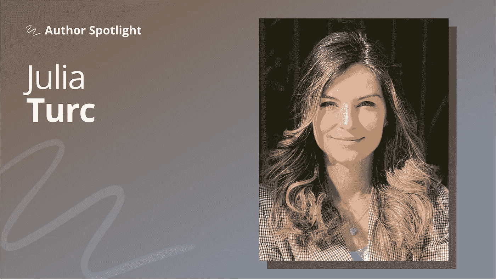

# 最可持续的策略是跟随你自己的好奇心

> 原文：<https://towardsdatascience.com/the-most-sustainable-strategy-is-to-follow-your-own-curiosity-8a852649bff3>

## [作者聚焦](https://towardsdatascience.com/tagged/author-spotlights)

## Julia Turc 讨论了她在自然语言处理方面的职业道路以及多模态机器学习的未来

*在 Author Spotlight 系列中，TDS 编辑与我们社区的成员谈论他们在数据科学领域的职业道路、他们的写作以及他们的灵感来源。今天，我们很高兴与* [*朱莉娅·图尔奇*](https://medium.com/u/f758859396fc?source=post_page-----8a852649bff3--------------------------------) *分享我们的对话。*

照片由朱莉娅·图尔克提供

*Julia 是一名软件工程师和自然语言处理研究员，对迁移学习和多模态模型特别感兴趣。她最近离开了谷歌，在生殖人工智能领域创办了自己的公司。当她不在键盘前时，你会发现她带着她的金毛猎犬朱莉在纽约市漫步。*

## 是什么首先吸引你进入自然语言处理领域的？

上大学前，我对语言和科学同样感兴趣。当时，我认为这是一个无法解决的二分法，我必须在它们之间做出艰难的选择。我决定在大学里攻读计算机科学，并开始接受语言不会成为我未来职业生涯中重要部分的想法。然而，当我为我的大学论文寻找一个主题，并找到一个分析推文中情绪的项目提案时，我突然想到了一个问题。

现在听起来已经是老生常谈了，因为从那以后情绪分析就被打死了。但在当时，这个话题汇集了多个潜力不断增长的元素:深度学习、作为未开发数据源的社交媒体和自然语言处理。在研究生院，我学习机器翻译(具体来说，我们正在研究递归神经网络是否应该是双向的)；我记得我着迷于将语言投射到矢量语义空间的想法，以及它所有的哲学含义，比如*意义的意义*。感觉我已经在最初放弃的计算机科学、语言和哲学的交叉点上找到了自己的位置。

## **随着时间的推移，您的 NLP 方法是如何发展的？**

在我的职业生涯中，迄今为止最重要的事件是迁移学习的兴起——重用像 BERT 或 GPT-3 这样的大型通用语言模型来解决几乎任何语言任务。我的关注点已经从特定任务的技术转移开了(例如,*我们应该使用双向 RNN 进行机器翻译吗？*)到更广泛的迁移学习研究:*我们如何改进基础模型，从而让所有的 NLP 任务同时受益？*

更具体地说，在过去几年中，我研究了增强迁移学习的基石——变形金刚的方法:如何让它们在计算上更加有效，如何提高它们的多语言能力，以及如何防止它们产生“幻觉”(即产生听起来似乎合理的错误)。

## **根据你自己的职业道路，你对早期职业 ML 从业者应该关注的项目类型有什么建议要分享吗？**

我认为机器学习发展太快，无法对你所追求的特定子领域或项目进行战略规划。最可持续的策略是跟随你自己的好奇心，深入挖掘任何激发你兴趣的东西，无论是过时的(如 word2vec 嵌入)还是最闪亮的新玩具(如文本到图像模型)。

当你真正内化一个概念或技术，能够质疑它，改进它，或在新的环境中使用它时，创造力就开始了。对我来说，最高的投资回报率是直接进入代码——这是基本的真理，不受人工智能文学的缺点(修饰、夸张和与人类思维的强行比较)的影响。

我记得我很难理解[变形金刚论文](https://arxiv.org/abs/1706.03762)，直到我看了代码才意识到，在那些自命不凡的术语(例如“多头自我关注”)背后，只是一些矩阵乘法，这是所有模型真正可以归结为的。我从被一项看似难以理解的研究弄得不知所措，到被邀请为 TensorFlow 的官方 YouTube 频道拍摄一部关于变形金刚的教程。

## **是什么激发了你为更广泛的受众发布这些主题——你是如何选择主题的？**

当参加谷歌的阅读小组时，我发现用尽可能简单的术语展示数学含量高的研究论文非常令人满意，因为它去除了学术上的困惑，抓住了核心信息。我经常从我的同行那里收到非常令人鼓舞的反馈，并且意识到，如果这种重构能够让该领域的专家受益，那么它将对更广泛和不太专业的受众产生更大的影响。

关于选题，我总是写与我当前工作密切相关的话题，因为写作迫使我对自己的项目有更清晰的认识。

## 展望未来，你希望在未来一两年内看到你所在领域的哪些变化？

我坚信机器学习的未来是多模态的。迁移学习集中了自然语言处理和计算机视觉。现在，不从通用的预训练模型开始，在这两个领域中的任何一个领域进行操作都是不可想象的。

此外，单峰模型(纯文本、纯图像)的规模正接近互联网上可用数据的上限。很自然的，下一次大统一将把多种形式结合在一起:文本、图像、连续的传感器数据等等。第一个迹象是:CLIP 已经将文本和图像融合到一个单一的公共语义空间中，并为 DALL E 2 等应用程序提供支持，产生了巨大的现实影响。这种趋势很可能会继续下去，使全面发展的代理人能够驾驭我们周围复杂的世界。

要了解更多 [Julia](https://medium.com/u/f758859396fc?source=post_page-----8a852649bff3--------------------------------) 的工作并了解她的最新文章，请在 [Medium](https://medium.com/@turc.raluca) 、Twitter 和 LinkedIn 上关注她。为了了解 Julia 在 TDS 方面的广泛工作，这里有几个突出的帖子:

*   [**如何在谷歌云平台上运行稳定的扩散服务器(GCP)**](/how-to-run-a-stable-diffusion-server-on-google-cloud-platform-gcp-c879357808bf)(2022 年 9 月，10 分钟)
*   [**为文字转图像模型制作提示**](/the-future-of-crafting-prompts-for-text-to-image-models-fc7d9614cb65)(2022 年 7 月，6 分钟)
*   [**自然语言理解数据集未解决的问题**](/unsolved-problems-in-natural-language-datasets-2b09ab37e94c)(2020 年 8 月，7 分钟)
*   [**开关变压器**](/the-switch-transformer-59f3854c7050)(2021 年 1 月 6 日分)
*   [**为什么 GPT 不会告诉你真相**](/why-gpt-wont-tell-you-the-truth-301b48434c2c)(2022 年 5 月，6 分钟)

想和广大观众分享一些你自己的作品吗？[我们希望听到您的意见](http://bit.ly/write-for-tds)。

*这个问题&是为了长度和清晰度而稍加编辑的。*