# 阿达辛之迷被揭开了

> 原文：<https://towardsdatascience.com/the-mystery-of-adasyn-is-revealed-73bcba57c3fe>

[艾德亚多·桑奇兹](http://Eduardo Sánchez)在 [Unsplash](https://unsplash.com/images) 拍摄的照片

## 如果你认为你知道 ADASYN 在预测模型中做什么，你很可能错了。继续读下去，我们将向你展示非凡的真理。

***首席研究员:戴夫·古根海姆/合作研究员:斯里什·蒂鲁马莱***

**前言**

这项研究假设您熟悉类不平衡和 ADASYN 算法。我们强烈建议我们的读者阅读推出 ADASYN 的会议文章(只需输入谷歌学术或查看本文的参考资料部分)，然后阅读《走向数据科学》中讨论类别失衡和 ADASYN 的任意数量的文章。

因为这既不是指南，也不是概述；这是一次探索未知领域的航行，有着惊人的发现。

**简介**

一开始，我们想研究三个主要问题:

1.  学习模型和它们的预测对阶级不平衡有不同的敏感度吗？
2.  ADASYN 是否在一系列综合样本比率和学习模型中提供稳定的预测？
3.  ADASYN 到底在用看不见的数据做什么？

答案依次是令人惊讶、引人入胜和非同寻常。但首先，我们将分享实验的基础。

**型号定义**

这项研究中的所有模型都是使用 sci-kit learn 库中的 RandomForest 和 LogisticRegression 算法进行的，以分别获得关于树和线性结构的信息。在 train_test_split 中使用“分层=y ”,在 GridSearchCV 中使用“cv=10 ”,用分层抽样对所有预测模型进行 10 倍交叉验证。

随机森林模型的所有超参数都保留其默认状态，并且“random_state=1”应用于所有用于分区、处理(ADASYN)和建模的随机种子选择。

这里使用的线性函数是 LogisticRegression+GridSearchCV。每个二元逻辑回归分类模型使用以下超参数运行:

1)惩罚= 'l2 '

2) C = 1E42

3)求解器= 'liblinear '

4) class_weight =无

5) cv = 10

6) max_iter = 5000

7)得分=“准确性”

8)随机状态= 1

为了保持 liblinear 解算器的使用(它支持 l1 和 l2 罚分，并且我们在研究中专门使用它作为公平竞争的场所)，该解算器选择需要设置正则化罚分。在这种情况下，我们选择“l2”或 ridge 作为惩罚，但因为我们只对 ADASYN 的效果感兴趣，所以我们通过将“C”设置得非常大来禁用它。通过这种方式，我们不必引入特征缩放作为数据预处理组件，鉴于我们之前的发现，这是有问题的([特征缩放的奥秘最终被 Dave Guggenheim |向数据科学迈进](/the-mystery-of-feature-scaling-is-finally-solved-29a7bb58efc2))解决。所有其他超参数都保留默认值。

由于样本大小始终是机器学习的一个问题，如果数据集的每个预测器的样本少于 12 个，作为泛化误差的设定点(Shmueli，Bruce，Gedeck 和 Patel 2019)，我们保留 10%的人口作为测试样本。对于超过 24 个样本/预测值的模型，我们将数据集分成相等的两半，50%用于训练，50%用于测试。在这两个值之间，我们使用了一个等式来平衡测试集与足够大的训练集的泛化误差(Abu-Mostafa，Magdon-Ismail，& Lin，2012，第。57).

其中四个数据集包含缺失值，因此为了与之前的研究保持一致，我们使用了缺失值插补的 MissForest 算法( [MissForest PyPI](https://pypi.org/project/MissForest/) )，因为它能够抵抗噪声、异常值或多重共线性的有害影响。此外，我们选择完全哑编码分类预测器，而不是选择名义或顺序数据类型的替代算法。因为线性模型和树模型都在本研究中，所以对于逻辑回归和随机森林模型，虚拟编码分别具有丢弃和未丢弃的子类型。和往常一样，如果一个潜在的预测值明显较低或没有信息，如身份证号码，它会在数据预处理之前被丢弃。

构建这些模型的目的是检查 ADASYN 的影响，而不是调整模型以获得最佳结果。出于这个原因，我们在模型中引入了尽可能多的默认值，为上述比较创造了一个平台。

**与我们之前的研究一样，这项工作包含了方差的随机函数，因此结果是基于学习模型看不到的数据。所有混淆矩阵及其相关分析都代表了真实世界的测试数据。**

**数据集**

表 1 列出了本次分析中使用的 30 个开源数据集，这些数据集是根据其数据类型和复杂性选择的。UCI 索引( [UCI 机器学习库:数据集](https://archive.ics.uci.edu/ml/datasets.php))托管了这些数据集的大部分。其他不在 UCI 索引中的位于 Kaggle ( [查找开放数据集和机器学习项目| Kaggle](https://www.kaggle.com/datasets) )。

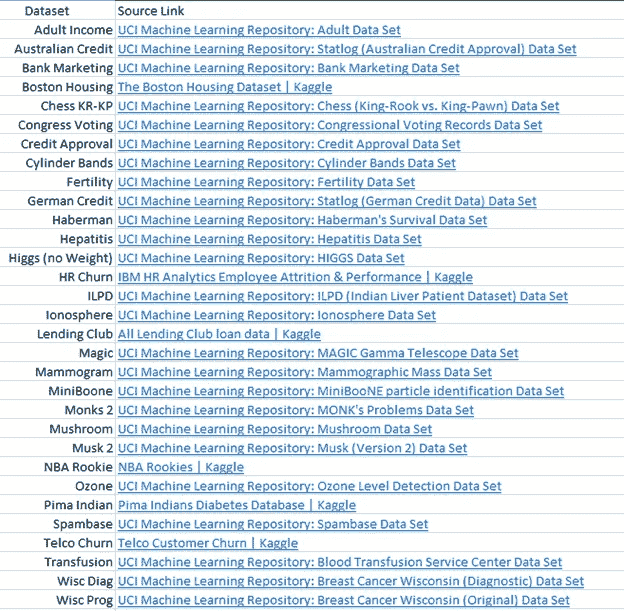

**表 1 数据集及其来源(图片由作者提供)**

类别不平衡不足以生成合成样本的数据集被排除在考虑范围之外；否则，它们被选择来代表如图 1 所示的大范围的不平衡。Classdiff 或阶级差异度量是从多数阶级的百分比中减去少数阶级的百分比。

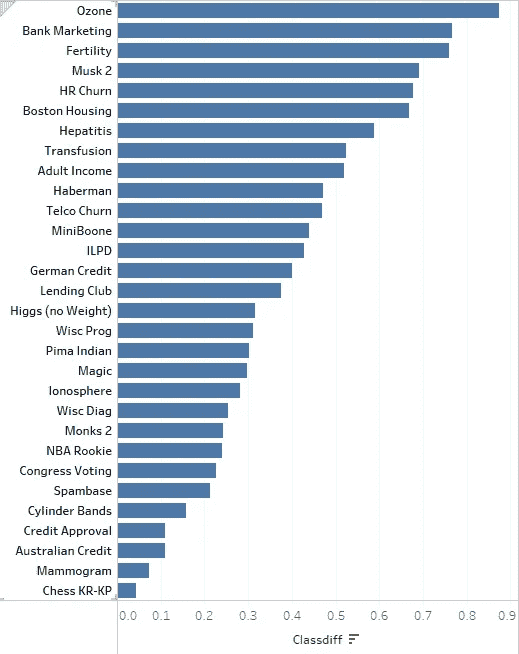

**图 1 数据集及其类别不平衡(图片由作者提供)**

目标变量完全是二项式的，因为 ADASYN 只能对二元分类数据进行操作。现在，关于这些问题…

**学习模型及其预测对班级失衡的敏感度不同吗？**

令人惊讶的答案是否定的，至少对于这两款车型来说是否定的。为了确定这种情况，我们测量了所有数据集的随机森林和逻辑回归的不平衡模型中假阴性测试数据的百分比。假阴性浓度的升高表明对类别不平衡的更大敏感性，这是由于对真阳性(少数类别)的错误分类倾向的增加。详情参见图 2。

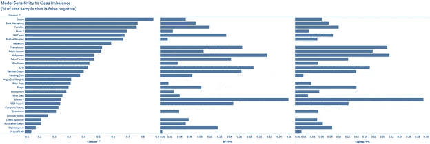

**图 2 类不平衡敏感度结果(图片由作者提供)**

不平衡随机森林模型平均有 7.967%的测试数据为假阴性，而不平衡逻辑回归模型平均为 8.51%，由于未能拒绝零，多重 t 检验证实它们代表相同的分布(见图 3、4 和 5)。

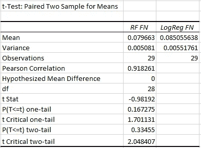

**图 3 配对双样本 t 检验(图片由作者提供)**

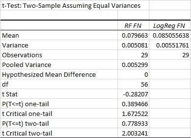

**图 4 假设方差相等的双样本 t 检验(图片由作者提供)**

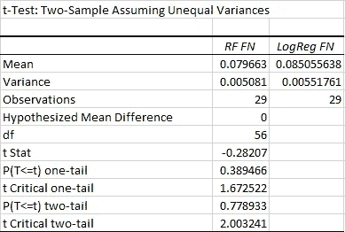

**图 5 假设方差不等的双样本 t 检验(图片由作者提供)**

两种截然不同的学习模式，但两者对班级失衡的平均预测敏感度相同。将测试更多的模型类型，以确定类别不平衡是否是一种普遍的、预测不可知的现象。

**ADASYN 是否在一系列综合比率和学习模型中提供稳定的预测？**

ADASYN 提供了更改合成样本比率的能力，从默认的 50/50 分布(具有最大数量的合成样本)降低到不生成合成样本的数据的自然类别不平衡。每个图表在顶部显示数据集的名称，并显示一系列使用 ADASYN ratio 函数的模型，并用 y 轴上的 F1 分数进行测量(标记为“准确性”)。选择 F1 评分是因为它是 ADASYN 作者(何、白、加西亚和李，2008)推荐的一般衡量标准。x 轴包含多数/少数类的比率，表示为与 50/50 起点的偏差。阅读 x 轴刻度线的快速指南如下:

a.0 =五五比

b.10 = 55/45 比率(50+5 和 50–5)

c.20 = 60/40 比率(50+10 和 50–10)

d.30 = 65/35 比率(50+15 和 50–15)

e.40 = 70/30 的比例(等等。)

f.50 = 75/25 的比例(等等。)

g.60 = 80/20 的比例(等等。)

默认的 50/50 ADASYN 分布在最左侧，而自然不平衡出现在最右侧。定义这些线的每个序列模型代表了从 50/50 起点直到达到自然不平衡的 2%的阶级差异增加(每个模型=多数+1 和少数-1)。蓝色的点(在最左边)表示没有平衡的训练数据，而橙色的点(相同的区域)显示没有平衡的测试数据。水平的蓝色和橙色线分别显示了平衡的训练和测试数据，即序列模型。

每组有两个地块，数据集用随机森林拟合，然后用逻辑回归拟合(见图 6-11)。我们希望了解在合成样本、数据集和模型的范围内，测试数据标绘线的干扰程度，从而了解标绘体积。

我们将在这里谈论它们，这样你就可以跳过情节，更快地到达 ADASYN 揭示。基本上，随机森林在所有数据集的比率范围内大多是稳定的，而逻辑回归可能会变得相当混乱，迷人的逐步函数导致稳定的量子水平。这些量子能级的数学描述，特别是它们的维度的确定，应该在未来的工作中探索。

不管学习模型如何，在几乎所有情况下，默认的 50/50 ADASYN 处理都是稳定的，并在测试数据上提供了最佳性能。但是，也有一些例外(例如，使用两种模型的流失建模、RandomForest 的信贷批准以及 LogisticRegression 的德国信贷)。请参考下面的图表，了解这个 1，000+模型实验的图示。

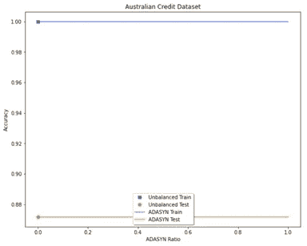

**图 6 随机森林的 ADASYN 比率稳定性(图片由作者提供)**

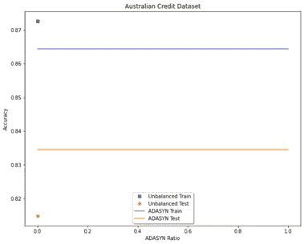

**图 7 逻辑回归的 ADASYN 比率稳定性(图片由作者提供)**

注意:澳大利亚信用证明数据在没有综合调整的情况下接近平衡(训练集中的 284/233 类样本)。在随机森林中没有 ADASYN 改进，但尽管在训练数据中注入了有限数量的合成样本，但逻辑回归显示了更好的性能。

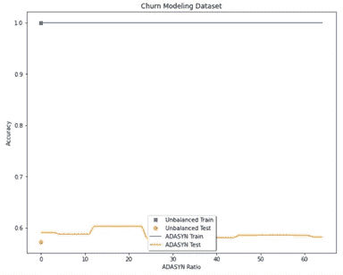

**图 8 随机森林的 ADASYN 比率稳定性(图片由作者提供)**

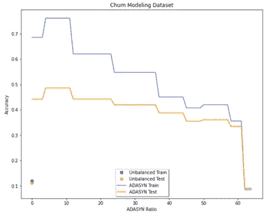

**图 9 逻辑回归的 ADASYN 比率稳定性(图片由作者提供)**

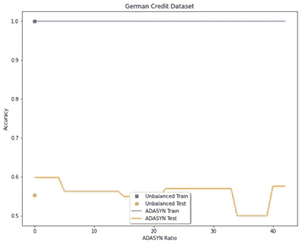

**图 10 随机森林的 ADASYN 比率稳定性(图片由作者提供)**

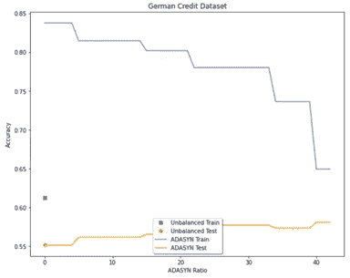

**图 11 逻辑回归的 ADASYN 比率稳定性(图片由作者提供)**

# **阿达辛被揭露**

对于大多数数据集，ADASYN 单独将测试样本从真阴性转换为假阳性(上侧)和从假阴性转换为真阳性(下侧)，分别在每个侧内一一对应。少量数据集沿相反方向行进，**在每个横向内也是一对一的**。更多详情请参考图 12。

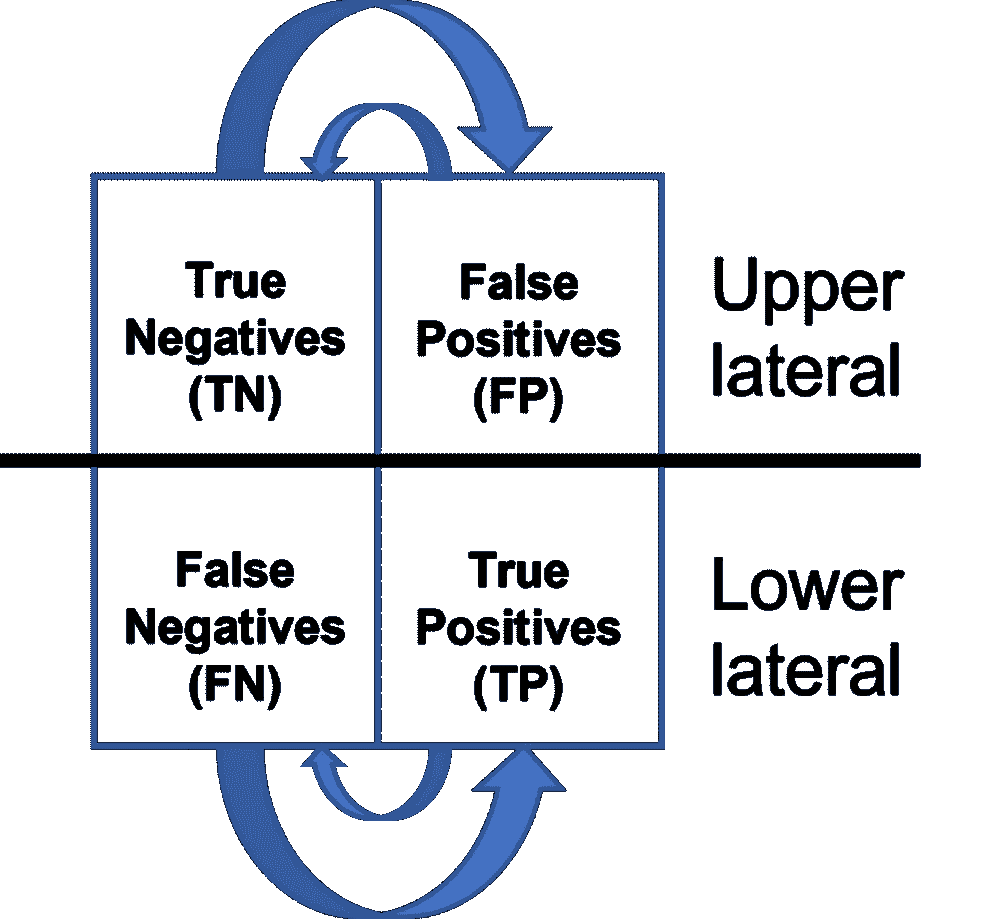

**图 12 混淆矩阵横向转移**

以下四个图表(图 13-16)显示了真阴性(TN)、假阳性(FP)、假阴性(FN)和真阳性(TP)的增量，以应用 ADASYN 后测试数据的百分比变化进行测量。随机森林模型是前两个图表，逻辑回归紧随其后。每对图中的第一个(图 13 和 15)显示了真阴性和假阳性之间的关系，每对图中的第二个(图 14 和 16)显示了假阴性和真阳性之间的关系。

向左移动的条形表示测试数据减少了一定的百分比，向右移动的条形表示测试数据增加了一定的百分比——这是不平衡模型的增量。**由于 ADASYN*** ，相反方向的等长条“蝴蝶的翅膀”显示了混淆矩阵中从左侧象限到其横向关系的直接转移

**完全由这些图表背后的数字数据支持。统计支持无关紧要，因为转让的绝对值是相同的。*

**随机森林模型**

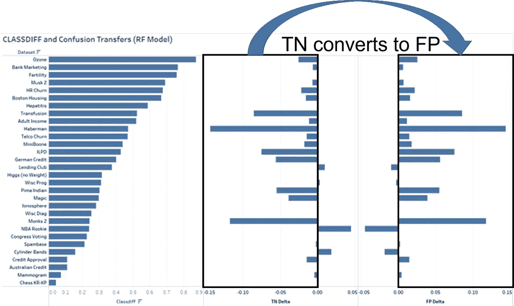

**图 13 随机森林模型的 TN-FP 上部横向混淆转移(图片由作者提供)**

关于随机森林模型，30 个数据集中的 26 个显示了从真阴性到假阳性的数量完全相等的零或正值转移(8 个为 0，18 个为正值)。这些结果不会导致分母发生变化，但会导致**特异性(TN/(TN+FP))** 的分子减少，从而导致捕获 TN-FP 转移的源和汇的指标总体减少。

**绝对不应该使用 Precision，因为它无法为假阳性接收器捕获真正的阴性源。此外，永远不要使用 F1 分数，因为它的分子和分母都很精确。**

四个数据集显示了与这种情况相反的情况，发生了从假阳性到真阴性的转移。这一现象将很快被探究。

**图 14 随机森林模型的 FN-TP 较低横向混淆转移(图片由作者提供)**

移动到 FN-TP 维度，30 个数据集中的 26 个显示了从假阴性到真阳性的数量完全相等的零或正计数转移(4 个为 0，22 个为正值)。这些结果不会改变分母，但会增加**灵敏度(TP/(TP+FN))** 的分子，从而总体增加捕获 FN-TP 传输的源和汇的度量。

四个数据集显示了与这种情况相反的情况，从真阳性到假阴性发生转移，这也将很快被探究。

**逻辑回归模型**

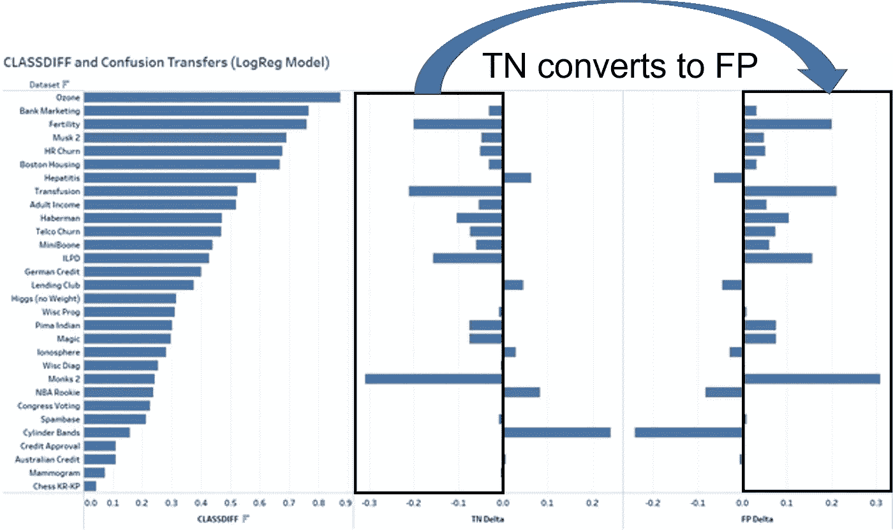

**图 15 逻辑回归模型的 TN-FP 上横向混淆转移(图片由作者提供)**

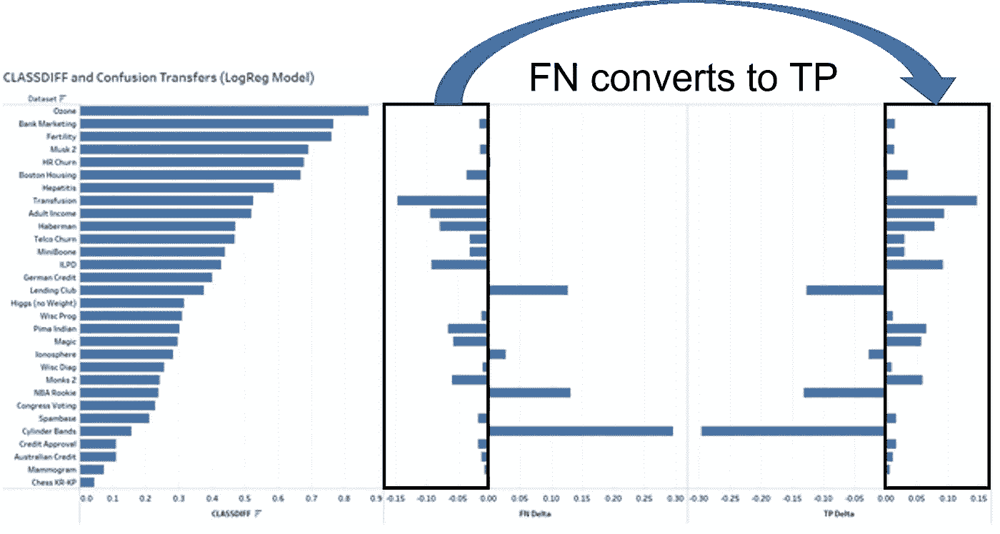

**图 16 逻辑回归模型的 FN-TP 下侧混淆转移(图片由作者提供)**

关于逻辑回归模型，30 个数据集中的 26 个显示了从真阴性到假阳性的完全等量的零或正值转移(4 个为 0，22 个为正值)。此外，移动到 FN-TP 维度，30 个数据集中的 26 个也显示了从假阴性到真阳性的完全等量的零值或正值转移(6 个零值，20 个正值)。

如上所述，特异性和敏感性应用于分析，因为它们分别包括混淆转移的源和汇(更多信息见图 17)。

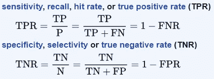

**图 17 敏感性和特异性指标(从** [敏感性和特异性—维基百科](https://en.wikipedia.org/wiki/Sensitivity_and_specificity) **)**

性能的一般测量可以从**信息**开始，它等于**特异性+灵敏度 1** 。另一个度量可以是灵敏度和特异性的调和平均值，作为 F1 分数的适应[**2 *(TPR * TNR)/(TPR+TNR))**。然而，F1 评分受到了批评，因为它认为特异性与敏感性具有相同的值，但这种情况很少发生。有一个可调的 F1 分数，它使用β系数来引起两个基本度量之间的偏移(sklearn.metrics 中的 fbeta_score ),这可以进行调整，但选择该系数是有问题的。其他人提出将**马修斯相关系数**作为衡量二元变量的更好指标(Chicco & Jurman，2020)。

**反向转账**

反向转移是指假阳性变成真阴性，真阳性变成假阴性。有七个数据集导致反向转移，三个专用于随机森林模型，一个专用于逻辑回归，三个生成反向转移而不考虑学习模型(见表 2)。

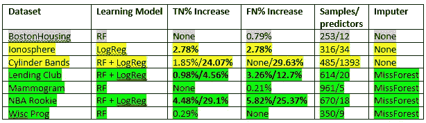

**表 2 反向转移(图片由作者提供)**

如果 TN 和 FN 都增加(如**粗体**所示)，则发现一对匹配的横向混淆象限。该表以颜色编码，灰色表示未知，黄色表示样本量问题，绿色表示共享 MissForest。

关注随机森林模型(见图 18 和 19)，四个(从顶部数，第四个)中的两个较小的反向转移之一可能是由于样本大小的问题。在这种情况下，每个预测器的样本远少于 12 个(即 p >> n ),并且观察到微小的反向转移。虽然这是轶事，但样本大小始终是机器学习中的一个问题，这些微小的反向转移可能是模型不稳定的结果。在这些潜在样本量问题的情况下，TN-FP 和 FN-TP 转移维度之间缺乏匹配，进一步暗示了模型的不稳定性。BostonHousing 是一个异常，因为尽管反向转移的影响可以忽略不计，但样本大小似乎不是一个问题——这将在以后的研究中进一步研究。

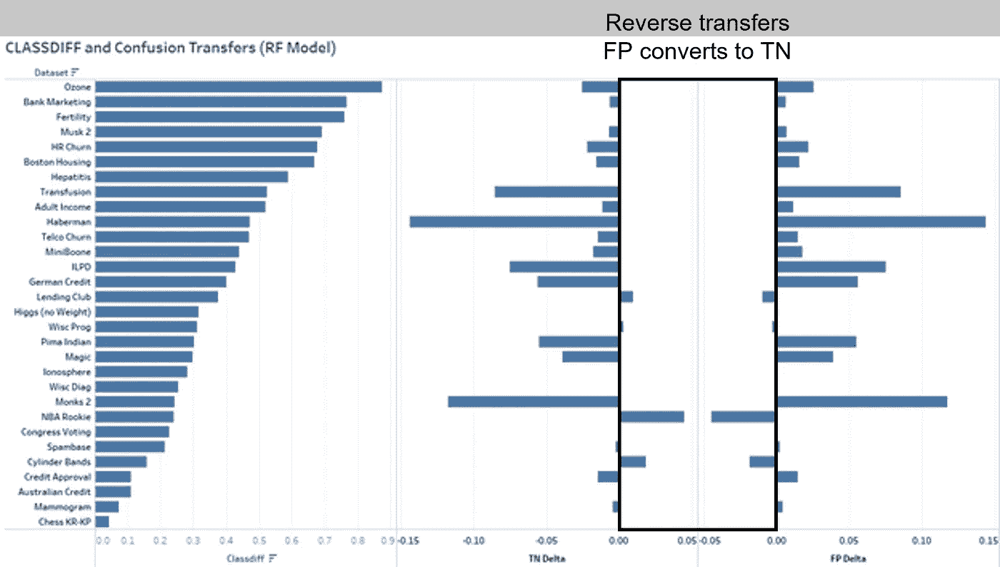

**图 18 随机森林模型的 FP-TN 反向转移(图片由作者提供)**

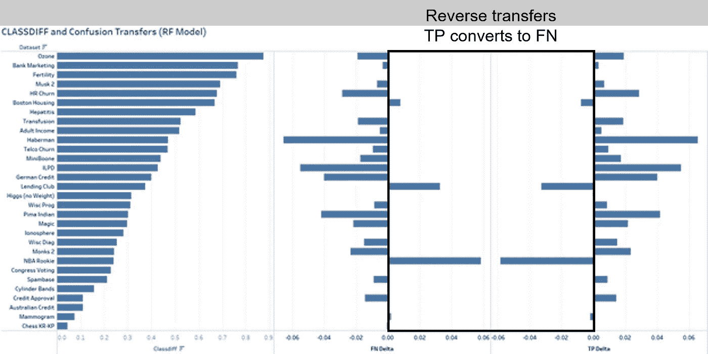

**图 19 随机森林模型的 TP-FN 反向传输(图片由作者提供)**

然而，在两个数据集中发生了更大的反向迁移，而不管学习模型和样本大小是不是一个问题。这两个数据集(Lending Club 和 NBA 新秀)具有匹配的反向转移(FP 转换为 TN **和** TP 转换为 FN ),除了通过逻辑回归显著增加 TN% delta 和 FN% delta 之外，几乎没有其他相似之处；例如，与不平衡模型相比，NBA 新秀的真阴性增加了 29.1%，假阴性增加了 25.37%(以及相应的 FP 和 TP 减少)。NBA 新秀都是数字，有大量浮点预测值，而 Lending Club 有八个分类变量，由于 one-hot 编码导致更大的稀疏化(见表 3)。它们共有的一个属性是都使用了 MissForest 缺失值插补算法。事实上，在导致反向转移的七个数据集中，其中四个使用了 MissForest 算法，这是仅有的四个缺少值的数据集。

**表 3 匹配大额反向转账的数据集(图片由作者提供)**

ADASYN 在内部使用 k-最近邻(kNN)算法，并将缺失值插补算法更改为 sklearn.impute 库中的 KNNImputer，从而实现了微小的改进，例如，乳房 x 光照片和 Wisc Prog 从不匹配的反向传输转换为小比例的匹配正向传输；基本上实现了正常运行。虽然测量了小的改善，但 Lending Club 和 NBA 新秀仍然存在反向转移的严重问题，这是一个值得进一步研究的无法解释的现象。

但这确实提出了一个有趣的应用点——在使用 ADASYN 时，我们应该考虑使用 kNN 缺失值插补，因为它在每种缺失值的情况下都能提供稍好的性能。

**商业分析场景**

**特异性**和**敏感性**虽然是很好的指标，但都无法捕捉到混淆矩阵中相对侧的信息。特异性定义了上侧，而敏感性衡量了下侧，但两者都无法“看到”等式的另一侧。衡量标准 I**inform ness**有助于解决这个问题，但是更好的理解来自于经济分析，它包含了混淆矩阵的所有四个象限，并在成本/收益关系中将它们标准化。虽然假阴性和假阳性几乎总是有相关的成本，但真阴性和真阳性可能是成本或收益，这取决于场景，这限制了在业务设置中对性能的一般测量的有用性。

因此，如果 TN-FP 转移的负值大于 FN-TP 转移的正值，则 ADASYN 的表现将低于不平衡模型。相反，如果 FN-TP 转换产生的绝对值大于 TN-FP 维度，则 ADASYN 辅助模型将更优越。

以下四个场景探讨了经济绩效的概念，并通过简化的案例展示了几种可能的结果。

***场景 1 员工流失***

在这种情况下，目标变量 Gone 表示已经离开组织的雇员。由于雇佣和培训新员工的成本，准确预测即将到来的辞职可能相当重要，即使没有大的辞职。

根据美国劳动局的数据，更换一名员工的成本可能高达高管年薪的 200%，但全国平均水平为年薪的 21%。防止辞职的干预成本是不可用的，因为它们通常是定制的，所以我们选择年薪的 4%作为保留成本。应该注意的是，这种保持成本会随着时间和条件而变化。从劳动局也获得了按职业估算平均工资的数据。

TN =员工不受影响，这是中性的。

FN =员工将在没有干预的情况下离开；替换成本*计数为负

FP =员工不会离开，但无论如何都要干预；维护成本*计数为负

TP =员工将离职，但干预被阻止；维护*计数的成本为负值，但更换*计数的成本为正值。

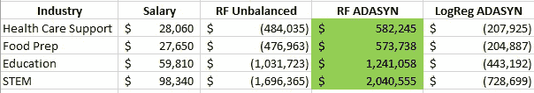

**表 5 员工流失经济绩效分析(图片由作者提供)**

表 4 表明 ADASYN 辅助的随机森林优于该系列中的所有其他模型。

***场景二信用审批***

在这种情况下，我们选择的平均信用值为 10，000 美元，该值的违约成本为 25%。

TN =信用被批准，金额*计数被添加为正数

FN =信用已批准，但金额*默认成本*数量为负值

FP =信用被拒绝，金额*计数为负数

TP =信用被拒绝，这导致节省违约成本*计数为正数

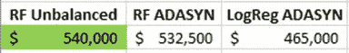

**表 5 信贷审批经济绩效分析(图片由作者提供)**

表 5 表明，无辅助随机森林模型优于该系列中的所有其他模型。

***场景 3 客户流失(电信客户流失)***

我们曾在电信行业使用预测模型，我们估计替换一个客户的成本为 500 美元，保留一个客户的成本为 50 美元，这是基于真实世界的信息，这些信息曾经是正确的，但现在可能已经过时了。

TN =客户不受影响，这是中性的。

FN =客户将离开，无需干预；替换成本*计数为负

FP =客户不会离开，但无论如何都要干预；维护成本*计数为负

TP =客户将离开，但干预被阻止；维护成本*计数为负

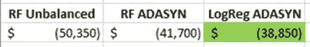

**表 6 客户流失经济表现分析(图片由作者提供)**

表 6 表明 ADASYN 辅助的逻辑回归优于该系列中的所有其他模型。请记住，这是一个简化的场景，没有考虑客户收入，因此经济方面的更多细节可能会导致转向不同的模式。

***场景 4 贷款审批(贷款俱乐部)***

因为它可能是反向转移的有害影响的来源，我们选择这个数据集来研究这些事件的影响。在本例中，我们选择的平均贷款批准额为 25，000 美元，违约成本为 6，250 美元。

TN =贷款被批准，贷款金额*计数被添加为正数

FN =贷款已批准，但贷款金额*违约成本*计数为负数

FP =贷款被拒绝，贷款金额*计数为负数

TP =贷款被拒绝，这节省了违约成本*计数为正数

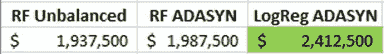

**表 7 贷款审批经济绩效分析(图片由作者提供)**

表 7 表明 ADASYN 辅助的逻辑回归优于该系列中的所有其他模型。这个场景展示了反向转移是如何提高业绩的，因为有更多的真负值，并且在这个场景中，TN 象限有一个很大的正估值。尽管假阴性有所增加，但违约成本无法抵消贷款收益，但我们认为这种情况很少发生，因为 TN 象限通常不会有这么大的估值。

**结论**

我们的调查让我们对阶级不平衡和 ADASYN 的问题有了一些真正发人深省的见解。

当我们研究阶级不平衡对我们学习模型的影响时，不平衡测试数据中的假阴性比例表明随机森林和逻辑回归预测对阶级不平衡具有相同的敏感性。有趣的是，ADASYN 似乎对学习模型之间的结果有不同的影响，正如“蝴蝶”图显示的上侧和下侧。

当在两个模型上实现 ADASYN 时，数据显示随机森林通常具有稳定的预测，而不管使用的合成比率如何，而逻辑回归模型往往受各种比率的影响更大。这种现象超出了本研究的范围，但将在未来进行研究。

也许我们最有意义的发现是在不平衡模型上原子水平上的 ADASYN 辅助转换。ADASYN 创建的从 FN-TP 和 TN-FP 横向转移的概念在决定该算法是否应该用于平衡数据集时非常有利，并且还显示了 ADASYN 在应用于业务分析时的影响力。

我们已经证明了混乱矩阵的最终形成不是由于波函数的坍缩——我现在正在抚摸薛定谔的猫！虽然这是一种机械现象，但 TN-FP 和 FN-TP 转换的简单性和普遍性是非同寻常的。

我们现在可以通过一个更清晰的镜头来看待 ADASYN，从这个镜头中我们可以更好地分析我们的模型，并获得更有意义的结果。

**未来研究**

未来对类别不平衡的研究将进一步探索模型的敏感性，以发现具有抵抗性的模型。用不同的学习模型，如支持向量机和 boosted 树，以及不同的不平衡算法，如 SMOTE、KMeansSMOTE、BorderlineSMOTE 等，重复这个实验设计。可能会很有趣。此外，了解反向转移也提上了日程，尤其是两个具有极端效应的数据集。此外，我们将试图理解出现在比率图中的量化水平，以及它们是否与其他不平衡算法一起发展。

**参考文献**

Abu-Mostafa，Y. S .、Magdon-Ismail，m .、和 Lin，H.-T. (2012 年)。*学习资料*(第四卷)。美国纽约 AMLBook

奇科博士和朱尔曼博士(2020 年)。马修斯相关系数(MCC)在二分类评估中相对于 F1 分数和准确性的优势。 *BMC 基因组学*， *21* (1)，6。[https://doi.org/10.1186/s12864-019-6413-7](https://doi.org/10.1186/s12864-019-6413-7)

Shmueli，g .，Bruce，P. C .，Gedeck，p .，& Patel，N. R. (2019)。*商业分析的数据挖掘:Python 中的概念、技术和应用*。约翰·威利的儿子们。

何海辉，白，杨，贾亚东，李，等(2008 年 6 月)。ADASYN:用于不平衡学习的自适应合成采样方法。在 *2008 年 IEEE 国际神经网络联合会议(IEEE 世界计算智能大会)*(第 1322-1328 页)。IEEE。

**联系方式:**

dguggen@gmail.com 博士:领英简介:大卫·古根海姆博士

斯里什·蒂鲁马莱:[领英简介](https://www.linkedin.com/in/srish-tirumalai-616727167/)，【stirumalai1@gmail.com】T2