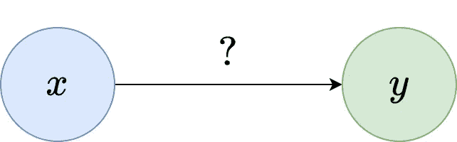
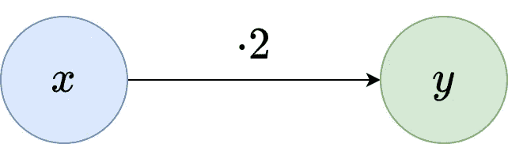
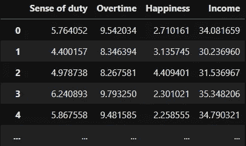
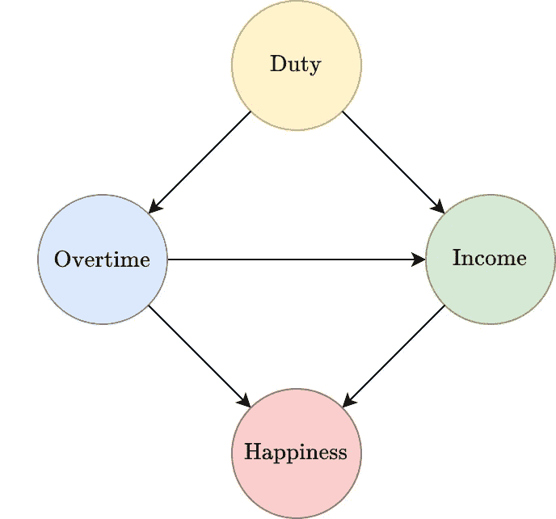

# 因果推理的需要

> 原文：<https://towardsdatascience.com/the-need-for-causal-inference-4c7c612dde91>

## [因果推断](https://medium.com/tag/causal-inference)

## 探究我们为什么要处理因果关系的简单原因


由[米哈尔·姆罗泽克](https://unsplash.com/@miqul?utm_source=medium&utm_medium=referral)在 [Unsplash](https://unsplash.com?utm_source=medium&utm_medium=referral) 上拍摄

O 机器学习领域的后期趋势之一是*因果推理*或*因果关系*的概念。简而言之，它应该回答如下问题:

> 一个特征(称为治疗)对另一个特征(称为反应或结果)的影响是什么？

因果推理绝不是一种新方法——人们知道它至少有 50 年了，而且在社会科学、经济学和政治学中使用已经很久了。在医学中，一个具体的问题可能是:

> 服用避孕药对患者的生存概率有什么影响？

在这里，治疗是二元的(给药丸？是/否)，并且响应在 0 和 1(概率)之间是连续的。

# 对这个问题天真的看法

作为一个抽象而简单的例子，假设我们有一个数据集，它有一个特征 *x* 和一个目标 *y* 。我们想要检查 *x* 对 *y* 的影响。



图片由作者提供。

为了做到这一点，让我们假设我们将线性模型 *ŷ* = 2 *x* + 1 拟合到数据，这具有相当好的性能。现在 *x* 对 *y* 的作用是什么？嗯，因为线性模型的简单形式，我们可以这样描述效果:一个**增加 1 的 *x* 增加 2 的 *y* 。下一个问题！**



图片由作者提供。

但是别急，当我们引入更多的变量时，事情就变得有趣了。

## 许多功能，许多答案

我创建了一个小数据集来告诉你答案并不总是那么清楚。只需跟随 Python:

```
import pandas as pd

data = pd.read_csv(
  'https://raw.githubusercontent.com/Garve/datasets/5734e7783ed5c39b03348fe7484af19d9936ed9f/causal.csv'
)
```

在这里，我们已经加载了虚构的数据集。每行对应一个假想的人。每个人都有以下特征:

*   **责任感**
*   **加班金额** ( *待遇*)
*   **幸福**，和
*   **收入** ( *回复*)。



图片由作者提供。

我们现在想搞清楚**加班如何影响收入**，这应该是一个很简单的问题。让我们也使用线性回归，因为我们可以很容易地用一个单一的数字来描述加班对收入的影响——加班**系数**的斜率。所以，让我们抓住 [scikit-learn](https://scikit-learn.org/stable/) 并尽我们所能做到最好。

我们现在将运行一个简单的线性回归，将**加班**作为输入特征，将**收入**作为目标。这感觉是试图回答问题时最直接的做法。

```
from sklearn.linear_model import LinearRegression

X = data[['Overtime']]
y = data['Income']

print(LinearRegression().fit(X, y).coef_)

# Output:
# [2.7987431]
```

酷，所以加班增加 1 就增加收入 2.8 左右吧？好吧，也许，让我们先检查一下模型是否捕捉到了数据。

```
from sklearn.model_selection import cross_val_score

print(cross_val_score(LinearRegression(), X, y).mean())

# Output:
# 0.9566128136325356
```

一个 **五重交叉验证**的**均值 *r* (我写这篇文章时 scikit-learn 的标准方法)大约是 **0.95** ，这非常合适，所以我们应该能够相信模型告诉我们的任何东西。**

但是我们的口袋里有更多的功能，对吗？信息越多越好，所以让我们利用它们。我们现在将使用加班待遇**以及额外的回归变量**责任感**。**

```
X = data[['Overtime', 'Sense of duty']]
y = data['Income']

print(LinearRegression().fit(X, y).coef_)

# Output: 
# [1.99819195 0.98356566]
```

使用这两个特性，故事发生了很大的变化。现在，将**加班**增加 1 意味着**收入**仅增加约 2，而不是之前的 2.8！*5 倍均值 r 也比之前略好，约为 0.976。*

如果我们也使用最后一个特征——**快乐** —

```
X = data[['Overtime', 'Sense of duty', 'Happiness']]
y = data['Income']

print(LinearRegression().fit(X, y).coef_)

# Output: 
# [2.92794148 0.52911897 0.46879848]
```

**超时**的斜率再次改变，这次大约为 2.9。*此处 5 重均值 r 约为 0.987，为最高值。*

> 那么，对于“加班如何影响收入”这个简单的问题，你的最终答案是什么是吗？

*是真的*斜率…

1.  …关于 **2.8** ，因为只用**加班**作为预测器最直接的回答了问题？
2.  …关于 **2.9** ，因为我们使用了所有可用的特性，并且 5 倍均值 *r* 在那里最高？
3.  …关于 **2** ，因为…它是唯一的偶数质数？😅
4.  …完全不同的东西？

> 如果你明白这里的纠结，那么恭喜你，你知道因果推断是为了什么了！

# 解决争端

在这篇非常基础的介绍文章中，我无法向您展示如何系统地解决这个问题——这是另一篇文章的内容。如果你等不及，我也不会感到惊讶😉，看看这些由布雷迪·尼尔创建的关于因果推理的精彩讲座。

> 10/10 为他的视频系列和脚本，会再次观看！👍—罗伯特

让我给你一些关键词:它与*因果图*、*混杂器、碰撞器*和 *do-calculus 有关。我还能为你做的是给你一些这些东西是什么的直觉。*

> ***注:*** *以下解释真的只是一个大概的概述。不可能理解* ***为什么*** *这些事情都是真的，所以不要气馁。*

## 因果图

数据集的因果图是一个[图](https://en.wikipedia.org/wiki/Graph_(discrete_mathematics))，在这里你可以读出哪些特征相互影响。因果推理中典型的——不幸的是极其困难的——问题是得到这个图表。由于我自己通过一些规则创建了数据集，我可以给你它的因果图:



图片由作者提供。

用语言来说:

*   **责任感**影响**加班**和**收入**。
*   **加班**影响**收入**和**幸福**。
*   **收入**影响**幸福**

同样，获得这些类型的陈述(即因果图)是非常重要的。我们只是幸运，因为数据集是合成的，我知道生成过程。顺便说一下，是这样的:

```
import numpy as np
import pandas as pd

np.random.seed(0)

duty = np.random.randn(1000) + 4
overtime = duty + 3.5 + 0.5*np.random.randn(1000)
income = duty + 2*overtime + 10 + 0.5*np.random.randn(1000)
happiness = income - 4*overtime + 6 + 0.5*np.random.randn(1000)

data = pd.DataFrame({
    'Sense of duty': duty,
    'Overtime': overtime,
    'Happiness': happiness,
    'Income': income
})
```

在这里，我们可以看到哪些特征影响了哪些其他特征，此外，我们甚至可以从上面粗体标记的部分直接看到表示 **2 是正确答案**。

再举一个例子，从线

```
overtime = duty + 3.5 + 0.5*np.random.randn(1000)
```

我们可以看到**的责任感**如何影响**的加班**、因此箭头从值班到加班。

## 混淆器和碰撞器

影响**治疗和反应**的特征称为*混杂因素*。在我们的例子中，**责任感**是我们唯一的混淆因素*我们必须控制它*，这基本上意味着我们必须将它包括在回归中。

另一方面，幸福不是混杂因素，而是 T2 对撞机。正如我们在这里看到的，在回归中包含碰撞器会导致问题。

## 微积分

使用所谓的 *do-calculus，由 [Judea Pearl](https://en.wikipedia.org/wiki/Judea_Pearl) 发明的*，我们可以证明我刚刚抛给你的关于混杂器、对撞机等等的陈述。这个主题的标准资源是 Judea Pearl 的书[为什么的书](https://en.wikipedia.org/wiki/The_Book_of_Why)。

# 结论

在本文中，我们通过一个小例子看到，即使是像**“一个特性对另一个特性有什么影响？”**无法用幼稚的方式正确回答。我们必须付出更多的努力来解决与因果关系相关的问题，而这正是我们需要因果推理的原因。

因果推理是一个有趣的领域，也是非常重要的，因为它让你对真正的因果关系进行推理——这是你得出正确结论所需要的。否则，你最终会得到几个同样好的模型，告诉你一个特性对另一个特性的影响的完全不同的故事，就像我们所做的一样。

我希望你今天学到了新的、有趣的、有用的东西。感谢阅读！

**作为最后一点，如果你**

1.  **想支持我多写点机器学习和**
2.  **无论如何都要计划获得中等订阅量，**

**为什么不做** [**通过这个环节**](https://dr-robert-kuebler.medium.com/membership) **？这将对我帮助很大！😊**

透明地说，给你的价格不变，但大约一半的订阅费直接归我。

非常感谢，如果你考虑支持我的话！

> *有问题就在*[*LinkedIn*](https://www.linkedin.com/in/dr-robert-k%C3%BCbler-983859150/)*上写我！*