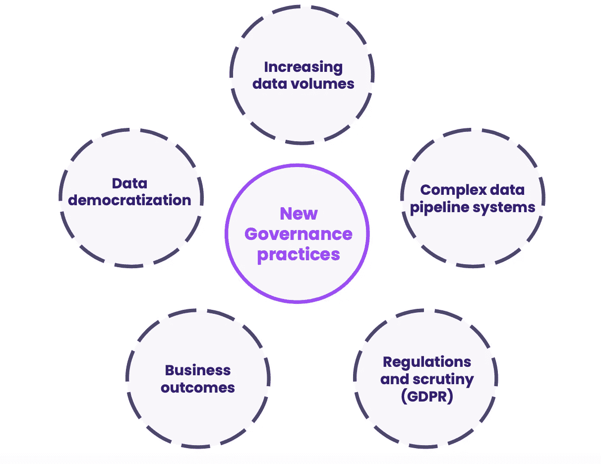
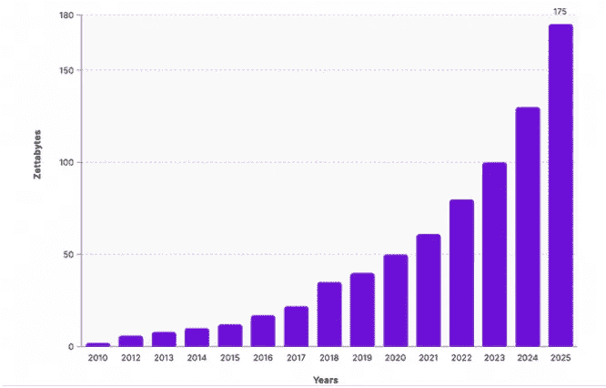
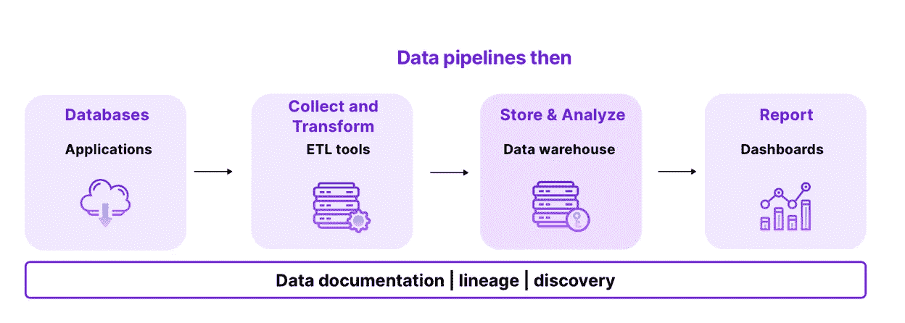
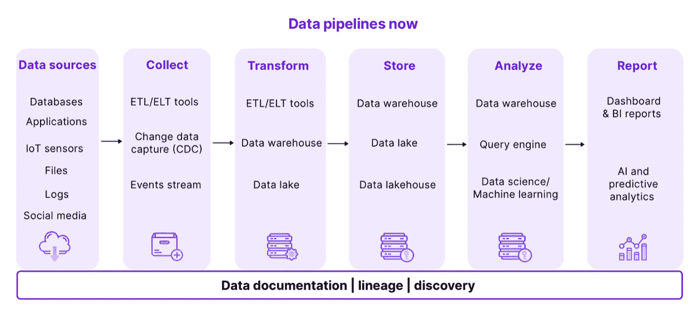
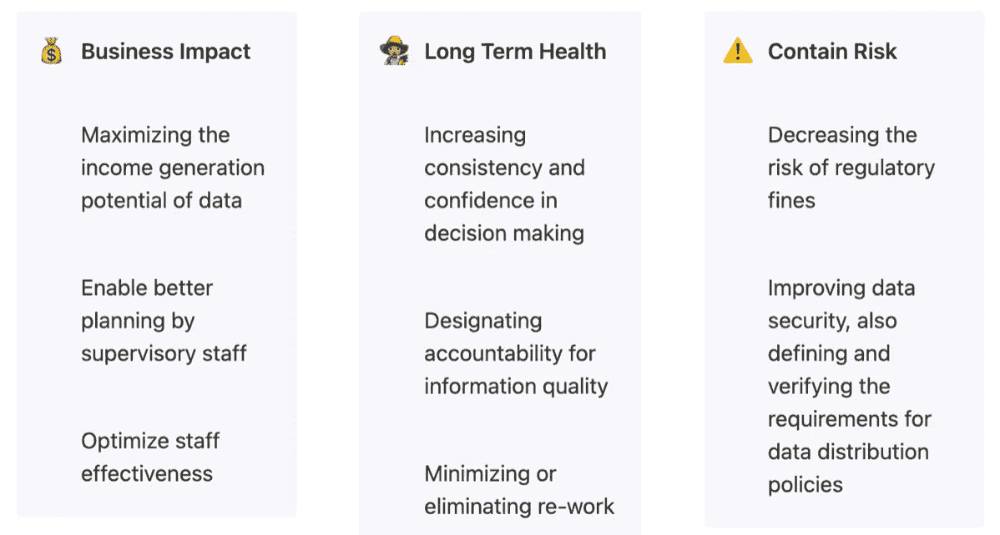
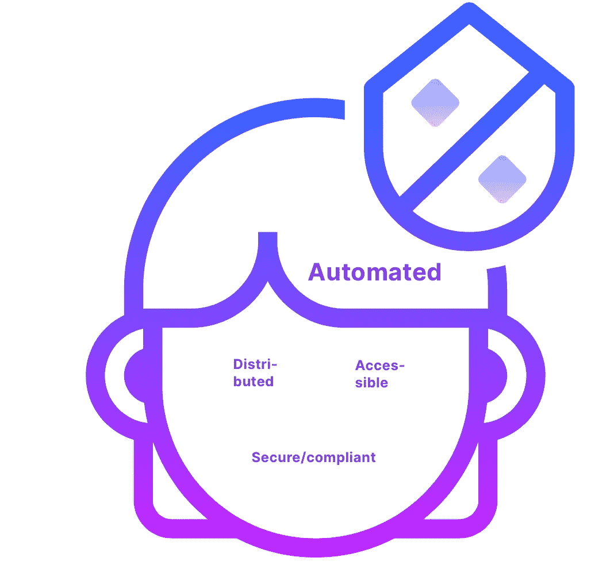
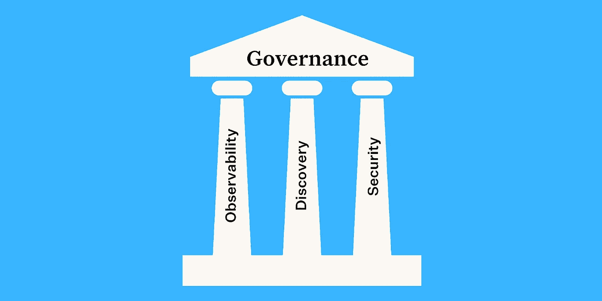

# 数据治理的新面貌

> 原文：<https://towardsdatascience.com/the-new-face-of-data-governance-44eee0a91e68>

## 数据治理已死。我们可以这样复活它。

图片由 Castor 提供

本文是与蒙特卡洛的内容负责人 [Molly Vorwerck](https://www.linkedin.com/in/vorwerck/) 共同撰写的。

*数据治理不一定是一件麻烦事。它只需要满足数据团队的需求:在分布式组织中。这就是我们长期以来的数据治理方法不适合现代数据堆栈的原因，以及一些最好的数据团队已经在做的事情。*

数据治理是许多数据领导者的首要考虑，特别是考虑到 GDPR、CCPA、、新冠肺炎以及许多其他首字母缩略词，这些词表明在管理公司数据时，合规性和隐私越来越重要。

传统上，数据治理是指维护数据的可用性、可用性、来源和安全性的过程，正如一位数据领导者曾经告诉我们的那样，是“让您的 CFO 免于牢狱之灾的通行证”

尽管如此，Gartner 指出，2022 年，超过 80%的数据治理计划将会失败。

坦白说，我们并不惊讶。

虽然[数据治理](https://searchdatamanagement.techtarget.com/definition/data-governance)被广泛认为是健康数据战略的必备特性，但在实践中很难实现，特别是考虑到现代数据堆栈[的需求](https://www.montecarlodata.com/the-future-of-the-modern-data-stack/)。

# 数据治理(云计算之前)

我们将治理方式的转变归功于一个关键的催化剂:**云**。

在云数据仓库兴起之前(感谢雪花！)，分析主要由孤立的团队处理。云架构和支持云架构的工具使得构建分析仪表盘和报告比以往任何时候都更便宜、更容易。突然间，营销部门的 Joan 和财务部门的 Robert 可以收集关于业务的近乎实时的见解，而不必每次向董事会提交报告时都 ping 数据科学团队。

数据实际上变得民主化了。算是吧。

虽然使数据变得更容易访问和使用的技术正以前所未有的速度创新，但确保数据易于发现和可靠的工具和流程(换句话说，数据治理)却不能满足我们的需求。

原因如下。

**手动治理方法不再奏效。**

虽然我们在自助服务分析、云计算和数据可视化等领域取得了巨大进步，但在治理方面我们还没有达到这一水平。许多公司继续通过手动的、过时的和特别的工具来实施数据治理。

数据团队花费数天时间手动审查报告，设置自定义规则，并逐一比较数字。随着数据源数量的增加和技术栈变得越来越复杂，这种方法既不可扩展也不高效。

虽然数据目录通常将自己标榜为数据治理的答案，但许多数据领导者发现，当涉及到手动需求时，他们的目录甚至缺乏最基本的方面。

在一些组织中，这些操作花费了大量时间来手动映射上游和下游依赖关系，更不用说保持这一点最新所需的维护工作了。

**数据无处不在；数据治理不是。**

对于许多公司来说，提高数据创新的速度是生存的关键。虽然数据基础设施和商业智能工具在过去几年中不断进步，以支持这一创新，但 DataOps 仍然落后于大多数 DataOps 解决方案，如数据质量警报和沿袭跟踪都是手动、一维且不可扩展的。

DataOps 和 solutions 能够迎头赶上的方法之一是借鉴软件工程的概念。我们在数据方面面临的很多问题，其实都是工程、安全等行业已经解决的问题。

随着公司迁移到更加分布式的架构(例如，[数据网格](https://www.montecarlodata.com/data-mesh-101-everything-you-need-to-know-to-get-started/))，对无处不在的端到端治理的需求从未如此之大。

好消息是什么？我们不必接受现状。与软件工程团队依赖自动化、自我修复过程和自助工具的方式一样，数据团队也需要通过拥抱数据治理的新面貌来采取类似的方法。

以下是原因和方法。

# 事情已经改变了

自公元前时代以来，许多事情都发生了变化。在描绘数据治理的新面貌之前，理解带来更新需求的结构变化是关键。这一部分致力于探索新数据治理实践的催化剂。

新数据治理实践的催化剂。图片由 Castor 提供。

# 1 —公司正在吸收越来越多的数据

在过去的几十年里，存储和计算成本下降了数百万倍，带宽成本下降了数千倍。这导致了云的指数级增长，以及**云数据仓库**的到来，如亚马逊红移或谷歌 BigQuery。云数据仓库的独特之处在于，它们比传统数据仓库**具有无限的可扩展性**，能够容纳几乎任何数量的数据。

数据量预计将在 2025 年前[进一步爆炸。图片由 Castor 提供。](https://www.hannovermesse.de/en/news/news-articles/data-volume-expected-to-explode-until-2025)

这些发展使得各个领域的组织能够收集和存储大量的数据。与过去相比，现在的数据更加分散和分散，可以用大数据的“ [Three Vs](https://www.zdnet.com/article/volume-velocity-and-variety-understanding-the-three-vs-of-big-data/) ”来描述:激增的数量、多样性和速度。

数据的本质已经发生了变化，这应该促使旨在管理这些数据的数据治理模型发生变化。

# 2-管道和生态系统变得日益复杂

简单的数据管道。图片由 Castor 提供。

复杂的数据管道。图片由 Castor 提供。

直到 15-20 年前，数据管道还是相当基础的，为业务分析的稳定需求服务。商业智能团队需要对他们的财务状况、库存水平、销售渠道和其他运营指标进行历史测量。数据工程师使用 [ETL(提取、加载、转换)工具](https://www.castordoc.com/blog/etl-benchmark-for-mid-market-companies)来转换特定用例的数据，并将其加载到数据仓库中。由此，数据分析师使用商业智能软件创建仪表板和报告。

数据管道现在使用复杂工具(仅举几个例子，Apache Spark、Kubernetes 和 Apache Airflow)的组合**运行，随着互联部件数量的增加，**管道故障的风险也在增加**。工具的多样性是必要的，因为它允许数据团队在其数据堆栈的每一层选择最佳平台。但是所有这些引擎的组合使得实际上不可能看到管道的不同部分。**

现代数据管道不仅复杂，而且还具有**黑盒特性**。你知道进去的是什么，出来的是什么，但你不知道中间发生了什么。只要出现想要的结果就好。但如果没有，那就非常令人沮丧。当数据集从管道中出来时，通常会留下奇怪的值、缺失的列、本应是数字的字段中的字母等等。结果，数据工程师花了几个小时绞尽脑汁想到底哪里出了问题，哪里出了问题，如何解决。Forrester 估计，数据团队在数据质量问题上花费了超过 40%的时间，而不是致力于为业务创造价值的活动。

传统的数据治理模型不适合这些高度复杂的系统，导致数据由于模糊和无法解释的原因而中断。我们需要转向一种新的模式，能够应对这种新的复杂性水平。

# 3 —数据受到更严格的审查(GDPR)

数据不仅数量更多，而且受到更多的监管和审查。尽管与数据隐私相关的第一批法规在 20 世纪 90 年代就已生效，但直到 21 世纪 10 年代，随着、HIPAA 等法规的出现，这些法规才成为一个全球性问题..这导致了数据治理工具的出现，帮助企业级组织遵守这些严格的要求。当时，只有企业级组织能够负担得起收集和存储数据所需的基础设施。因此，他们是唯一面临数据合规性问题的人。

但是正如我们在上面的章节中看到的，由于云存储，2010 年也标志着组织中数据量的指数级增长。这种廉价的存储替代方案允许初创企业和中小型企业收集和存储大量数据。问题是，GDPR、HIPAA 和其他法规没有给小企业留下豁免的余地，并要求各种规模的企业遵守法律，承担处理个人数据的责任。公司仍然需要遵守 GDPR，即使他们的员工少于 250 人。随着初创公司和中小型企业开始面临企业级问题，这给小型企业带来了**数据治理的挑战。现有的数据治理工具对中小型企业来说是不可能的，因为它们的定价模型反映了它们的企业关注点(即它们非常昂贵)。**

在过去的几十年中，收集和存储数据的成本大幅下降，现在是时候让管理这些数据的完整性和安全性的成本遵循同样的趋势了。新的数据治理模式需要考虑到，合规不仅仅是大公司的事情，每个人都必须认真对待。

# 4-每个人都在使用数据

只有少数专业人员使用数据，很容易控制对数据的访问并实施某种数据可追溯性。问题是，数据不是为一小群专家保留的——它现在被每个人使用。

如今，公司越来越多地参与到**运营分析**中，这是一种让“运营”团队可以访问数据的方法，用于运营用例(销售、营销、..).我们将其与仅将数据用于报告和商业智能的更经典的方法区分开来。运营分析不是使用数据来影响长期战略，而是为业务的**日常运营**提供战略。无代码 BI 等趋势通过授权运营团队操纵数据，使运营分析成为可能。

1.  随着每个人都在使用数据并构建报告/仪表板/新数据集，组织很快就会发现不同部门之间的数字不匹配。
2.  控制对数据的访问级别，以及确保数据被正确的人以正确的方式使用变得更加困难。这使得法规遵从性问题比以前更加糟糕。

因此，组织越来越多地将目标放在数据民主化上，确保每个人都可以在需要时访问他们需要的数据。尽管这带来了很多好处，但也产生了两个主要问题:

这种“数据无政府状态”导致传统的数据治理模型失败，促使人们需要新的、更具适应性的模型。

数据治理不再仅仅是合规性问题。它对业务有影响。图片由 [Castor](http://www.castordoc.com) 提供。

# 5-数据治理推动业务成果

数据治理是对过去几十年中出现的严格数据监管的回应。过去人们认为这是一项无聊、无趣的任务，为了逃避巨额罚款，你必须完成这项任务。今天，情况不同了。数据治理不仅能让组织逃脱罚款，还能提高业务绩效。为什么

从短期来看，强大的数据治理计划可以确保数据的可追溯性和数据质量。它使数据用户更有效地查找和理解数据。它还引入了重用数据和数据过程的能力，从而减少了组织中的重复工作。一个更有生产力的数据团队可以最大化潜在数据的收入。

从长远来看，良好的数据治理增加了决策的一致性和信心。当所有部门的数字和仪表板一致时，比当它们走向相反方向时，更容易做出决定。数字之间的不一致导致信任侵蚀，使得数据收集方面的巨大投资基本无效。

概括一下这一部分，我们从一个少数人需要访问有限数量的不受监管的数据的世界，变成了一个每个人都需要访问大量高度监管的数据的世界。毫不奇怪，这两个世界应该以不同的方式治理。

# 数据治理的新面貌应该是什么样的？

数据治理的新面貌。图片由 Castor 提供。

鉴于数据本质、数据监管水平和数据民主化趋势的变化，可以肯定地说，传统、陈旧、乏味的数据治理已经寿终正寝。我们不能让它进入坟墓，因为我们今天比以往任何时候都更需要数据治理。因此，我们的工作是使它复活，并给它一个新的面貌。本节致力于理解现代数据治理模型的新面貌。

# 数据治理需要安全/合规

良好的数据治理计划应该确保完美的数据合规性。数据法规遵从性是指确保所有敏感数据以一种使组织能够满足法律和政府法规的方式进行管理和组织的做法。它涉及被视为个人信息的隐私，以及企业如何管理这些敏感数据。新的数据治理模型应该让您确信您的组织正在遵守法规。这应该是数据治理计划的基石，因为随着罚款变得越来越重要，监管在未来只会越来越严格。

# 数据治理需要是可访问的

数据治理应顺应运营分析和数据民主化的趋势，并确保任何人都可以在任何时候使用数据做出决策，而没有访问或理解的障碍。数据民主化意味着没有守门人在通往数据的路上制造瓶颈。

这一点值得一提，因为对数据治理的安全性和合规性的需求通常会导致程序在数据网关处制造瓶颈，因为 IT 团队通常负责授予对数据的访问权限。操作人员可能需要等待数小时才能访问数据集。到那时，他们已经放弃了他们的分析。拥有安全性和控制力非常重要，但不能以牺牲数据提供的灵活性为代价。

# 数据治理需要分布式

*数据治理机制需要跨团队(或领域)具有普遍的互操作性。图片由* [*蒙特卡洛*](http://www.montecarlodata.com) *提供。*

传统的数据治理计划让组织通过**数据管家或集中式 IT 团队**来管理数据。考虑到数据量的变化，这种做事方式不再适用。事实上，单个部门几乎不可能跟踪整个组织的所有数据。因此，数据治理必须转向分布式模型。对于分布式，我们指的是在整个企业中**委派数据管理职责**的组织框架。这意味着数据管理的责任由组织中的数据用户分担。这很有效，由于**数据民主化、**数据用户的数量增加，这使得分担数据治理的负担变得更加容易。

分布式数据治理模型的目标是允许最接近数据的团队管理访问和权限，同时消除集中式 IT 目前存在的瓶颈。这个系统完成了很多工作，因为它允许数据治理既安全又符合标准，同时让所有人都可以访问数据。因此，我们需要找到一个框架或工具来协调数据用户的协作，以支持数据治理工作。当然，这并不容易。如果您对如何实现分布式数据管理感兴趣，请查看本文[。](https://www.datanami.com/2021/04/27/roadmap-to-distributed-data-stewardship/)

# 数据治理需要自动化

数据治理流程过去是手动进行的。然而，数据是活的，流程每小时都在变化。此外，组织管理的数据量使得手动跟踪数据资产几乎不可能。这意味着要手动维护数千个表的 10 多个字段的元数据。就目前的数据量而言，这意味着需要雇佣一个完整的团队来处理数据治理问题。出于这个原因，是时候转向编排数据治理的自动化方法了。自动化数据治理工具只需 10 分钟就可以在您的云数据仓库中完成设置(相比之下，非自动化工具需要 6 个月)，并且最大限度地减少了必须手动维护的字段。

*数据治理的新面貌有三个关键支柱:可观察性、发现和安全性。图片由蒙特卡洛提供。*

# 我们如何到达那里？

认真对待治理的数据团队需要采用融入云的分布式、可扩展特性和现代数据团队的分布式特性的技术。为了实现这一点，我们需要跨治理的三个不同支柱重新构建我们的方法:可观察性、发现和安全性。

**可观察性**

团队经常临时处理数据质量，而不是制定一个整体的方法来解决不可靠或不准确的数据。与 DevOps 将可观察性应用于软件的方式非常相似，数据可观察性平台为数据团队提供了实时监控、预警、根本原因、修复甚至预防数据问题的能力。

数据可观察性是指组织完全了解其系统中数据的健康状况的能力，并通过确保您呈现的数据在其生命周期的所有阶段都值得信赖来补充数据发现。与 DevOps 类似，data observability 使用自动化监控、警报和分类来识别和评估数据质量和可发现性问题，从而实现更健康的渠道、更高效的团队和更满意的客户。一些最好的解决方案也会提供创建自定义规则和[断路器](https://conferences.oreilly.com/strata/strata-ny-2018/public/schedule/detail/69610.html)的能力。

数据可观察性支柱。图片由蒙特卡洛提供

数据可观察性被分解成它自己的五个支柱:新鲜度、分布、容量、模式和沿袭。这些组件共同提供了对数据质量和可靠性的宝贵见解。

**Freshness:** Freshness 试图了解您的数据表有多新，以及您的表更新的频率。决策时，新鲜感尤为重要；毕竟，陈旧的数据基本上等同于浪费时间和金钱。

**分布:**分布，换句话说，是数据可能值的函数，告诉你数据是否在可接受的范围内。数据分布使您能够根据对数据的预期来判断表是否可信。

**Volume:** Volume 指的是您的数据表的完整性，并提供关于您的数据源的健康状况的见解。如果 2 亿行突然变成 500 万行，你应该知道。

**模式:**数据组织的变化，换句话说就是模式的变化，通常表示数据损坏。监控谁在何时对这些表进行了更改是了解数据生态系统健康状况的基础。

**血统:**当数据断裂时，第一个问题永远是“哪里？”数据谱系通过告诉您哪些上游来源和下游来源受到了影响，以及哪些团队正在生成数据和谁正在访问数据来提供答案。Good lineage 还收集关于数据的信息(也称为元数据),这些信息涉及与特定数据表相关联的治理、业务和技术指导原则，作为所有消费者的单一真实来源。

通过数据可观察性，您可以监控组织数据的来源、完整性和可用性的变化，从而形成更具协作性的团队和更快乐的利益相关者。

数据发现假设不同的数据所有者对其作为产品的数据负责，并促进不同位置的分布式数据之间的通信。一旦数据被提供给给定的域并被其转换，域数据所有者就可以利用这些数据来满足他们的运营或分析需求。

数据发现取代了对传统数据治理平台的需求，它基于一组特定消费者如何接收、存储、聚合和使用数据，提供对数据的特定领域的动态了解。治理标准和工具跨这些领域联合起来(允许更好的可访问性和互操作性)，可以轻松地实时了解数据的当前(与理想状态相反)状态。

*   什么数据集是最新的？哪些数据集可以弃用？
*   这个表最后一次更新是什么时候？
*   我的领域中给定字段的含义是什么？
*   谁有权访问这些数据？最后一次使用这些数据是什么时候？被谁？
*   这些数据的上游和下游依赖关系是什么？
*   这是生产质量数据吗？
*   哪些数据对我所在领域的业务需求至关重要？
*   我对这些数据的假设是什么，这些假设得到了满足吗？

数据发现不仅可以回答数据的理想状态，还可以回答每个域中数据的当前状态:

虽然现代数据堆栈工具为处理数据提供了额外的功能，但它们也必须受到保护和适当的管理，以确保只有应该访问数据的人才能使用数据。

为了在更安全的基础上开始新的一年，我们建议数据工程团队与他们的安全和法律同行合作，进行跨组织的“数据审计”

根据优步前数据产品经理 Atul Gupte 的说法，任何数据领导者的首要工作都是审计你正在收集和存储的数据，以及谁有权访问这些数据(他们称之为“数据爆炸半径”)。

到 2022 年，大多数企业将依赖驻留在传统数据仓库系统中的企业级交易数据、事件流和其他数据平台功能的组合，包括您公司的运营战略。这两项要求都强调了对[的需求，即一种强大且自动化的](https://www.montecarlodata.com/what-we-got-wrong-about-data-governance/)策略实施方法，该方法优先考虑 PII 识别和访问控制，以捕获数据的含义、位置、使用模式和所有者。

# 转身面对改变

归根结底，解决数据治理问题不仅仅是实施正确的技术。实现公平的数据访问和端到端信任也依赖于构建更好的流程。毕竟，如果数据本身找不到、不可信或不安全，那么数据堆栈中有什么也没用。

现在我们应该采用一种新文化，优先考虑数据治理新面貌的这三个方面，并在此过程中，让数据团队能够在整个企业中实现数据民主化和更好的决策。

数据治理不一定是一件麻烦事，它只需要满足数据团队的需求。

*最初发表于*[*【https://www.castordoc.com】*](https://www.castordoc.com/blog/the-new-face-of-data-governance)*。*