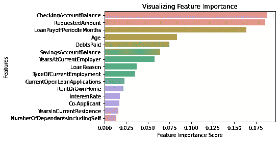
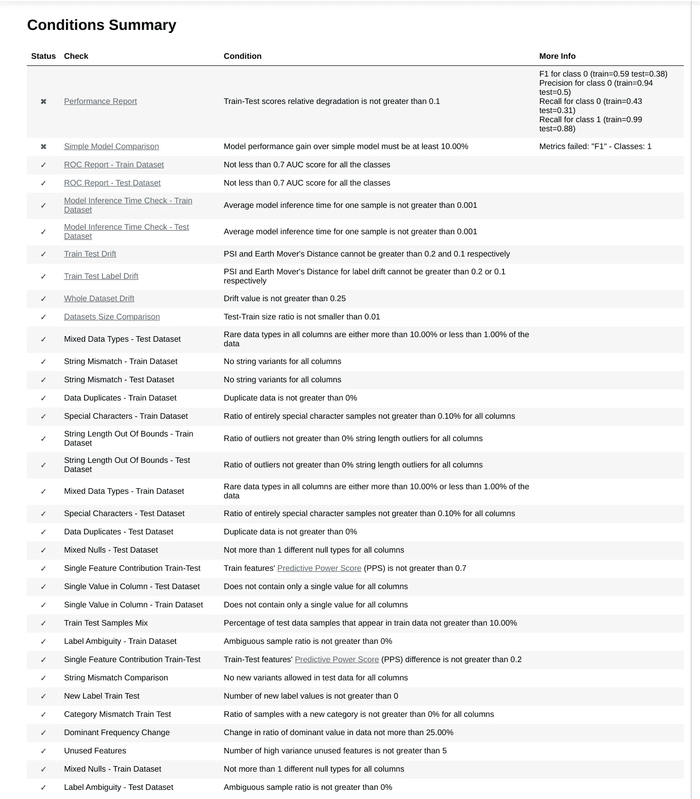
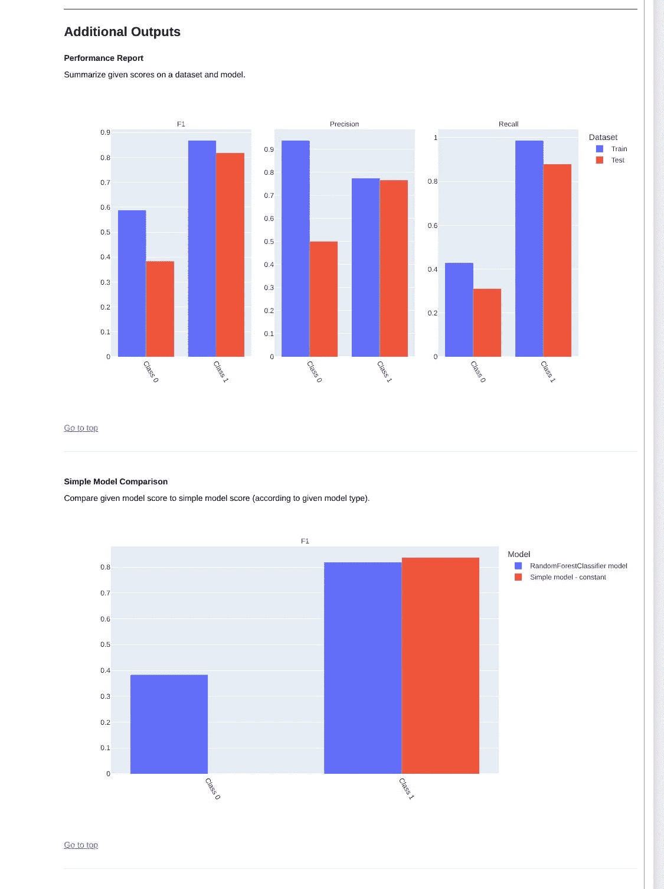
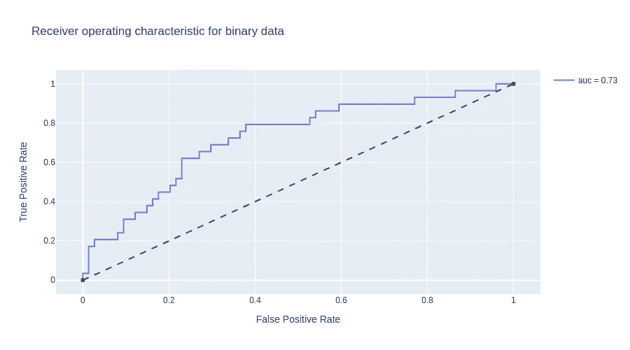
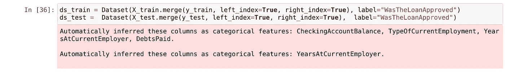
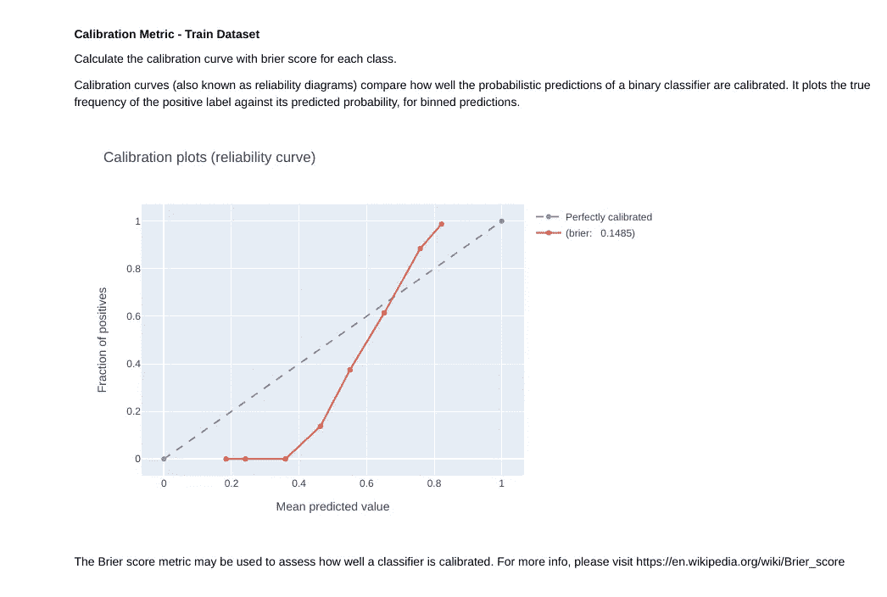
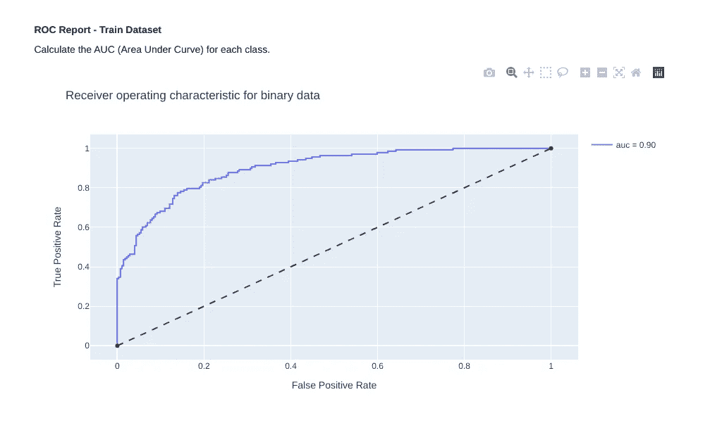

# 用于即时验证 ML 模型的最新包— Deepchecks

> 原文：<https://towardsdatascience.com/the-newest-package-for-instantly-evaluating-ml-models-deepchecks-d478e1c20d04>

## Deepchecks 是一个 ML 套件，用于验证 Scikitlearn 模型的性能。它与内置的 Scikitlearn 解决方案相比如何？


克里斯·利维拉尼在 [Unsplash](https://unsplash.com?utm_source=medium&utm_medium=referral) 上的照片

ML 模型的模型验证，尤其是在生产环境中的模型验证，一直是并且很可能将继续是机器学习研究中最困难的子课题之一。毫不奇怪，有许多初创公司、研究人员和大型科技公司投入资源来完善这个持续存在的问题。

其中一家公司 Deepchecks 刚刚开源了他们的[机器学习验证工具](https://docs.deepchecks.com/en/stable/examples/guides/quickstart_in_5_minutes.html)。该工具使用简单，可以在任何 Scikitlearn 模型上工作。

这听起来很棒，但是 Scikitlearn 提供了大量用于模型验证的内置工具。值得转行吗？

为了测试这个套件，我设置了一个相当简单的玩具问题。给定下面的数据帧模式和 550 个样本，我想预测列*被浪费了*

```
Index: CustomerID
LoanPayoffPeriodInMonths           object
LoanReason                         object
RequestedAmount                     int64
InterestRate                       object
Co-Applicant                       object
YearsAtCurrentEmployer             object
YearsInCurrentResidence             int64
Age                                 int64
RentOrOwnHome                      object
TypeOfCurrentEmployment            object
NumberOfDependantsIncludingSelf     int64
CheckingAccountBalance             object
DebtsPaid                          object
SavingsAccountBalance              object
CurrentOpenLoanApplications         int64
WasTheLoanApproved                 object
```

然后，我设置了一个故意不完美的[随机森林分类器](https://scikit-learn.org/stable/modules/generated/sklearn.ensemble.RandomForestClassifier.html)来解决这个问题，使用一些简单的参数调整，比如最小成本复杂性修剪，以及 80/20 的训练/测试分割。这个模型是故意不优化的，以评估发现常见问题的容易程度。

```
X = df[df.columns.values[:-1]]
Y = df["WasTheLoanApproved"]
X_train, X_test, y_train, y_test = train_test_split(X, Y, test_size=0.2)
clf=RandomForestClassifier(n_estimators=100, ccp_alpha=0.008)
clf.fit(X_train,y_train)
y_pred=clf.predict(X_test)
y_pred_train=clf.predict(X_train)
```

## scikit 学习简单验证

现在我已经训练好了我的简单模型，我可以使用 Scikitlearn 提供的一些简单的验证技术来识别我的模型的性能。我将查看我的训练与测试准确性、我的精确度、回忆和 F1 分数，以及我的特征重要性。下面是这样做所需的代码行:

```
#Let us look at train and test accuracy
print("Accuracy Train:",metrics.accuracy_score(y_train, y_pred_train))
print("Accuracy Test:",metrics.accuracy_score(y_test, y_pred))
print(classification_report(y_test, y_pred))
#and feature importance
feature_imp = pd.Series(clf.feature_importances_,index=df_num.columns.values[:-1]).sort_values(ascending=False)
#A chart
sns.barplot(x=feature_imp, y=feature_imp.index)
plt.xlabel('Feature Importance Score')
plt.ylabel('Features')
plt.title("Visualizing Feature Importance")
plt.legend()
plt.show()
```

不错，在 10 行代码中，我能够得到以下结果:(如果你需要复习下面的分数，我推荐[这篇中等文章](https://medium.com/@kohlishivam5522/understanding-a-classification-report-for-your-machine-learning-model-88815e2ce397)，或者如果你想要完整的课程，我推荐[数据科学道场](https://datasciencedojo.com/python-for-data-science/?ref=jdibattista3))

```
Accuracy Train: 0.7985436893203883
Accuracy Test: 0.7184466019417476
              precision    recall  f1-score   support

           0       0.50      0.31      0.38        29
           1       0.76      0.88      0.82        74

    accuracy                           0.72       103
   macro avg       0.63      0.59      0.60       103
weighted avg       0.69      0.72      0.70       103
```



作者图片

我认为解释这些结果非常容易——由于召回率低，0 的 F1 分数非常低，这意味着在这个数据集中，它将许多 0 错误地标记为 1。支持还表明数据集中 1 的实例比 0 的多得多，但这可能是也可能不是问题。特征重要性图看起来不错，表明似乎没有一个支配性特征控制分类器。一个有经验的 ML 工程师可以利用这些信息，推断出我们有一个不平衡的分类，并且可能需要尝试对 0 和 1 的比率进行更均匀的子采样，以获得更好的模型，但是这个结果可能不是每个人都清楚的。

## 深度检查现成的验证

Deepchecks 的优势在于它允许任何人用很少的代码运行一套验证指标。您所要做的就是创建 dataset 对象，指定标签列、索引(如果有意义的话)和分类特征(推荐，不是必需的)。

```
from deepchecks import Dataset
from deepchecks.suites import full_suite
ds_train = X_train.merge(y_train, left_index=True, right_index=True)
ds_test = X_test.merge(y_test, left_index=True, right_index=True)
ds_train = Dataset(ds_train, label="WasTheLoanApproved", cat_features=["TypeOfCurrentEmployment", "LoanReason", "DebtsPaid"])
ds_test =  Dataset(ds_test,  label="WasTheLoanApproved", cat_features=["TypeOfCurrentEmployment", "LoanReason", "DebtsPaid"])
suite = full_suite()
suite.run(train_dataset=ds_train, test_dataset=ds_test, model=clf)
```

在 8 行代码中，该套件对我的数据集运行了 30 多次检查。这些检查分为 4 个主要类别:[数据分布](https://docs.deepchecks.com/en/stable/examples/checks/distribution/index.html)(我的测试数据是否与我的训练数据相似)[数据完整性](https://docs.deepchecks.com/en/stable/examples/checks/integrity/index.html)(我的数据中是否有可能导致问题的错误值)[方法](https://docs.deepchecks.com/en/stable/examples/checks/methodology/index.html)(我的训练/测试集大小是否正确且没有泄漏)[性能](https://docs.deepchecks.com/en/stable/examples/checks/performance/index.html)(相当明显——我的模型是否表现良好)。



作者图片

这是条件总结，可以看出，这是一个非常强大的验证工具。这不仅提供了与我运行的几个 Scikitlearn 测试相似的结果，而且像数据完整性和数据漂移这样的问题也很容易被忽视，并需要大量的代码来测试。拥有一个可以单独检查这些内容的平台使它值得使用。

现在让我们回到我的模型。所有这些测试都已运行，当前型号只有两项检查未通过，两项检查都与性能相关。带有超链接的测试有相关的图表。让我们来看看失败的例子。



作者图片

*性能报告*故障告诉我，模型稍微过拟合。特别是当查看 0 类(贷款未批准)时，测试集精度下降非常显著。

*简单的模型比较*告诉我，当前模型的预测方式并不比每次只猜测一个常数“1”好多少。这是一个很大的问题，也是一个明显的信号，表明 1 在数据集中被过多地表示了。我可以通过查看我们的测试集 ROC 报告来确认这一点，由于我们错误地分类了我们代表不足的类，所以测试集的 ROC 报告只能勉强接受。



作者认为 auc < 0.7 为失败|图片

总的来说，这使我得出了与内置的 Scikitlearn 方法大致相同的结论，但是 Deepchecks 以一种更容易产生和理解的方式提供了这些信息。

# 改进/缺点

既然我已经展示了这个测试套件的强大功能，我想深入了解一些我想看到的特性。其中一些更挑剔，但它们是我在整个平台中发现的弱点。

## 推断分类特征是不一致的

文档指出，强烈建议显式声明任何分类特性，但是如果没有指定，平台可以尝试推断哪些是分类特性。目前的推断过程使用简单的启发式，在我的测试中，我发现这是不可靠的。



测试推断的分类特征|作者图片

如您所见，第一个问题是它不一定能检测到相同的分类特征。第二个问题是缺乏准确性。训练集确定了 4 个分类特征，其中只有 1 个实际上是分类的。我希望看到一种统计方法来代替这种启发式方法，以获得可能更好的结果。同时，在使用这个包时，请定义你的分类变量。

## 声明数据集类会变得更容易

这属于吹毛求疵的范畴。第一个问题是声明一个索引。要声明一个索引(可以进行更多的数据完整性检查)，必须将索引设为一列(使用 reset_index ),然后显式声明。如果有一个 use_dataframe_index=True/False 参数，可以轻松地绕过显式声明并使用数据帧本身的索引，这将是一个很好的改进。

第二个小的改进是能够分别传入 X(输入)和 Y(输出/预测)数据帧，而不是只接受带有显式声明标签的完整数据帧。这仅仅是因为这可以更好地匹配许多个人天生使用 Scikitlearn 的训练测试分割的方式。你可以在上面看到，我必须重新连接我的 X 和 Y 数据帧才能进入套件。

## 不一致的解释和解释资源

很大一部分图表很好地解释了测试是什么，为什么它很重要，然后是一些外部文档来做进一步的解释。这在校准度量测试中很容易看出。



校准度量测试|作者图片

由于这个原因，当图表/测试很少或没有解释时，我很失望，例如，ROC 报告



作者图片

我认为，对于最近才接触 ML 的人来说，这可能会导致信息过载的感觉，并且在出现问题时，对如何调试他们的模型缺乏指导。

## 宽松的通过-失败开箱即用

开箱即用的套件预先调整了一些关于什么是“好”模型的宽松定义。就拿我算法的测试 ROC 来说吧。当然，测试通过了，但它几乎是失败的。如果没有进一步的调查，这可能会导致用户忽略可能需要解决的问题。如果有预定义的性能层(例如，“严格”模式)，它可能会抛出更多警告，让用户知道这不是一个确定的问题，但可能是值得考虑优化的问题。

这是一个吹毛求疵的问题，因为 Deepchecks 已经通过实现[定制套件](https://docs.deepchecks.com/en/stable/examples/guides/create_a_custom_suite.html)部分解决了这个问题。对于众多测试中的任何一个，都可以调整性能边界和度量标准，从而允许对合格模型的构成进行微调。这个建议纯粹是作为单一开箱即用套件和完全定制模型之间的“中间地带”。

## 仅限于 Scikitlearn

如果包可以处理不同的 ML 包就好了。比如 NLP 的 Gensim，或者深度学习的 TensorFlow。至少检测这些其他包中的数据漂移的能力是值得探索的。

# 结论

这个包虽然新，但非常棒，只会让机器学习模型评估变得更容易。手工运行所有这些测试需要数百行代码。将它简化为一个简单的函数调用将很容易地将这个包转移到一个我计划紧密集成到我的开发过程中的包中。我迫不及待地想用这个包来扩展过去的 Scikitlearn 并开发更复杂的见解。

如果你喜欢你所读的，请随意[跟随我](https://jerdibattista.medium.com/)，阅读更多我写的东西。我倾向于每个月深入一个主题一次，这通常涉及新的包、技巧和窍门，或者 ML 空间中我认为需要更好解释的任何东西！

[](/the-best-python-sentiment-analysis-package-1-huge-common-mistake-d6da9ad6cdeb) 