# 数据科学家一直在等待的无代码熊猫替代品

> 原文：<https://towardsdatascience.com/the-no-code-pandas-alternative-that-data-scientists-have-been-waiting-for-9e22aaa9cf02>

## 为所有人简化数据分析的一步

罗伯特·阿纳奇在 [Unsplash](https://unsplash.com?utm_source=medium&utm_medium=referral) 拍摄的照片

# 动机

讲述故事对于所有数据科学项目的工作流程都至关重要。

在这方面，从数据中获取有价值的见解是每个组织都希望数据科学家具备的基本技能。

令人欣慰的是，在过去的几年里，全球各地的开发人员为开发可靠而复杂的工具做出了巨大贡献，使数据科学家的工作变得相对容易。

Python 最流行的开源工具包括 Pandas、NumPy、Matplotlib、Seaborn 等等。

本质上，这些工具允许用户使用编码指令执行各种数据分析操作。

虽然它们巨大的效用使它们在今天的数据科学项目的工作流程中几乎不可或缺，但我相信:

没有经验的初学者在试图掌握这些工具时经常会不知所措。

**→ #2** 更令人担忧的是**专家**每天花费相当多的时间和精力反复编写相同的代码，进行跨不同项目的数据分析。

*   为了获得一些观点，试着记住你已经明确地写了`df.sort_values()`、`pd.merge()`、`df.value_counts()`的次数，或者通过一遍又一遍地写相同的代码来创建不同的散点图。
*   简单来说，冗余比你想象的更频繁，抑制了工作产出。

因此，这两个团队都特别寻找省时、无代码、基于 GUI 的工具，这些工具:

1.  对**初学者**有极低的准入门槛。
2.  帮助专家根除多余的工作，做对他们重要的事情。

有人可能会说，在这种情况下，Excel 可能是一个潜在的选择。我部分同意这一点，因为 Excel 的最大问题是它的最大行数限制。这阻碍了涉及大规模数据分析的项目。

为此，我在这个博客中特别感兴趣讨论的是一个**潜在的**使用熊猫进行数据分析的无代码辅助工具，名为 [Gigasheet](https://www.gigasheet.com/) 。

为了使表格数据分析相对容易，我将在 Pandas 中执行 15 个典型操作，并演示如何使用 Gigasheet 只需点击几下按钮即可完成这些操作。

我们开始吧🚀！

# 先决条件

要使用 Pandas，应该先导入库。如下所示:

要使用 Gigasheet，你应该有一个 [Gigasheet 账户](https://gigasheet.com/)，所有东西都是预装的。

# 资料组

对于这个博客，我将使用一个由 30 万行和 9 列组成的[自创数据集](https://deepnote.com/workspace/avi-chawla-695b-aee6f4ef-2d50-4fb6-9ef2-20ee1022995a/project/Pandas-Gigasheet-3adc396b-9084-4a8c-92e4-5ecdf663e06b/%2Femployee_dataset.csv)。前五行如下所示:

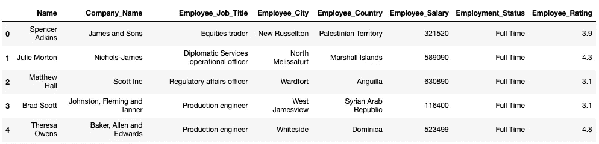

数据集的五个五行(图片由作者提供)

# #1 阅读 CSV

## 熊猫

您可以使用`pd.read_csv()`方法读取 CSV 文件并创建 Pandas 数据帧。

## 千兆页

在这里阅读 CSV 也很简单。只需上传 CSV 文件，您就可以开始了。

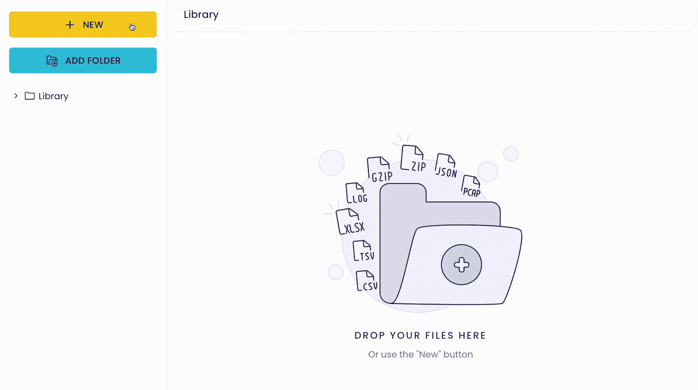

阅读 CSV(作者 Gif)

您还可以上传其他文件格式，如 JSON、XLSX、TSV、GZIP 等等。

或者，你可以利用数据连接器，如亚马逊 S3、谷歌驱动、Dropbox 等。，以上传数据集。这节省了从本地机器上传文件的时间。

# #2 数据帧的维度

## 熊猫

如果你想打印数据帧的形状(行数和列数)，你可以使用数据帧的`shape`属性。

## 千兆页

在这里，一旦您上传文件，就会显示形状。

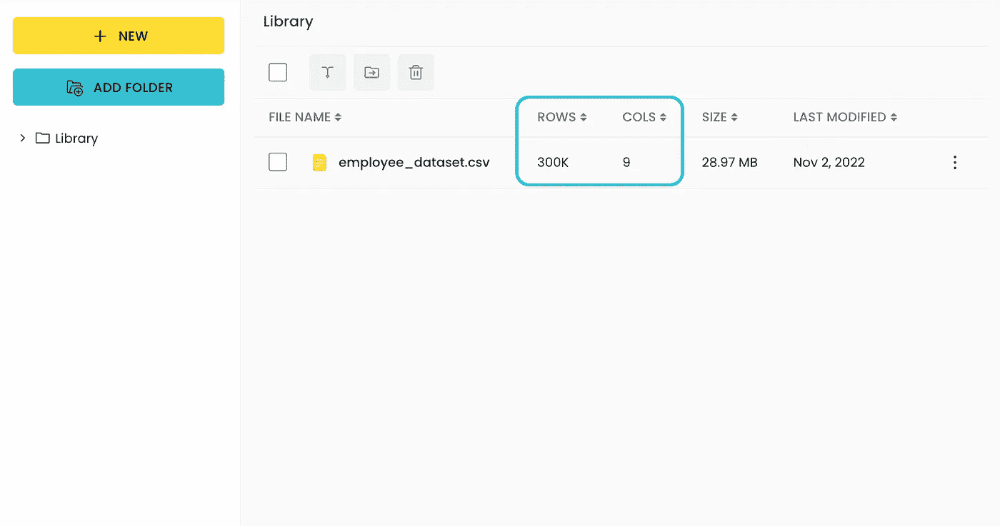

数据集的维度(图片由作者提供)

> **注意:**它计算一个额外的列来说明索引。

# #3 查看前 N 行

通常，在现实世界的数据集中，您将有许多行要处理。

在这种情况下，人们通常只对查看数据帧的前几行`n`感兴趣。

## 熊猫

您可以使用`df.head(n)`方法打印第一个`n`行:

## 千兆页

打开工作表后，默认情况下会显示前 100 行。这使您可以快速浏览数据集。

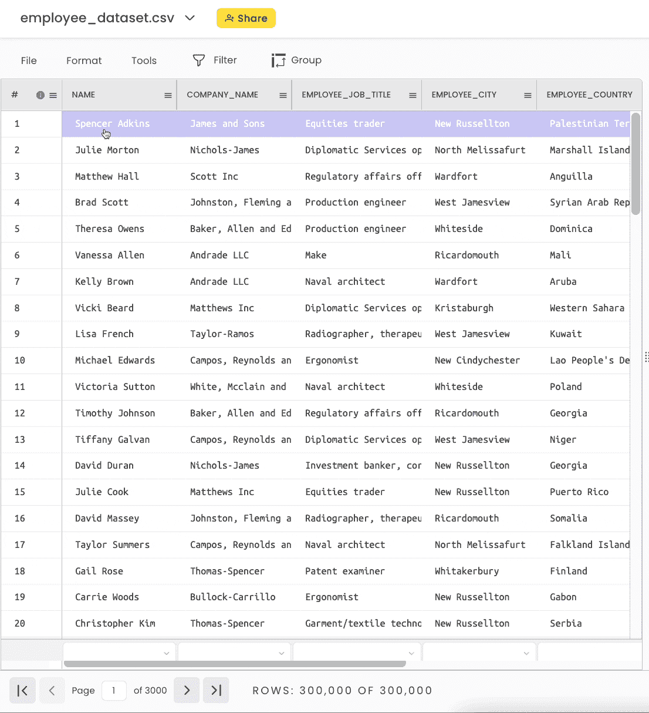

查看数据框的顶行(作者 Gif)

# #4 查看列的数据类型

## 熊猫

您可以使用`dtypes`参数查看列的数据类型。

## 千兆页

要查看列的数据类型，请单击特定的列标题并选择“更改数据类型”

数据类型显示为突出显示的文本，在本例中为`Company_Name`列的“纯文本”。

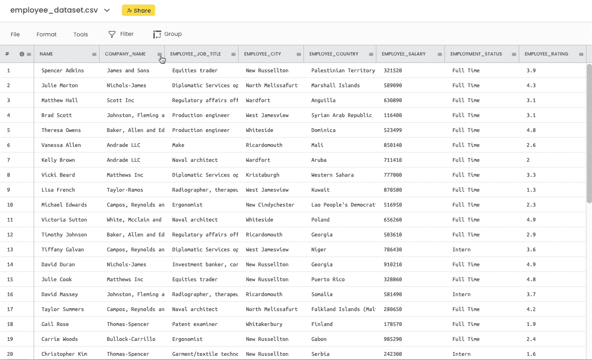

查看列的数据类型(Gif by Author)

# #5 修改列的数据类型

## 熊猫

要更改列的数据类型，可以使用如下的`astype()`方法:

## 千兆页

要更改列的数据类型，请单击特定的列标题并选择“更改数据类型”

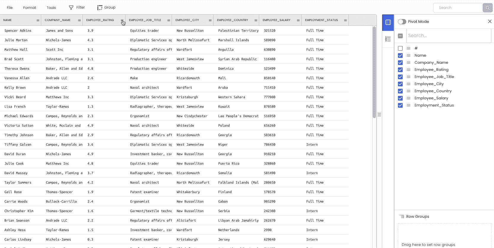

更改列的数据类型(Gif by Author)

你可能已经注意到了，修改并没有到位。简单地说，它会自动创建一个具有所需数据类型的新列，并隐藏原始列以供将来引用。

# #6 删除列

## 熊猫

如果你想删除一列，使用`df.drop()`方法:

## 千兆页

从工作区中删除列有两种方法。

第一种方法是暂时隐藏右侧边栏中的列。

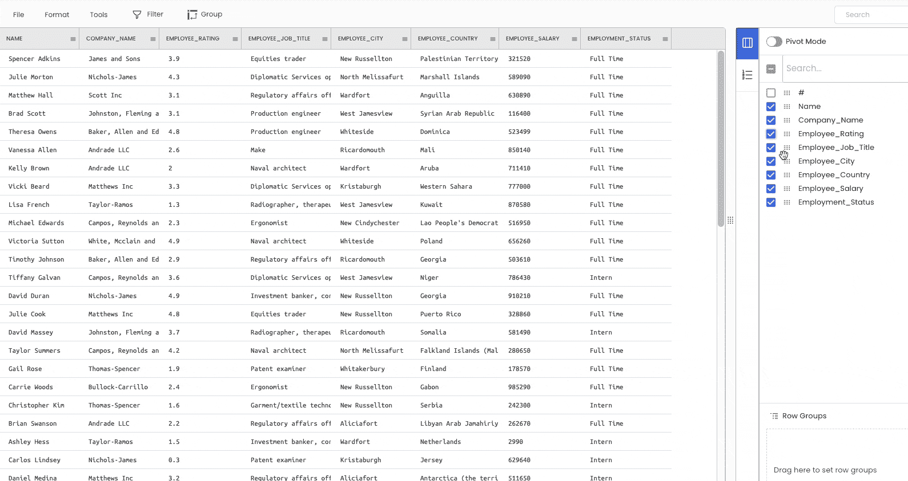

删除列(Gif by Author)

第二种方法是永久删除该列。为此，单击特定的列标题并选择“删除”

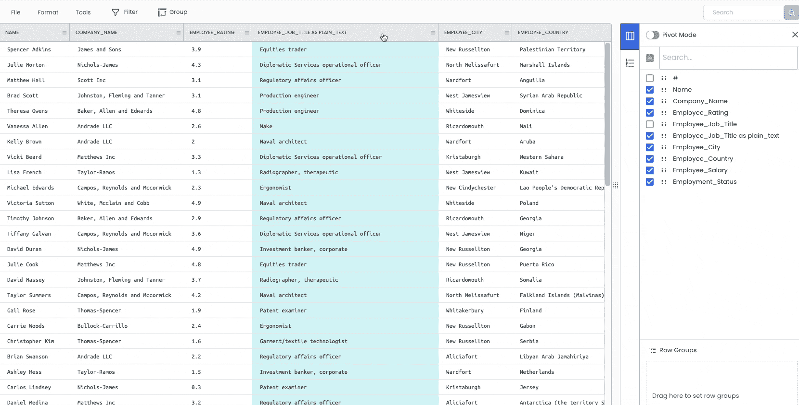

删除列(Gif by Author)

# #7 打印关于数据帧的描述性信息

## 熊猫

`df.info()`和`df.describe()`是生成数据帧统计信息的两种常用方法。

## 千兆页

您可以使用工作表底部提供的各种聚合来查看上述信息。

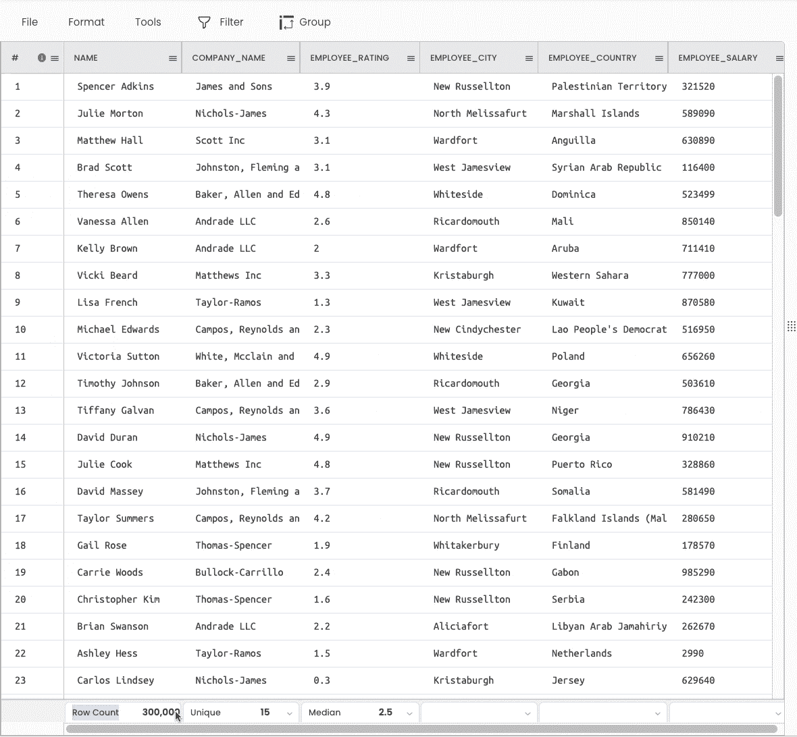

打印列的描述性统计数据(Gif by Author)

# #8 排序数据帧

## 熊猫

您可以使用`df.sort_values()`方法对数据帧进行排序。

## 千兆页

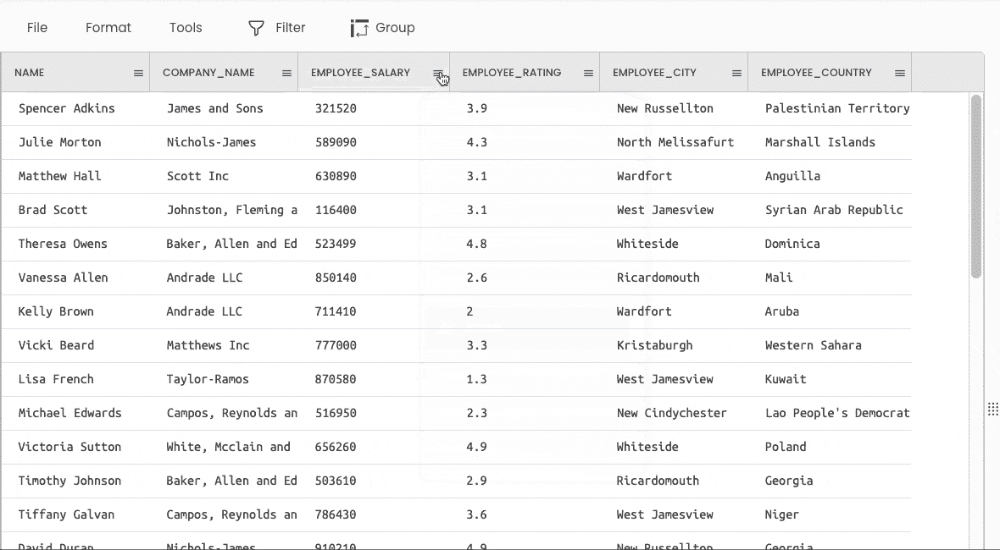

对数据帧排序(按作者排序的 Gif)

# #9 重命名列

## 熊猫

如果您想要重命名列标题，请使用`df.rename()`方法，如下所示:

## 千兆页

要更改列名，请单击特定的列标题，然后选择“重命名”

重命名列(Gif by Author)

# #10 过滤数据帧

## 熊猫

有多种方法来过滤数据帧。这些包括布尔过滤、选择列、按标签选择、按位置选择等。

## 千兆页

要过滤数据帧，请转到“过滤器”选项卡。选择列并指定要筛选的条件。

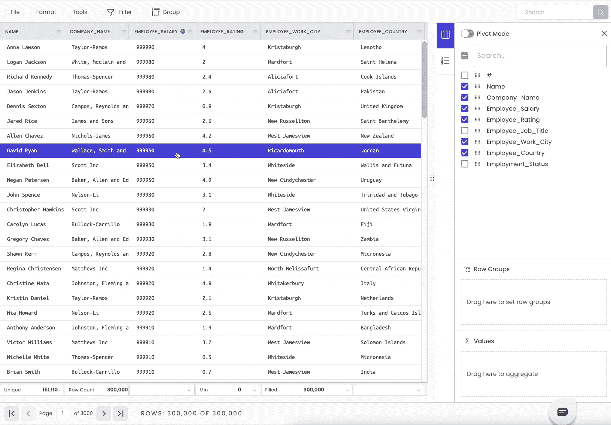

基于条件过滤数据帧(Gif by Author)

此外，它在工作表底部显示过滤后的行数。

# #11 拆分列

## 熊猫

如果您想将一个列拆分成多个列(比如说`Name`到`First_Name`和`Last_Name`，您可以对一个字符串列使用`split()`方法。

## 千兆页

要拆分列，请转到“工具”→“列”→“拆分”

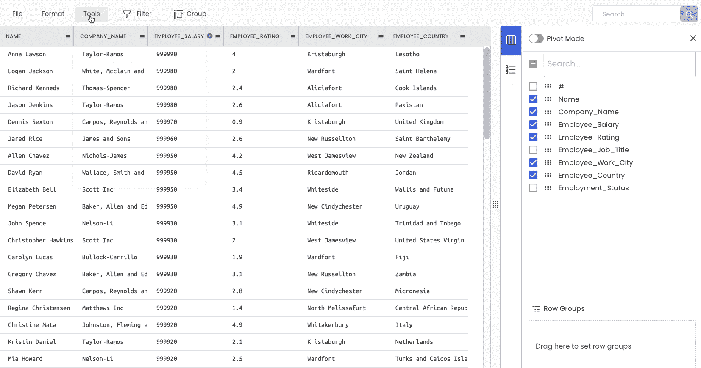

拆分列(作者 Gif)

# #12 对数据帧进行分组

## 熊猫

您可以使用 Pandas 中的`groupby()`方法对数据帧进行分组并执行聚合:

## 千兆页

要对数据框进行分组，请点击顶部栏中的“分组”按钮。

分组后，您可以在这里执行各种常见的聚合。

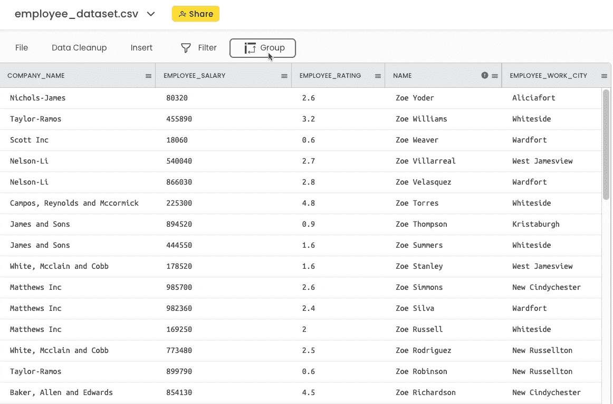

将数据框分组(按作者分组的 Gif)

# #13 添加新列

## 熊猫

您可以使用赋值运算符来添加新列:

## 千兆页

在这里，您可以转到“插入”→“计算”并执行上述操作，如下所示:

向数据框架添加新列(Gif by Author)

# #14 合并数据帧

## 熊猫

如果你想用一个连接键合并两个数据帧，使用`pd.merge()`方法:

## 千兆页

为了演示这一点，我将合并下面的 CSV 文件。合并列是`Employment_Status`。

下面演示了这些步骤。我们将使用“跨文件 VLOOKUP”工具来合并数据帧。

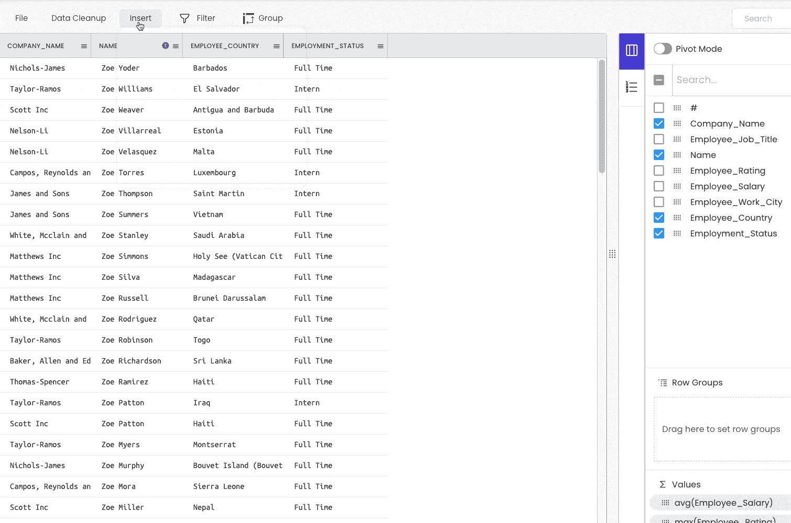

合并两个数据帧(Gif by Author)

# #15 将数据帧存储到 CSV

## 熊猫

您可以使用`df.to_csv()`方法将数据帧转储到 CSV，如下所示:

## 千兆页

保存数据帧的步骤如下所示(文件→导出)。

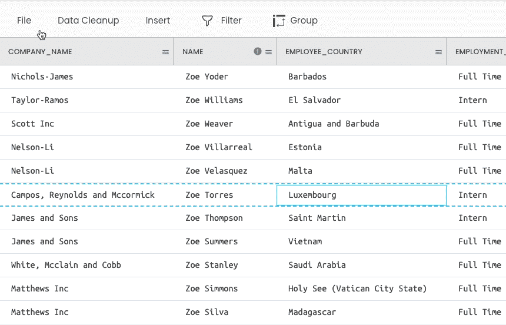

存储数据帧(Gif by Author)

# 结论

在这篇博客中，我演示了如何利用 Gigasheet 来执行 15 个最常见的 Pandas 操作，而无需编写任何代码。

我是无代码解决方案的忠实粉丝。在我看来，当谈到消除多余的工作，从而使生活变得更容易时，他们确实是游戏规则的改变者。

当然，我同意编码解决方案提供定制(以及更多)，这是它最重要的好处之一。因此，重申一下，我并不是说 Gigasheet 是(或将会是)熊猫的最终替代品。

然而，根据我的经验，我认为 Gigasheet 对于初学者来说非常方便，因为它降低了开始数据科学基本操作的门槛。

这个博客将帮助初学者学习如何在 Gigasheet 中对熊猫进行回溯引用操作。

同时，这个博客也可以帮助该领域的专家将常见的熊猫操作翻译成 Gigasheet。这将通过避免重复编写相同代码的冗余来帮助他们更快、更轻松地工作。

另一组可以利用 Gigasheet 的潜在用户是 Excel 用户。有人可能会说，这篇博客中演示的大多数操作都可以在 Excel 中轻松执行。

然而，Excel 最大的问题是它的[最大行数限制](https://www.gigasheet.com/post/excel-max-row-limit)。这阻碍了大规模数据分析项目的工作，而 Excel 不支持这种项目。

总之，虽然 Gigasheet 还没有达到杀死熊猫(或 Excel)的程度，但这种轨迹肯定是存在的。我渴望看到他们如何继续！

**一如既往感谢阅读**！我很乐意阅读您的回复:)

[🚀**订阅数据科学每日剂量。在这里，我分享关于数据科学的优雅技巧和诀窍，一天一个技巧。每天在你的收件箱里收到这些提示。**](https://avichawla.substack.com/)

[🧑‍💻**成为数据科学专家！获取包含 450 多个熊猫、NumPy 和 SQL 问题的免费数据科学掌握工具包。**](https://subscribepage.io/450q)

我喜欢探索、实验和撰写关于数据科学概念和工具的文章。你可以在 LinkedIn 上和我联系。