# 随机效应回归模型实用指南

> 原文：<https://towardsdatascience.com/the-no-nonsense-guide-to-the-random-effects-regression-model-be899ce415a5>

## 和 Python 教程，帮助您在真实数据集上使用 RE 模型

**随机效应回归模型**用于估计个人特定特征的效应，如内在不可测量的毅力或敏锐度。在**面板数据**研究中经常遇到这种个体特异性的影响。与 [**固定效应回归**](/understanding-the-fixed-effects-regression-model-d2fccc2cc27e) 模型一起，随机效应模型是研究个体特异性特征对面板数据集响应变量影响的常用技术。

本文是面板数据分析系列文章的第三部分:

1.  [如何为面板数据集构建混合 OLS 回归模型](/how-to-build-a-pooled-ols-regression-model-for-panel-data-sets-a78358f9c2a)
2.  [了解固定效应回归模型](/understanding-the-fixed-effects-regression-model-d2fccc2cc27e)
3.  **随机效应回归模型的实用指南**

对于那些读过我关于[固定效应模型](/understanding-the-fixed-effects-regression-model-d2fccc2cc27e)和[混合 OLS 模型](/how-to-build-a-pooled-ols-regression-model-for-panel-data-sets-a78358f9c2a)的文章的人来说，这篇文章的前 10%可能感觉像是对概念的修正。

让我们从简单地(重新)了解面板数据开始。

# 什么是面板数据集？

面板数据集包含关于**一组唯一可识别的个体或“事物”**的数据，这些个体或“事物”在一段时间内被主动**跟踪**。每个个体或“事物”被称为一个**单元**。可以被认为是跟踪单元的例子有个人、家庭、树、车辆、公司和国家。通常，对于每个单元，在每个时间段测量一个或多个**参数**(又名**回归变量**或**效应**)。属于一个单位(一个国家)的一组数据点称为**组**。

如果所有单元被跟踪相同数量的时间段，该数据面板被称为**平衡面板**。否则称为**不平衡**面板。如果在整个研究过程中跟踪同一组单元，则称之为**固定面板**，但如果在研究过程中单元发生变化，则称之为**旋转面板**。

面板数据通常来源于已知的纵向研究，如 T2、弗雷明汉心脏研究、T4、T5、T6、T7 或 T9 英国家庭面板调查。

# 世界银行面板数据集

在本文中，我们将使用来自世界银行的面板数据集，其中包含七个国家的人均 GDP 年同比增长率数据。这些数据是从 1992 年到 2014 年采集的。以下是该面板数据集的外观:


a 专家组数据集(来源:[世界发展指标](https://databank.worldbank.org/metadataglossary/world-development-indicators/series)数据 [CC BY 4.0 license](https://www.worldbank.org/en/about/legal/terms-of-use-for-datasets) )(图片由作者提供)

上面的数据集中，单位是一个国家，有**两个变量** : GDP 增长和 GCF 增长。因此，我们在 **23 个时间段** (1992 年至 2014 年)内跟踪 **7 个单位**中每个单位的 2 个变量。这导致创建了 7 组数据。世界银行数据集是**固定的**和**平衡的。**

# 回归目标

我们的目标是研究总资本形成年同比增长对 GDP 年同比增长的影响。

因此，我们的**因变量**或**反应变量** ***y*** 就是 *Y-o-Y %的人均 GDP 增长率*。

**自变量**或**解释变量** ***X*** 为*年-年资本形成总额增长率*。

我们将从直观地考察 GDP 增长和 GCF 增长之间的关系开始。

让我们创建一个 ***y*** 对 ***X*** 的散点图，看看数据是什么样子的。

我们将从导入所有需要的 Python 包开始，包括我们稍后将用来构建随机效果模型的包。

```
**import** pandas **as** pd
**import** scipy.stats **as** st
**import** statsmodels.api **as** sm
**import** statsmodels.formula.api **as** smf
**from** matplotlib **import** pyplot **as** plt
**import** seaborn **as** sns
```

让我们将数据集加载到熊猫数据框中。数据集可以在 这里下载 [**。**](https://gist.github.com/sachinsdate/c40651e9e4bc13a696780462209f1992)

```
df_panel = pd.**read_csv**('wb_data_panel_2ind_7units_1992_2014.csv', **header**=0)
```

我们将使用 Seaborn 绘制所有 7 个国家在所有时间段的人均 GDP 增长与每个国家总资本形成增长的关系图:

```
colors = [**'blue'**, **'red'**, **'orange'**, **'lime'**, **'yellow'**, **'cyan'**, **'violet'**]sns.**scatterplot**(**x**=df_panel[**'**GCF_GWTH_PCNT**'**], 
                **y**=df_panel[**'**GDP_PCAP_GWTH_PCNT**'**],
                **hue**=df_panel[**'**COUNTRY**'**],
                **palette**=colors).
                **set**(**title**='Y-o-Y % Change in per-capita GDP versus Y-o-Y % Change in Gross capital formation')plt.**show**()
```

我们看到下面的情节:


国内生产总值同比增长%与总资本形成同比增长%的国家散点图(图片由作者提供)

GDP 和 GCF 增长之间的关系似乎是线性的，尽管数据中也有相当多的 [**异方差**](/heteroscedasticity-is-nothing-to-be-afraid-of-730dd3f7ca1f) 。

作为一个工作假设，让我们假设以下线性函数形式的关系:

***y=*** Y-o-Y %人均国内生产总值增长率，以及，

***X=*** Y-o-Y 资本形成总额增长率


国家 I 的线性模型(图片由作者提供)

上述方程是一个矩阵方程，如变量的**粗体**字体所示。假设每组有 *T* 个时间段，每单位有 *k* 个回归变量，每单位有 *n* 个回归变量，方程中每个矩阵变量的维数如下:

*   ***y****_ I*是单元 *i* 的响应变量。它是一个大小为*【T×1】*的向量。
*   ***X****_ I*是大小*【T X k】*的回归变量矩阵。
*   ***β****_ I*是大小为*【k×1】*的系数矩阵，包含***X****_ I .*中 k 个回归变量系数的总体(真)值
*   **_ I*是一个大小为*【t×1】*的矩阵，包含模型的误差项，每个 *T* 时间段一个误差项。误差项定义为观察值和“模拟”值之间的差异。*

*下面是这个方程的矩阵形式:*

**

*国家 I 的线性回归模型的矩阵形式(图片由作者提供)*

*在世界银行面板数据集中， *T=23，k=1* 和 *n=7* 。*

*在上述回归模型中，错误术语**_ I*产生的原因如下:**

*   **测量误差，**
*   **实验装置中的随机噪声，**
*   **由于一个或相关解释变量的意外或故意遗漏而引入的错误，**
*   **回归模型选择不正确或模型中回归变量或响应变量的函数形式选择不正确。**
*   **由于我们无法测量特定单元的某些特性而引入的误差。在国家数据面板中，这种特定单位的影响可能是该国在不同环境条件下促进或抑制 GDP 增长的**社会经济结构**，以及该国数百年来演变的**企业和政府决策的文化方面**。**

**特定单位的影响本质上是不可测量的(一些作者更愿意称之为**不可观察的影响**)。**

**我们仍然需要找到一种方法来测量它们对响应变量的影响，因为如果我们从回归分析中完全忽略它们，它们的影响将以一种不受控制的方式泄漏到误差项中(并因此泄漏到训练模型的残余误差中)，并使我们的模型次优。**

**为此，我们将从重新陈述单元(即国家)的回归模型等式开始 *i* 如下:**

****

**国家 I 的线性模型的一般形式(图片由作者提供)**

**在上面的等式中:**

*   *****y*** *_i* 是一个大小为*【T x 1】*的矩阵，包含国家 *i* 的 *T* 观察值。**
*   *****X****_ I*是一个大小为*【T X k】*的矩阵，包含 *k* 回归变量的值，所有这些值都是可观察的和相关的。**
*   *****β****_ I*是一个大小为*【k x 1】*的矩阵，包含 *k* 回归变量的回归系数的总体(真)值。**
*   *****Z****_ I*是一个大小为*【T x m】*的矩阵，包含所有变量的(理论)值(数量为 *m* )和无法直接观察到的效应。**
*   *****γ****_ I*是一个大小为*【m×1】*的矩阵，包含 *m* 个不可观测变量的回归系数的(理论)总体值。**
*   *****ε****_ I*是一个大小为*【T×1】*的矩阵，包含对应于国家 *i* 的 *T* 观测值的误差项。**

**下面是矩阵乘法和加法的样子:**

****

**矩阵格式的国家 I 线性模型的一般形式(图片由作者提供)**

**所有特定于单元的效应都被假设为由术语***Z****_ I****γ****_ I .*矩阵***Z****_ I*及其系数向量***γ****_ I*是纯理论术语，因为它们所代表的内容实际上无法观察和测量。**

**我们的目标是找到一种方法来估计**_ I*对*y 的影响，即**_ I****γ****_ I 对* ***y* 的影响*******

**为了简化估算，我们将把所有国家特有的不可观测效应的影响合并到一个变量中，对于国家 *i* ，我们称之为***z****_ I*。***z****_ I*是一个大小为*【T×1】*的矩阵，因为它只包含一个变量 *z_i* ，并且它有 *T* 行对应于 *T* 个“测量值”，每一个值为*z _ I .***

**由于***z****_ I*不可直接观测，为了衡量 ***z_i*** 的效果，我们需要将省略 ***z_i*** 的效果形式化。为此，我们将求助于统计学中的一个概念，称为**省略变量偏差**。**

## **省略可变偏差**

**在面板数据集上训练模型时，如果我们从模型中遗漏掉**_ I*，就会造成所谓的**遗漏变量偏差**。可以看出，如果在不考虑 ***z_i*** 的情况下对回归模型进行估计，那么模型系数**的估计值***β****_ cap _ I*会有如下偏差:*****

****

**省略变量偏差:由于省略变量***z****_ I【图片由作者提供】*而在***β****_ I 的估计中引入的偏差***

**在上式中可以看出，估计值**_ cap _ I*中引入的偏差是**正比于省略变量 ***z*** *_i* 与解释变量***X****_ I*之间的协方差**。这表明了建立两种回归模型的动机:***

1.  ****固定效应模型**，其中协方差非零，即单位特定效应与回归变量相关，以及，**
2.  **一个**随机效应模型**，其中协方差项为零，即**单位特定效应独立于回归变量**。**

**在以前的文章中，我们看到了如何构建固定效果模型。在本文中，我们将重点关注**随机效应模型**，并将其性能与有限元模型和[混合 OLS 回归模型](/how-to-build-a-pooled-ols-regression-model-for-panel-data-sets-a78358f9c2a)进行比较。**

# **随机效应模型**

**为了理解**随机效应模型**的结构，从 FE 模型的结构开始，并将其与 re 模型的结构进行对比是很有用的。那么，让我们简单回顾一下**固定效果模型**的结构。**

**固定效应模型的关键假设是，不可观察的效应与模型的回归变量相关。在省略变量偏差一节中，我们看到这种相关性的存在将导致协方差项非零，进而导致偏差与该协方差的绝对值成比例。为了应对这种偏差，固定效应模型采用了将单位特定偏差项 *c_i* 引入回归方程的方法，如下所示:**

****

**固定效应回归模型(图片由作者提供)**

**请注意，我们已经用***_ I*替换了术语***z****_ I****γ****_ I*，它是一个大小为*【T x1】*的矩阵，其中每个元素都有相同的值 *c_i.*****

***c_i* 的*估计值*，即(我们称之为 *c_cap_i)* 是一个具有一定概率分布的随机变量，其均值为 *c_i.* 在固定效应模型中，我们假设所有单位特定效应的估计值具有相同的常方差 *σ。*假设正态分布 *c_cap_i 也很方便(尽管不是必需的)*因此，我们有:**

***c_cap_i ~ N(c_i，σ )***

**下图说明了三个单元的 *c_i* 的分布:**

****

**面板数据集中三个不同单位的单位特异性效应 c_i 的概率分布(图片由作者提供)**

**现在让我们来看看随机效应模型的动机。**

**如果单位特定效应与回归变量不相关，则该效应完全成为误差项*的一部分。*我们不能再使用我们在固定效应模型中使用的策略来补偿它的缺失*，即我们不能再假设一个独特的、单位特定的效应 *c_i* 的存在，其效应将补偿由于从模型中省略所有未观察到的变量**_ I*而引入的偏差。****

**因此，我们需要一种不同的方式来考虑单位特定的影响，为此，我们求助于一种巧妙的建模方法。**

**回忆以下回归方程:**

****

**国家 I 的线性模型的一般形式(图片由作者提供)**

**回想一下，术语***Z****_ I****γ****_ I*产生特定于单元的效果。***Z****_ I****γ****_ I*恰好是一个具有某种均值和方差的随机变量。**

**在随机效应模型中，我们假设所有单元的**单元特定效应**根据某个未知概率分布分布在公共平均值**周围。此外，该**公共平均值在数据面板中的所有时间段**内保持不变。****

**在符号方面，这些假设产生了下面的[条件期望](/3-conditionals-every-data-scientist-should-know-1916d48b078a)对于术语***Z****_ I****γ****_ I*，这意味着捕捉所有不可观察的特定于单元的效应:**

***E(****Z****_ I****γ****_ I |****X****_ I)=α***

**现在，让我们从模型的回归方程的 R.H.S .中加减这个期望值:**

**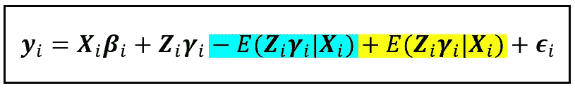**

**图片作者)**

**在上式中，术语(****Z****_ I****γ****_ I—E(****Z****_ I****γ****_ I |****X****我们将用术语***μ****_ I .*来表示这种变化****

*此外，我们已经假设上式中的黄色项(即所有单位特定效应的期望值)具有常量值 *α* ，即*E(****Z****_ I****γ****_ I |****X****

**因此，我们得出随机效应回归模型的以下方程:**

**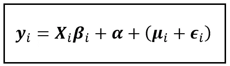**

**第一单元的随机效应模型(图片由作者提供)**

**上述等式表明了以下观点:**

**在估计模型的参数时，如果我们忽略特定于单元的效果**_ I****γ****_ I*，我们将引入两种情况:***

1.  **常数 *α* 捕捉所有单位特效的平均值。这个平均值不随时间变化，它有效地取代了回归模型的截距项。**
2.  **误差项***μ****_ I*，其大小与常数均值周围单位特定效应的方差成正比。**

**从这个角度来看，我们有理由将**_ I*与误差项***ϵ****_ I*组合在一起，形成**一个复合误差项**，我们在括号中显示了该误差项。***

**这个复合误差项是随机效应回归模型的定义特征。正如我们将很快看到的，复合误差项的各个分量需要作为 re 模型估计过程的一部分进行估计。**

**以下是单位 *i* 和特定时间段 *t* 的随机效应模型方程:**

**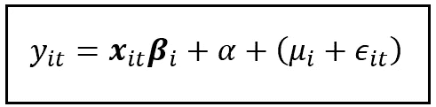**

**t 时段单位 I 的随机效应回归模型(图片由作者提供)**

**在上面的等式中:**

*   ***y_i_t* 是单位(国家) *i* 在时间段(年份) *t* 的响应变量的值(在 WB 数据集中的 GDP 增长百分比)。**
*   *****x*** *_i_t* 是一个大小为*【1 x k】*的行向量，假设有 k 个回归变量(WB 数据面板的 *k=1* )。***X****_ I _ T*是我们前面看的大小为*【T X k】*的***X****_ I*回归矩阵中的第*T*行。**
*   *****β****_ I*是一个大小为*【k×1】*的列向量。在世界银行的数据集中，只有一个回归变量:%总资本形成增长率。**
*   ***α* 是共同偏倚(所有单位特异性效应的平均值)。它形成了线性回归模型的截距。**
*   ***μ_i 是*由单位 I 的单位特定效应引入的方差。请注意，它缺少时间下标 t，因为在数据面板中假设它在所有时间段内都是常数(也称为时间不变量)。**
*   ***ϵ_i_t* 是在时间段 *t* 内为单元 *i* 引入的所有其他来源的误差的余额。**

**下面是上述等式的矩阵形式:**

**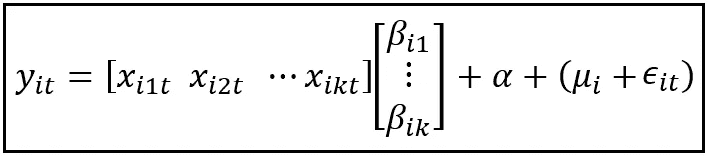**

**时间周期 t 内单元 I 的随机效应回归模型(矩阵格式，图片由作者提供)**

## **随机效应模型中复合误差项的特征**

**RE 模型的综合误差项有几个重要特征，决定了如何估算这些误差。**

1.  **与[固定效应模型](/understanding-the-fixed-effects-regression-model-d2fccc2cc27e)一样，**误差** *ϵ_i_t* **是一个随机变量，它被假定为以某种未知的(但通常被假定为正态的)概率分布围绕平均值 0**波动。因此，误差的条件期望为零: *e(ϵ_i_t|****x****_ I)= 0 对于所有单位 I 和时间段 t***
2.  **假定**误差项***【ϵ_i_t】***在数据面板中的所有单位和所有时间段的零均值附近具有恒定方差 *σ _ϵ*** 。从概率论中，我们知道随机变量的方差是以均值为中心的随机变量的平方的期望值。由于误差项的平均值为零，它只是误差平方的期望值，取决于该单元的其余回归变量值:
    *e(ϵ_ I _ t |****x****_ I)=σ_ϵ***
3.  ****误差项** *ϵ_i_t* **跨不同单位** *i* **和** *j* **或不同时间段** *t* **和** *s* (假设模型指定正确):
    *e(ϵ_i_t*ϵ_j_s|****x***=j 或者 t！= s**
4.  ****特定于单元的效果** *μ_i* **围绕零均值波动，并且它们具有恒定方差***σ_ u:
    E(μ_ I |****X****_ I)= 0*和*E(μ_ I |****X*****
5.  ****特定于单元的效果** *μ_i* **与误差***ϵ_i_t:
    e(μ_j*ϵ_i_t|****x****_ I)= 0 对于所有 I，j，t***

# **随机效应回归模型的估计**

**RE 模型的估计涉及以下两件事:**

1.  **方差分量的估计 *σ _ϵ* 和 *σ _u* 与复合残差*(****μ****+****ϵ****)。***
2.  **回归系数 ***β*** 和公共偏差 *α* 的估计(我们形成回归模型的截距项)。**

***σ _ϵ* 和 *σ _u* 的估计也为我们提供了一种估计随机效应模型能够解释的 ***y*** 中总方差分数的方法，如下所示:**

**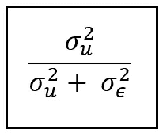**

**随机效应模型能够解释的总方差在 ***y*** 中的分数(图片由作者提供)**

**随机效应模型的估计过程通过以下一系列步骤进行:**

## **步骤 1:混合 OLSR 回归模型的估计**

**随机效果模型具有复合误差项*(****μ****+****ϵ****)。*在这一步中，我们将为估计与组件*和*相关的方差 *σ _ϵ* 和 *σ _u* 做准备。稍后将需要这些方差估计来估计模型的系数。****

**为此，我们将训练一个 [**汇集了 OLS 回归模型**](/how-to-build-a-pooled-ols-regression-model-for-panel-data-sets-a78358f9c2a) 模型的面板数据集。混合 OLSR 模型基本上是一个 OLS 回归模型，建立在面板数据组的扁平化版本上。**

****

**面板数据集的扁平化版本(图片由作者提供)**

**在世界银行数据集的情况下，我们在 GCF_GWTH_PCNT 上回归 GDP_PCAP_GWTH_PCNT:**

****

**汇集的 OLSR 数据模型(图片由作者提供)**

**我们真正感兴趣的是经过训练的 PLSR 模型的残差***【ϵ】****。在下一步中，我们将使用这些误差来估计随机效应模型的方差分量。***

## ***步骤 2:方差分量σ _ϵ和σ _ *u* 的估计***

****σ _ ϵ* 和 *σ _ μ* 是误差分量 ***μ*** 和 ***ϵ.的方差*** 为了估计方差，我们将使用样本方差的公式:***

**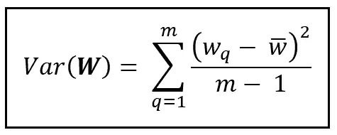**

**随机变量 ***W*** 与均值 w_bar 的样本方差公式(图片由作者提供)**

**可以看出，方差 *σ _ ϵ* 就是固定效应模型的误差项 ***ϵ*** 的方差。因此，为了估计这个方差，我们将在面板数据集上训练一个固定效应模型，如我在关于 [**固定效应模型**](/understanding-the-fixed-effects-regression-model-d2fccc2cc27e) 的文章中所示。然后，我们使用拟合模型的残差来计算 *σ _ ϵ* ，如下所示:**

**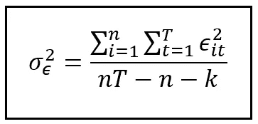**

**剩余误差*方差的计算公式(图片由作者提供)***

**上式中， *ϵ_i_t* 为训练好的有限元模型在 *t* 时刻单元 *i* 的残差。请注意，我们没有对每个误差进行去均值处理(即减去均值),因为拟合的 OLSR 模型(实际上是有限元模型)的残差均值为零。**

**在上面的公式中，内部求和是单元 *i* 的残差的平方和。外部求和对数据面板中的所有 *n* 单元执行内部求和。**

**在分母中，我们通过固定效应模型使用的组数 *(n)* 和每个组中的回归变量数( *k)* 向下调整了总自由度( *nT* )。**

**计算 *σ _u* 的程序有点复杂，σ _u 是单位效应的方差。在面板数据回归的文献中至少有三个不同的公式。我们不会深入这些公式的细节和基本原理，而是简单陈述最容易理解的公式:**

**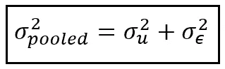**

**与随机效应回归模型的复合误差项相关的方差之间的关系*(图片由作者提供)***

**上式中， *σ _pooled* 是在面板数据集上训练的 [Pooled OLSR 模型](/how-to-build-a-pooled-ols-regression-model-for-panel-data-sets-a78358f9c2a)的残差方差。回想一下，我们在步骤 1 中拟合了这个模型。我们已经看到如何估计 *σ _ ϵ.*因此，知道了 *σ _pooled* 和 *σ _ ϵ* ，我们就可以用上面的公式来估算 *σ _u* 。**

**在接下来的两步中，我们将进一步为估计系数 ***β*** 和公共偏差 *α做准备。***

## **步骤 3:估计特定群体的平均数**

**在这一步，我们将计算数据面板中每组 *i* (即每个单元 *i* )的响应***y****_ I*和回归变量***X****_ I*的平均值。由于我们的数据面板是平衡的，每个组包含相同数量的 *T* 时间段。因此，计算组 *i* 的平均值需要对组 *i* 的响应值 ***y*** 的所有值求和(或对组 *i* 的回归变量***x _ k****的所有值求和)，然后除以 *T****

**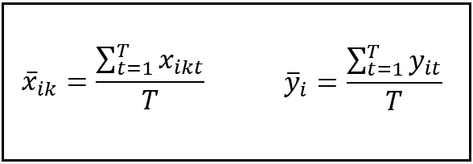**

**每个单元 I 的 **X** 和 **y** 值的组特定平均值(图片由作者提供)**

**下图说明了比利时的计算方法:**

**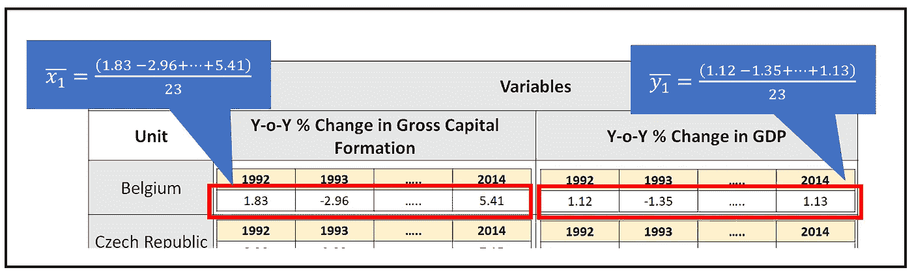**

**计算世界银行数据面板的特定群体平均值(图片由作者提供)**

**许多文本使用以下符号表示这种方法:**

**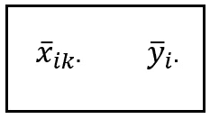**

**聚合值的点符号(图片由作者提供)**

**点的位置表示在其上执行聚合的矩阵维数。在上面的例子中，聚合是在时间维度上执行的。**

**下表包含 WB 数据集的特定组均值:**

**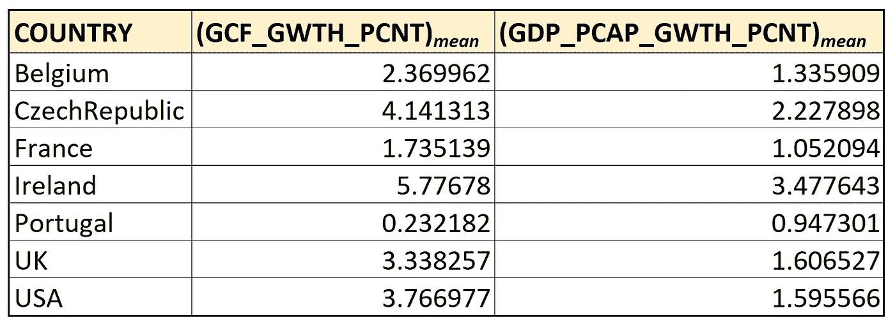**

**世界银行面板数据组的 **X** _i 和 **y** _i 的分组均值(图片由作者提供)**

**以下是这些值相互对比时的样子:**

**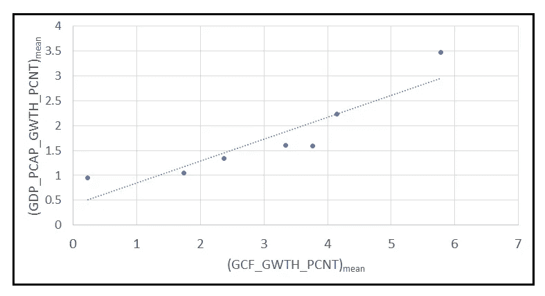**

****y** _i 对 **X** _i 的分组均值(图片由作者提供)**

**我们将在下一步中使用这些组方法。**

## **步骤 4:居中(减去平均值)数据面板的计算**

**在此步骤中，我们使用在步骤 3 中计算的各个组特定平均值，对每个单元的所有***y****_ I*和***X****_ I*值进行去平均。但是，我们没有将数据集集中在特定组的原始平均值周围，而是将其集中在平均值的缩放版本周围，其中缩放因子 *θ* 体现了特定单元随机效应的贡献。以下是对中***y****_ I*和***X****_ I*值的公式:**

**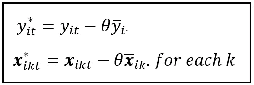**

**每个单元 I 的 **y** _i 和 **X** _i 的对中(图片由作者提供)**

**比例因子 *θ* 可以用两个方差分量 *σ _ϵ* 和 *σ _u* 表示如下:**

**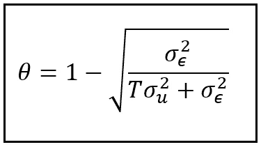**

***θ的估算(图片由作者提供)***

## **步骤 5:使用减去平均值的数据面板估计随机效应模型系数***β****_ I***

**最后，我们估计随机效应模型的系数***β****_ I*。我们通过在我们在步骤 4 中构建的均值减去数据面板( ***y*** * ***，X*** **) 【T71)上拟合 OLSR 模型来做到这一点。在时间 *t* 时，单元 *i* 的模型方程如下:***

*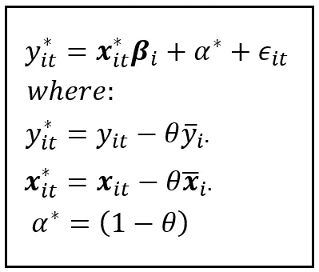*

*(图片由作者提供)*

*这就完成了随机效应模型的估算程序。*

# *如何使用 Python 和 statsmodels 实现随机效应回归模型*

*现在，我们将使用上文概述的 5 步程序，说明在世界银行数据集上构建和训练随机效应回归模型的程序。*

*在本文的开始，我们已经导入了所有需要的包，并将世界银行数据集加载到 Pandas 数据框架中。*

*让我们列出所有代码，包括我们将在后面步骤中使用的公共变量定义:*

```
*colors_master = [**'blue'**, **'red'**, **'orange'**, **'lime'**, **'yellow'**, **'cyan'**, **'violet'**, **'yellow'**, **'sandybrown'**, **'silver'**]

*#Define the units (countries) of interest* unit_names = [**'Belgium'**, **'CzechRepublic'**, **'France'**, **'Ireland'**, **'Portugal'**, **'UK'**, **'USA'**]unit_names.**sort**()

colors = colors_master[:**len**(unit_names)]

unit_col_name=**'COUNTRY'** time_period_col_name=**'YEAR'** *#Define the y and X variable names* y_var_name = **'GDP_PCAP_GWTH_PCNT'** X_var_names = [**'GCF_GWTH_PCNT'**]

***#Load the panel data set of World Bank published development indicators into a Pandas Dataframe***df_panel = pd.read_csv(**'wb_data_panel_2ind_7units_1992_2014.csv'**, **header**=0)***#Setup the variables that we will use in later steps to calculate the variance components******#n=number of groups***n=len(unit_names)

***#T=number of time periods per unit***T=df_panel.shape[0]/n

***#N=total number of rows in the panel data set***N=n*T

***#k=number of regression variables of the Pooled OLS model***k=len(X_var_names)+1plot_against_X_index=0

***#Use Seaborn to plot GDP growth over all time periods and across all countries versus gross*** *# capital formation growth:* sns.**scatterplot**(**x**=df_panel[X_var_names[plot_against_X_index]], **y**=df_panel[y_var_name], **hue**=df_panel[unit_col_name], palette=colors).**set**(**title**= 'Y-o-Y % Change in per-capita GDP versus Y-o-Y % Change in Gross capital formation')plt.**show**()*
```

*数据集可以在 这里下载 [**。**](https://gist.github.com/sachinsdate/c40651e9e4bc13a696780462209f1992)*

## *步骤 1:估计混合 OLSR 回归模型*

*在这一步中，我们将使用 statsmodels 在 panel 数据集上构建和训练一个合并的 OLS 回归模型:*

```
***#Carve out the pooled y and pooled X matrices**
grouped_y=df_panel_group_means[y_var_name]
grouped_X=df_panel_group_means[X_var_names]**#Add the placeholder for the regression intercept**
grouped_X = sm.add_constant(grouped_X)**#Build and train an OLSR model on the entire dataset**
pooled_olsr_model = sm.OLS(endog=pooled_y, exog=pooled_X)
pooled_olsr_model_results = pooled_olsr_model.fit()print(**'=============== Pooled OLSR Model ==============='**)
print(pooled_olsr_model_results.summary())*
```

*我们得到以下输出:*

*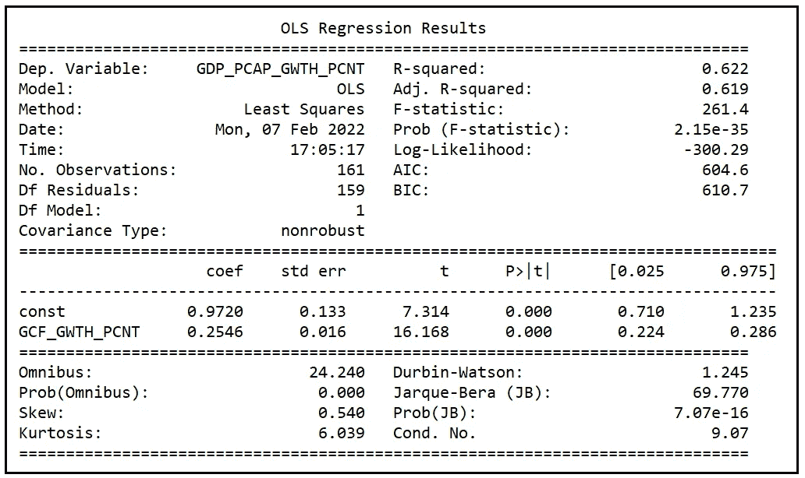*

*集合 OLSR 模型的训练总结(图片由作者提供)*

*我们对该模型的残差感兴趣，如下所示:*

```
***print**('residuals of the \'Pooled OLSR\' model:')
**print**(pooled_olsr_model_results.**resid**)*
```

*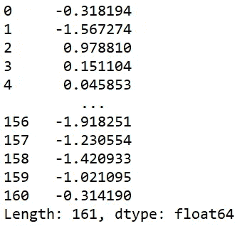*

*混合 OLSR 模型的残差(图片由作者提供)*

## *步骤 2:方差分量σ _ϵ和σ _ *u* 的计算*

*为了计算 *σ _ϵ* ，我们将在这个数据集上拟合固定效应模型。*

*在面板数据集上建立和拟合 LSDV(带虚拟变量的最小二乘)模型，以便我们可以访问它的 SSE。*

*创建虚拟变量，每个国家一个。*

```
*df_dummies = pd.**get_dummies**(df_panel[unit_col_name])*
```

*将假人数据框与面板数据集连接起来。*

```
*df_panel_with_dummies = df_panel.**join**(df_dummies)*
```

*构建 LSDV 模型的回归方程。请注意，我们省略了一个虚拟变量，以避免 7 个虚拟变量之间完全多重共线。回归模型的截距将包含被忽略的美国虚拟变量的系数值。*

```
*lsdv_expr = y_var_name + **' ~ '** i = 0
**for** X_var_name **in** X_var_names:
    **if** i > 0:
        lsdv_expr = lsdv_expr + **' + '** + X_var_name
    **else**:
        lsdv_expr = lsdv_expr + X_var_name
    i = i + 1
**for** dummy_name **in** unit_names[:-1]:
    lsdv_expr = lsdv_expr + **' + '** + dummy_name

print(**'Regression expression for OLS with dummies='** + lsdv_expr)*
```

*建立和训练 LSDV 模型。*

```
*lsdv_model = smf.**ols**(**formula**=lsdv_expr, **data**=df_panel_with_dummies)
lsdv_model_results = lsdv_model.**fit**()*
```

*打印出培训总结。*

```
*print(**'============= OLSR With Dummies ============='**)
print(lsdv_model_results.summary())*
```

*我们看到以下输出:*

*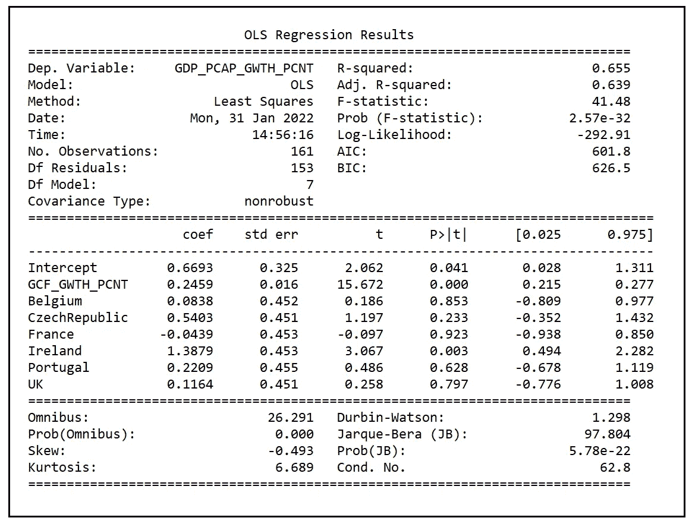*

*固定效果(LSDV)模型训练总结(图片由作者提供)*

*计算并打印 *σ _ϵ* :*

```
*sigma2_epsilon = lsdv_model_results.**ssr**/(n*T-(n+k+1))
print(**'sigma2_epsilon = '** + **str**(sigma2_epsilon))*
```

*我们得到 *σ _ϵ:* 的如下值*

```
*sigma2_epsilon = **2.359048222628497***
```

*计算 *σ _pooled:**

```
*sigma2_pooled = pooled_olsr_model_results.**ssr**/(n*T-(k+1))
print(**'sigma2_pooled** **= '** + **str**(sigma2_pooled))*
```

*我们得到 *σ _pooled 的以下值:**

```
*sigma2_pooled = **2.4717633611733136***
```

*计算 *σ _u:**

```
*sigma2_u = sigma2_pooled - sigma2_epsilon
print(**'sigma2_u = '** + **str**(sigma2_u))*
```

*我们得到以下值:*

```
*sigma2_u = **0.11271513854481663***
```

## *步骤 3:估计特定组的平均值*

*计算数据面板中各组(即每个单元 *i* )的***y****_ I*和***X****_ I*值的平均值如下:*

```
*df_panel_group_means = df_panel.**groupby**(unit_col_name).**mean**()**print**(df_panel_group_means)*
```

*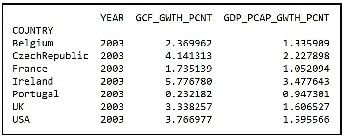*

*WB 数据面板的分组均值(图片由作者提供)*

*在上面的分组数据面板中，年份列可以忽略。*

*让我们为这个数据帧添加一个存储回归截距的列。我们将在步骤 5 中使用该列来估计公共偏置 *α* :*

```
*df_panel_group_means[**'const'**] = 1.0*
```

## *步骤 4:计算居中(减去平均值)的数据面板*

*在这一步中，我们将使用在第 2 步中计算的相应组特定平均值的缩放版本，对每个单元的所有 ***y*** *_i* 和 ***X*** *_i* 值进行去平均。*

*让我们来计算 *θ* :*

```
*theta = 1 - math.**sqrt**(sigma2_epsilon/(sigma2_epsilon + T*sigma2_u))
print(**'theta = '** + **str**(theta))*
```

*我们得到以下值:*

```
*theta = 0.30975991786766044*
```

*准备数据集，用于将 y***y***和 X 列居中:*

```
*pooled_y_with_unit_name = pd.**concat**([df_panel[unit_col_name], pooled_y], **axis**=1)pooled_X_with_unit_name = pd.**concat**([df_panel[unit_col_name], pooled_X], **axis**=1)*
```

*使用 *θ-* 缩放的组特定平均值，将每个 ***X*** 值居中:*

```
*unit_name = ''
for row_index, row **in** pooled_X_with_unit_name.**iterrows**():
    for column_name, cell_value **in** row.**items**():
        if column_name == unit_col_name:
            unit_name = 
                pooled_X_with_unit_name.**at**[row_index, column_name]
        else:
            pooled_X_group_mean = 
                df_panel_group_means.**loc**[unit_name][column_name]
            pooled_X_with_unit_name.**at**[row_index, column_name] = 
                pooled_X_with_unit_name.**at**[
                row_index, column_name] - theta*pooled_X_group_mean*
```

*使用 *θ-* 缩放的组特定平均值将每个 ***y*** 值居中:*

```
*unit_name = ''
for row_index, row **in** pooled_y_with_unit_name.**iterrows**():
    for column_name, cell_value **in** row.**items**():
        if column_name == unit_col_name:
            unit_name = 
                pooled_y_with_unit_name.at[row_index, column_name]
        else:
            pooled_y_group_mean = 
                df_panel_group_means.**loc**[unit_name][column_name]
            pooled_y_with_unit_name.**at**[row_index, column_name] = 
                pooled_y_with_unit_name.**at**[
                row_index, column_name] - theta*pooled_y_group_mean*
```

## *步骤 5:使用减去平均值的数据面板估计随机效应模型系数β_i*

*最后，让我们在`pooled_X_with_unit_name`和`pooled_X_with_unit_name.`上构建和训练 RE 模型*

*雕刻出 ***y*** 和 ***X*** 矩阵:*

```
*re_y=pooled_y_with_unit_name[**list**(pooled_y_with_unit_name.columns[1:])]re_X=pooled_X_with_unit_name[**list**(pooled_X_with_unit_name.columns[1:])]*
```

*建立和训练 OLS 回归模型:*

```
*re_model = sm.**OLS**(**endog**=re_y, **exog**=re_X)re_model_results = re_model.**fit**()*
```

*打印培训总结:*

```
***print**(re_model_results.**summary**())*
```

*我们看到以下输出:*

*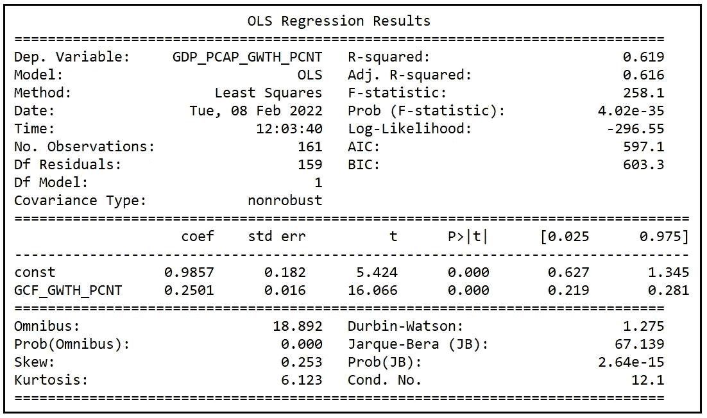*

*随机效应回归模型的训练总结(图片由作者提供)*

*这就完成了随机效应回归模型的估计过程。*

# *检验随机效应的显著性*

*回想一下 *σ _u* 估计为 **0.112723** 和 *σ _ϵ* 估计为 **2.35905** 。因此，可归因于单位特定随机效应的总方差的分数为:*

***0.112723/(0.112723+2.35905)=**0.04560 即约 4%。*

*小规模的随机效应给出了第一个提示，即随机效应模型可能不适合这个数据集，而固定效应模型可能会提供更好的拟合。*

*我们可以使用 **Breusch-Pagan LM 测试**来测试随机效应的显著性。*

***breu sch-Pagan LM 检验的零假设是单位方差** *σ _u* **为零** *。**

*测试统计如下:*

*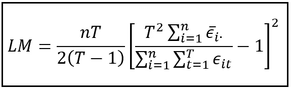*

*检验随机效应显著性的 LM 检验的检验统计量 *σ _u(图片由作者提供)**

*在 LM 检验的零假设下，检验统计量是卡方(1)分布的。*

*分母中的嵌套求和是我们在步骤 1 中拟合的混合 OLSR 模型的残差平方和。分子中的总和是来自混合 OLSR 模型的残差的分组均值的总和。请注意 *ϵ* 上的横条，它表明这是平均残差，以及“ *i* ”下标后的“点”,它表明该平均值是每组中所有时间段的集合。数据面板中有对应于 *n 个*单元的 *n 个*组。因此，分子中的总和从 1 到 n。*

*让我们计算一下世界银行数据集的这个统计值:*

```
***#Concatenate the unit names column to the Dataframe containing the residuals from the Pooled OLSR model** df_pooled_olsr_resid_with_unitnames = pd.**concat**([df_panel[unit_col_name],pooled_olsr_model_results.**resid**], **axis**=1)df_pooled_olsr_resid_group_means = df_pooled_olsr_resid_with_unitnames.**groupby**(unit_col_name).**mean**()ssr_grouped_means=(df_pooled_olsr_resid_group_means[0]**2).**sum**()ssr_pooled_olsr=pooled_olsr_model_results.**ssr**LM_statistic = (n*T)/(2*(T-1))*math.**pow**(((T*T*ssr_grouped_means)/ssr_pooled_olsr - 1),2)

print(**'BP LM Statistic='**+str(LM_statistic))*
```

*我们看到以下输出:*

```
*LM Statistic=**3.4625558219208075***
```

*让我们打印出α= 0.05 时的临界卡方值:*

```
*alpha=0.05
chi2_critical_value=st.**chi2**.**ppf**((1.0-alpha), 1)
print(**'chi2_critical_value='**+**str**(chi2_critical_value))*
```

*我们看到以下输出:*

```
*chi2_critical_value=**3.841458820694124***
```

*在α= 0.05 时，LM 检验的检验统计量( **3.46256** )小于 **3.84146** 的卡方(1)临界值，这意味着在α= 0.05 时随机效应不显著。(不要把这个 *α* 和象征 RE 模型平均单位特效的那个搞混了！)*

# *混合 OLSR、固定效应和随机效应模型的性能比较*

*在 WB 数据集上比较三个模型的性能将是有用的。对于合并的 OLSR 和有限元模型，我们将利用从[相应的](/how-to-build-a-pooled-ols-regression-model-for-panel-data-sets-a78358f9c2a) [文章](/understanding-the-fixed-effects-regression-model-d2fccc2cc27e)中获得的这些模型的结果。*

## *系数比较*

*我们发现三种模型估计的 GCF_GWTH_PCNT 回归变量的系数大致相同:*

*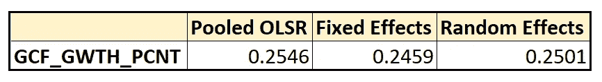*

*GCF_GWTH_PCNT 的系数(图片由作者提供)*

## *拟合优度度量的比较*

*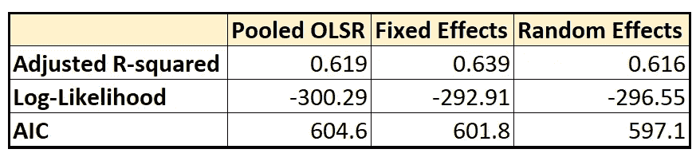*

*混合 OLSR、固定效应和随机效应模型的拟合优度比较(图片由作者提供)*

*我们看到，在固定效应模型中，调整后的 R 平方(在考虑了由于包含回归变量而导致的自由度减少后的 R 平方)比混合 OLSR 模型从 0.619 略微提高到 0.639，而随机效应模型在调整 R 平方方面几乎没有比混合 OLSR 模型提高。*

*FE 模型还产生了对数似然性从-300.29 到-292.91 的小幅增加，以及 AIC 评分从 604.6 到 601.8 的相应小幅改善(降低)。与有限元模型相比，RE 模型进一步提高了 AIC 得分，达到 597.1。*

*可以看出，有限元模型在拟合优度方面总体上优于混合模型(尽管差距很小)，而随机模型的性能却并非如此。误差项方差中随机效应的微小贡献(4%)以及 LM 检验确定的其不显著性进一步证明了这一点。*

*以下是本文中使用的完整源代码:*

# *参考文献、引文和版权*

## *数据集*

*[世界发展指标](https://databank.worldbank.org/metadataglossary/world-development-indicators/series)数据来自世界银行 [CC BY 4.0 license](https://www.worldbank.org/en/about/legal/terms-of-use-for-datasets) 。 [**下载链接**](https://gist.github.com/sachinsdate/c40651e9e4bc13a696780462209f1992)*

## *纸质和图书链接*

*以下两本书基本上涵盖了面板数据分析领域，大多数从业者无需进一步研究:*

*巴蒂·h·巴尔塔吉， [*面板数据的计量经济分析*](https://link.springer.com/book/10.1007/978-3-030-53953-5) ，第 6 版，*施普林格**

*威廉·h·格林， [*计量经济分析*](https://www.pearson.com/us/higher-education/program/Greene-Econometric-Analysis-8th-Edition/PGM334862.html) ，第 8 版*，* 2018，*培生**

*如果您是 Stata 用户，您可能会发现以下来自 Hun Myoung Park 的领域介绍和教程非常有用:[*面板数据建模实用指南:使用 Stata 的逐步分析*](https://www.iuj.ac.jp/faculty/kucc625/method/panel/panel_iuj.pdf)*

## *形象*

*本文中的所有图片版权归 [CC-BY-NC-SA](https://creativecommons.org/licenses/by-nc-sa/4.0/) 所有，除非图片下面提到了不同的来源和版权。*