# 吵闹的大象

> 原文：<https://towardsdatascience.com/the-noisy-elephant-79e9071536e>

## 无法获得更多数据？噪音小一点可能会有用

图 1 | [图片](https://pixabay.com/images/id-5172162/)取自 [DimaDim_art](https://pixabay.com/users/dimadim_art-11205138/) 来自 pixabay。

在制造业或医疗保健等更传统的行业，机器学习才刚刚开始展现其增加价值的潜力。这些行业的关键将是从以模型为中心转向以数据为中心的机器学习开发。[1]正如吴恩达(联合创始人 [Coursera](https://www.coursera.org) 和 [deeplearning.ai](https://www.deeplearning.ai) ，谷歌大脑负责人[2])指出的，在这些行业，关键将是接受机器学习的“以数据为中心”的观点，重点是数据质量而不是数量。[3]

在这篇博文中，我们将探讨噪声(质量)和数据集大小(数量)对高斯过程回归的影响。[5]我们将会看到，提高数据质量并不会增加数据量，反而会提高拟合质量。我将分三步走。首先，我将介绍数据集。其次，我将定义要模拟并添加到数据中的噪声。第三，我将探讨数据集大小和噪声对回归模型准确性的影响。这些图和数值实验是使用 Julia 生成的。代码可以在 [github](https://github.com/lnemec/VonNeumannElephant) 上找到。如果没有说明，这些数字是由代码(作者)生成的。

# 1.约翰·冯·诺依曼大象

为了探索数据集大小和噪声之间的关系，我们使用图 2 所示的冯诺依曼大象[6]。作为一个玩具数据集。

> **注:** [约翰·冯·诺依曼(1903 — 1957)](https://en.wikipedia.org/wiki/John_von_Neumann) 是匈牙利出生的数学家。他在包括数学、物理、计算机科学和统计学在内的许多领域做出了重大贡献。在 1953 年与恩利克·费密的一次会面中，他批评了自己的工作，说“**有了四个参数，我就能适应一头大象，有了五个参数，我就能让它扭动鼻子**”[7]

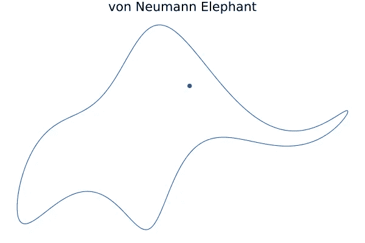

图 2 | j . Mayer 等人[6]参数化的约翰·冯·诺依曼大象周长图

大象的周长(图 2)由一组点描述( *x(t)，y(t)* ，其中 *t* 是一个参数。将 *t* 解释为时间 J. Mayer *等人*【6】将 *x(t)* 和 *y(t)* 分别展开为[傅立叶级数](https://en.wikipedia.org/wiki/Fourier_series)

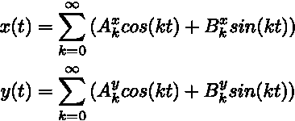

方程式 1 |傅立叶展开式

其中，上下标【T14(x，y)】表示 *x* 和 *y* 展开，下下标 *k* 表示傅里叶展开中的*第 k*项。表 1 列出了 J. Mayer 等人*发现的系数(A，B)。表 1 中列出的值还包括摆动参数*摆动系数。=40* 和眼睛的坐标*xₑ=yₑ=20*【6】。*

表 1 |生成冯诺依曼象的傅立叶展开系数。[6]

事实上，我们需要 24 个实系数来制作大象，因为 k 的范围从 k=0 到 k=5，每个 k 需要四个系数。然而，J. Mayer *等人*发现大多数系数可以设置为零，只留下八个非零参数。如果每对系数进一步总结成一个复数，大象轮廓(和躯干摆动)实际上被编码成一组四个(加一个)复数参数。

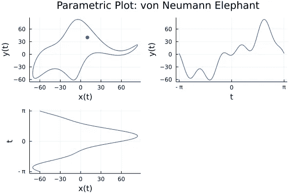

图 3 |冯·诺依曼象(左上)和傅立叶级数展开 x(t)(左下)和 y(t)(右上)的参数图。

在下文中，我们将使用曲线 *x(t)* 和 *y(t)* ，其中*t =[-π，π]* 用于我们的实验(如图 3 所示)。

# 2.噪音

对于噪声，我们使用从[均匀分布](https://en.wikipedia.org/wiki/Continuous_uniform_distribution)、[标准正态分布](https://en.wikipedia.org/wiki/Normal_distribution)或[偏斜正态分布](https://en.wikipedia.org/wiki/Skew_normal_distribution)中抽取的随机数。噪声由伪随机数发生器产生。我们在 [Julia](https://julialang.org) 中使用基于 [xoshiro](https://arxiv.org/abs/1805.01407) 算法的默认伪随机数发生器。

[**2.1 均匀分布**](https://en.wikipedia.org/wiki/Continuous_uniform_distribution)

当从连续均匀分布中取样时，区间*【a，b】*中的每个实数都是等概率的*。*图 4 显示了曲线 *x(t)* 和 *y(t)* 包括直方图中的均匀分布噪声。在图 4 中，随机数的范围从 *a=-1.5* 到 *b=1.5* 。

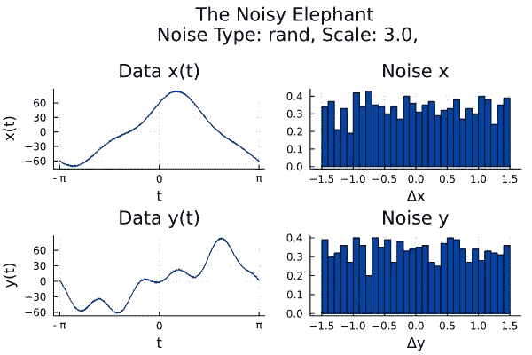

图 4 |显示了曲线 x(t)和 y(t)以及均匀分布噪声和噪声直方图(δx，δy)。噪声以 0 为中心，范围在[-1.5，1.5]之间。

[**2.2 标准正态分布**](https://en.wikipedia.org/wiki/Normal_distribution)

标准正态分布(也称为高斯分布)是实值随机变量的连续概率分布。方程给出了归一化概率密度函数(pdf)的一般形式。2

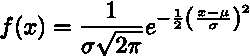

等式 2 |归一化概率密度函数的一般形式

其中参数μ是平均值(或期望值)，σ是标准正态分布[的方差](https://en.wikipedia.org/wiki/Standard_deviation)。标准正态分布是一个对称分布，其均值[、](https://en.wikipedia.org/wiki/Mean)[中位数](https://en.wikipedia.org/wiki/Median)和[众数](https://en.wikipedia.org/wiki/Mode_(statistics))相等。标准正态分布在统计学中很重要的原因之一是[中心极限定理](/the-one-theorem-every-data-scientist-should-know-f7c501d54bad)。它指出，在某些条件下，许多具有有限均值和方差的独立随机变量的平均值的抽样分布接近正态分布，因为起作用的随机变量的数目趋于无穷大。[8]被认为是许多独立过程之和的物理量，如测量误差，通常是正态分布的。[9]因此，噪声通常可以近似为标准的正态分布。

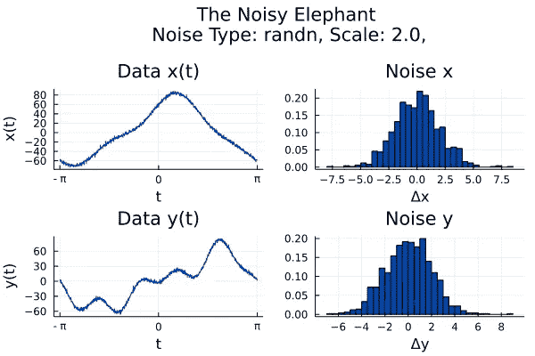

图 5 |显示了数据 x(t)和 y(t)加上标准正态分布噪声以及噪声直方图(δx，δy)。噪声的均值为 0，标准差为σ=2。

图 5 显示了数据曲线 *x(t)* 和 *y(t)* ，包括标准正态分布产生的噪声。在示例中(图 5)，噪声的均值为μ=0，标准差为σ=2。

[**2.3 偏斜正态分布**](https://en.wikipedia.org/wiki/Skew_normal_distribution)

偏斜正态分布代表一种非对称扰动正态分布。该分布可用于模拟不对称噪声，其中一条尾巴比另一条长。在偏态正态分布中，平均值和中位数通常是不同的。偏斜正态概率密度函数(pdf)的一般形式，如等式所示。3、是标准正态分布 pdf*φ(x ')*和误差函数ψ(α x ')的乘积。

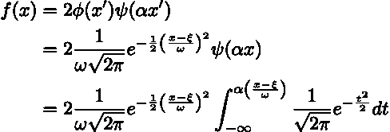

等式 3 |偏斜正态概率密度函数

其中位置由ξ给出，标度由ω给出，参数α定义偏斜度。*φ(x’)*成为正态分布(方程式。2)对于等式中的α=0。3.通常，参数α被称为形状参数，因为它调节 pdf 的形状。如果α >为 0，则分布是右偏的，如果α <为 0，则分布是左偏的。

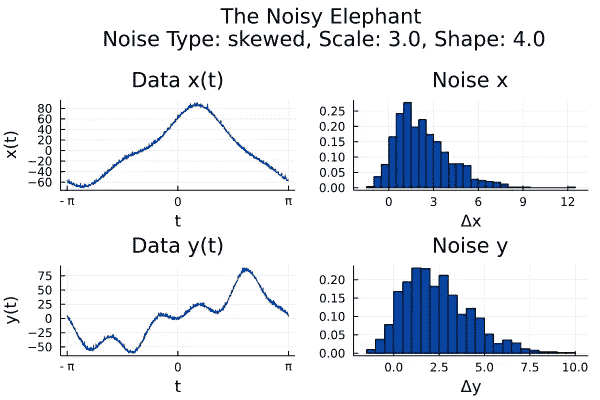

图 6 |显示了曲线 x(t)和 y(t)加上偏斜的标准正态分布噪声以及噪声直方图(δx，δy)。位置ξ=0，比例ω=3，形状α=4。

图 6 显示了数据曲线 *x(t)* 和 *y(t)* ，包括偏斜正态分布产生的噪声。噪声是使用参数 location ξ=0，scale ω=3，shape α=4 生成的。

# 3.第一个实验:数据集大小和回归质量

对于第一个实验，让我们使用数据 *y(t)* 并添加由标准正态分布产生的噪声，其中 *μ=0* 和 *σ=2* (见图 5)。对于本例，我们采用如上所述的具有 *N=1000* 个数据点的数据集，从中随机选择 *10、50、100、*和 *500* 个数据点，如图 7 所示。为了拟合采样点，我们使用高斯过程。

为什么是高斯过程？除了被广泛使用之外，高斯过程在小数据集上工作得很好，并且与其他可比的机器学习方法相比，高斯过程在训练或推断期间更容易确定问题的原因。例如，高斯过程已经被月球探测器公司 X 在一个项目中使用，该项目是用平流层气球扩展互联网连接。利用高斯过程，每个气球决定如何最好地利用盛行风，使自己成为一个大型通信网络的一部分。[4]

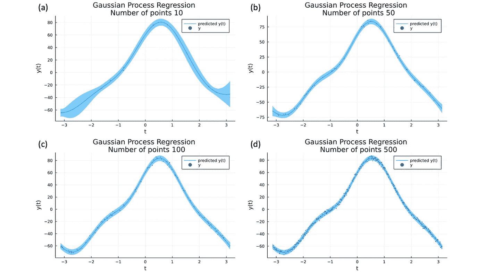

图 7 |显示了高斯过程(a)对数据(蓝点)的拟合(青色线)和置信区间 0.95(蓝带)，10(b)50(c)100(d)500 个数据点。

为了评估高斯过程回归的质量，我们基于真实值和拟合值之间的差异来计算误差。关于机器学习回归中的错误的简明介绍，参见参考文献。[10].在这里，我们计算[平均绝对误差(MAE)](https://en.wikipedia.org/wiki/Mean_absolute_error) 、[均方误差(MSE)](https://en.wikipedia.org/wiki/Mean_squared_error) 、[均方根误差(RMSE)](https://en.wikipedia.org/wiki/Root-mean-square_deviation) 。表 2 列出了对应于我们上述回归(图 7)的 MAE、MSE 和 RMSE。

表 2 |对应于图 7 所示回归的 MAE、MSE 和 RMSE

从图 7 和 Tab。2，我们看到拟合的质量如何随着更多的数据点而提高。随着数据越来越多，拟合度越来越高，这并不令人惊讶。图 8 也在双对数图中显示了这种行为。

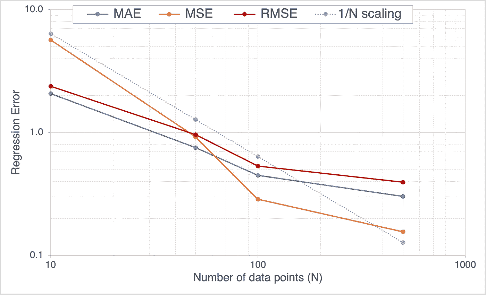

图 8 |显示了与图 7 /表 2 所示回归相对应的 MAE、MSE 和 RMSE。轴以对数刻度显示。灰色虚线表示用于比较的 1/N 比例。

我们看到，将点数从 N=50 增加到 N=500 会使 RMSE 降低 60%。稍后，我们将看到将噪声的影响减半会产生类似的减少。

> **注意:**对于高斯过程回归，我们使用平方指数(se)函数作为核函数(等式)。4).在高斯过程回归中，SE 核是大多数机器学习库中的默认核。与其他内核相比，SE 有一些优势。例如，在其先验中的每个函数都是无限多次可微的。此外，它也只有两个参数:长度标度 *ℓ* 和输出方差σ。长度标尺 *ℓ* 决定函数中“摆动”的长度。输出方差σ决定了函数与其均值的平均距离。对于图 7 所示的拟合，我们选择了超参数 *ℓ=8* 和 *σ=75。*

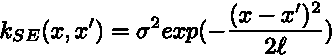

等式 4 |平方指数核

# 4.第二个实验:噪声类型的影响

接下来，我们使用数据 x *(t)* 并添加由三种不同分布产生的噪声:均匀分布、标准正态分布和偏斜正态分布，如*章节所述。2* 。对于均匀分布，我们从区间 *a=-2.0* 到 *b=2.0* 进行采样。对于标准正态分布，我们使用参数 *μ=0* 表示平均值，使用参数 *σ =4.0* 表示方差。对于偏态正态分布，我们使用参数 *ξ=0* 、 *ω=2.0* 、 *α=2.0* 。对于所有三种分布，我们使用 N=1000 个数据点的数据集。从数据集中，我们随机选择了 500 个数据点，如图 9 的左栏所示。

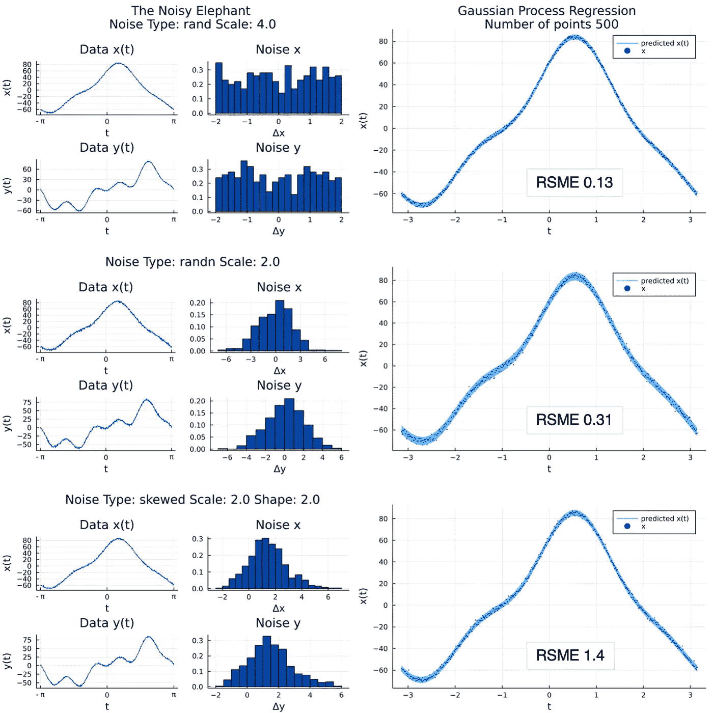

图 9 |左栏:基于不同分布的曲线 x(t)和 y(t)加上噪声，以及噪声直方图(δx，δy)。右栏:显示拟合(青色线)采样点 y(t)+δy(蓝色点)和置信区间(蓝色带)，由具有 500 个数据点的高斯过程给出。从上到下，它显示了从均匀(rand)、标准正态(randn)和偏斜正态(skewed)分布中提取的噪声。

我们使用高斯过程回归，就像之前在第二节中一样。3.高斯过程回归的结果显示在图 9 的右栏中。数据点显示为蓝色点，结果拟合为青色线。此外，我们看到拟合的置信区间(0.95)并将其可视化为蓝带。

对于均匀噪声和高斯噪声，均方根误差分别为 0.13 和 0.31。高斯拟合 RMSE 更高，因为噪声的方差也更大。偏斜的正常情况更困难。在高斯和均匀情况下，最小化拟合 RMSE 相当于找到最大似然拟合。然而，偏斜正态情况更困难，因为均值和众数(最大似然)是不同的。由于高斯过程回归优化最大似然拟合，而不是 RMSE 最小化，我们预计 RMSE 更高。事实上，RMSE 是 1.4，如图 9 所示。总之，我们看到了噪声的规模和形状如何影响我们所期望的拟合 RMSE。

# 5.第三个实验:噪音的影响

在第三个实验中，我们使用曲线 x *(t)* ，并添加均匀、标准正态和偏斜正态分布产生的噪声，如*节所述。2* 。我们按如下方式改变每个分布的噪声比例:

*   均匀分布:[a，b] = {[-1，1]，[-2，2]，[-4，4]，[-8，8]}；平均值= 0
*   正态分布:σ={1，2，4，8 }；平均值 *μ=0*
*   偏斜正态分布:ω={1，2，4，8 }；参数 *ξ=0* ， *α=2.0*

我们对每个分布使用 N=5000 个数据点的数据集。我们从数据集中随机选择{50，100，500，1000}个点。对于数据点的规模、分布和数量的每种组合，我们使用高斯过程回归并计算拟合 RMSE 值，如前第节所述。3.RMSEs 在表中列出。下面 3。

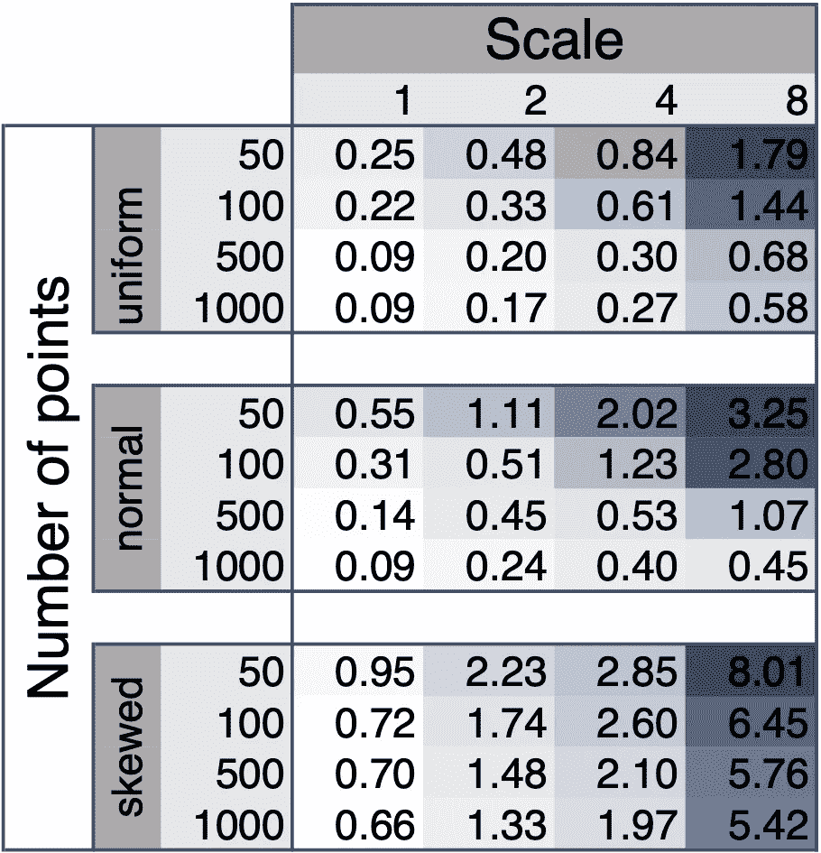

表 3|生成数据中不同噪声等级的高斯过程回归的 RMSE。噪声采样自均匀、正态和偏斜分布。数据集大小从 50 到 1000 个数据点不等。

第三个实验表明，对于所有三种分布，数据点的数量必须随着噪声规模的增加而增加，以保持与 RSME 测量的相同的拟合质量。例如，从 N=100 个点的区间[-2，2](标度= 2)采样的均匀噪声开始，我们可以将点数增加到 N=1000，以减少 48%的 RMSE，或者通过从更小的区间[-1，1](标度=1)采样来降低噪声，以减少 33%的 RMSE。看着标签。3，我们看到了其他尺度、数据集大小和噪声类型的类似权衡— **将噪声减半与将数据集大小增加 10 倍产生类似的改善。**

# 6.结论

我们已经看到，更多的噪声数据导致更差的拟合。此外，即使对于相同的方差，噪声的形状也会对拟合质量产生深远的影响。最后，我们比较了改进数据质量和数量，发现降低噪声可以产生与增加数据点数量相似的拟合改进。

在工业应用中，数据集很小，更多的数据很难获得，理解、控制和减少数据的噪声提供了一种从根本上提高拟合质量的方法。有多种方法可以控制和有效地降低噪声。关于灵感，参见参考文献。[11].

# 参考

1.  吴恩达“ [*AI 对你的业务来说不必太复杂或太昂贵*](https://hbr.org/2021/07/ai-doesnt-have-to-be-too-complicated-or-expensive-for-your-business) ”，《哈佛商业评论》(2021 年 7 月)
2.  维基百科文章“ [*吴恩达*](https://en.wikipedia.org/wiki/Andrew_Ng)”(2021 年 12 月)
3.  谷歌大脑 的联合创始人尼古拉斯·戈登(Nicholas Gordon)“[*不要相信‘大数据’的宣传”，fortune.com(2021 年 7 月)*](https://fortune.com/2021/07/30/ai-adoption-big-data-andrew-ng-consumer-internet/)
4.  詹姆士·威尔森、保罗·r·多尔蒂和蔡斯·达文波特" [*人工智能的未来将是更少的数据，而不是更多的*](https://hbr.org/2019/01/the-future-of-ai-will-be-about-less-data-not-more) ，《哈佛商业评论》(2019 年 1 月)
5.  麦凯、戴维、j . c .《[*信息论、推理和学习算法*](http://www.inference.phy.cam.ac.uk/itprnn/book.pdf) *》，*剑桥大学出版社。ISBN 978-0521642989(2003 年 9 月)
    Carl Eduard Rasmussen 和 Christopher K.I. Williams，“[机器学习的高斯过程](http://www.gaussianprocess.org/gpml/chapters/RW.pdf)”，麻省理工学院出版社 ISBN 978-0262182539(2005 年 11 月)
6.  于尔根·迈耶、哈立德·凯里和黄邦贤·霍华德“ [*用四个复杂参数*](https://aapt.scitation.org/doi/10.1119/1.3254017) 画一头大象”，《美国物理学报》78，648，DOI:[10.1119/1.3254017](https://doi.org/10.1119/1.3254017)(2010 年 5 月)
7.  弗里曼·戴森 [*与恩利克·费密*](https://www.nature.com/articles/427297a) 《自然》427，6972，297，DOI:[10.1038/427297 A](https://doi.org/10.1038/427297a)(2004 年 1 月)
8.  [Julia Kho](https://medium.com/u/75b5f5a46f52?source=post_page-----79e9071536e--------------------------------)[每个数据科学家都应该知道的一个定理](/the-one-theorem-every-data-scientist-should-know-f7c501d54bad)，[Medium.com—走向数据科学](https://towardsdatascience.com)(2018 年 10 月)
9.  [库珀·道尔](https://medium.com/u/f9f30269fe4f?source=post_page-----79e9071536e--------------------------------)[*信号与噪音:中心极限定理如何使数据科学成为可能*](/the-signal-and-the-noise-d82b8630c3ad) ，[Medium.com——走向数据科学](https://towardsdatascience.com)(2021 年 9 月)
10.  [Eugenio Zuccarelli](https://medium.com/u/d0d529173bc4?source=post_page-----79e9071536e--------------------------------) “机器学习中的性能指标——第 2 部分:回归”，[Medium.com——迈向数据科学](/performance-metrics-in-machine-learning-part-2-regression-c60608f3ef6a)(2021 年 1 月)
11.  [Andrew Zhu](https://medium.com/u/bf0160c6bb?source=post_page-----79e9071536e--------------------------------) “用 Python 中的傅里叶变换清理数据噪声”，【Medium.com】—走向数据科学(2021 年 10 月)