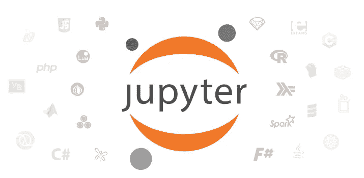
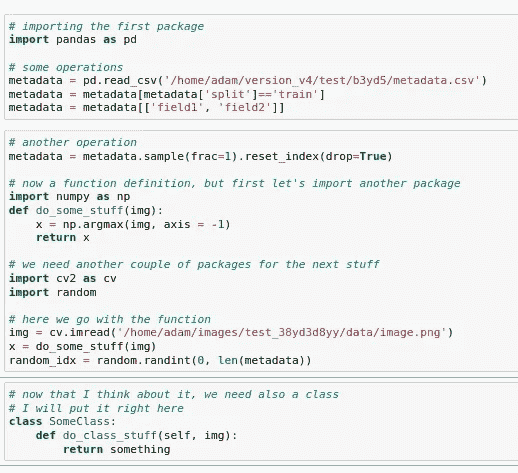
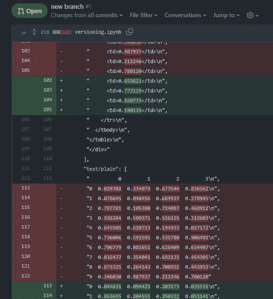

# 笔记本引发的回归

> 原文：<https://towardsdatascience.com/the-notebook-induced-regression-fc46b0e7f1dd>

## 意见

## 笔记本的大量采用如何对数据科学中的代码质量产生负面影响

洛伦佐·埃雷拉在 [Unsplash](https://unsplash.com/s/photos/computer?utm_source=unsplash&utm_medium=referral&utm_content=creditCopyText) 上的照片

每个数据科学家都熟悉**笔记本**的定义:一个用于以交互方式编写和运行计算机程序的网络界面。笔记本可以连接到几个被称为**内核**的计算后端:它们提供了运行诸如 *Python* 、 *R* 、 *Julia* 等许多其他语言所需的 API。

> 如今，笔记本电脑在很大程度上被社区所使用，特别是用于技术科学计算，如数据处理、机器学习和人工智能/深度学习任务。

## 笔记本有很多优点

笔记本为用户提供了一个完全交互式的环境，用户可以在其中写笔记和文档(即使有 Latex 支持)，编写和运行特定部分的代码(即**笔记本单元**)，并以数字或图形形式显示结果(如数据帧和图表)。因此，笔记本电脑丰富了基于控制台的方法，提供了身临其境的基于网络的编码体验。

JupyterLab 会话中的运行单元格-作者图片

事实上，我认为笔记本在很多方面都是一个很好的工具。它们允许**快速开发和测试**代码。它们也非常适合教学和演示。

我碰巧参加的任何基于代码的课程都是基于笔记本的。每当我教授包含代码的课程时，我也会使用笔记本，以便在课堂上演示和讨论例子和练习。

马修·奥斯本在 [Unsplash](https://unsplash.com/s/photos/presentation?utm_source=unsplash&utm_medium=referral&utm_content=creditCopyText) 上拍摄的照片

最后但并非最不重要的是，笔记本可以无缝地用来创建漂亮的演示文稿，因为它们允许显示代码和开发过程中遵循的工作流程所获得的结果(并且根据 T2 文化编程的概念)。为此，笔记本可以导出并保存为 **PDF、Latex 或 HTML 文档**。

## 相同的概念，许多产品

鉴于这一工具的广泛流行，在过去几年中已经开发了许多不同的笔记本电脑解决方案。一些最著名的包括 *Jupyter* 、 *Amazon SageMaker* (作为 AWS 工具的一部分)和 *Google Colab* ，但是还有许多其他的存在。你可以在这个网站上找到一个相当详尽的概述[。](https://datasciencenotebook.org/)

Jupyter 徽标，来自 [Jupyter 主页](https://jupyter.org/)——根据记名使用规则允许复制

从历史上看， [Jupyter](https://jupyter.org/) 是 2014 年作为 [IPython](https://ipython.org/) 项目的副产品开发的第一款笔记本电脑。它是基于 Python 的完全免费的产品。它可以通过 *pip* 轻松安装，笔记本网络服务可以在本地运行(例如，在用于访问笔记本的同一台机器上)或通过网络运行。最近还推出了 **JupyterLab** ，它带有更高级的界面和附加功能。

## 又快又脏？

现在我们来看痛苦的音符。出于同样的原因，笔记本能够快速编写代码，笔记本用户的方法通常都是由良好的编程实践激发的。

以我的经验来看，主要是 Python，笔记本经常被糟糕的代码组织所困扰。例如，包的导入，在任何代码的开始都应该是*总是*的，被沿着单元传播，因为它们只是被插入到需要它们的地方。

因为笔记本并不鼓励创建像类和函数这样的结构，所以大部分代码都是由脚本和代码片段来表示的，但是当有类和函数时，它们也会沿着单元格分布，这符合已经提到的“我在需要时放置它”的原则。

互联网上常见笔记本电脑的典型结构—作者图片

## 对笔记本进行版本控制是有问题的

笔记本的另一个相关问题是代码版本。基本上，笔记本是 JSON 文件，表示单元格的输入(即代码或文本)、输出(即计算结果)和格式化元数据。当涉及到用**版本控制系统**组织笔记本的代码时，处理拉取请求和代码审查变成了一项复杂而令人沮丧的任务。

忘记清除输出使得比较一个文件的不同版本变得非常不切实际。但是即使没有输出，逐行比较仍然需要很大的耐心，因为我们必须处理格式化元数据带来的大量样板文件。

祝代码审查好运！—作者图片

## 协作也有问题

版本问题的直接后果是，开发人员之间的有效协作变得很难完成。我必须承认，有几次**我发现自己通过电子邮件发送和接收笔记本**，因为，尽管这是一种可悲的做法，但它仍然比试图使用 git 更方便。

有了这种(不好的)做法，同事之间交换困惑的问题是很常见的。

> 脚本的最新版本是什么？我可以用你一小时前寄给我的这个吗？你知道我昨天对这个函数的修改在哪里吗？

最后，难怪你会发现自己重复做同样的工作两次，也许是因为在这个“协作过程”中出了问题。毕竟， **VCS 正是为了避免这些恼人的情况而被创造出来的。**

## 原型与生产

许多数据科学家没有强大的 IT 背景，因此笔记本对他们来说是一个方便的工具。只需很少的努力，他们就可以处理数据，建立复杂的计算管道，开发尖端技术。从这个意义上来说，今天的笔记本电脑与多年前的 **Matlab** 非常相似(尽管程度较轻，但仍然如此):一个为工程师、研究人员和科学家设计的**易用 IDE** 。

然而，虽然像 Matlab 这样的工具很自然地在原型和生产级代码之间带来了清晰的界限，但是像 Python 这样的语言使得这一界限更加模糊。Python 生态系统足够灵活，可以容纳原型和生产系统。数据科学代码通常被设计为处于这些领域的中间，因为通常:

*   它托管在公司服务器上，*但*
*   它的执行是用户触发的，*然而*
*   它通常以一定的周期运行，*和*
*   有时，它必须在很短的时间内频繁运行(例如，由于项目的截止日期)。

## 底线

长话短说，笔记本是快速代码开发和测试的伟大工具。他们对于**教学、**以及**展示和讨论用例**也非常有用。

> 然而，在这些情况之外，特别是当目标是开发一个**高质量的协作代码**，**笔记本应该尽可能少地使用****。**

**当它们存在时，在代码经过测试和验证之后，它们应该根据所用语言的**最佳实践**进行翻译和重新安排。**