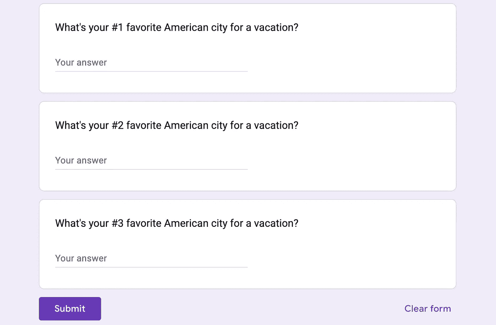
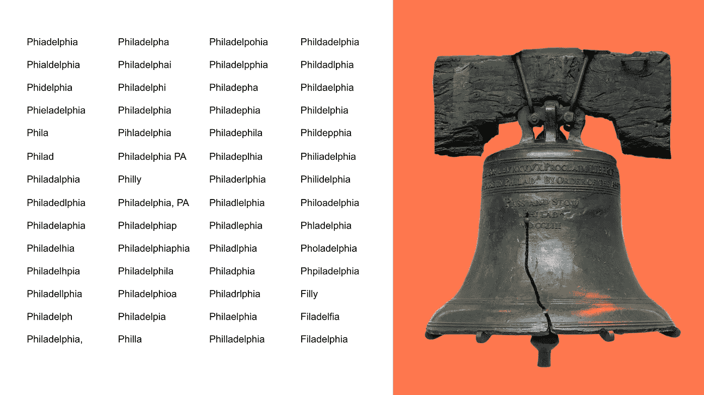
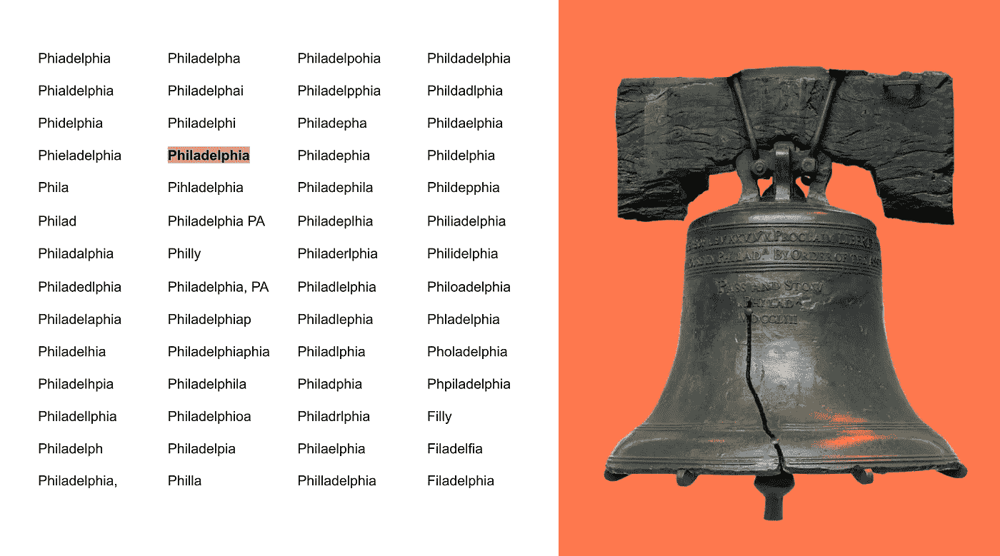
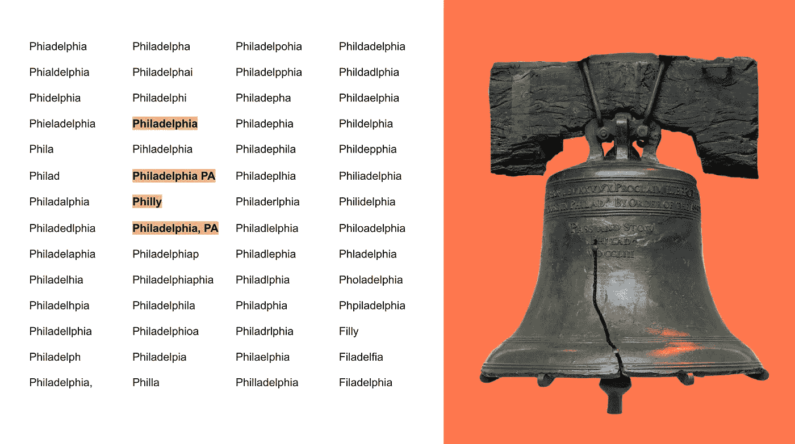
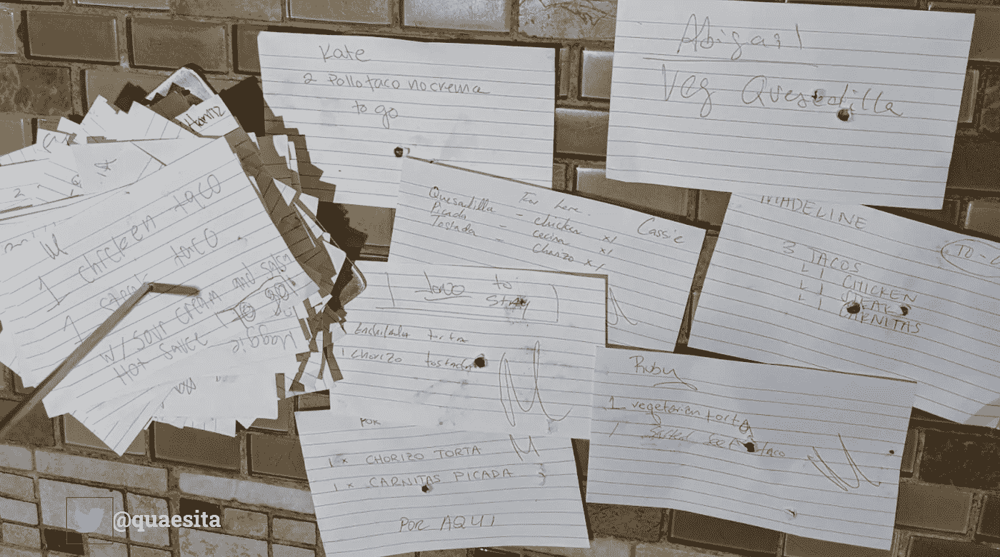
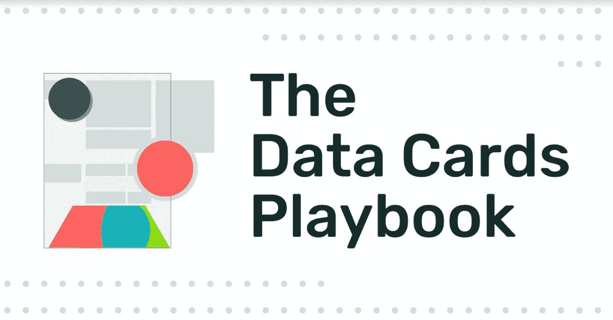
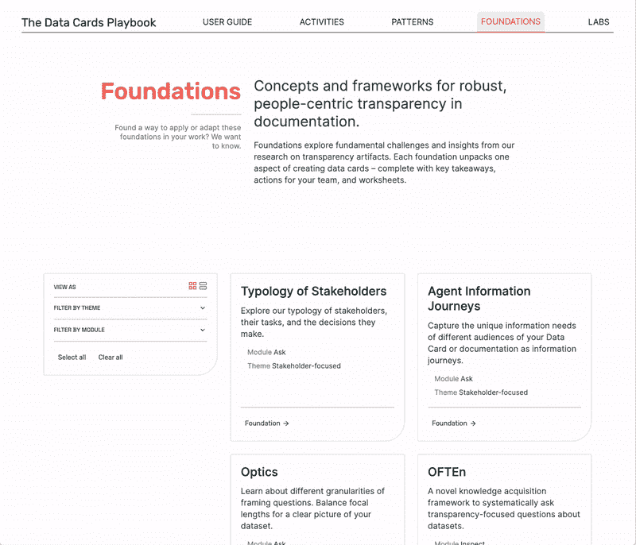

# 数据设计的晦涩艺术

> 原文：<https://towardsdatascience.com/the-obscure-art-of-data-design-397ffb230596>

## 为数字时代对抗尴尬的新炼金术

数据职业空间被令人厌恶地夸大了。不是夸大其词(这里的 ***是*** 从[数据](bit.ly/quaesita_hist)中获得的难以置信的价值)，而是更像是“错误键入”——许多人出于所有错误的原因产生数据嗡嗡声。

兴奋的正确理由与一句老话有关，知识就是力量:改善你的业务、工作、个人生活和你周围世界的力量。随着存储和处理知识原材料的技术进步，有如此多的潜力等待着被发掘。这值得几卡车的炒作。

但是我希望你能和我一起对错误的类型说不:不要把数据等同于魔法。垃圾不会变成金子，不管你对它投入多少数学。工业界对数据炼金术的迷恋，就像 15 世纪对在铁屑上喃喃自语的拉丁语胡言乱语的迷恋一样令人尴尬。

> 不要把数据等同于魔法。

我希望我们都停止用大写字母“D”来读数据。数据并不神奇——仅仅因为你有一个充满数字的电子表格，并不保证你能从中获得任何有用的东西。GIGO 原则一如既往地适用。

> 垃圾进，垃圾出。

数据不是事实。远非如此。让我们用一个例子来说明这一点。下图是美国的象征，自由钟。在继续阅读之前，花点时间记下这个标志性物品所在的城市。

图片由作者改编自[维基百科](https://en.wikipedia.org/wiki/Liberty_Bell#/media/File:Liberty_Bell_2017a.jpg)。

现在想象一下，你正在为一个旅游组织工作，你的任务是在你的用户[人群](http://bit.ly/quaesita_popwrong)中收集美国最令人愉快的度假目的地的数据。您创建了一个在线调查，邀请用户通过一个开放的表单字段告诉您他们最喜欢的三个旅游城市。会出什么问题呢？

作者创建的 Google 表单截图(心情沉重，因为这个调查太糟糕了)。

稍后，当你查看回复时，你会注意到一些关于自由钟城市的条目…

哦不。

诺诺诺诺诺诺。

这到底是什么奖励？

脱发症？

Phi-load-elphia？？

Phpiladelphia？？？

在这一点上，最好把它拼写成 Pffffftiladelphia，因为这些用户生成的输入对你有好处。但是，让我们对人类慷慨一点，让我们自己有片刻的感激，因为正确的答案出现在了这辆小丑车上。但是哪个才是正确答案呢？

这个吗？

当然，但是这些怎么样？

这四个答案都不错…但是同一条目的四个不同版本并不是有自尊心的数据人的好主意。这不是扑克。如果你正在从你的数据中寻找最清晰、最干净的信号，那么近似的副本不是你的朋友。

此外，仅仅因为这些回答在技术上是正确的，并不意味着你会喜欢处理它们。例如，一个逗号——就像宾夕法尼亚州费城的一个逗号——可能会破坏您的 CSV 文件。为什么，哦为什么，你让用户这样对你？

这种情况很搞笑，但也很可悲。都是！哲学，真的。但更重要的是，这种情况是可以预防的*。*

*在这个例子中，回答者真诚地试图提供帮助。没人想惹你。你让人们告诉你他们喜欢参观哪些城市，他们尽了最大努力。如果他们能正确拼写，也许他们会。这不像他们的答案是火星或他们的猫的名字什么的…他们真的是想告诉你，费城是一个不错的城市。*

*这些条目中的每一个都有费城的信号，但它们并不都一样。其中一些比其他的信号弱得多。你在追求尽可能多的信号，但是如果你让人们随心所欲地输入他们的数据，许多信号将会丢失，你将需要花费时间、精力和资源来清理这些信号以恢复它们。然而，如果你一开始就聪明地设计了这个数据集合，那么每个费城条目都将是信号，没有噪音。*

**

*再举一个例子，请看这张我在布鲁克林玉米卷工厂拍的照片。这是一家很棒的餐馆，菜单很丰富，顾客可以在便签卡上写下他们想要的任何东西。这里有一堆订单需要员工处理(我的订单在中间)。人类很神奇，因为他们能理解所有这些不同的格式，但请注意这些格式是如何随处可见的。我敢打赌，有些时候，即使是这个地方的胡说八道的员工也会因为顾客头脑中有意义的东西而感到困惑。还有其他收集数据的方法。更好的方法。不过，这里的食物是一流的。*

*如果任其自生自灭，人们会发现挫败你的数据收集意图的非凡方法。如果你把设计数据收集留给那些没有预见和预防问题的技能的人，你将浪费时间和金钱去清理一个混乱的数据集。(有时候，再多的努力都没有用，而且永远都毁了。)数据清理是圣人的工作，但应该是万不得已的工作。聪明地计划要比希望你能通过勤奋的清理来修正糟糕的计划好得多。*

> *如果任其自生自灭，人们会发现挫败你的数据收集意图的非凡方法。*

*这就引出了我的主要观点。人们不是直观有序的数据设计者。设计数据收集需要专业知识，这样才能更快、更容易地让数据变得可用和有用。*

*还记得互联网看起来好像每个程序员都幻想自己是设计师吗？恶心。当没有人花时间去学习一些数据设计技巧时，数据集大概就是这个样子。*

*如果您对[让数据变得有用](http://bit.ly/quaesita_datascim)感兴趣，我强烈建议您熟悉以下两个主题:*

*   *[主数据与继承数据](http://bit.ly/quaesita_provenance)*
*   *[真实世界数据收集](https://bit.ly/quaesita_srstrees1)*

*我欣喜若狂，因为我认识的一些最有激情的数据设计师最近发布了一份关于数据设计主题的培训手册，即[数据卡行动手册](http://bit.ly/datacardsplaybook)。如果你对数据很认真的话，一定要去看看！*

**

*拿到这里:[bit.ly/datacardsplaybook](https://bit.ly/datacardsplaybook)*

*记住，[数据](http://bit.ly/quaesita_hist)不欠你什么。对你的麻烦来说连像样的质量都没有。永远无法保证你的数据不是垃圾。如果你的组织中有数学魔法思维，并且你认为获取数据是容易的部分，那么你会忽略雇佣那些真正擅长确保这些数据不是垃圾的人。*

> *是时候让我们开始重视制作好数据所涉及的技能了，至少要重视让现有数据变得有用的技能。*

**

*说到垃圾进，垃圾出，你的作者走进这个地方，出来的时候一模一样。\_(ツ)_/*

# *感谢阅读！YouTube 课程怎么样？*

*如果你在这里很开心，并且你正在寻找一个为初学者和专家设计的有趣的完整的应用人工智能课程，这里有一个我为你制作的娱乐课程:*

*点击在 YouTube [上欣赏课程。](https://bit.ly/funaicourse)*

**又及:你有没有试过在 Medium 上不止一次点击拍手按钮，看看会发生什么？* ❤️*

# *寻找动手 ML/AI 教程？*

*以下是我最喜欢的 10 分钟演练:*

*   *[AutoML](https://console.cloud.google.com/?walkthrough_id=automl_quickstart)*
*   *[顶点 AI](https://bit.ly/kozvertex)*
*   *[人工智能笔记本](https://bit.ly/kozvertexnotebooks)*
*   *[ML 为表格数据](https://bit.ly/kozvertextables)*
*   *[文本分类](https://bit.ly/kozvertextext)*
*   *[图像分类](https://bit.ly/kozverteximage)*
*   *[视频分类](https://bit.ly/kozvertexvideo)*

# *不要忘记访问数据卡行动手册！*

**

*在这里获得:[bit.ly/datacardsplaybook](https://bit.ly/datacardsplaybook)(图片由[玛希玛·普什卡纳](https://www.linkedin.com/in/mahimapushkarna/)，剧本创作人之一，经许可使用)*

*尽管该网站强调数据文档和人工智能(必须抓住那个时代精神),但[数据卡剧本](https://bit.ly/datacardsplaybook)远不止这些。这是我所知道的最强大的通用数据设计资源集。预览:*

**

*在这里获得:[bit.ly/datacardsplaybook](https://bit.ly/datacardsplaybook)(图片由[玛希玛·普什卡纳](https://www.linkedin.com/in/mahimapushkarna/)，剧本创作人之一，经许可使用)*

# *喜欢作者？与凯西·科兹尔科夫联系*

*让我们做朋友吧！你可以在 [Twitter](https://twitter.com/quaesita) 、 [YouTube](https://www.youtube.com/channel/UCbOX--VOebPe-MMRkatFRxw) 、 [Substack](http://decision.substack.com/) 、 [LinkedIn](https://www.linkedin.com/in/kozyrkov/) 上找到我。有兴趣让我在你的活动上发言吗？使用[表格](http://bit.ly/makecassietalk)取得联系。*