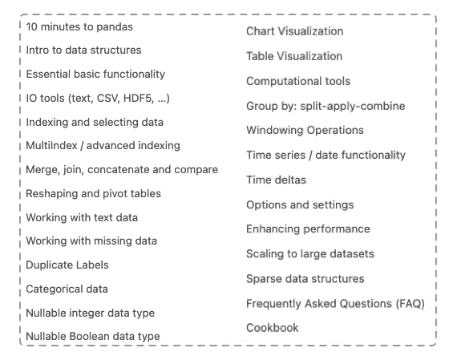

# 成为熊猫专家你应该掌握的 30 种方法

> 原文：<https://towardsdatascience.com/the-only-30-methods-you-should-master-to-become-a-pandas-pro-749795084bb2>

## 在使用熊猫三年多之后，这里是我几乎一直使用的 30 种方法

格伦·卡斯滕斯-彼得斯在 [Unsplash](https://unsplash.com?utm_source=medium&utm_medium=referral) 上的照片

Pandas 无疑是 Python 中为表格数据争论和处理任务而构建的最好的库之一。

由于是开源的，来自世界各地的众多开发人员为它的开发做出了贡献，并使它达到了今天的水平——支持各种任务的数百种方法。

然而，如果你是一个新手，并试图在熊猫图书馆得到一个稳固的位置，如果你从熊猫的官方文件开始，事情一开始会显得非常令人生畏和令人不知所措。

主题列表如下所示:

熊猫官方 API 文档中的主题列表(图片由作者提供)(来源:[此处](https://pandas.pydata.org/docs/user_guide/index.html))

我自己也去过那里，这个博客旨在帮助你开始接触熊猫。

换句话说，在这篇博客中，我将回顾我 3 年多来使用熊猫的经验，并分享我几乎一直使用的 30 种具体方法。

你可以在这里找到这篇文章[的代码。](https://deepnote.com/workspace/avi-chawla-695b-aee6f4ef-2d50-4fb6-9ef2-20ee1022995a/project/Untitled-project-1673f17b-3f5c-46f7-a40a-0576addb3113/%2Fnotebook.ipynb)

我们开始吧🚀！

# 导入库

当然，如果你想使用熊猫库，你应该导入它。这里广泛采用的惯例是将`pandas`的别名设置为`pd`。

# #1 阅读 CSV

CSV 通常是读取熊猫数据帧最流行的文件格式。

你可以使用`pd.read_csv()`方法创建一个熊猫数据帧:

我们可以验证使用`type()`方法创建的对象的类型。

# #2 将数据帧存储到 CSV

正如 CSV 普遍用于读取数据帧一样，它们也广泛用于转储数据帧。

使用如下所示的`df.to_csv()`方法:

分隔符(`sep`)表示列分隔符，而`index=False`指示 Pandas**而非**将数据帧的索引写入 CSV 文件。

# # 3–4 创建数据框架

为了创建熊猫数据帧，使用了`pd.DataFrame()`方法:

## 从列表列表中

一种流行的方法是将给定的列表转换成数据帧:

## 从字典上

另一种流行的方法是将 Python 字典转换成数据帧:

你可以在这里阅读更多关于创建数据框架[的信息。](https://pandas.pydata.org/docs/reference/api/pandas.DataFrame.html)

# #5 数据帧的形状

数据帧本质上是一个带有列标题的矩阵。因此，它有特定的行数和列数。

可以用`shape`参数打印尺寸，如下所示:

这里，元组的第一个元素(`2`)是行数，第二个元素(`3`)是列数。

# #6 查看前 N 行

通常，在现实世界的数据集中，您会有许多行。

在这种情况下，人们通常只对查看数据帧的前几行`n`感兴趣。

您可以使用`df.head(n)`方法打印第一个`n`行:

# #7 打印列的数据类型

Pandas 为数据帧中的每一列分配适当的数据类型。

您可以使用`dtypes`参数打印所有列的数据类型:

# #8 修改列的数据类型

如果你想改变一个列的数据类型，你可以使用如下的`astype()`方法:

# # 9–10 打印关于数据帧的描述性信息

## 方法 1

第一种方法(`df.info()`)用于打印缺失值统计和数据类型。

## 方法 2

这相对更具描述性，并打印标准统计数据，如`mean`、`standard deviation`、`maximum`等。每个**数值型**列的。

方法是`df.describe()`。

# #11 填充 NaN 值

在现实世界的数据集中，缺失数据几乎是不可避免的。

这里，您可以使用`df.fillna()`方法将它们替换为一个特定的值。

在我之前的博客中阅读更多关于处理缺失数据的内容:

  

# #12 连接数据框

如果想用连接键合并两个数据帧，使用`pd.merge()`方法:

# #13 排序数据帧

排序是数据科学家用来排序数据帧的另一种典型操作。

您可以使用`df.sort_values()`方法对数据帧进行排序。

# #14 对数据帧进行分组

要对数据帧进行分组并执行聚合，请在 Pandas 中使用`groupby()`方法，如下所示:

# #15 重命名列

如果您想要重命名列标题，请使用`df.rename()`方法，如下所示:

# #16 删除列

如果你想删除一列，使用`df.drop()`方法:

# #17 添加新列

添加新列的两种广泛使用的方法是:

## 方法 1

您可以使用赋值运算符来添加新列:

## 方法 2

或者，您也可以使用如下的`df.assign()`方法:

# # 18–21 过滤数据帧

基于条件过滤数据帧有多种方法。

## 方法 1:布尔过滤

这里，如果一行上的条件评估为`True`，则选择该行。

对于要过滤的行，`**col2**`中的值应大于 **5** 。

`isin()`方法用于选择其值属于一个值列表的行。

你可以在我之前的博客中读到基于字符串的过滤:

  

## 方法 2:获取列

您也可以按如下方式过滤整列:

## 方法 3:按标签选择

在基于标签的选择中，要求的每个标签都必须在数据帧的索引中。

> 整数也是有效的标签，但是它们指的是标签而不是位置。

考虑下面的数据帧。

我们使用`df.loc`方法进行基于标签的选择。

但是在`df.loc[]`中，不允许使用位置来过滤数据帧，如下图所示:

为了达到上述目的，您应该使用`df.iloc[]`进行基于位置的选择。

## 方法 4:按职位选择

# # 22–23 在数据帧中查找唯一值

要打印一列中的所有不同值，请使用`unique()`方法。

如果您想打印唯一值的数量，请使用`nunique()`代替。

# #24 将函数应用于数据帧

如果您想对列应用函数，使用如下所示的`*apply()*`方法:

您也可以将一种方法应用于单个列，如下所示:

# # 25–26 处理重复

您可以使用`df.duplicated()`方法标记所有重复的行:

所有重复的行被标记为**真**，keep =假。

此外，您可以使用`df.drop_duplicates()`方法删除重复的行，如下所示:

保留重复行的一个副本。

# #27 寻找值的分布

要查找列中每个唯一值的频率，使用 `value_counts()`方法:

# #28 重置数据帧的索引

要重置数据帧的索引，使用`df.reset_index()`方法:

要删除旧索引，请将`drop=True`作为参数传递给上述方法:

# #29 查找交叉列表

要返回跨两列的每个值组合的频率，请使用`pd.crosstab()`方法:

# #30 旋转数据框

数据透视表是 Excel 中常用的数据分析工具。与上面讨论的交叉表类似，Pandas 中的数据透视表提供了一种交叉制表的方法。

考虑下面的数据框架:

使用`pd.pivot_table()`方法，您可以将列条目转换为列标题:

恭喜🎊，你已经了解了熊猫最有用的 30 种方法。

总之，我可以自信地说，你可能会在 95%的时间里用这些方法和熊猫打交道。

这项研究得到了我自己的经验以及与其他数据科学家的合作和看到他们的工作的支持。

感谢阅读。我希望这篇文章是有帮助的。

[**🚀订阅每日数据科学。在这里，我分享关于数据科学的优雅技巧和诀窍，一天一个技巧。每天在你的收件箱里收到这些提示。**](https://avichawla.substack.com/)

[🧑‍💻**成为数据科学专家！获取包含 450 多个熊猫、NumPy 和 SQL 问题的免费数据科学掌握工具包。**](https://subscribepage.io/450q)

✉️ [**注册我的电子邮件列表**](https://medium.com/subscribe/@avi_chawla) 不要错过另一篇关于数据科学指南、技巧和提示、机器学习、SQL、Python 等的文章。Medium 会将我的下一篇文章直接发送到你的收件箱。