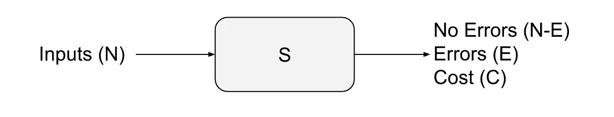
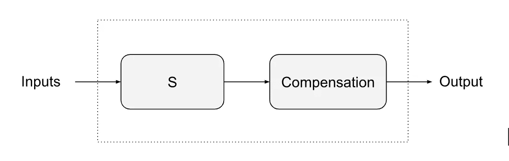
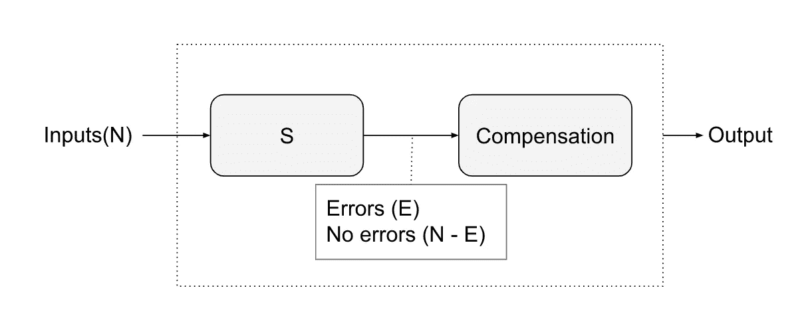

# ML 的开环——第三部分

> 原文：<https://towardsdatascience.com/the-open-loop-of-ml-part-3-f0ba4c6d225e>

## 结束循环

# 介绍

本系列的目的是为 ML 系统提出一种新的性能测量方法。在[第 1 部分](/the-open-loop-of-ml-ee86a4597955)和[第 2 部分](/the-open-loop-of-ml-part-2-ff6f3d2e0ae6)中，我们定义了这个问题，并将其称为“ML 的开环”。在这一部分，我们将提出一个补救措施，并声称已经完成了闭环。

图片来自 [Rajashree Rajadhyax](https://www.linkedin.com/in/rajashreerajadhyax)

首先，让我们快速回顾一下前两部分:

*   第一部分指出，模型准确性的度量给了开发人员一个很好的结论，但并不表示系统在现实世界中的效用。这种心理因素造成了大量精确模型和少量工作系统之间的差距。
*   在第二部分中，我们看到模型精度是欺骗性的，因为它是观察函数(OF)和模型函数(MF)之间的距离，而不是真实世界函数(RWF)和 MF 之间的距离。
*   第二部分我们还研究了错误循环的代价。由于错误的高成本，不鼓励在现实世界中使用 ML 系统。如果没有实际使用，就无法收集真实世界的数据，模型的改进也会受阻。事实上，你在实际使用中看到的唯一系统是那些创造者以某种方式打破了错误成本循环的系统。

在这种背景下，我们现在给自己设定的任务是回答以下两个问题:

*   如果模型的准确性是欺骗性的和不相关的，那么我们可以建议另一种方法来正确地反映 ML 系统的效用吗？
*   我们如何打破错误成本循环？

很明显，这两个问题的答案都与同一个概念有关。但是首先我们需要更多地研究错误的代价。

# 错误的代价

现实世界中的任何猜测系统都会犯错误，因此会有相关的错误成本。假设一个 ML 系统 S 放在现实世界中，它每天处理 N 个输入。设 E 是它犯的错误数，C 是这些错误的总成本。

图 1:开环系统(图片由作者提供)

每犯一次错误的代价取决于应用程序。对于一些用例来说，每次错误的成本自然很低。这里有两个例子:

*   在推荐系统中，错误不是很重要。想想你最喜欢的 OTT 平台向你展示关于观看什么的建议。如果系统做出一些错误的猜测也没关系，只要一些建议是正确的。
*   一些用例本质上是统计性的。情感分析系统试图估计媒体中好评的比例。碰巧的是，一些正面评价被系统误归类为负面。但是错误也会反过来发生，负面评价会被认为是正面的。如果两者的错误比例大致相当，总体分析还是比较接近真实的。

然而在大多数其他系统中，错误的代价是巨大的。正如我们在癌症检测示例中看到的，医疗诊断中假阴性的成本非常高。在 OCR 或文档阅读系统中，提取的错误值会导致重大损失。在自动门禁系统中，你肯定不希望你的 CEO 等在门口，因为系统无法识别他们。(关于错误成本的更多例子，请参见我的文章[您喜欢哪个错误，先生](https://deveshrajadhyax.medium.com/which-error-would-you-like-sir-1431f5367db0)。)

我们可以说，对于任何真实世界的使用，都需要真实世界的精确度。如果系统的精度低于这个极限，系统就变得不可用。但并不是因为精度本身。这是因为错误的代价。对于推荐系统，即使准确度很低，错误的代价也是可以接受的。但是医疗系统只允许出现一些错误，因为每个错误的代价都很高。因此，实际上这意味着总成本(C)应该低于某个阈值，以使系统有用。误差的总成本才是有用性的真正衡量标准，而不是系统的准确性。

然而，无法衡量这一成本。只有将系统置于现实世界中，才能对其进行测量。正如我们已经看到的，成本本身阻止了这种情况的发生。所以我们又回到了起点。

# 补偿

我们现在将谈论这个难题的最后一块。我们需要的是系统中的一个组件，它将控制错误的成本。让我们加上这个成分，称之为‘补偿’。这是一个以某种方式纠正错误的组件。对于我们目前的目的，我们并不真的需要了解它是如何工作的。然而在大多数情况下，它是一个人。

图 2:添加了补偿的 ML 系统(图片由作者提供)

补偿的想法并不新鲜。它也存在于传统系统中。每当错误的代价很高时，你会看到补偿被添加到系统中。毕竟，犯错误的不仅仅是 ML 系统。人类也制造它们。所以又增加了一个人类作为补偿。这是指像制造商检查，质量控制，批准，第二意见等术语。

值得注意的是，补偿组件并不能纠正所有的错误。它将只关注那些代价巨大的错误。例如，考虑一个文档信息提取系统，它提取字段“Remarks”和其他字段。还假设备注字段中的错误与用例无关。补偿组件将纠正其他字段中的错误，但不纠正备注中的错误。

纠正错误显然是有成本的。在大多数情况下，人类正在纠正错误，因此必须考虑他们的时间和相关成本。现在总成本 C 变成了:

> C =错误成本+补偿成本

由于补偿成本，总成本 C 可能仍然很高。但是补偿的主要作用是打破错误成本循环，使系统能够在现实世界中使用。数据科学和工程团队现在可以专注于降低补偿成本，以便总成本可以接受。这种减少通常来自于模型精度的提高(现在使用真实世界的数据)，但也可以通过重新设计整个系统来实现。

通过设计，带补偿的整体系统精度保证高于所需水平。我们称之为闭环精度(CLA)。我们现在关心的不是精度，而是赔偿成本。

# 作为衡量标准补偿成本

此外，薪酬部分还为我们提供了急需的绩效衡量标准。补偿成本(CC)是系统有用性的一个极好的量度。让我们看看如何:

*   它是在现实世界中衡量的。由于误差成本在可接受的限度之内，闭环 ML 系统可以放心地置于现实世界中。因此，当您测量 CC 时，系统在真实条件下运行。
*   如果 CC 低，则该系统是有用的。高补偿成本在较长时期内是不可持续的，因此 ML 系统必须改进。因此，CC 是 ML 系统性能的直接度量。

在 CLA 系统中，可以测量底层 ML 系统的真实精度。

图 3:测量 CLA 系统中 S 的精确度(图片由作者提供)

> S = (N-E) / N 的精度

但是 CC 仍然是比上述准确度更好的量度。原因是 CC 只关注相关错误。正如我们在“备注”字段示例中看到的，该字段中的错误会影响上述测量的准确性，但不会影响 CC。因此，CC 与用例更加相关。

CC 测量为 ML 系统开发过程提供了一些主要的好处:

*   有了 CC 措施，开发和实施团队的工作现在集中在同一个目标上——降低补偿成本。由于系统已经在运行，这些工作可以使用敏捷方法。
*   CC 的减少来自于模型改进和一些聪明的软件工程的结合。使用 CC measure，重点是整个系统，而不仅仅是模型。
*   性能的度量现在与系统的实际有用性一致。开发者和用户都可以期待同样的结果——低补偿成本。

# 结论

三部分系列现在已经完成。在这个系列中，我们处理了机器学习系统在现实世界中采用的挑战。挑战的出现是因为使用了错误的性能度量(模型准确性)。然后，我们提出，增加补偿成分和使用补偿成本作为绩效衡量标准可以帮助克服这一挑战。CC 度量使开发者的心理闭合和 ML 系统的可用性一致。补偿组件可以帮助打破错误成本循环。CC 度量还集成了模型改进和系统工程的工作，以使系统更加可用。

为使系统输出可用而引入补偿并不是一个新的想法，并且已经被大多数组织以某种方式使用。在 ML 理论中接受这种方法，并努力将 CC 度量形式化，可以大大加速 ML 系统的采用。

前情提要:

[ML 的开环——第一部分:心理效应如何阻碍 ML 的发展](/the-open-loop-of-ml-ee86a4597955)

[ML 的开环—第 2 部分:为什么模型准确性是一个欺骗性的度量](/the-open-loop-of-ml-part-2-ff6f3d2e0ae6)