# 感知器算法

> 原文：<https://towardsdatascience.com/the-perceptron-algorithm-b74d95d6e1cb>

## 理解并用 R 或 Python 编写你自己的感知器算法


*照片由* [*安德烈斯【哈罗】*](https://unsplash.com/@hvaandres?utm_source=unsplash&utm_medium=referral&utm_content=creditCopyText) *上* [*下*](https://unsplash.com/images/things/arrow?utm_source=unsplash&utm_medium=referral&utm_content=creditCopyText)

感知器算法可能是最简单的二进制分类算法。最初由 Frank Rosenblatt 于 1958 年发明，人们很快发现单层感知器的限制使分类方法不切实际。然而，多层感知器今天仍然被用作“前馈”神经网络的基本构件。因此，对于任何有抱负的数据科学家来说，敏锐地理解这种算法是至关重要的。

这篇文章旨在作为算法背后的数学的高层次概述，以及一个关于如何编写自己的感知器算法的例子。虽然代码示例是用 R 语言编写的，但我用 Python 重新编写了类似的函数，你可以在这里找到。

## r 包

在我们开始之前，我将快速分享本教程中使用的所有 R 包。如果当前没有安装，可以先安装。本教程使用的软件包有:
—[data . table](https://cran.r-project.org/web/packages/data.table/index.html)
—[gg plot](https://ggplot2.tidyverse.org/)
—[plot ly](https://plotly.com/r/)
—[matlib](https://cran.r-project.org/web/packages/matlib/index.html)

```
# Install packages if needed

if (!require(data.table)) install.packages('data.table')if (!require(ggplot2)) install.packages('ggplot2')if (!require(plotly)) install.packages('plotly')if (!require(matlib)) install.packages('matlib')library(data.table)
library(ggplot2)
library(plotly)
library(matlib)
```

## 感知器算法的数学基础

为了理解感知器算法，必须首先理解以下数学原理的基本知识:

*   向量(具体来说，如何计算方向和范数)
*   点积

我假设大多数阅读这篇文章的人都事先了解这些基础知识。如果你没有，在这里可以找到一个很好的资源。我不打算尝试教授基础知识，因为已经有这么多(更好的)可用资源。

## 线性可分数据

如前所述，单层感知器的挑战之一是约束限制了算法准确分类数据的能力。具体来说，主要约束是数据*必须*是线性可分的。

线性可分数据的定义是不言自明的。在高层次上，对于可线性分离的数据来说，这仅仅意味着存在某个平面可以真正地“分离”数据。例如，考虑以下两个类的数据集:

```
DT <- data.table(
  class_ = c(rep(1, 31), rep(-1, 31)),
  x = c(seq(1, 4, .1), seq(7, 10, .1)),
  y = c(runif(31, 1, 4), runif(31, 7, 10))
)

ggplot(DT, aes(x=x, y=y)) + 
  geom_point(colour=c(rep('blue',31), rep('darkred', 31))) + 
  theme(legend.position='none',
        axis.text.x=element_blank(),
        axis.text.y=element_blank())
```

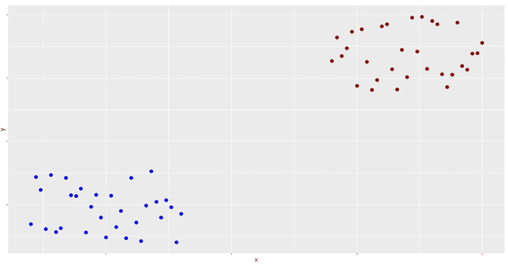

作者图片

很明显，您可以画一条任意的线来分隔两个不同颜色的数据点:

```
ggplot(DT, aes(x=x, y=y)) + 
  geom_point(colour=c(rep('blue',31), rep('darkred', 31))) + 
  geom_abline(slope=-1.25, intercept=12) + 
  theme(legend.position='none',
        axis.text.x=element_blank(),
        axis.text.y=element_blank())
```

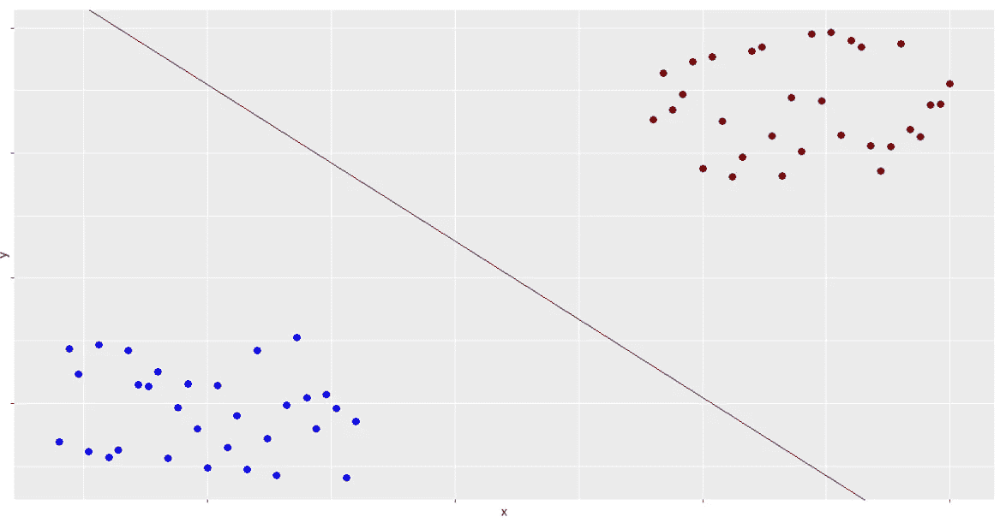

作者图片

类似地，考虑以下三维数据:

```
DT <- DT[, z := c(runif(31, 1, 4), runif(31, 7, 10))]

scene = list(
  camera = list(
    center = list(x = 0, y = 0, z = 0), 
    eye = list(x = 1.75, y = .75, z = .25)
    ),
  xaxis=list(title='x', showticklabels=F),
  yaxis=list(title='y', showticklabels=F),
  zaxis=list(title='z', showticklabels=F)
)

plot_ly(data=DT,
        x=~x, y=~y, z=~z, 
        color=~as.factor(class_),
        type='scatter3d',
        mode='markers', 
        colors=c('darkred', 'blue'),
        showlegend=F) %>%
  layout(scene=scene)
```

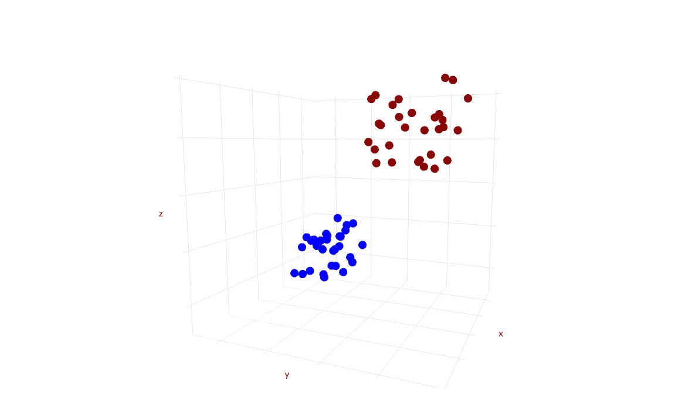

作者图片

在这种情况下，当试图分离两个数据类时，一条线是不够的。相反，可以使用二维平面:

```
plot_ly(data=DT,
        colors=c('darkred', 'gray', 'blue')) %>%
  add_trace(x=~seq(min(x), max(x), .1)*1.5, 
            y=~seq(min(y), max(y), .1)*1.5, 
            z=~matrix(6, nrow=62, ncol=62),
            type='surface') %>%
  add_trace(x=~x, y=~y, z=~z, 
            color=~as.factor(class_),
            type='scatter3d',
            mode='markers',
            showlegend=F) %>%
  layout(scene=scene) %>% 
  hide_colorbar()
```

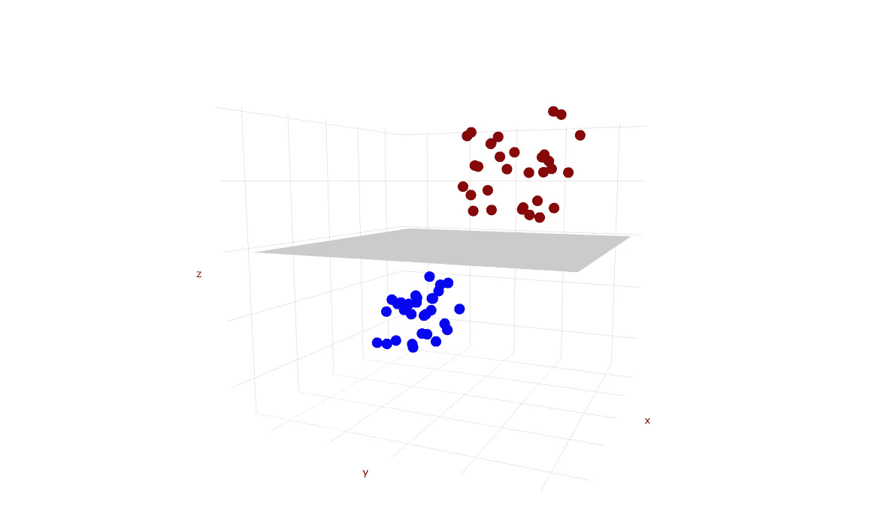

作者图片

当然，随着维度的不断增加，这变得更加难以想象，甚至难以解释。因此，使用了一个更广义的术语来描述这种线性分离:一个*超平面*。

## 超平面

根据[维基百科的定义](https://en.wikipedia.org/wiki/Hyperplane):“在几何学中，超平面是一个维度比其周围空间的维度小一的子空间。”这是有道理的。看我们的第一个例子，数据的维度是两个，而用来分隔数据的线是一维的。在第二个例子中，数据是三维的，间隔是二。

## 感知器算法

现在假设你有一些向量的基础知识，我们已经回顾了线性可分性和超平面的含义，我们可以在这些知识的基础上理解感知器算法是如何工作的。

首先，考虑以下几点:


更简单地说，我们说数据中有两个类( **x** )，因此有一个二进制分类问题。我们称之为类 1 和-1，但它们可以是任何东西。假设这两个类是线性可分的，那么一定存在某个 **w** 使得当 **x** 和 **w** 之间的点积(正偏差)为正时，类为 1。而当点积为负时，类为负 1。

为了找到最优的 **w** ，我们可以首先将向量初始化为随机值。从技术上讲，这些值可能都为零。我选择初始化 0 到 1 之间的随机值。

在本例中，我们将处理本文前面演示线性可分性的例子中给出的二维数据。因为数据是二维的( *x* ， *y* )，我们知道分隔类的超平面会是一条线。我们也知道向量 **w** 也会有二维，加上一些偏差 *b* 。

为了让事情变得简单一点，我们实际上可以完全消除等式中的偏差。为此，首先回忆一下:

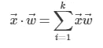

这意味着:

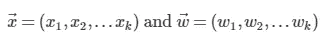

为了消除偏差 *b* ，我们可以简单地向 **x** 和 **w** 添加一个零分量，这样:

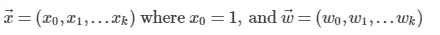

现在，原始函数可以写成:

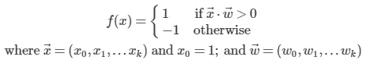

在我们的二维例子中，这意味着 **w** 应该用 3 个值初始化，而不是原来的两个值。我们的矩阵 **x** 也应该增加一个附加的数据“列”,其中附加列中的每个值都等于 1。在 R 中，这些步骤看起来像下面的代码:

```
# Generate random weights (initialize `w` with 3 values)
w <- runif(3, min=0, max=1)

# Remove `z` since we are using 2D data in this example
# Augment the data such that `x0` = 1
DT[, z := NULL][, x0 := 1]
```

既然 **w** 和 **x** 都被初始化并增加以考虑任何偏差 *b* ，我们可以使用公式 *f(x)* 进行一些初始预测。这可以通过取 **x** 和 **w** 的点积的符号来完成。我们还将确定初始预测哪里不正确，因为这些将在算法的下一步中发挥关键作用。

```
# Predict class (either -1 or 1) at each point by taking the dot
# product
pred <- apply(DT[, 2:4], 1, FUN = function(x) sign(sum(x * w)))

# Get incorrect predictions
incorrect_preds <- DT[class_ != pred]
```

在下一步中，我们将从错误分类的预测中抽取一个随机样本，将样本的三个 **x** 值分别乘以实际类别(1 或-1)，然后将样本的三个相应值分别添加到向量 **w** 。这给了我们一个更新的矢量 **w** 。然后，重复原来的过程。使用新的 **w** 进行预测，不正确的预测被识别并用于更新 **w** 。该过程重复进行，直到没有不正确的预测(或者达到预定义的阈值)。

为了理解这一过程背后的推理，它有助于描述向量实际上发生了什么。作为例子，考虑以下向量，其中`x_sample1`是从某个任意向量 **x** 的不正确预测中取得的随机样本，并且`w1`是计算中使用的权重向量:

```
x_sample1 <- c(.3, .8)
w1 <- c(.6, .1)
```

形象化，我们得到如下(其中*θ*是`x_sample1`和`w1`之间的角度):

```
plot(1, type='n', xlim=c(-.1, 1), ylim=c(-.1, 1), 
     xlab='', ylab='', xaxt='n', yaxt='n')
grid()

vectors(x_sample1, labels=expression(x))
vectors(w1, labels=expression(w))

arc(w1, c(0, 0), x_sample1, d=.1, absolute=T)
text(.15, .15, expression(theta), cex=1.5)
```

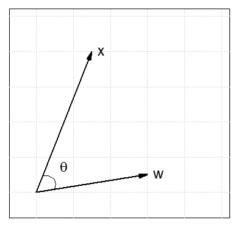

作者图片

我们可以看到两个向量`x_sample1`和`w1`之间的角度小于 90°。我们也知道`x_sample1`的预测类别是不正确的，因为样本取自错误分类的数据。这意味着`x_sample1`的实际类与`x_sample1`和`w1`的点积相反。现在，我们需要以某种方式调整`w1`，使`x_sample1`和`w1`之间的点积的符号等于`x_sample1`的类。

为此，我们先来看看`x_sample1`的预测值是多少:

```
print(paste0('The predicted class is: ', sign(x_sample1 %*% w1)[1]))## [1] "The predicted class is: 1"
```

因为预测的类是 1，并且我们知道这个例子中的预测是不正确的，所以我们可以推断实际的类是-1。为了得到预测值 1，我们需要`x_sample1`和我们的 **w** 值之间的点积为负。

为此，我们可以简单地从`w1`中减去`x_sample1`:

```
plot(1, type='n', xlim=c(-.05, .7), ylim=c(-.8, .8), 
     xlab='', ylab='', xaxt='n', yaxt='n')
grid()

new_w1 <-  w1 - x_sample1

vectors(x_sample1, labels=expression(x))
vectors(w1, labels=expression(w))
vectors(new_w1, labels=expression(w - x), col='darkred')

arc(w1, c(0, 0), x_sample1, d=.3, absolute=F)
text(.2, .3, expression(theta), cex=1.5)

arc(new_w1, c(0, 0), x_sample1, d=.2, col='darkred')
text(.12, .16, expression(beta), cex=1.5, col='darkred')
```

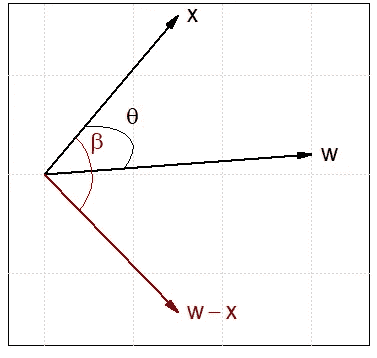

作者图片

这产生了以下预测:

```
print(paste0('The predicted class is: ', sign(x_sample1 %*% new_w1)[1]))## [1] "The predicted class is: -1"
```

现在，让我们再取两个任意向量`x_sample2`和`w2`。设`x_sample2`与`w2`的夹角大于 90 度，实际`x_sample2`的等级为 1，预测值为-1:

```
plot(1, type='n', xlim=c(-.8, 1), ylim=c(-.1, .6), 
     xlab='', ylab='', xaxt='n', yaxt='n')
grid()

x_sample2 <- c(-.7, .45)
w2 <- c(.9, .05)

vectors(x_sample2, labels=expression(x))
vectors(w2, labels=expression(w))

arc(w1, c(0, 0), x_sample2, d=.1)
text(.05, .07, expression(theta), cex=1.5)
```


作者图片

```
print(paste0('The predicted class is: ', sign(x_sample2 %*% w2)[1]))## [1] "The predicted class is: -1"
```

因为预测的类是-1，我们需要它是 1，我们实际上需要减小`x_sample`和`w2`之间的角度。为此，我们将它们相加，而不是相减:

```
plot(1, type='n', xlim=c(-.9, 1.1), ylim=c(-.05, .6), 
     xlab='', ylab='', xaxt='n', yaxt='n')
grid()

new_w2 <-  w2 + x_sample2

vectors(x_sample2, labels=expression(x))
vectors(w2, labels=expression(w))
vectors(new_w2, labels=expression(w + x), col='darkblue')

arc(w2, c(0, 0), x_sample2, d=.1)
text(-.02, .08, expression(theta), cex=1.2)

arc(new_w2, c(0, 0), x_sample2, d=.15, col='darkblue')
text(-.05, .18, expression(beta), cex=1.2, col='darkblue')
```

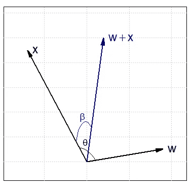

作者图片

```
print(paste0('The predicted class is: ', sign(x_sample2 %*% new_w2)[1]))## [1] "The predicted class is: 1"
```

如前所述，该过程对每个新的 **w** 进行迭代，直到没有不正确的预测，或者满足某个预定义的阈值。如果数据不是线性可分的，那么 **w** 永远不会收敛。

```
# Iteratively update weights
repeat{
  w <- w + unname(unlist(
    incorrect_preds[sample(1:nrow(incorrect_preds), 1)][, .SD * class_, .SDcols=2:4][1,]
    ))
  pred <- apply(DT[, 2:4], 1, FUN = function(x) sign(sum(x * w)))
  incorrect_preds <- DT[class_ != pred]
    if (nrow(incorrect_preds) == 0) break
}

# Plot
ggplot(data=DT, aes(x=x, y=y)) +
  geom_point(color=c(rep('blue',31), rep('darkred', 31))) +
  geom_abline(slope=-w[[2]] / w[[1]], intercept=-w[[3]] / w[[1]]) + 
  theme(legend.position='none',
        axis.text.x=element_blank(),
        axis.text.y=element_blank())
```

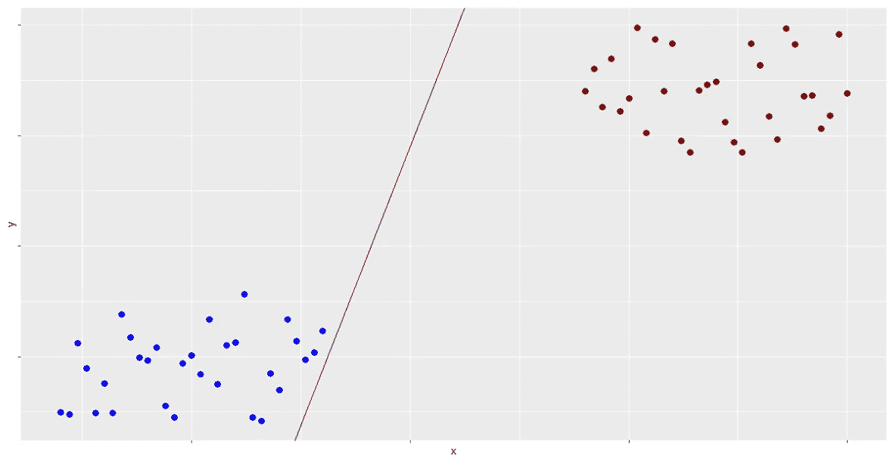

作者图片

我们做到了！你可以自己尝试所有的代码。下面是一个完整的 R 脚本，算法中的所有步骤都被定义为函数。如果你还没有感受到用 Python 写的同样的代码[这里](https://github.com/bentontripp/perceptron-decepticon/blob/3a1e134e6747f5197c5edbc314c780ffb2d01539/notebooks/perceptron.ipynb)。

在以后的文章中，我打算分享关于多层和内核感知机的内容，敬请关注！

也可以随意查看我最近的作品，这是一个关于使用 Python 解决微积分问题的 3 部分系列(目前仍在进行中)。

最后，如果你还没有订阅 Medium，并想阅读无限的文章，请查看这个[链接](https://medium.com/@bentontripp/membership)。

## 参考

*所有图片，除非特别注明，均为作者所有。*

[1]维基百科*，*感知器(2022)，[https://en.wikipedia.org/wiki/Perceptron](https://en.wikipedia.org/wiki/Perceptron)
【2】亚历山大·科瓦尔茨克，SVM 简洁地(2017)，[https://bitbucket . org/syncfusion tech/SVM-简洁地/src/master/](https://bitbucket.org/syncfusiontech/svm-succinctly/src/master/)
【3】维基百科，Hyperplanes (2021)，[https://en.wikipedia.org/wiki/Hyperplane](https://en.wikipedia.org/wiki/Hyperplane)