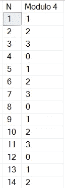
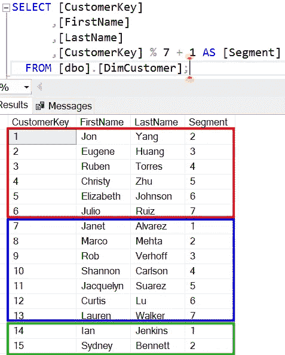
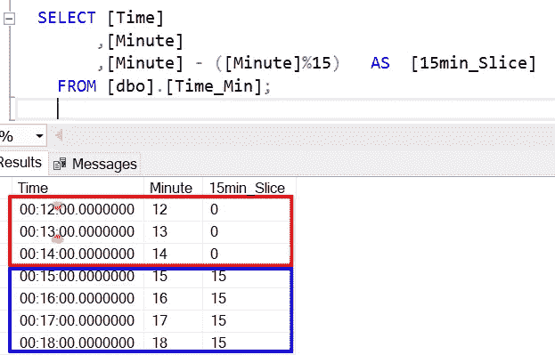

# 数据分析中模的力量

> 原文：<https://towardsdatascience.com/the-power-of-modulo-in-data-analysis-fbd5ddfd561c>

# 数据分析中模的力量

## 你可能知道不同编程语言中的模运算符。但是您如何使用这个操作符，以及为了什么？


在 [Unsplash](https://unsplash.com?utm_source=medium&utm_medium=referral) 由 [Anoushka P](https://unsplash.com/@_purianoushka?utm_source=medium&utm_medium=referral) 拍摄的照片

# 什么是模？

简而言之，模运算符返回除法的余数。

许多编程语言都有一个运算符或一个函数来计算模块。
T-SQL 有%操作符，DAX 有 MOD()函数。

如果您没有直接计算模数的方法，您可以使用以下公式从数字 A 计算模数 B:

A — A / B * B → A ( ( A / B) * B)

在 T-SQL 中，以下表达式都返回相同的结果:11

```
SELECT 263-((263/14)*14), 263%14;
```

但是，模运算有什么有趣的呢？

当您有一系列连续的数字，并且您对每个数字计算模 4 时，结果从 0 开始，上升到 3，然后再重新开始:



图 1 —以 4 为模的数列(作者提供的数字)

这种效应开启了很多可能性。

让我们来看三个我和我的客户一起工作的例子，其中模数简化了很多。

# 创建任意分段

我的一个客户问了我以下的问题:“我怎样才能任意地对我的客户进行细分？”

使用模运算，解决方案很简单:每个客户都有一个数字客户 ID。通过计算每个客户的模数，我以最小的努力将每个客户分配到任意的细分市场。

如果您没有数字 ID，您可以添加一个索引列，按您想要的任何列排序，并基于此计算模数以获得分段:



图 2——任意的客户细分(由作者提供)

# 计算每分钟的 15 分钟

另一个客户要求我将基于时间的数据汇总到每小时四个时间段。

*   分钟 01–14→00
*   第 15–29 分钟→ 15 分钟
*   第 30–44 分钟→ 30 分钟
*   第 45 分钟–60 分钟→ 45 分钟



图 3-分钟分段(作者提供的图)

现在，我可以通过 15min_Slice 列聚合数据。

# 结论

Modulo 在这两种情况下都帮助我创建了简单有效的解决方案。

尤其是第二个例子是一个解决挑战的突发奇想。

我希望这两个例子可以帮助您解决不使用模运算符就需要更复杂计算的挑战。


照片由 [Riccardo Annandale](https://unsplash.com/@pavement_special?utm_source=medium&utm_medium=referral) 在 [Unsplash](https://unsplash.com?utm_source=medium&utm_medium=referral) 拍摄

# 参考

在我的示例中，我使用了 Contoso 示例数据集，就像我以前的文章中一样。你可以从微软[这里](https://www.microsoft.com/en-us/download/details.aspx?id=18279)免费下载 ContosoRetailDW 数据集。

Contoso 数据可以在 MIT 许可下自由使用，如这里的[所述](https://github.com/microsoft/Power-BI-Embedded-Contoso-Sales-Demo)。

[](https://medium.com/@salvatorecagliari/membership) [## 通过我的推荐链接加入 Medium-Salvatore Cagliari

### 作为一个媒体会员，你的会员费的一部分会给你阅读的作家，你可以完全接触到每一个故事…

medium.com](https://medium.com/@salvatorecagliari/membership)