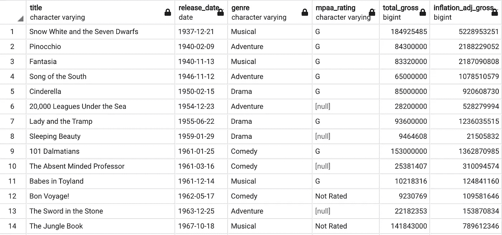
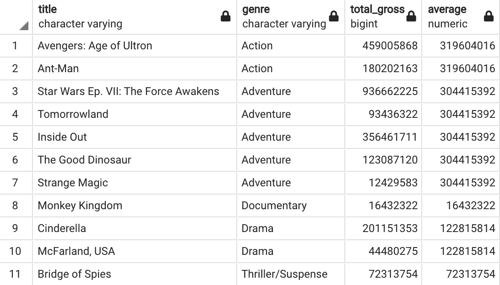
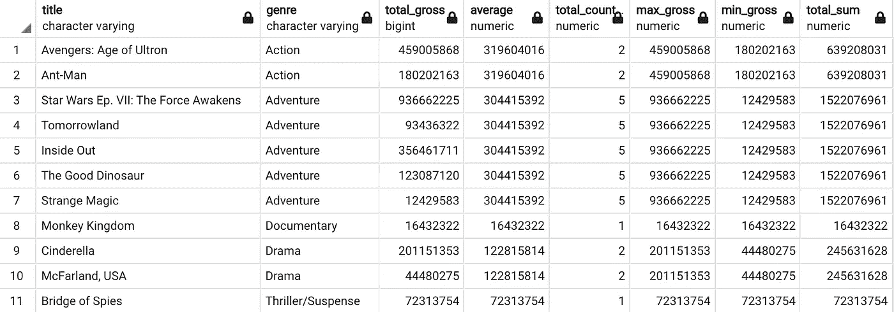
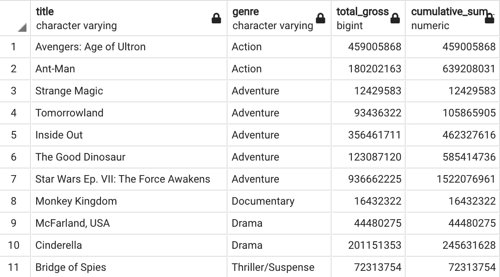
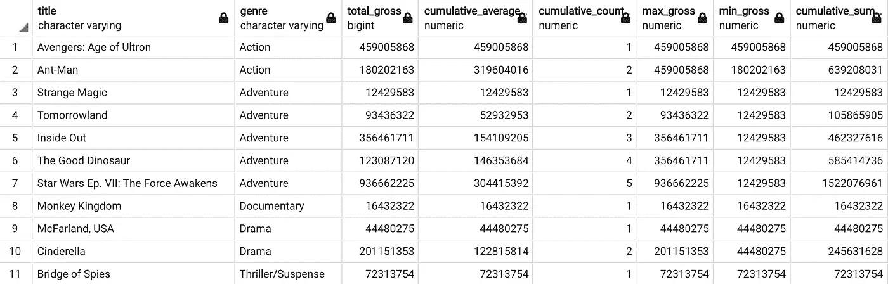

# 迪士尼数据的 SQL 聚合窗口函数的强大功能

> 原文：<https://towardsdatascience.com/the-power-of-sql-aggregate-window-functions-with-disney-data-9c92ebbf2540>

AVG()，计数()，最大值()，最小值()，总和()


Travis Gergen 在 Unsplash 上拍摄的照片

窗口函数允许我们在每一行上执行操作并显示结果，这与基于查询组合多行的普通 SQL 操作相反。普通的 SQL 聚合函数对于将多行分解成解决方案是必不可少的。例如，这些函数可以显示多行的平均值并输出单个数值，或者显示一组行中的实例数。在聚合窗口函数中，我们可以将这个聚合结果应用于数据的每一行。这使我们能够轻松地创建有用且高效的结果，例如累积和、特定行输出与所有行平均值的比较。

五种类型的聚合窗口函数是:

*   AVG()
*   计数()
*   最大()
*   最小值()
*   总和()

在我们进入每个聚合窗口函数的细节之前，我们应该看看这些函数通常是如何写出的:

```
[Aggregate Function]([column]) OVER([specific operation] column_name)
```

例如，一个示例 SQL 命令如下所示:

```
SELECT *, SUM(column_x) OVER(PARTITION BY column_y ORDER BY column_z)
FROM table
```

*请注意，x、y 和 z 列可以相同，也可以不同*

**数据:** 本文中使用的数据最初由 Rashik Rahman 发布到 Kaggle，授权为 CC0: Public Domain。拉西克的 Kaggle 个人资料的链接可以在这里找到([这里](https://www.kaggle.com/rashikrahmanpritom/disney-movies-19372016-total-gross))。该数据由 1937 年至 2016 年的迪士尼电影组成，并显示以下变量名称:电影名称、电影上映日期、类型、mpaa 评级、总票房和通货膨胀调整后的票房。出于本文的目的，我将主要使用“标题”、“发行日期”、“流派”和“总收入”。此外，我将重点关注 2015 年上映的电影，以简化结果输出。数据示例如下:



作者图片

*这些数据将仅用于演示我们的聚合窗口函数，不应被视为这些电影的完整和准确的来源。

**基本用例:** 如前所述，聚合窗口函数的工作方式与普通聚合函数相同，但它不提供合并输出，而是将输出反映在表中的每一行上。例如，AVG()窗口函数完全按照您的预期工作，它创建给定分区中值的平均值，并将该值输出到数据的每一行。下面的 SQL 代码演示了这一点:

```
SELECT title, genre, total_gross, 
ROUND(AVG(total_gross) OVER(PARTITION BY genre),0) as average 
FROM disney
WHERE release_date >= '2015-01-01' AND release_date < '2016-01-01'
```



作者图片

新的“平均”栏按类型划分，显示了每种类型的平均总票房收入。使用相同的概念和实践，我们可以使用所有五个聚合函数运行相似的指标。

```
SELECT title, genre, total_gross, 
ROUND(AVG(total_gross) OVER(PARTITION BY genre),0) as average,
ROUND(COUNT(*) OVER(PARTITION BY genre),0) as total_count,
ROUND(MAX(total_gross) OVER(PARTITION BY genre),0) as max_gross,
ROUND(MIN(total_gross) OVER(PARTITION BY genre),0) as min_gross,
ROUND(SUM(total_gross) OVER(PARTITION BY genre),0) as total_sum
FROM disney
WHERE release_date >= '2015-01-01' AND release_date < '2016-01-01'
```



作者图片

这里我们看到了所使用的每个聚合函数及其输出。虽然获得这些信息会有所帮助，但是这种类型的操作也可以在没有窗口函数的情况下完成，而是使用连接到原始数据集的普通聚合嵌套查询来完成。下面是 AVG()函数的一个例子:

```
SELECT title, d.genre, total_gross, ROUND(average,0)
FROM disney d LEFT JOIN (SELECT genre, AVG(total_gross) as average 
 FROM disney
 WHERE release_date >= '2015-01-01' AND release_date < '2016-01-01'
 GROUP BY genre) aON d.genre = a.genreWHERE release_date >= '2015-01-01' AND release_date < '2016-01-01'
ORDER BY genre
```

上述代码块的结果与我们的窗口函数完全相同，但是上述代码块需要一个更复杂的语句。

**累积案例:**
在我看来，这些聚合窗函数最大的好处就是当它们被用来寻找累积值的时候。要对现有的代码块进行这种更改，我们需要做的就是在 OVER()语句中添加 ORDER BY 子句。能够在几个步骤中添加累积值有助于为这些聚合窗口函数增加巨大的力量。下面是一个使用 SUM()函数的例子。

```
SELECT title, genre, total_gross, 
ROUND(SUM(total_gross) OVER(PARTITION BY genre ORDER BY release_date),0) as cumulative_sum
FROM disney
WHERE release_date >= '2015-01-01' AND release_date < '2016-01-01'
```



作者图片

这里我们看到了每个分区的 total_gross 列的累积方面。我们可以使用下面的代码块将同样的方法应用于所有函数:

```
SELECT title, genre, total_gross, ROUND(AVG(total_gross) OVER(PARTITION BY genre ORDER BY release_date),0) as cumulative_average,ROUND(COUNT(*) OVER(PARTITION BY genre ORDER BY release_date),0) as cumulative_count,ROUND(MAX(total_gross) OVER(PARTITION BY genre ORDER BY release_date),0) as max_gross,ROUND(MIN(total_gross) OVER(PARTITION BY genre ORDER BY release_date),0) as min_gross,ROUND(SUM(total_gross) OVER(PARTITION BY genre ORDER BY release_date),0) as cumulative_sumFROM disney
WHERE release_date >= '2015-01-01' AND release_date < '2016-01-01'
```



作者图片

利用这些函数的累积特性，我们现在可以看到一些有趣的结果。以“动作片”为例，我们可以看到，第一部《复仇者联盟:奥创时代》上映后，平均票房为 4.59 亿美元，而在《蚁人》上映后，平均票房降至 3.2 亿美元。cumulative_count 列只是计算行数并显示结果。我们看到两部电影的 max_gross 栏都保持在 4.59 亿美元，因为第一部电影的票房比第二部高，相反，当我们看 min_gross 时，我们看到它从 4.59 亿美元开始，然后在《蚁人》上映后下降到 1.8 亿美元。最后，cumulative_sum 的工作方式和我们之前解释的一样，在分区中添加每部电影的 total_gross。

**结论:**
使用聚合窗口函数可以帮助我们创建有用的信息指标，同时还可以帮助我们节省编写查询的时间。聚合窗口函数只是窗口函数的一个分支，你可以在这里找到我之前关于窗口函数排名的文章。感谢您花时间阅读本文，更多数据科学相关内容请关注我！


作者图片