# YOLOv5 算法目标检测实用指南

> 原文：<https://towardsdatascience.com/the-practical-guide-for-object-detection-with-yolov5-algorithm-74c04aac4843>

## 详细教程解释了如何在您自己的自定义数据集上有效地训练对象检测算法 YOLOv5。

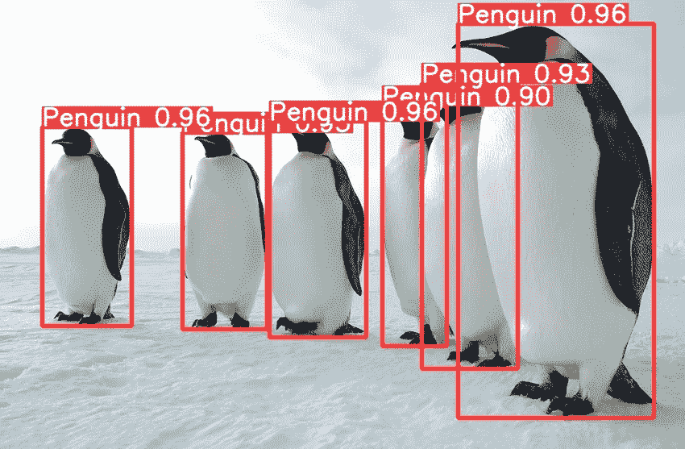

作者标签，国家科学基金会图片，[http://www.nsf.gov/](http://www.nsf.gov/)

# **简介**

识别图像中的物体被认为是人脑的一项普通任务，尽管对机器来说并不那么简单。照片中物体的识别和定位是一项被称为“物体检测”的计算机视觉任务，在过去几年中出现了几种算法来解决这个问题。迄今为止最流行的实时对象检测算法之一是 YOLO(你只看一次)，最初由 Redmond 等人提出。阿尔[1]。

在本教程中，您将学习使用 Ultralytics 开发的最新 YOLOv5 实现对自定义数据集执行端到端对象检测项目[2]。我们将使用迁移学习技术来训练我们自己的模型，评估它的性能，使用它进行推理，甚至将其转换为其他文件格式，如 ONNX 和 TensorRT。

本教程面向具有目标检测算法理论背景的人，他们寻求实际的实施指导。为了您的方便，下面提供了一个易于使用的 Jupiter 笔记本，并附有完整的代码。

# **数据处理**

*数据集创建*

在本教程中，我从网上手动标记了大约 250 张企鹅的图片和视频，生成了自己的企鹅数据集。我花了几个小时使用 Roboflow 平台，该平台对公众用户友好且免费[3]。为了实现健壮的 YOLOv5 模型，建议每类训练 1500 个以上的图像，每类训练 10，000 个以上的实例。还建议添加高达 10%的背景图像，以减少假阳性错误。由于我的数据集非常小，我将使用迁移学习技术缩小训练过程。

*YOLO 标签格式*

大多数注释平台支持以 YOLO 标签格式导出，为每个图像提供一个注释文本文件。每个文本文件包含图像中每个对象的一个边界框(BBox)注释。注释被标准化为图像大小，并且在 0 到 1 的范围内。它们以下列格式表示:

< object-class-ID>

如果图像中有两个对象，YOLO 注释文本文件的内容可能如下所示:

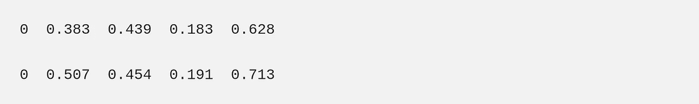

*数据目录结构*

为了符合 Ultralytics 目录结构，数据以下列结构提供:

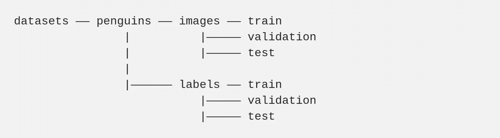

为了方便起见，我在笔记本上提供了一个自动创建这些目录的功能，只需将你的数据复制到正确的文件夹中。

# **配置文件**

培训的配置分为三个 YAML 文件，它们随回购协议本身一起提供。我们将根据任务定制这些文件，以满足我们的需求。

1.  **数据配置文件**描述了数据集参数。由于我们是在自定义的企鹅数据集上训练，我们将编辑这个文件并提供:训练、验证和测试(可选)数据集的路径；类的数量(NC)；和类名，顺序与它们的索引相同。在本教程中，我们只有一个名为“企鹅”的类。我们将自定义数据配置文件命名为‘penguin _ data . YAML ’,并将其放在‘data’目录下。这个 YAML 文件内容如下:

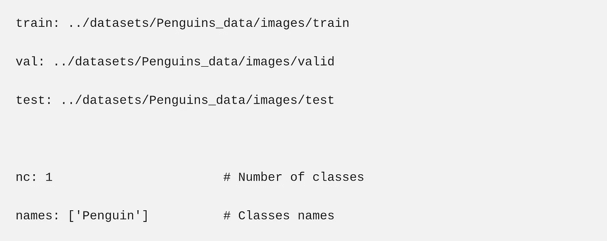

2.**模型配置文件**规定了模型架构。Ultralytics 支持几种 YOLOv5 架构，命名为 P5 型号，主要因其参数大小而异:YOLOv5n (nano)、YOLOv5s (small)、YOLOv5m (medium)、YOLOv5l (large)、YOLOv5x (extra large)。这些架构适合于用 640*640 像素图像尺寸进行训练。附加系列，针对 1280*1280 的较大图像尺寸的训练进行了优化，称为 P6 (YOLOv5n6、YOLOv5s6、YOLOv5m6、YOLOv5l6、YOLOv5x6)。P6 模型包括一个额外的输出层，用于检测较大的对象。他们从更高分辨率的训练中受益最多，并产生更好的结果[4]。

Ultralytics 为上述每个体系结构提供内置的模型配置文件，这些文件位于“models”目录下。如果您是从零开始训练，选择具有所需架构的模型配置YAML 文件(在本教程中为“YOLOv5s6.yaml”)，然后只需将类的数量(nc)参数编辑为自定义数据中正确的类的数量。

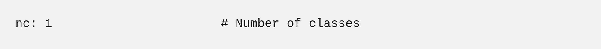

当训练像本教程中一样从预训练的权重初始化时，不需要编辑模型配置文件，因为模型将使用预训练的权重提取。

3.**超参数配置文件**定义了训练的超参数，包括学习率、动量、损耗、增量等。Ultralytics 在“data/hyp/hyp.scratch.yaml”目录下提供了一个默认的超参数文件。正如我们将在本教程中所做的那样，我们主要建议从默认的超参数开始训练，以建立一个性能基线。

YAML 配置文件嵌套在以下目录中:

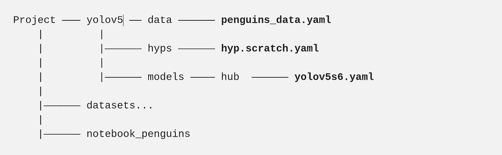

# **培训**

为了本教程的简单性，我们将训练小参数大小的模型 YOLOv5s6，尽管可以使用更大的模型来改善结果。对于不同的情况，可以考虑不同的训练方法，这里我们将介绍最常用的技术。

**从零开始训练**

当拥有足够大的数据集时，模型将从零开始训练中受益最多。权重是通过向权重参数传递空字符串(“”)来随机初始化的。训练由以下命令引发:

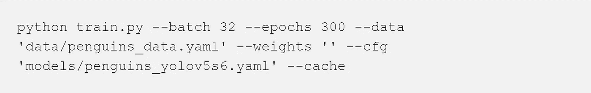

*   批次—批次大小(-1 表示自动批次大小)。使用硬件允许的最大批量。
*   时期—时期的数量。
*   数据—数据配置文件的路径。
*   cfg 模型配置文件的路径。
*   权重-初始权重的路径。
*   缓存—缓存图像以加快训练速度。
*   img —以像素为单位的图像大小(默认为 640)。

**迁移学习**

*预训练模型热启动:*

由于我的企鹅数据集相对较小(约 250 张图片)，迁移学习有望产生比从头开始训练更好的结果。Ultralytic 的默认模型是在 COCO 数据集上预先训练的，尽管也支持其他预先训练的模型(VOC、Argoverse、VisDrone、GlobalWheat、xView、Objects365、SKU-110K)。COCO 是一个对象检测数据集，包含来自日常场景的图像。它包含 80 个类，包括相关的“鸟”类，但没有“企鹅”类。通过将模型的名称传递给“weights”参数，我们的模型将使用来自预训练 COCO 模型的权重进行初始化。将自动下载预训练模型。

*特征提取*

模型由两个主要部分组成:作为特征提取器的主干层和计算输出预测的头部层。为了进一步补偿较小的数据集大小，我们将使用与预训练 COCO 模型相同的主干，并且只训练模型的头部。YOLOv5s6 主干由 12 层组成，它们将由‘冻结’参数固定。

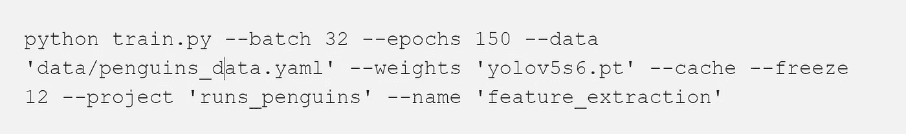

*   权重-初始权重的路径。COCO 模型会自动下载。
*   冻结(freeze )-要冻结的层数
*   项目—项目的名称
*   名称-运行的名称

如果提供了“项目”和“名称”参数，结果会自动保存在那里。否则，它们被保存到“运行/训练”目录。我们可以查看保存到 results.png 文件的指标和损失:

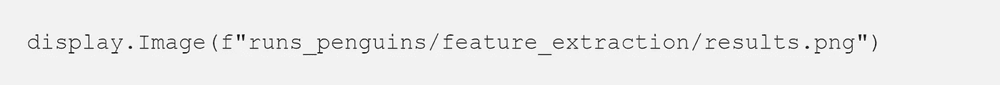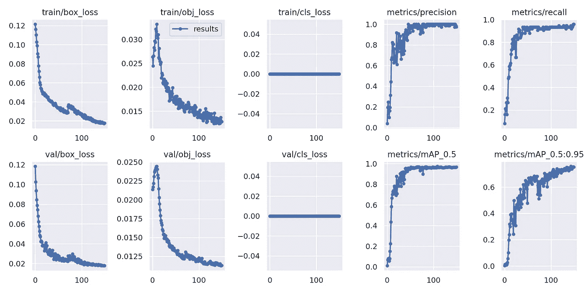

“特征提取”训练的结果|作者图片

为了更好地理解结果，让我们总结一下 YOLOv5 损失和指标。YOLO 损失函数由三部分组成:

1.  **box_loss** —包围盒回归损失(均方误差)。
2.  **obj_loss** —物体存在的置信度就是物体损失。
3.  **cls_loss** —分类损失(交叉熵)。

因为我们的数据只有一个类别，所以没有类别错误识别，并且分类错误始终为零。

**精度**测量 bbox 预测正确的程度(真阳性/(真阳性+假阳性))，而**召回**测量真 bbox 预测正确的程度(真阳性/(真阳性+假阴性))。“mAP_0.5”是 IoU(联合交集)阈值为 0.5 时的平均精度( **mAP** )。“mAP_0.5:0.95”是不同 IoU 阈值的平均 mAP，范围为 0.5 至 0.95。你可以在参考文献[5]中了解更多。

*微调*

训练的最后一个可选步骤是微调，包括解除冻结我们上面获得的整个模型，并以非常低的学习率根据我们的数据重新训练它。通过逐步调整预训练特征以适应新数据，这有可能实现有意义的改进。可以在超参数-配置文件中调整学习率参数。对于教程演示，我们将采用内置的“hyp.finetune.yaml”文件中定义的超参数，它的学习速率比默认的要小得多。权重将使用前一步骤中保存的权重进行初始化。

```
python train.py --hyp 'hyp.finetune.yaml' --batch 16 --epochs 100 --data 'data/penguins_data.yaml' --weights 'runs_penguins/feature_extraction/weights/best.pt' --project 'runs_penguins' --name 'fine-tuning' --cache
```

*   超级-超级参数配置文件的路径

正如我们在下面看到的，在微调阶段，指标和损耗仍在改善。

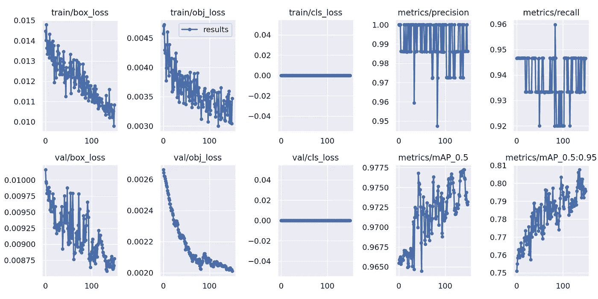

“微调”训练的结果|作者提供的图片

# **验证**

为了评估我们的模型，我们将利用验证脚本。性能可以通过训练、验证或测试数据集分割来评估，由“任务”参数控制。这里，正在评估测试数据集分割:

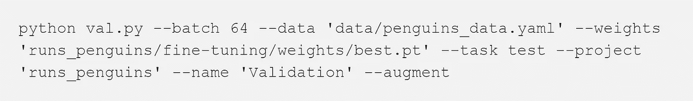

我们还可以获得精确召回曲线，它会在每次验证时自动保存。

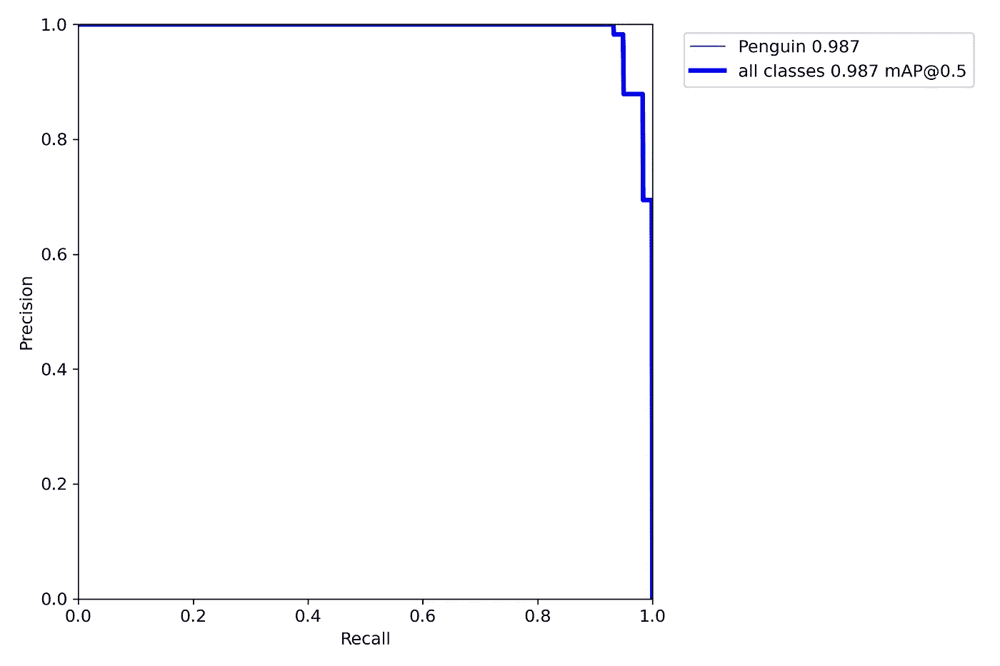

精确度—测试数据的召回曲线分割|作者图片

# **推论**

一旦我们获得了令人满意的训练性能，我们的模型就可以进行推理了。根据推断，我们可以通过应用测试时间增强(TTA)来进一步提高预测的准确性:每个图像都被增强(水平翻转和 3 个不同的分辨率)，最终的预测是所有这些增强的集合。如果我们紧抓每秒帧数(FPS)速率，我们将不得不放弃 TTA，因为它的推论是 2-3 倍长。

用于推断的输入可以是图像、视频、目录、网络摄像头、流甚至 youtube 链接。在下面的检测命令中，测试数据用于推断。

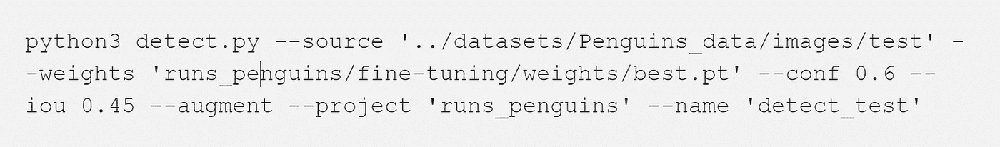

*   源—输入路径(0 表示网络摄像头)
*   权重-权重路径
*   img —用于推断的图像大小，以像素为单位
*   conf —置信度阈值
*   iou—NMS 的 IoU 阈值(非最大抑制)
*   增强——增强推理(TTA)

推理结果会自动保存到定义的文件夹中。让我们回顾一下测试预测的一个例子:

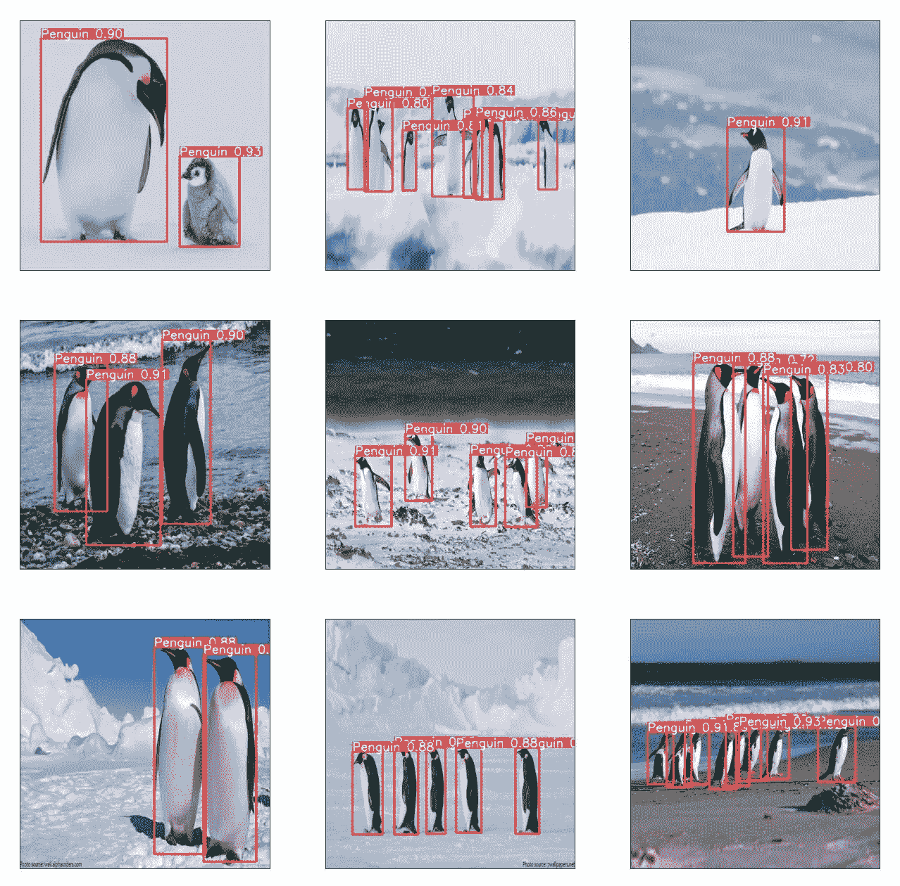

推理结果|作者图片

# 导出为其他文件格式

至此，我们的模型已经完成，并保存为带有。pt '文件扩展名。模型可以导出为其他文件格式，如 ONNX 和 TensorRT。ONNX 是一种中间的机器学习文件格式，用于在不同的机器学习框架之间进行转换[6]。TensorRT 是 NVIDIA 开发的一个用于优化机器学习模型的库，以在 NVIDIA 图形处理单元(GPU)上实现更快的推理[7]。

“export.py”脚本用于通过将类型格式应用于“include”参数，将 PyTorch 模型转换为 ONNX、TensorRT engine 或其他格式。以下命令用于将我们的企鹅模型导出到 ONNX 和 TensorRT。这些新的文件格式与 PyTorch 模型保存在同一个“权重”文件夹下。

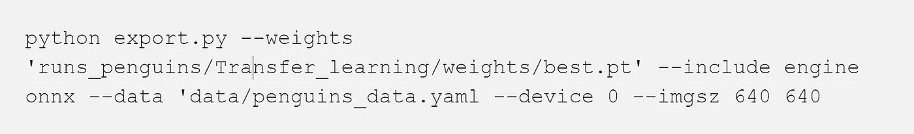

_________________________________________________________________

# 感谢您的阅读！

**想了解更多信息？**

*   [**探索**](https://medium.com/@lihigurarie) 我写的附加文章
*   [**订阅**](https://medium.com/@lihigurarie/subscribe) 在我发布文章时获得通知
*   关注我的 [**Linkedin**](https://www.linkedin.com/in/lihi-gur-arie/)

本教程的完整代码在第一个参考资料[0]中提供:

***参考文献***

[0]完整代码:[https://gist . github . com/Lihi-Gur-Arie/41f 014 BCF be 8 b 8e 1e 965 fa 11 a 6251 e 04](https://gist.github.com/Lihi-Gur-Arie/41f014bcfbe8b8e1e965fa11a6251e04)

[1][https://arxiv.org/abs/1506.02640](https://arxiv.org/abs/1506.02640)

[https://github.com/ultralytics/yolov5](https://github.com/ultralytics/yolov5)

[https://roboflow.com/](https://roboflow.com/)

[https://zenodo.org/record/4679653#.YfFLX3UzaV4](https://zenodo.org/record/4679653#.YfFLX3UzaV4)

[https://blog.paperspace.com/mean-average-precision/](https://blog.paperspace.com/mean-average-precision/)

[https://onnx.ai/get-started.html](https://onnx.ai/get-started.html)

[https://developer.nvidia.com/tensorrt](https://developer.nvidia.com/tensorrt)