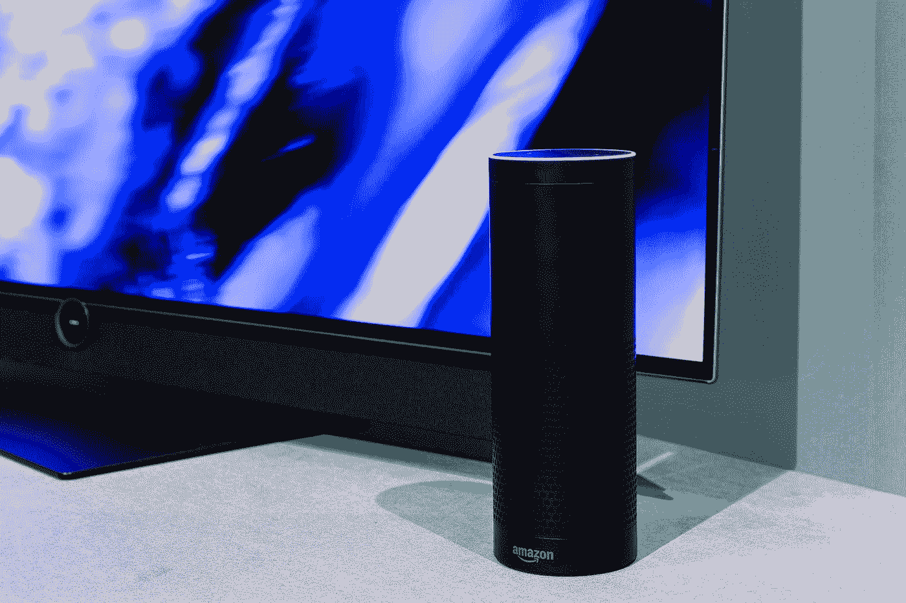
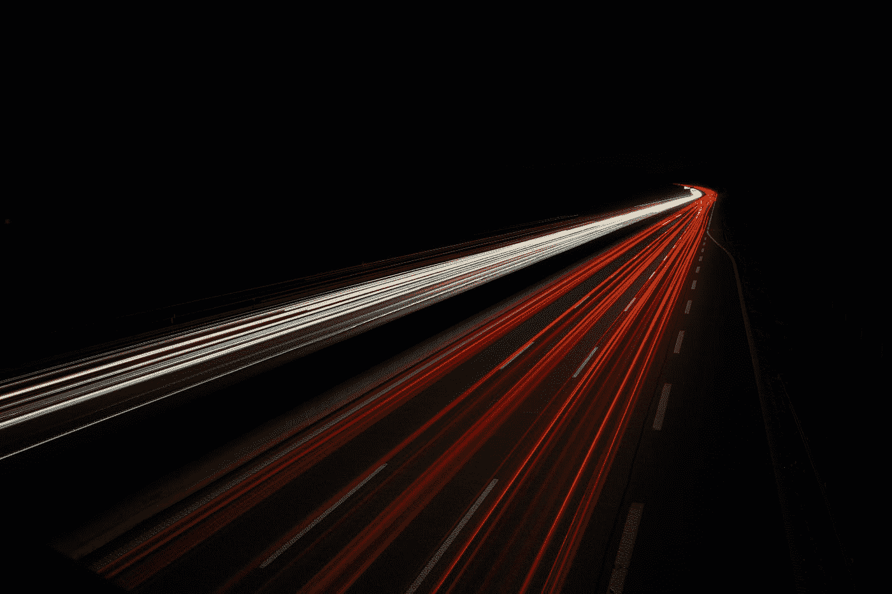

# 模拟人工智能的前景

> 原文：<https://towardsdatascience.com/the-promise-of-analog-ai-e3a8c0daf146>

## 为什么模拟人工智能将出现在从 Alexa 到你的 iPhone 的所有东西中

[Loewe 科技](https://unsplash.com/@loewe?utm_source=medium&utm_medium=referral)在 [Unsplash](https://unsplash.com?utm_source=medium&utm_medium=referral) 上的照片

神经网络变得越来越大，越来越耗能。因此，人工智能的未来取决于让人工智能在更小的设备上更有效地运行。

这就是为什么**警告说，让人工智能更有效的进展正在放缓**。

人工智能最耗费资源的方面是数据传输。传输数据通常比实际计算花费更多的时间和能量。为了解决这个问题，目前流行的方法包括减少数据需要传输的距离和数据大小。芯片的尺寸是有限的，所以最小化距离只能做到这一点。类似地，降低数据精度在某种程度上是可行的，但随后会损害性能。

我们已经从 32 位和 64 位浮点数发展到具有 8 位数据的专用人工智能芯片。加速是惊人的，但是较低的精度会影响准确性。其他方法也在探索中，但是数字的极限已经开始被触及。

几十年前，由于对精度的需求，数字计算机胜过了模拟计算机。就像将数据精度从 32 位降低到 8 位不会影响学习的准确性一样，我们发现*精度对 AI* 来说不那么重要了。是模拟回归的时候了。研究人员和行业正在竞相迎接挑战，IBM 最近宣布通过模拟人工智能实现 100 倍性能的****和**[**100 倍效率的**](https://spectrum.ieee.org/analog-ai) **。这怎么可能？****

****

**照片由[克里斯蒂安·恩格梅尔](https://unsplash.com/@christianem?utm_source=medium&utm_medium=referral)在 [Unsplash](https://unsplash.com?utm_source=medium&utm_medium=referral) 拍摄**

# ****冯·诺依曼瓶颈****

**在计算中，冯诺依曼瓶颈描述了这样一种现象，即**系统吞吐量受限于数据处理与移动的相对速度**。*如果我们能在同一个地方存储和处理数据，我们就能消除数据移动，消除这个瓶颈。***

**使用模拟人工智能，数据在同一个地方存储和处理。使用非易失性存储设备，analog 可以在没有电源的情况下存储数据长达 10 年[。](https://analog-ai-demo.mybluemix.net/)**

**同时，数据比数字电路需要更少的晶体管。在**数码机器中，你有 1 和 0**。要表示-128 到 127 范围内的一个数，需要 8 位。要将两个数相加，你需要大约 200 个晶体管。**

**与数字不同，模拟不是二进制。它可以代表基于电导或电阻的整个数字范围(*电流的测量*)。正常情况下，数字有 0 和 1 的截止阈值，但模拟使用实际值。因此，**你可以在一个晶体管中代表许多数字**，只要你对晶体管的物理特性和随机性自然产生的可变性没有问题。这在传统计算中是有问题的，但在深度学习中是可行的。**

# ****模拟 AI 如何处理数据？****

**在神经网络中，*最常见的运算符是乘累加*。你将几组数字相乘，然后求和，就像矩阵乘法中使用的那样，这是深度学习的支柱。如果您将输入存储为数组，您实际上可以通过在一个全矩阵上并行利用物理工程定律([欧姆定律](https://en.wikipedia.org/wiki/Ohm%27s_law)相乘，[基尔霍夫定律](https://en.wikipedia.org/wiki/Kirchhoff%27s_circuit_laws)求和)来一蹴而就。**

**这就是模拟 AI 的症结所在。**如果真有那么简单**，模拟 AI 早就用上了。为什么我们还没有使用模拟人工智能？**

****

**照片由[以色列总统府](https://unsplash.com/@othentikisra?utm_source=medium&utm_medium=referral)在 [Unsplash](https://unsplash.com?utm_source=medium&utm_medium=referral) 上拍摄**

# **可变性的问题**

**从芯片制造到环境因素，电导会因各种因素而异。这种差异会累积起来，扰乱神经网络。**

**早期的方法同时使用模拟和数字，在层间使用数模和模数转换器。然而，这需要加以限制，因为转换比保持模拟更慢且更耗能。它会产生自己的瓶颈。**

**模拟也不是高精度应用的理想选择，因为在高精度应用中，每一位都很重要。对于可解释性很重要的应用程序也是如此:*如果你想理解为什么你的神经网络做出了某种预测，引入可变性会使解释变得更具挑战性。*你的网络不是决定性的。给定相同的数据，可变性可能导致网络下次做出不同的预测。**

**这就是为什么模拟人工智能现在最适合边缘设备上的人工智能，比如你的手机和 Google Home。你的**电池将持续更长时间，**你的**能源账单将下降，**你甚至可以得到一个**更小的设备** ( *更少的晶体管*)。**

**研究人员正在研究更广泛采用的障碍。**接下来是什么？****

****

**照片由 [Nicole Avagliano](https://unsplash.com/@nicolescapturedmoments?utm_source=medium&utm_medium=referral) 在 [Unsplash](https://unsplash.com?utm_source=medium&utm_medium=referral) 上拍摄**

# **未来**

**目前，模拟人工智能在乘-累加运算方面工作得很成功。对于其他操作，提供他们自己的电路仍然是理想的，因为*编程非易失性存储设备比传统设备花费更长的时间并导致更快的磨损*。**

**推理通常不需要重新编程这些设备，因为重量很少改变。**然而，为了训练，它们需要不断地重新配置**。**

**此外，模拟的可变性导致前向传播误差(*推理*和反向传播误差(*在训练期间计算误差*)之间的不匹配。*这可能会在培训过程中造成问题*。这导致需要单独的反向传播电路，可能是数字的。然而，研究人员已经想出了在相同的模拟人工智能神经网络上进行训练的方法，因此它们是端到端的。例如，蒙特利尔大学和 Rain Neurophormics [的一个团队提出了用于端到端芯片的平衡传播](https://arxiv.org/abs/2006.01981)。**

# **外卖**

**随着使神经网络更快、更节能的方法实现收益递减， **analog 可能会卷土重来**。神经网络比传统计算有更低的精度需求，使模拟成为可能。**

**模拟人工智能有能力生产速度快几倍、体积更小、能效更高的网络，正成为一个热门的研究领域，并具有巨大的商业潜力。预计很快就会在智能手表、电话和家庭助理中看到模拟电路！**