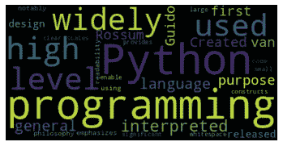
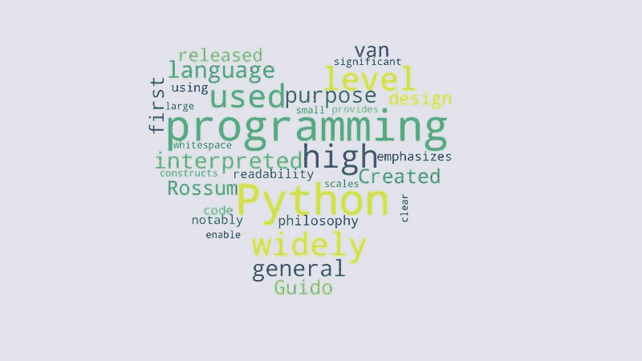

# 用 Python 创建单词云的快速简单指南

> 原文：<https://towardsdatascience.com/the-quick-and-easy-guide-to-create-wordclouds-in-python-7a81813e4cd5>

## 创建不同形状的单词云以更好地传达信息


照片由[像素](https://www.pexels.com/)的[皮克斯拜](https://www.pexels.com/photo/person-in-purple-crew-neck-t-shirt-with-just-me-painting-on-hand-52986/)拍摄

文字云是一种可视化文本数据的好方法。python 使创建一个变得很容易。在本帖中，我们将回顾一个使用 Wordcloud 库生成单词云的例子。

如果你不知道它是什么，单词云可以可视化单词在给定文本中出现的频率。一个词出现的次数越多，它在词云中的比重就会越大。

词云对于从评论中发现客户情绪非常有用。此外，一些网站使用文字云来显示网站上最受欢迎的话题。

你可以使用 [Monkeylearn 单词云生成器工具](https://monkeylearn.com/word-cloud/)进行离线用例。但是你经常不得不动态地或者大批量地生成单词云。

所以，让我们开始吧！

# 1.安装 Wordcloud 库

Wordcloud 是一个免费的开源 Python 库。截止到写这篇帖子， [Wordcloud 的 GitHub repo](https://github.com/amueller/word_cloud) 有 8.7k 星，2.2k 叉，62 人投稿。

你可以从 PyPI 安装 Wordcloud 库。

```
pip install wordcloud
```

如果您使用[poem 来管理 Python 包](https://www.the-analytics.club/virtualenv-alternative-for-python-dependency-management)，您可以使用下面的命令。

[](/poetry-to-complement-virtualenv-44088cc78fd1) [## 你不会还在用 Virtualenv 吧？

### 有一种更好的方法来管理依赖项、打包和发布 Python 项目。

towardsdatascience.com](/poetry-to-complement-virtualenv-44088cc78fd1) 

```
poetry add wordcloud
```

# 2.加载数据

对于本教程，我们将使用以下文本。

> *“Python 是一种广泛用于通用编程的高级解释语言。由吉多·范·罗苏姆创建并于 1991 年首次发布的 Python 拥有一种强调代码可读性的设计理念，特别是使用了大量的空白。它提供了能够在小规模和大规模上实现清晰编程的结构。”*

您可以在 Python 中将它设置为一个变量，如下所示。

```
text = """ Python is a widely used high-level interpreted language for general-purpose programming. Created by Guido van Rossum and first released in 1991, Python has a design philosophy that emphasizes code readability, notably using significant whitespace. It provides constructs that enable clear programming on both small and large scales. """
```

但是，您可能需要加载比这多得多的数据。例如，如果您有一个评论数据集，您必须以不同的方式加载它们。

[](/summarize-pandas-data-frames-b9770567f940) [## 总结熊猫数据的更好方法。

### Skimpy 使得在笔记本和终端上汇总数据集变得非常容易。

towardsdatascience.com](/summarize-pandas-data-frames-b9770567f940) 

你可以从[熊猫数据框](https://pandas.pydata.org/docs/reference/api/pandas.DataFrame.html)中创建单词云。以下代码通过以下方式准备一个合并的审阅文本

*   从 CSV 读取熊猫数据帧；
*   加入所有用户评论；
*   将它赋给一个新变量“text”

```
text = pd.read_csv("data.csv").Reviews.str.cat()
```

如果你没有熊猫数据框架，你也可以从文件中读取文本。

```
with open("data.txt", "r") as file: 
    text = file.read()
```

无论哪种方式，你都应该得到一串文本。

# 3.生成单词云

现在我们已经加载了文本数据，让我们继续创建单词云。

使用单词云库创建单词云很容易。下面的代码将从我们之前加载的文本中创建一个单词云。

```
from wordcloud import WordCloud 
import matplotlib.pyplot as plt 
% matplotlib inline wordcloud = WordCloud().generate(text)plt.imshow(wordcloud, interpolation='bilinear')plt.axis("off")
```

首先，我们从单词云库中导入`WordCloud`类。然后，我们也导入`matplotlib`。我们使用`%matplotlib inline`魔法命令，让单词 cloud 出现在笔记本中。

然后，我们创建一个 WordCloud 实例，并使用文本变量生成 word cloud。

最后，我们使用`plt.imshow()`函数来显示单词 cloud。使用默认设置显示单词 cloud。



如果要更改单词云的外观，可以使用不同的设置。例如，您可以更改背景颜色、最大字数、最大字体大小等。

下面的代码演示了如何将背景色改为#e2e1eb，将 max_words 改为 10。

```
wordcloud = WordCloud(
    background_color="#e2e1eb", 
    max_words=10).generate(text) plt.imshow(wordcloud, interpolation='bilinear') 
plt.axis("off")
```

正如你所看到的，单词 cloud 在这些设置下看起来是不同的。摆弄设置来得到你想要的单词云。

# 在形状中创建单词云

你可以通过创造单词云来发挥创造力。您可以将遮罩选项设置为图像，以获得按形状创建的单词云。蒙版图像应该在白色背景上有一个黑色对象。下面是我们如何把单词云做成心形的。

```
from PIL import Image 
import numpy as np mask_img = np.array(Image.open("./Untitled design.png"))wordcloud = WordCloud(
    background_color="#e2e1eb", 
    max_words=100, mask=mask_img
).generate(text)
```

上面的代码将产生下面的图像。



# 结论

单词云是一种很好的交流热门话题的方式。

我们已经简要讨论了如何使用 Python 创建单词云并将其导出为 PNG。我们还制作了不同形状的单词云。

下面是完整的代码。

```
import pandas as pd
from wordcloud import WordCloud

import matplotlib.pyplot as plt
% matplotlib inline

text = """
Python is a widely used high-level interpreted language for general-purpose programming. Created by Guido van Rossum and first released in 1991, Python has a design philosophy that emphasizes code readability, notably using significant whitespace. It provides constructs that enable clear programming on both small and large scales.
"""

# Read and convert an mask image. It should have a white (not transparent) background with a black object.
mask_img = np.array(Image.open("./heart.png"))

#
wordcloud = WordCloud(background_color="#e2e1eb", max_words=100, mask=mask_img).generate(text)

# store to file
wordcloud.to_file("wc.png")

# Show the image
plt.imshow(wordcloud, interpolation='bilinear')
plt.axis("off")
```

> 感谢阅读，朋友！看来你和我有许多共同的兴趣。我很乐意在 [**【领英】**](https://www.linkedin.com/in/thuwarakesh/)[**推特**](https://twitter.com/Thuwarakesh) 和 [**媒体**](https://thuwarakesh.medium.com) 上与你联系
> 
> 还不是中等会员？请使用此链接 [**成为会员**](https://thuwarakesh.medium.com/membership) 因为，不需要你额外付费，我为你引荐赚取一小笔佣金。