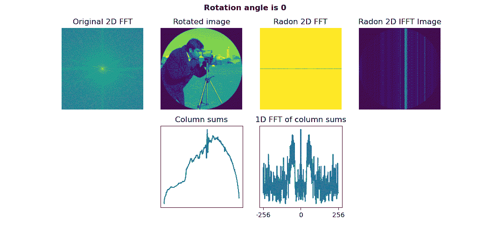
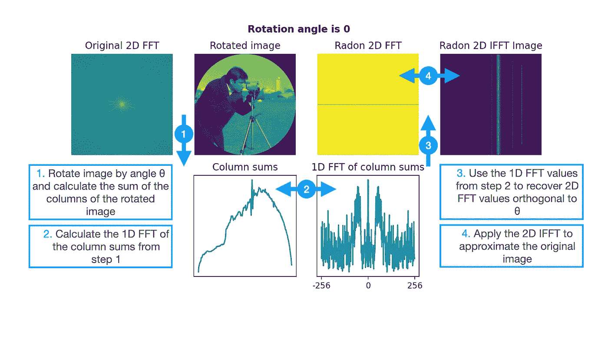
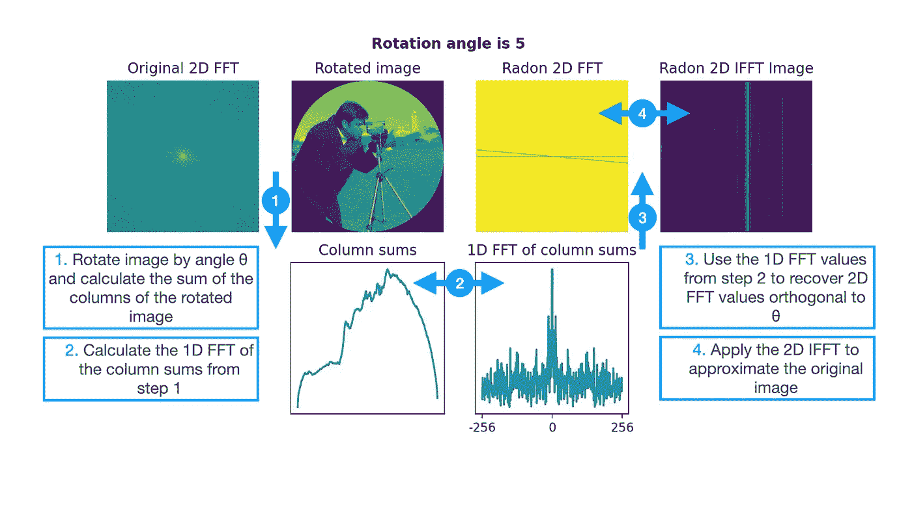
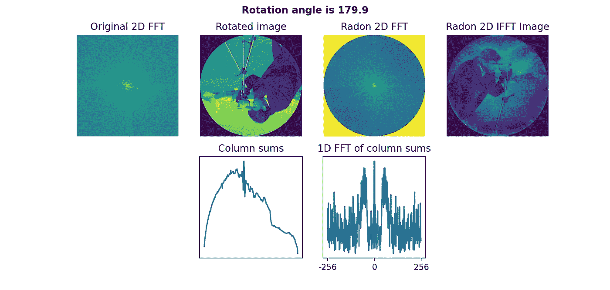

# 拉冬变换:基本原理

> 原文：<https://towardsdatascience.com/the-radon-transform-basic-principle-3179b33f773a>

## 了解计算机断层扫描(CAT)、合成孔径雷达(SAR)等技术背后的数学原理

随意在任何上下文中重用图片，无需注明出处(不保留任何权利)。

# 动机和定义

让我们从一个激励性的问题开始:断层摄影。此外，我们还将见到与我们同名的约翰·拉冬。

> 断层重建是一种多维[逆问题](https://en.wikipedia.org/wiki/Inverse_problem)，其中的挑战是从有限数量的[投影](https://en.wikipedia.org/wiki/Projection_(linear_algebra))中产生特定系统的估计。断层成像的数学基础是由[约翰·拉冬](https://en.wikipedia.org/wiki/Johann_Radon)奠定的。[维基百科](https://en.wikipedia.org/wiki/Tomographic_reconstruction)

在什么样的真实世界环境下，我们可以很容易地获得投影，而不容易获得完整的体积？出奇的经常！让我们考虑一下脑成像的例子。

如果我们想获得大脑的三维立体图像，我们可以相对容易地获得完整的 2D 切片。想想 x 光！我们可以让能量通过这个体积，看看有多少能量通过。这些 2D x 射线图像中的每一个都表示通过 3D 体积的线积分。我们可以在颅骨周围的不同几何位置获取大量的 x 射线图像，例如，从左侧、从前面、从右侧以及其间的所有角度。

然而，给定一组在任意集合几何结构下获得的 2D 图像，我们如何近似地重建潜在的 3D 体积呢？

> 如果函数表示未知的密度，则拉冬变换表示作为断层扫描的输出而获得的投影数据。因此，Radon 变换的逆变换可用于从投影数据中重建原始密度[…] [维基百科](https://en.wikipedia.org/wiki/Radon_transform)

让我们看看 Radon 变换(及其逆变换)如何帮助我们解决这个确切的问题！

为什么这些细节对医学数据科学家很重要？轻松点。对成像方法的理解对于推理伪像、限制和计算机视觉解决方案的适当处理方法是至关重要的。

# 拉冬变换的力学

为了便于可视化，让我们用 2D 积分切片来简化我们的 3D 大脑，而代之以用 1D 积分切片来考虑 2D 图像。逻辑是一样的！这只是让我们的介绍不那么令人生畏。

让我们把基本的观察放在一边！[傅立叶切片定理](https://en.wikipedia.org/wiki/Projection-slice_theorem)告诉我们…

> 如果我们通过 n 维体积(如 2D 图像)进行(n-1)维线积分(如列和)，这些积分的(n-1)维傅立叶变换**恢复原始的 n 维傅立叶值。**

打开这个需要一分钟时间！具体来说:如果我旋转一幅 2D 图像，对列求和，并计算这些列和的 1D FFT，*我已经从原始图像的 2D FFT 中恢复了值。*所以，我们可以利用傅立叶变换来实现拉冬变换！

**图 1** :未应用旋转的原理示例(0°)。图片作者。

在图 1 的*中，显示了未应用旋转的图像的原理。我们只是把原图的各列相加。如果我们对这些列和进行 1D FFT，我们将在 2D 傅立叶空间中恢复一条水平线，该水平线与我们求和的轴正交！不出所料，如果我们称 2D 为 IFFT，我们得到的是垂直方向的线型。*

现在，让我们应用 5°旋转，重复同样的过程！

**图 2** :应用旋转的原理示例(5)。图片作者。

通过收集偏移了旋转角度的线积分，我们现在已经通过 2D FFT 恢复了新的正交切片。2D·IFFT 恢复了原始图像的略微改善(但仍然很糟糕)的近似。

然而，在极限情况下，如果我们对许多角度重复这个过程，我们会得到拉冬变换！拉冬变换是将我们的 n 维体积变换成一组完整的(n-1)维线积分。逆拉冬变换是从我们的完整(n-1)维线积分回到原始图像的变换。在引擎盖下，所有这些都是通过(逆)傅立叶变换完成的！

**图 3** :从旋转角度 0°到 180°以 0.1 步重复该过程。图片作者。

正如所料，以紧密间隔的旋转角度重复恢复了我们原始 2D FFT 的精确近似和我们原始 2D 图像的相应精确近似(*图 3* )！

# 实际限制

事实上，我们并没有得到完整的集合。相反，我们通常会受到时间、成本或额外图像的负面影响的限制，例如，给病人进行 10，000 次 x 光扫描是不可取的😉

让我们来看看我们从 5 个旋转间距得到的近似值(*图 4* )！

**图 4** :具有 5 个旋转偏移的迭代逼近。图片作者。

值得注意的是，即使我们从 2D 傅立叶空间稀疏地恢复了值，我们仍然恢复了图像内容的关键特征。

# 结论

我们现在理解了关于成像的 Radon 变换的基本原理！(逆)拉冬变换描述了线积分的傅立叶变换和被成像的全维体积的傅立叶变换之间的基本关系。

接下来，我们将遍历支持代码，并探索层析成像常见的处理工件。感谢阅读；希望你学到了一些东西！