# 深度学习对时间序列预测的合理有效性

> 原文：<https://towardsdatascience.com/the-reasonable-effectiveness-of-deep-learning-for-time-series-forecasting-60e2c8affb9>

## 最先进模型的构建模块

在 [Unsplash](https://unsplash.com?utm_source=medium&utm_medium=referral) 上由 [Mourizal Zativa](https://unsplash.com/@mourimoto?utm_source=medium&utm_medium=referral) 拍摄的照片

# 非常笼统的定义

当谈到时间序列时，人们往往倾向于以一种非常实用的面向数据的方式来做:如果你试图查找一些定义，你可能会发现这样的表达方式，如“按时间顺序索引(或列出或绘制)的一系列数据点”([维基百科](https://en.wikipedia.org/wiki/Time_series))，“在连续时间点或连续时间段收集的一组数据”([大英百科全书](https://www.britannica.com/))，“在某段时间内以连续顺序出现的数据点序列”( [Investopedia](https://www.investopedia.com/terms/t/timeseries.asp) )。

事实是，所有可以测量的东西都属于这一类；一旦我们开始关注和观察一个现象超过一个快照，我们就可以合理地用时间序列建模的既定理论来处理它。

我能想到的唯一对时间序列没有意义的量是基本的物理常数:光速 *c* ，引力常数 *G* ，基本电荷 *e…* 像他们这样的家伙真的*永远不会改变*，根本不会。

我想在这个问题上多花两句话，因为我需要把一个观点讲清楚:我们不能在完整性的伪装下谈论时间序列和处理它们的工具。

事实上，每个时间序列只不过是一个特定的、可能非常复杂的物理过程的单一实现，其自身可能具有无限的潜在随机结果。

认识到无限的可能性应该有助于我们降低寻找一个适合所有人的解决方案来描述、分类或预测时间序列的愿望。

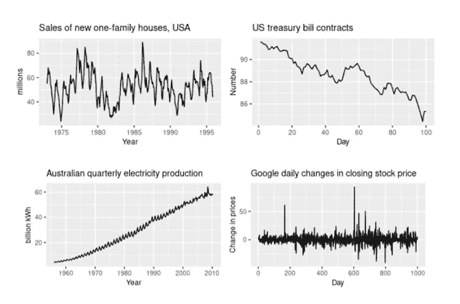

时间序列的例子显示了它们的外观和生成过程是多么的不同[1]。

# 预测问题

简而言之，预测是根据一个目标时间序列的过去值、其他相关序列的值以及使这些序列相互关联的特征来预测其未来值的任务。

我们通常用 **Y** 表示目标序列，用 **X** 表示协变量；当然，这是任意的，因为我们使用的所有序列至少在原则上是相互协变的。

相反，用另一个字母，比如说 **Z** 来表示那些具有已知未来值的时间序列是一个有意义的区别:想想日历特征，比如周数和假日。

这些序列有助于推理和训练，必须区别对待:首先，它们不需要预测。

另一个值得一提的命名惯例与时间有关:系列开始于传统的初始时间 t=0，然后我们使用 T 来表示过去(t=0 到 T)和未来(t>T)之间的划分，或者训练和测试；h 表示预测的**范围**，即我们需要预测达到未来多少个时间单位(t=T+1 到 t=T+h)。

最后，为了说明所有协变量之间的不同子群和关系，预测模型通常允许指定所谓的**静态特征**(**W**)；这些只不过是标记每个系列的值。

例如，我们可能有一组代表家庭用电量的序列，其静态特征描述了家庭本身(居住人数、房屋大小等)。

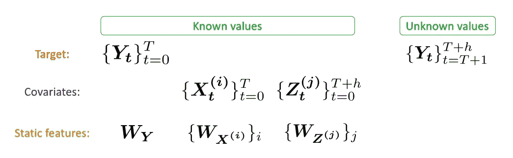

预测中使用的对象的基本分类。

请注意，图中的每个对象都用粗体表示，这通常是为向量保留的:这是因为，根据推理，我们也可以处理每个时间步长有多个值的序列。

我们称这样的多值序列*为多变量*，而不是更常见的*单变量*序列。这里我们借用了统计学术语:在统计学中，多变量概率分布是一种依赖于多个随机变量的分布。

## 分类

每当我们不得不面对一个预测问题时，我们可以通过给它贴上一些标签来立即揭示它；为此，我们可以根据我们到目前为止给出的定义记住以下分类:

*数据驱动标准*

*   **的**或**的**或**静态特性**。
*   **数据点的尺寸**:一元或多元。

*问题驱动标准*

*   **预测类型**、**、**点或概率性(分位数)。
*   **层位尺寸**，即一遍预测的时间步数。

# 古典技术

时间序列预测是一个既定的领域，在更现代的机器学习技术出现之前，其中的统计工具和理论已经为人所知。我们不会太关注这些，但是浏览一下最常见的还是很有用的。

## 基线

当考虑某样东西的未来价值时，首先想到的肯定是看它的当前价值；再一想，你肯定也会看看过去的值，然后满足于一个平均值，或者试着跟随一个趋势。

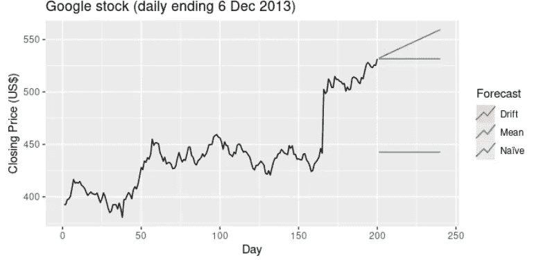

所谓的“简单”预测方法[1]。

我们称这些方法**为简单**；它们在概念上很重要，因为它们已经告诉我们，不对称数据(向前的时间箭头，相对于表格数据的一致性，每个样本都以相同的方式处理)增加了复杂性，需要我们做出一些假设:

*   未来会是现在的样子吗？
*   过去是什么样子很重要吗？我们应该追溯到多远？
*   结果背后的过程和以前一样吗？和以后一样吗？

如果这些问题的答案都是“是”，也就是说，我们假设所有过去的信息都是有用的，并且有一个单一的模式可以遵循，我们求助于**回归方法**，通过在越来越复杂的系列中搜索:线性、多项式、样条曲线等，找到逼近我们数据的最佳函数。

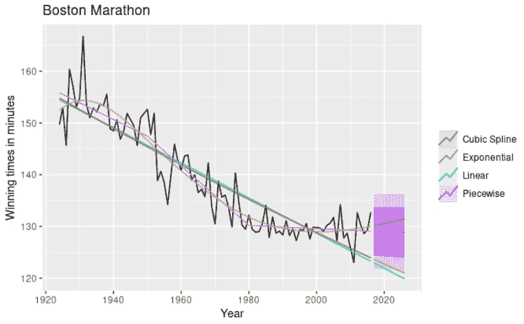

回归预测方法[1]。

除非我们出于某种原因知道要搜索的一些首选函数族，否则我们将只选择关于数据的最佳函数。然而，这又引发了一些疑问:

*   我们是否期望最近的趋势会无限期地持续下去？
*   过去的高峰和低谷会再次发生吗？
*   数列达到回归预测的未来值有意义吗？

## 分解方法

现在应该很清楚，我们不能只依赖数据，我们至少需要关于产生数据的过程的上下文信息。

分解方法走的就是这个方向，当我们知道这个序列来自一个具有某种周期性的过程时，这种方法最有用。

在这些方法中最经典的是季节-趋势-余数分解，我们寻找缓慢变化的平滑基线(趋势)，然后转向快速重复成分(季节性)，最后我们将信号的其余部分视为随机噪声(余数)。

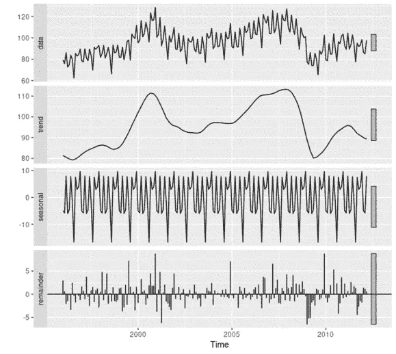

STR 分解预测法[1]。

分解方法让我们更自由地使用我们对数据的知识来预测其未来:例如，在旅游相关数据中，我们可能会发现每周(周末)或每年(夏季)的模式:将这些周期编码到模型中让我们放心，预测将更少“愚蠢”和更“知情”。

## SARIMAX 方法

最后，对于经典预测方法的概述，SARIMAX 方法是一个更加灵活的框架，允许选择最接近时间序列的成分。

构成 SARIMAX 首字母缩写词的字母代表分析块，我们可以将它们组合到模型的方程中:

*   **季节性**如果时间序列有周期性成分；
*   (**向量**)如果时间序列是多元的；
*   **自回归**如果时间序列依赖于它以前的值；
*   **积分**如果时间序列是非平稳的(如有趋势)；
*   **移动平均**如果时间序列依赖于以前的预测误差；
*   **外生变量**是否有协变量可利用。

SARIMAX 模型在概念上相当简单的同时却取得了令人难以置信的成功，并且最好地代表了人们应该如何处理预测问题:使用您所拥有的关于该问题的所有信息来限制要搜索的模型类别，然后在该类别中寻找您的数据的最佳近似。

# 深度学习技术

许多最近的综述论文[2][3][4]概述了在从业者长期缺乏兴趣之后，机器学习模型，尤其是神经网络，如何在时间序列预测话语中变得越来越重要。

为了理解为什么深度学习特别适合这个问题，我们将把经典技术与最新最成功的架构联系起来。

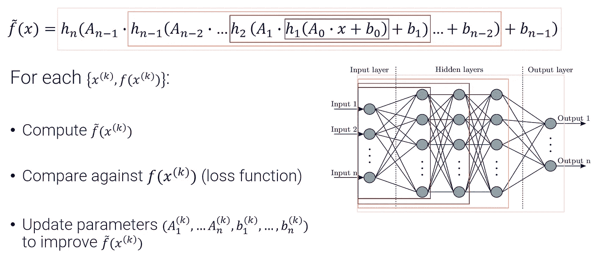

简而言之，训练一个(密集的)神经网络。

## 深度学习的合理有效性

目前，我们知道许多类型的神经网络是任何(合理定义的)函数的通用近似器，只要它们有足够的数据和内存[5][6][7]。

这当然使它们成为任何监督学习问题的优秀候选，其中目标确实是学习满足已知输入输出关联的函数。

然而，可悲的是，像普适近似这样的理论属性在实践中往往不相关，定理假设不成立:特别是，我们从来没有足够的数据和内存来成功地执行任何通用通用架构的学习任务。

尽管神经网络的武器库中还有另一种武器，那就是注入关于问题的信息的可能性，这种方法可以帮助模型学习想要的功能，就好像我们有更多的数据或计算时间可以花一样。

我们可以通过配置网络的**架构**来做到这一点，即通过根据手头的问题设计特定的网络连接性和形状:这实质上等于**约束可能函数的搜索空间**和**强加导致网络最佳参数的计算流**。

根据这个想法，以及在这个方向上多年的研究，一个关于网络结构和它们有效解决的相关问题的**分类法**正在被编纂；这种方法有时有些手工和启发性，但一般化和优雅的数学理论也正在出现[8]。

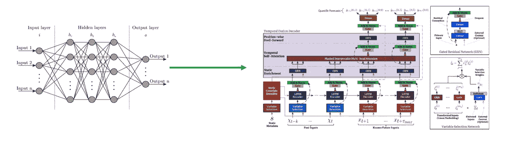

从一般的密集网络到高度复杂的网络(TFT) [10]。

深度学习的关键优势不是它的普遍性，而是它的**多功能性**和**模块化**:通过扩展、组合和重新连接节点来轻松处理网络的能力对于找到特定问题的正确候选模型至关重要。

此外，当找到这样的模型时，模块化可以简化向类似问题的过渡，而不会失去所有获得的专业知识(见迁移学习)。

所有这些特征使得深度学习成为经典技术的完美继任者，延续了模型复杂性和专业化不断增长的趋势，但也带来了普遍性和多功能性的巨大提升。

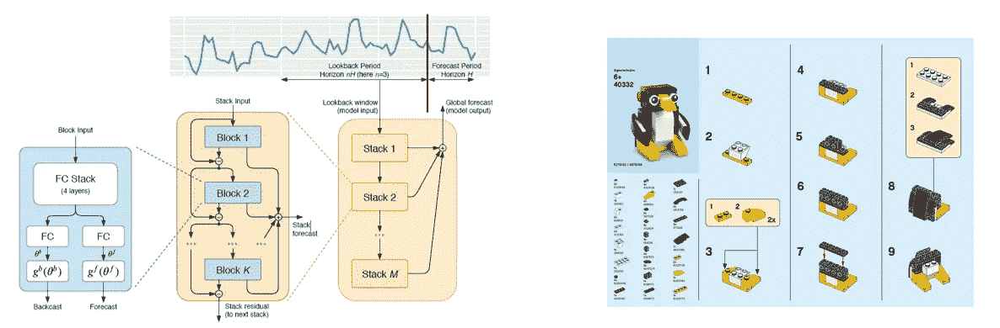

当代的 DL 架构，如 N-BEATS [9]是模块化和可组合的。

我们现在才开始理解塑造神经网络的架构如何改变它最接近的功能类别，但很明显，通过强加某种形状和结构来定制它以适应特定的问题类别是非常有益的:事实上，这种做法的优势在于从一开始就将网络指向正确的方向，从而减少在错误路径上花费的时间和资源。

照片由 [Heidi Fin](https://unsplash.com/@heidijfin?utm_source=medium&utm_medium=referral) 在 [Unsplash](https://unsplash.com?utm_source=medium&utm_medium=referral) 上拍摄

# 积木

现在，对于构建可以解决最困难的预测问题的深度学习模型来说，最有用的成分是什么？

正如我们之前说过的，每个预测问题都需要它的解决方案；因此，观察一些选定的网络结构，并了解它们如何通过形成计算流程和最终的训练模型来解决问题的特定特征，是很有启发性的。

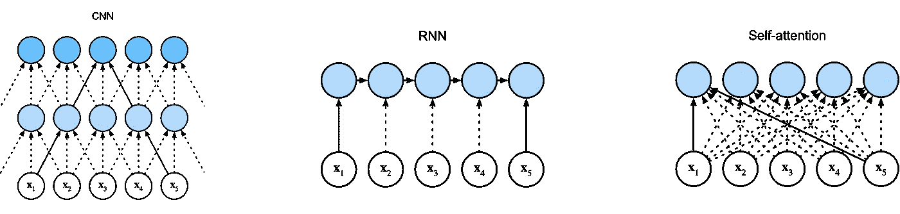

当适当地重新布线时，相同的节点可以变成不同的块[15]。

请注意，我们将只对将要讨论的架构进行非常简明的描述，然后只关注它们如何解决学习时间序列的特定特征。

不出所料，有许多资源涵盖了更多的技术和数学细节；比如[潜入深度学习](https://d2l.ai/index.html)【15】就非常全面，应该涵盖了所有的基本概念和定义。

## 卷积神经网络

卷积网络，或 CNN，已经存在了相当长的时间，并证明了许多监督学习任务的成功。

他们最引人注目的成就是学习图像特征，例如根据图片中是否描绘了特定的东西来对图片进行分类。

更一般地说，只要我们手头有数据，CNN 就有用:

*   可以有意义的用**张量**形式表示:1D 阵列，2D 矩阵…，
*   在张量中彼此靠近的点中包含有意义的模式，但与它们在张量中的位置无关。

很容易看出图像分类是如何适应这种技术的:

*   图片自然是像素矩阵，并且
*   分类通常基于物体内部物体的存在，物体被描述为一组相邻的像素。

请注意，“有意义”取决于我们试图解决的问题，因为模式和表示可能只对某些目标有意义。

例如，考虑将名画正确地分配给其画家或其所属的艺术运动的问题:相邻像素的模式是否有助于分类并不明显，因为例如检测一个物体可能对一些人有用(文艺复兴时期的艺术家画了很多肖像)，但对其他人却没有用(这对更现代的流派有什么帮助呢？) [16].

简而言之，CNN 可以通过应用具有**共享权重的**卷积**来学习上述局部模式:**卷积层中的每个节点是来自前一层的相邻节点(在图片的情况下是像素)的窗口和权重矩阵之间的点积。

实际上，对原始层中所有相同大小的窗口执行该乘积相当于应用卷积运算:卷积矩阵(在整个运算中是相同的)由可学习的网络参数组成，这些参数因此在节点之间共享。

通过这种方式，**平移不变性**得以加强:网络学习将局部模式与期望的输出相关联，而不管模式在张量中的位置如何。

见[这里](https://www.jeremyjordan.me/convolutional-neural-networks/)【11】一个优秀的和更广泛的解释。

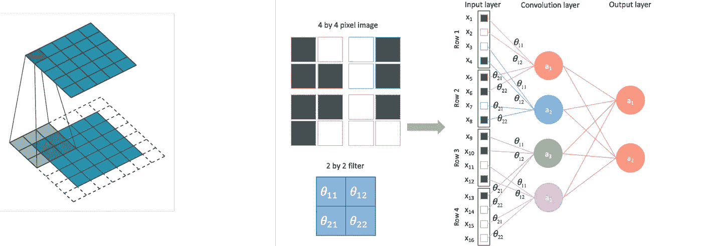

在 CNN 中，通过在整个层上滑动一个窗口来共享参数[11]。

但是我们能在时间序列设置中成功地应用 CNN 吗？

当然，开头提到的两个必要条件必须成立:

*   时间序列自然是有序的 1D 阵列，并且
*   通常时间上接近的点会形成有趣的模式(趋势、峰值、振荡)。

通过沿着时间轴滑动其卷积阵列，CNN 通常能够**在一系列中拾取重复的模式**，就像它能够检测图片中的对象一样。

此外，我们可以通过众所周知的时间序列操作技术来修改 CNN 的输入序列，从而欺骗 CNN 学习不同的结构。

例如，通过对序列进行子采样，我们可以让卷积层检测不同时间尺度的模式；通过在频域中应用变换，我们可以让它学习平滑、去噪的模式[12]。

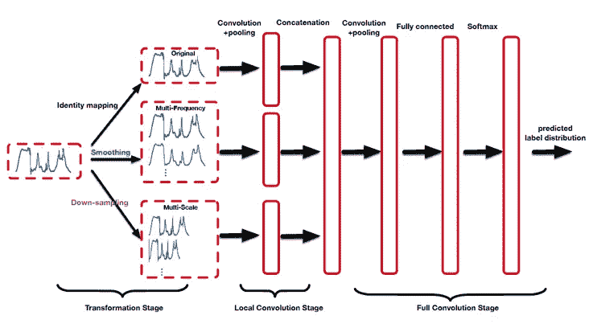

卷积网络作用于变换的时间序列[12]。

## 递归神经网络

如果 CNN 在图像和视频是最常见的数据格式的计算机视觉应用中找到了最佳点，那么递归神经网络似乎特别适合时间序列应用。

尽管如此，RNNs 最引人注目的成功来自自然语言处理领域，例如机器翻译或语音识别[17]。

事实上，当 CNN 寻找多维有序数据中的局部结构时，rnn 关注于单一维度并寻找持续时间更长的模式。

在处理某些类型的时间序列时，检测跨度很大的模式的能力特别有用，即那些呈现**低频周期**和季节性的时间序列，或者那些具有**长期自相关**的时间序列。

作用于有序 1D 输入数据的基本 RNN 层在那些数据点和层的节点之间具有一对一的关联；在此之上，层内连接形成了一个遵循输入数据排序的链。

训练过程包括将顺序数据分割成滑动的、重叠的块(长度与隐藏状态的数量相同):它们被顺序馈送，由通过它们传播的递归层内连接来链接。

我们通常将层节点表示为潜在或隐藏状态 h；它们对来自相应输入数据点的有意义信息进行编码，并与来自先前隐藏状态的递归信号进行协调。

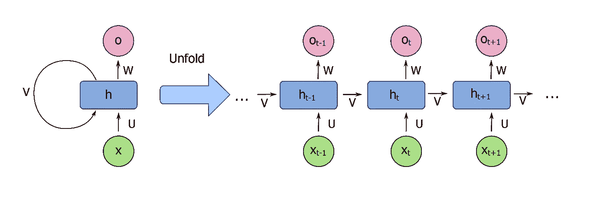

一个基本的 RNN，折叠(左)和展开(右)[13]。

出于时间序列预测的目的，对于 n 的任何选择，可以训练递归层的输出节点来学习 n 步预测，使得有序输出代表完整的预测路径；然而，通常情况下，RNN 只是更复杂架构中的一个模块。

在任何情况下，想法是处理和**保留关于过去的信息**，以便在训练过程中的任何点，算法可以访问所述信息并使用它。

正如在 CNN 中，这是一种形式的**权重分配**，因为时间序列的所有块进入相同的架构；出于同样的原因，**平移不变性**确保了无论某个模式何时发生，模型仍能将其与观察到的输出值相关联。

在简单的 RNN 中，隐藏状态通过经典的激活函数和线性标量积与输入节点和其他节点相联系；为了应对一些已知的限制，如 [**【消失渐变】**](https://en.wikipedia.org/wiki/Vanishing_gradient_problem)**【18】【19】，出现了许多不同的更复杂的“味道”，如 [LSTM](http://colah.github.io/posts/2015-08-Understanding-LSTMs/) s 和 [GRU](http://colah.github.io/posts/2015-08-Understanding-LSTMs/) 。**

**简而言之，消失梯度效应发生在反向传播期间，此时在长计算链中用乘积法则合成小导数会导致一些节点参数的无限小的更新，有效地中止了训练算法[20]。**

**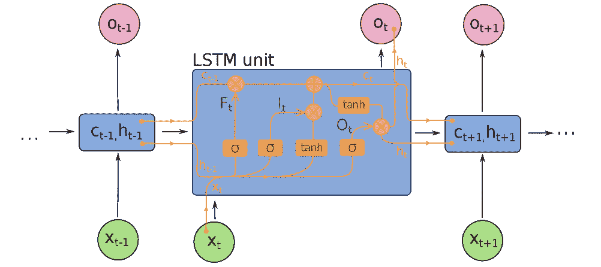****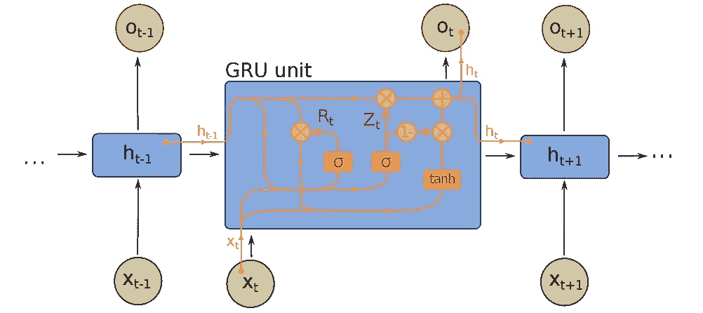**

**不同的 RNN“风味”:LSTM(左)，GRU(右)。**

## **注意机制**

**注意力机制诞生于神经机器翻译任务的 NLP 环境中，其中能够从给定语言翻译任何句子的单个全局模型的想法需要比当时可用的技术更复杂的技术[22]。**

**AMs 通常出现在编码器-解码器架构中，它们允许捕捉最相关的信息。**

****

**注意机制在编码器-解码器架构中的实际使用示例[15]。**

**事实上，注意机制的一般思想是，将时态数据序列的所有位都视为同等重要，即使不会误导模型，也是一种浪费。**

**有些单词对于理解句子的语气和语境是非常重要的:它们需要和同一个句子中的大多数其他单词一起考虑。**

**实际上，模型需要保持警惕，随时准备对这些单词给予更多的关注，并使用它们来影响同一个句子中其他单词的翻译。**

**在时间序列应用中，对于时间序列的未来发展至关重要且具有影响力的时刻，也可以做出类似的论证:结构趋势变化、意外峰值(异常值)、异常长的低值期……只是在某些情况下可用于检测的一些模式。**

**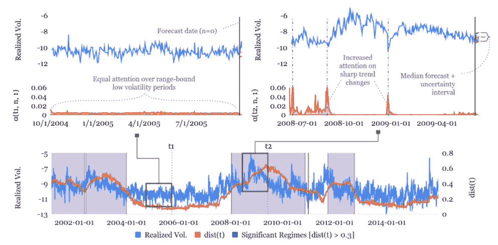**

**多头注意力机制在谷歌 TFT 中的实际应用，检测波动性系列中的趋势变化[10]。**

**这基本上就是 AM 所做的事情:它获取任何给定的输入数据(有时称为*查询*)，并根据查询本身的存在情况考虑所有可能的输入输出对(分别称为*键*和*值*)。**

**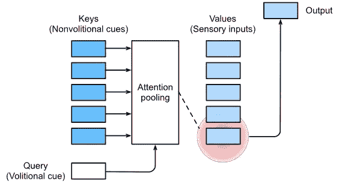**

**QKV 符号中简化的注意机制[15]。**

**在此过程中，该模型计算**关注分数**，该分数表示作为每个关键字的上下文的查询的重要性。**

**请注意，评分函数可以是固定的(例如，计算序列中查询和关键字之间的距离)，或者更有趣的是，可以参数化以便学习。**

**注意力分数通常被归一化为权重，并用于值的**加权平均值，该平均值可被用作该机制的输出。****

**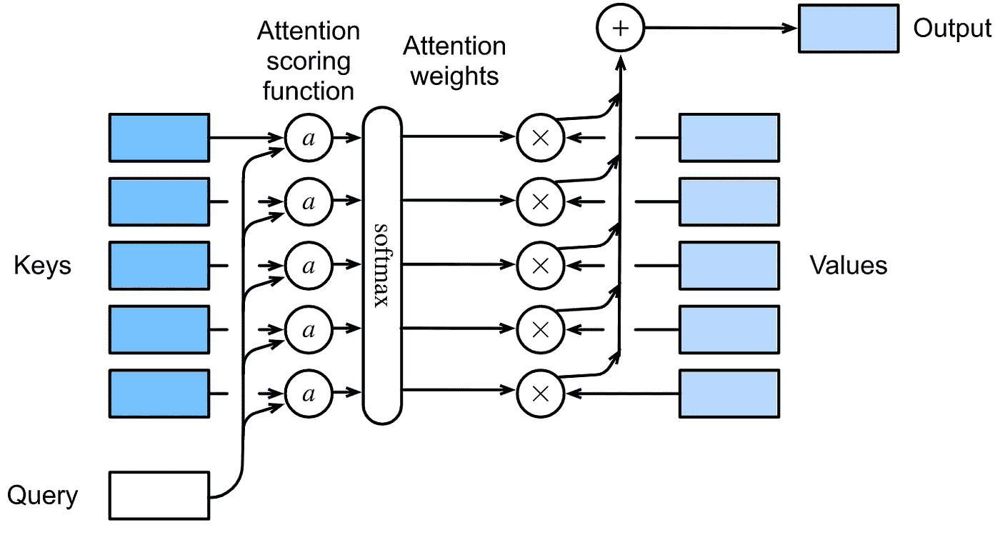**

**注意机制的可能设计[15]。**

## **剩余网络**

**剩余网络是现有模块的附件，提供所谓的**跳过连接**:输入与块中发生的计算并行传输，然后两个版本在输出端合并(通常有加法或减法，效果截然不同)。**

**例如，在加法的情况下，跳过连接的引入有效地使得跳过的块从学习某个原始变换 f(x)切换到它的**残差**，f(x)-x**

**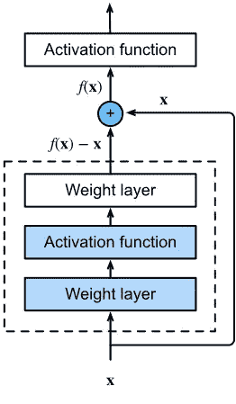**

**剩余网络的基本结构，其中虚线框被剩余连接绕过[15]。**

**它们最初是通过应用于 CNN[21]而引入的，但现在它们基本上无处不在，因为它们提供了明显的优势，而没有增加太多的计算或复杂性。**

**从表面上看，RNs 是一个非常简单的概念；不过，它所达到的效果可能并不明显，所以现在让我们来分析一下它们的优势。**

*   ****促进信息传播**:如前所述，长的计算链会遭受消失梯度的影响；剩余连接为梯度提供了附加项，该附加项不包含由跳过的块给出的导数的链积。**
*   ****避免精度饱和**:已经证明[21]添加残差块有助于减轻这种影响，这种影响包括阻止通过添加更多层来实现通常的改善，有时甚至会导致恶化(“降级”)。**
*   ****提供开/关开关**:被跳过的块学习残差 f(x)-x 的事实为模型打开了一种新的可能性，即设置块的所有参数，使得 f(x)=0，并且组合输出等于 x。这当然是**恒等式**，意味着组合块被有效地关闭。**
*   ****分解一个输入**:学习残差的另一个作用是，如果你巧妙地将残差块串联起来(“级联”块)，那么可以让第 n 个块学习输入中去掉前面 n-1 个块的结果。换句话说，每个方块都在学习期望结果的一小部分，可以通过在最后将这些部分相加来恢复。此外，我们可以定制每个级联块来学习不同的部分，以便我们有效地实现已知的时间序列分解，如 STR 或傅立叶变换[9]。**

**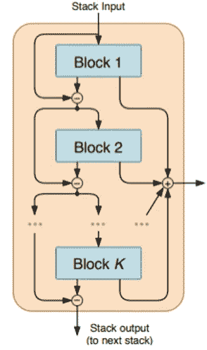**

**剩余网络将级联块分配给 N 拍时间序列中的不同相加分量[9]。**

# **结论**

**希望在这一点上很清楚，就时间序列预测而言，深度学习已经走上了一条成功的道路。**

**这条路径代表了日益复杂和定制的模型的历史，专门研究时间序列的不同子类，并且它只是在最近才被神经网络填充；经典的统计模型比它们更早，但仍然显示出越来越多地为特定的预测任务手工制作的趋势。**

**在未来，这种考虑肯定适用于统计学习的其他领域(特别是机器学习)，今天通常使用的有点手工的方法必须为数学框架腾出空间，该框架可以系统地将预测问题的特征与解决该问题的最佳可能架构联系起来。**

***我希望你喜欢这篇文章！请不要犹豫留下评论或反馈。***

***如果你愿意，* [*关注我*](https://medium.com/@gabri_orl) *以免错过我的下一期出版物。***

***你也可以在*[*LinkedIn*](https://www.linkedin.com/in/gabri-o/)*或者通过我的公司、*[*xtream*](https://xtreamers.io/)*找到我。***

**[1] R. J. Hyndman 等著，[预测:原理与实践，第二版](https://otexts.com/fpp2) (2018)。**

**[2] B. Lim 等，[深度学习的时间序列预测:综述](https://arxiv.org/abs/2004.13408) (2020)。**

**[3] K. Benidis 等人，[时间序列预测的深度学习:教程与文献综述](https://www.amazon.science/publications/deep-learning-for-time-series-forecasting-tutorial-and-literature-survey) (2018)。**

**[4] R. Masini 等人，[时间序列预测的机器学习进展](https://masini.princeton.edu/publications/machine-learning-advances-time-series-forecasting) (2021)。**

**[5] K. Hornik 等人，[多层前馈网络是通用逼近器](https://cognitivemedium.com/magic_paper/assets/Hornik.pdf) (1989)。**

**[6] Z. Lu 等，[神经网络的表达能力:从宽度上看](https://proceedings.neurips.cc/paper/2017/hash/32cbf687880eb1674a07bf717761dd3a-Abstract.html) (2017)。**

**[7] D .周等，[深度卷积神经网络的普适性](https://arxiv.org/abs/1805.10769) (2018)。**

**[8] M. Bronstein 等人，[几何深度学习:网格、组、图、测地线和量规](https://arxiv.org/abs/2104.13478) (2021)。**

**[9] B. N. Oreshkin 等人， [N-BEATS:可解释时间序列预测的神经基础扩展分析](https://arxiv.org/abs/1905.10437) (2019)。**

**[10] B. Lim 等人，[用于可解释多时间范围时间序列预测的时间融合转换器](https://www.sciencedirect.com/science/article/pii/S0169207021000637) (2021)。**

**https://www.jeremyjordan.me/convolutional-neural-networks/。**

**[12] Z .崔等，[用于时间序列分类的多尺度卷积神经网络](https://arxiv.org/abs/1603.06995) (2016)。**

**[13]由 fdeloche-Own 工作，CC BY-SA 4.0，[https://commons.wikimedia.org/w/index.php?curid=60109157](https://commons.wikimedia.org/w/index.php?curid=60109157)**

**[14]由 fdeloche-Own 工作，CC BY-SA 4.0，[https://commons.wikimedia.org/w/index.php?curid=60149410](https://commons.wikimedia.org/w/index.php?curid=60149410)和[https://commons.wikimedia.org/w/index.php?curid=60466441](https://commons.wikimedia.org/w/index.php?curid=60466441)**

**[15] A .张等，[潜入深度学习](https://d2l.ai/index.html) (2020)。**

**[16] W .赵等，[比较模型在艺术分类中的表现](https://journals.plos.org/plosone/article?id=10.1371/journal.pone.0248414) (2021)。**

**[17] I. Sutskever 等人，[用神经网络进行序列对序列学习](https://proceedings.neurips.cc/paper/2014/file/a14ac55a4f27472c5d894ec1c3c743d2-Paper.pdf) (2014)。**

**[18] S. Hochreiter 等人，[长短期记忆](https://direct.mit.edu/neco/article-abstract/9/8/1735/6109/Long-Short-Term-Memory?redirectedFrom=fulltext) (1997)。**

**[19] K. Cho 等人，[论神经机器翻译的性质:编码器-解码器方法](https://arxiv.org/abs/1409.1259) (2014)。**

**[20] S. Hochreiter 等人，[递归网络中的梯度流:学习长期依赖性的困难](https://www.researchgate.net/publication/2839938_Gradient_Flow_in_Recurrent_Nets_the_Difficulty_of_Learning_Long-Term_Dependencies) (2003)。**

**[21] K. He 等，[用于图像识别的深度残差学习](https://arxiv.org/pdf/1512.03385.pdf) (2015)。**

**[22] Bahdanau 等人，[通过联合学习对齐和翻译的神经机器翻译](https://arxiv.org/abs/1409.0473) (2014)。**