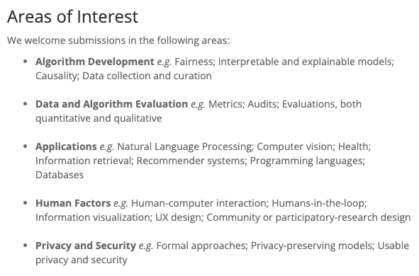

# 可解释性与公平性的关系

> 原文：<https://towardsdatascience.com/the-relationship-between-interpretability-and-fairness-627266bd6fda>

## 为什么可解释的模型更可能是公平的 3 个原因

(来源: [flaticon](https://www.flaticon.com/premium-icon/justice_3053751?term=fairness&page=1&position=15&page=1&position=15&related_id=3053751&origin=search) )

可解释性和公平性似乎是相辅相成的。[可解释性](/interpretability-in-machine-learning-ab0cf2e66e1)包括理解模型如何做出预测。[公平](/what-is-algorithm-fairness-3182e161cf9f)包括理解预测是否偏向某些群体。在负责任的人工智能框架和 ML 会议中，这些特征总是被一起提及。然而，可解释性并不一定意味着公平性。

也就是说，一个可解释的模型更有可能是公平的。这种联系有三个主要原因。对于可解释的模型，更容易确定不公平的原因。在一个可解释的模型中也更容易纠正不公平。一些方法，比如证明解释，甚至依赖于可解释性。最后，这两个特征通过在人工智能系统中建立信任的目标联系在一起。我们将深入讨论这些原因。

# 用不可知的方法测量偏差

在我们深入探讨这些之前，让我们先讨论一下如何分析公平性。这也将帮助我们理解为什么这不是可解释性和公平性相关的原因之一。通常，公平性的衡量标准是[模型不可知的](/what-are-model-agnostic-methods-387b0e8441ef)。这意味着它们可以用于任何型号。这包括**内在可解释的**模型，如线性回归和决策树。它还包括**更难解释的**模型，如随机森林甚至神经网络。

准确性是衡量公平性的一个简单例子。具体来说，我们将比较该模型在不同人群中的准确性。这里的子群体是由敏感的特征定义的，如种族或性别。如果其中一个小组的准确性明显较低，这表明该模型对该小组不公平。

为了计算这个公平的衡量标准，我们只需要模型的预测和实际的目标变量。我们不需要研究模型本身的内部工作原理。这意味着计算可解释模型和不太可解释模型的度量是一样容易的。换句话说，如果 一个模型不公平，可解释性并不会让理解 ***变得更容易。问题是，像这样的衡量标准并没有告诉我们 ***为什么*** 模型是不公平的。***

# 原因 1:更容易确定不公平的原因

不公平有不同的[原因](/algorithm-fairness-sources-of-bias-7082e5b78a2c) **。**这包括用于训练模型的数据中的偏差。具体来说，**历史偏差**、**代理变量**和**不平衡数据集**会导致不公平的预测。我们围绕**算法**和**用户如何与模型**互动的选择也会引入偏差。对于可解释的模型，更容易识别这些来源。

这是因为，对于可解释的模型，更容易理解模型如何工作。这意味着我们清楚地了解哪些特性是重要的。我们也理解这些特征和目标变量之间的关系。通常，与神经网络等模型相比，算法和成本函数也简单得多。所有这些都使得找出导致模型不公平的原因变得更加容易。

与这个原因相关的是模型是如何构建的。通常，当你建立一个可解释的模型(例如线性回归)时，你将最终选择 8 到 12 个模型特征。您还将花时间使用领域知识将特性趋势与预期进行比较。真的，更多的心思放在[功能选择](/characteristics-of-a-good-feature-4f1ac7a90a42)上。只要我们考虑到公平，我们可以在模型开发过程的早期提出问题。这意味着您甚至可以在偏差被引入模型之前就识别出偏差的来源。

# 原因 2:更容易纠正偏差

对于可解释的模型，也更容易[纠正不公平](/approaches-for-addressing-unfairness-in-machine-learning-a31f9807cf31) ***。*** 这部分源于上面讨论的第一个原因。我们采取的纠正不公平的方法可能取决于不公平的原因。因为更容易确定原因，所以更容易选择最佳方法来纠正它。例如，我们可以纠正不公平模型的方法之一是移除代理变量。这些特征与种族或性别等敏感特征密切相关。

像随机森林这样的模型可以有多达 30-40 个特征。模型结构还允许特性之间的[交互](/finding-and-visualising-interactions-14d54a69da7c#:~:text=What%20are%20interactions%3F)。这种复杂性使得很难理解任何代理变量和目标变量之间的关系。更难理解的是，这种关系是否会导致不公平的决定。最终，决定删除哪些代理变量更加困难。

可以对算法本身进行其他修正。比如我们可以调整成本函数来考虑公平性。这可能涉及添加惩罚不公平决策的惩罚参数。换句话说，模型的目标不仅是做出准确的预测，而且是公平的预测。可解释模型的算法和成本函数通常更简单。这使得调整它们更容易。

确保公平的方法也可以超越上面提到的量化方法。对抗不公平的一个重要方法是为用户提供预测的解释，然后给用户挑战这些预测的权力。我们越了解一个模型是如何工作的，就越容易用一种人类友好的方式来解释它。换句话说，可解释性更容易给出好的解释。

# 原因 3:它们都是关于建立信任的

最重要的原因是可解释性和公平性的共同目标。它们都是关于建立对人工智能系统的信任。这主要是通过减少这些系统可能造成的伤害来实现的。也就是说，我们不会相信我们认为会对我们造成伤害的东西。

我们更容易相信我们理解的东西。此外，我们对某事了解得越多，就越能确定它不会造成伤害。从这个意义上说，可解释性可以建立信任。公平的目标更直接。它旨在减少不公平决定带来的伤害。最终，一个关心人工智能系统信任度的组织会同时关心可解释性和公平性。

这就是为什么你会经常在负责任的人工智能框架中看到公平性和可解释性被一起提及。这些治理框架旨在定义开发人工智能系统的道德准则和最佳实践。除了公平性和可解释性，这些框架还涵盖了安全、保密和隐私等主题。像[谷歌](https://ai.google/responsibilities/responsible-ai-practices/)、[微软](https://www.microsoft.com/en-us/ai/responsible-ai?activetab=pivot1:primaryr6)和 [IBM](https://www.ibm.com/artificial-intelligence/ethics) 这样的公司都有自己的框架。他们明白客户不会使用他们不信任的系统。

> 人工智能的发展正在创造新的机会来改善世界各地人们的生活，从商业到医疗保健到教育。这也提出了新的问题，即在这些系统中构建**公平性**、**可解释性**、隐私和安全性的最佳方式。
> 
> —谷歌人工智能研究[负责任的人工智能实践](https://ai.google/responsibilities/responsible-ai-practices/)

出于类似的原因，公平性和可解释性是相关的研究课题。例如，在下面你可以看到 **FAccT 2022** 会议论文的一些感兴趣的领域。这是一次关于公平、问责和透明的会议。公平性和可解释性是算法开发中首先提到的话题。一个对减少人工智能系统的危害感兴趣的研究者会对这两个话题感兴趣。

FAccT 2022 征集论文(来源: [ACM FAccT](https://facctconference.org/2022/cfp.html) )

对信任的需求是公平性和可解释性之间关系的真正驱动力。我们看到可解释模型的特征也使这种关系更加密切。一路上，我们谈到了一些与公平相关的话题。这就是**不公平的原因**、**分析公平**和**保证公平的途径**。下面的三篇文章深入探讨了这些主题。

      

我希望这篇文章对你有帮助！你可以成为我的 [**推荐会员**](https://conorosullyds.medium.com/membership) **来支持我。你可以访问 medium 上的所有文章，我可以得到你的部分费用。**

  

你可以在|[Twitter](https://twitter.com/conorosullyDS)|[YouTube](https://www.youtube.com/channel/UChsoWqJbEjBwrn00Zvghi4w)|[时事通讯](https://mailchi.mp/aa82a5ce1dc0/signup)上找到我——注册免费参加 [Python SHAP 课程](https://adataodyssey.com/courses/shap-with-python/)

## 图像来源

所有图片都是我自己的或从[www.flaticon.com](http://www.flaticon.com/)获得的。在后者的情况下，我拥有他们的[保费计划](https://support.flaticon.com/hc/en-us/articles/202798201-What-are-Flaticon-Premium-licenses-)中定义的“完全许可”。

## 参考

Birhane，a .(2021)**算法的不公正:一种关系伦理方法**。[https://www . science direct . com/science/article/pii/s 2666389921000155](https://www.sciencedirect.com/science/article/pii/S2666389921000155)

Pessach，d .和 Shmueli，e .(2020)，**算法公平性。**[https://arxiv.org/abs/2001.09784](https://arxiv.org/abs/2001.09784)

Mehrabi，n .、Morstatter，f .、Saxena，n .、Lerman，k .和 Galstyan，A .，(2021)，**关于机器学习中的偏见和公平的调查。**[https://arxiv.org/abs/1908.09635](https://arxiv.org/abs/1908.09635)