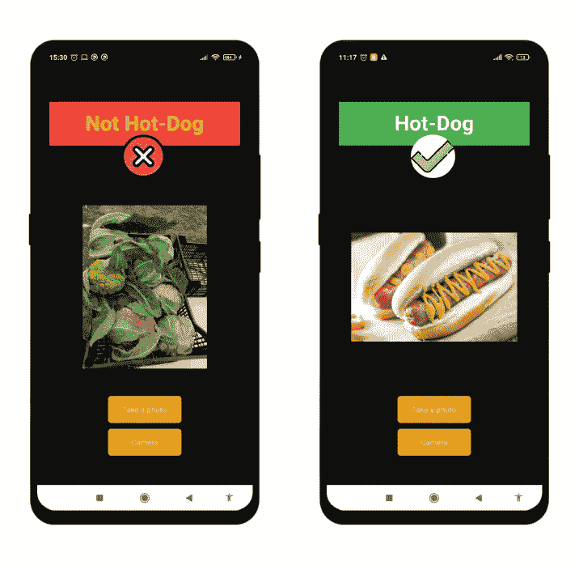
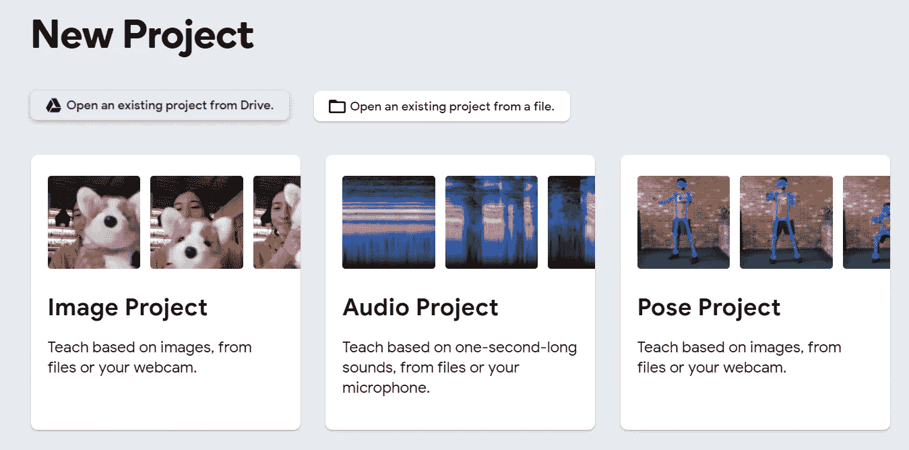
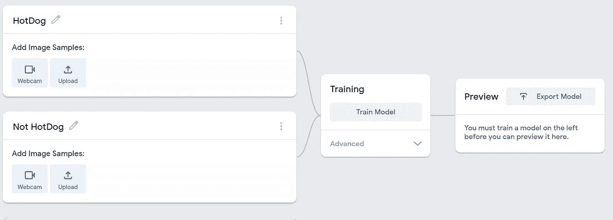
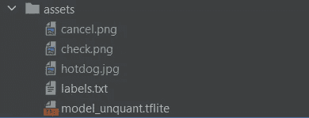
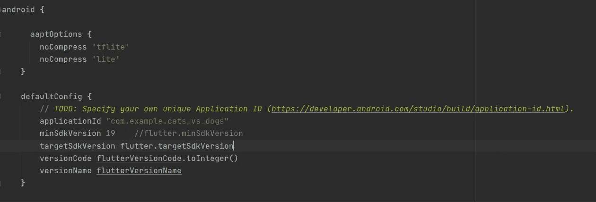
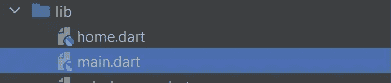

# 重塑“硅谷”SeeFood 应用程序

> 原文：<https://towardsdatascience.com/the-remaking-of-the-silicon-valleys-series-seefood-app-d309068cae6d>


马文·迈耶在 [Unsplash](https://unsplash.com?utm_source=medium&utm_medium=referral) 上的照片

# 重塑“硅谷”SeeFood 应用程序

## 使用可教的机器和颤振开发杨坚的应用程序

我花了整个圣诞假期重新看了一遍很棒的喜剧电视连续剧*硅谷*，其中杨坚开发了一个移动应用程序，将食物分类为“热狗”和“非热狗”。这里有一段插曲！

我对这个节目的热情，促使我重新创建应用程序的原型，基本上看起来像下面的图片:



作者图片

# 创建模型

首先，我们必须通过创建一个二元分类器来检测属于“热狗”类别的食物和不属于它的食物。在我的上一篇文章中，我说明了如何创建一个能够分类*狗*和*猫*的深度学习系统，你可以在这里找到它。

为了简单起见，我将在这篇书面教程中介绍一个非常酷和高效的工具，叫做[可教机器](https://teachablemachine.withgoogle.com/)，它可以让你通过点击几下鼠标就能创建一个二进制分类器！

第一步，是建立一个新的形象工程。



截图来自 https://teachablemachine.withgoogle.com/train

之后，您将第一个类重命名为“热狗”，第二个类重命名为“非热狗”



截图来自[https://teachablemachine.withgoogle.com/train/image](https://teachablemachine.withgoogle.com/train/image)

完成步骤 1 和 2 后，您可以将所有符合既定类别的图片拖放到“上传”按钮上进行上传。你可以在下面的 Kaggle [数据集](https://www.kaggle.com/yashvrdnjain/hotdognothotdog/metadata)上找到需要的图像。

最后点击“火车模型”等待。在培训阶段结束时，您应该能够下载 tensorflow lite 格式的培训模型。

下载后，您将解压压缩的归档文件，并打开 label.txt 文件。要保留普通的“热狗”和“非热狗”文本，请从文件中删除“0”和“1”字符。

# 数据

我提供的[数据集](https://www.kaggle.com/yashvrdnjain/hotdognothotdog/metadata)——带有公共许可证——总共有 **3000 张**图像可用于训练:从这个数量中， **1500 张**在图片中显示一个热狗，而在其余的图片上显示*非热狗*图像，如食物、人、宠物等。此外，测试集由两个类别的 **322 张**图片组成。

## 让我们构建移动应用程序

为了开发这个应用程序，我将在 Android Studio 中使用 Flutter。如果你不知道如何设置一个 Flutter 应用程序，只需遵循这些简单的 [*步骤*](https://docs.flutter.dev/get-started/install) 。

在您的*资产文件夹*(如果没有，创建一个即可)中插入提取的文件: *labels.txt* 和 *model_unquant.tflite* 。



作者图片

我还添加了另外三张图片，当应用程序返回是否是热狗的结果时显示。

打开 **pubspec.yaml** 文件，粘贴到这些依赖项下面。

```
**dependencies**:
  **flutter**:
    **sdk**: flutter
  **image_picker**: ^0.8.4+4
  **tflite**: ^1.1.2
  **splashscreen**: ^1.3.5
```

如果您在安装这些软件包时遇到问题，只需在[https://pub.dev/](https://pub.dev/)上查找它们，并按照说明进行操作。

您还需要在 **pubspec.yaml** 文件中添加(取消注释)**资产*目录:***

```
*# To add assets to your application, add an assets section, like this:* **assets**:
  - assets/
*#   - images/a_dot_burr.jpeg
#   - images/a_dot_ham.jpeg*
```

打开**Android/app/build . gradle**，将以下代码粘贴到 **android** 块中:

```
aaptOptions{
   noCompress ‘tflite’
   noCompress ‘lite’
}
```

并将 **minSdkVersion** 改为 **19**



作者图片

现在，您只需要在 lib 文件夹中创建 2 个 dart 文件:



作者图片

现在，将以下代码复制并粘贴到 main.dart 文件中。

在前面的代码中，我们设置了应用程序标题，而主页被重定向到 home 类。现在，我们可以在 home.dart 文件中创建 Home 类了

即使这段代码看起来很难，但大部分都是通过设置颜色、布局、文本等让事情看起来更漂亮

重要的方法很少。让我们从 **pickImage** 和**pick gallery image**开始。这些是异步功能，因为它们需要用户从他的设备中拍摄或选择照片。在*初始状态*中， **loadModel** 方法只是加载我们使用*可示教机器开发的模型。*之后，在*处理方法中关闭模型。*该 **classifyImage 方法**是该应用的核心，即给定一个图片文件，返回“HotDog”和“Not HotDog”。

## 结论

这项工作的结果是，当你观看像硅谷这样的科技展时会发生什么。现在你只需要找到其他像你一样的书呆子，开发一个应用程序，让你成为像杨晶一样成功的人！