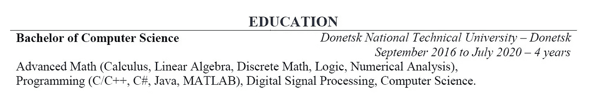
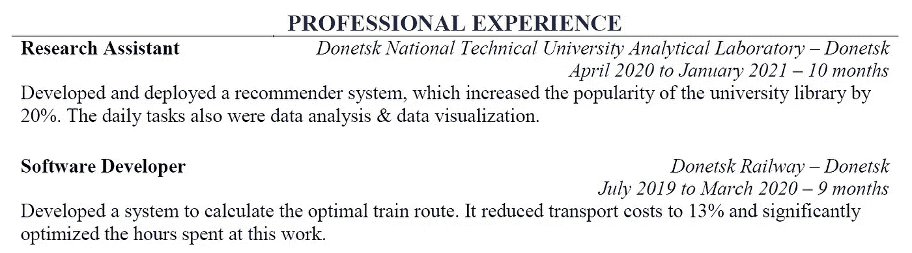
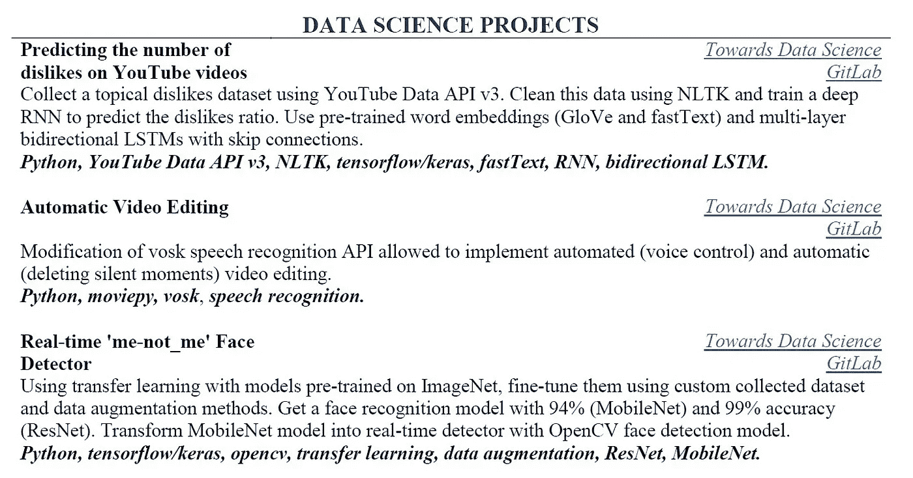
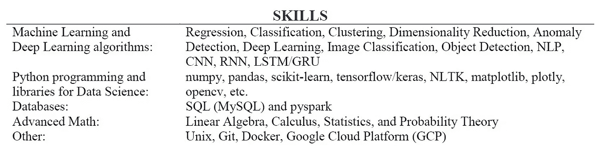
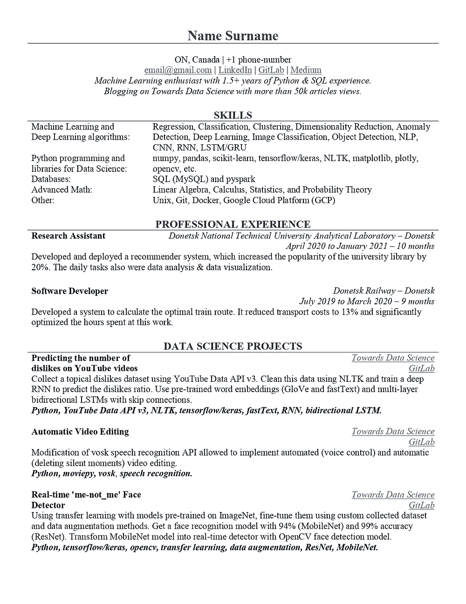
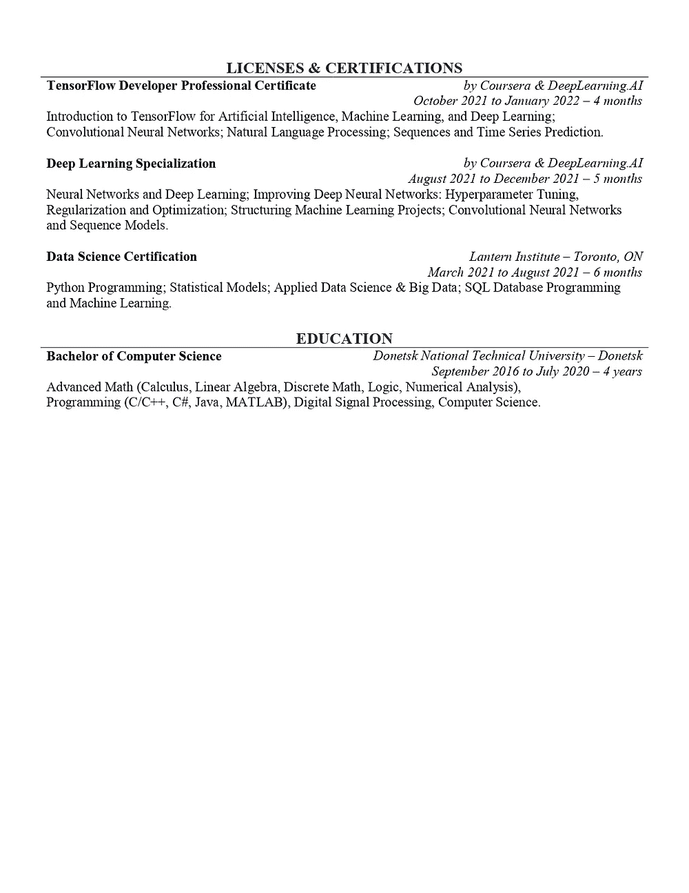

# 我在加拿大获得第一份 ML 实习的简历

> 原文：<https://towardsdatascience.com/the-resume-with-which-i-got-my-first-ml-internship-in-canada-d1cd833cc452>

## 机器学习怎么找工作？我的个人故事

塞巴斯蒂安·赫尔曼在 [Unsplash](https://unsplash.com/?utm_source=unsplash&utm_medium=referral&utm_content=creditCopyText) 上的照片

你可能见过很多这样标题的文章。每个人的经历都是独特的，你可以从每个人的经历中获得一些有用的(同时也是独特的)信息。

然而，我遇到的大多数关于这个主题的文章对我来说听起来有点奇怪:这样一篇文章中的一份简历有两页，第二页是科学出版物和专利的列表(哇，令人印象深刻！).

# TL；速度三角形定位法(dead reckoning)

我的故事和之前所有的故事有什么不同？好吧，如果我没有最差的简历，那么可能是最差的之一，至少在两个主要领域:

*   教育——我是一个计算机科学学士，来自一个你从来不知道的城市；
*   经验——我几乎没有相关的工作经验。

不过，我还是在加拿大找到了一份机器学习相关的工作，虽然很难而且**花了整整一年**。

你可以在**完整简历**版块下载我的 pdf 和 docx 格式的简历。

# 教育

正如我已经说过的——我是一所不知名大学的计算机科学学士。当然，通过良好的教育，你有更好的机会找到工作，至少因为你有机会接触到的关系和网络。但是，如果你不够幸运，没能在顶尖大学学习，那就用其他方式证明你值得拥有一份工作。

简历中的教育部分。作者图片

# 经验

我想这是你简历中最重要的一点——你以前在哪里工作过，你如何展示你的工作成果极大地影响了你获得职位的机会。然而，每个人都需要从某个地方开始。这就是著名的*权限悖论*或者说*经验悖论:* **如果所有用人单位都要求员工有工作经验，那么如何获得这种工作经验？**

我不是这方面的专家，但这是我从许多人那里听到的:**你不能让这个字段为空**。在这里列出大学实践并提及精心设计的课程或相应的学位项目可能是合适的。但是你不能让它空着。如果事情真的很糟糕，你可以找一个*开源项目*来贡献或者获得一些*志愿者*经验。

简历中的经历部分。作者图片

# 是的，个人项目(再次)

由于我的工作经历完全不起眼，数据科学/机器学习项目部分是我简历中最有价值和最强大的部分。如果你有类似的工作经历，你也应该有类似的项目经历。

那一部分可以让你找到工作。它可以告诉一个潜在的雇主:*“嘿，我没有任何工作经验，但是我在努力，我在努力！”。*

你可能不止一次听到这句话，但是**如果你没有任何工作经验，个人项目对你来说至关重要**。让它们*尽可能有趣*和*复杂*，使用*现代技术*，尝试从零开始实现某些东西*以更深入地理解特定算法是如何工作的，等等。*

***所有这些都表明你有兴趣**，你准备好学习新东西**，**准备好面对困难并克服困难**。你真的是那样吗？证明一下！***

**

*简历中的项目部分。作者图片*

*以下是我的项目链接。我不知道我写的关于数据科学的博客有多大帮助，但它首先帮助了我。*只有向另一个人解释某事，你才能完全理解它。因此，撰写教程或个人专业博客是开始数据科学职业生涯的一个非常好的方式。**

*   *预测 YouTube 视频上不喜欢的数量:[第一部分](/predicting-the-number-of-dislikes-on-youtube-videos-part-1-dataset-9ec431585dc3)和[第二部分](/predicting-the-number-of-dislikes-on-youtube-videos-part-2-model-aa981a69a8b2)；*
*   *[自动视频编辑](/automatic-video-editing-using-python-324e5efd7eba)；*
*   *[实时“我不是我”人脸检测器](/how-to-create-real-time-face-detector-ff0e1f81925f)。*

*你们的水平或兴趣可能有很大的不同，但是你需要找到一些能够启发你的东西。*

*如果你对项目没有任何想法，你可能还没有准备好实施它们。为了用机器学习术语来思考和观察这个世界*，你需要一个非常严肃的知识库*。尝试阅读另一本书或参加另一门课程来消化这些知识，并再现自己的想法。*

*如果你认为你已经准备好了，但是仍然没有想法，那就在网上找找看。通常这类文章的质量还有待提高(建议你对[虹膜数据集](https://scikit-learn.org/stable/auto_examples/datasets/plot_iris_dataset.html)进行分类，或者解决一些计算机视觉问题，尽管这些任务完全是不同层次的)，但这可能会让你产生自己的想法。*

# *其他部分*

## *技能*

*老实说，我填写这一部分是为了尽可能多地列出关键词，以免一开始就被过滤掉。据我所知，*关键词搜索程序*是在选择简历时使用的，尤其是对于新手职位(如实习生或大三)，因为 HR 专员无法手动处理。*

*此外，重要的是要记住，指定你实际上不具备的技能是一个**坏主意**。*

**

*简历中的技能部分。作者图片*

## *证书*

*这里我列出了我从中获得数据科学和机器学习主要知识的课程。*

*我也觉得它**没有多大意义**列举一下:*

*   **个别课程*因为单子会太长太细；相反，你应该列出你的课程/证书；*
*   **入门级课程*(比如斯坦福的[机器学习)因为你的潜在雇主可能会认为你的知识/资历不足。](https://www.coursera.org/learn/machine-learning)*

**

*简历中的证书部分。作者图片*

# *完整简历*

*把所有的部分放在一起，我得到了给我带来第一份机器学习工作、第一份加拿大工作和第一份好工作的简历。
谢谢，简历！*

****

*给我带来第一份 ML 实习的简历。作者图片*

*您可以从下面的资源库下载 pdf 和 docx 格式的完整简历。*

* [## dmytro Nikolai ev/ML _ resume _ first _ job

gitlab.com](https://gitlab.com/Winston-90/ml_resume_first_job/) 

# 结论和最后想法

找工作不容易。我花了整整一年的时间才得到一个面试邀请。老实说，我不知道这一年是我运气不好，还是相反，我有一次运气不错。

在我找工作的时候，我经常改变我的简历，增加和删除一些部分，改变公式，或者重新组织章节的顺序。我不知道这些转变中哪些是真正成功的，但我可以肯定地说:

*   不要把你的简历复杂化。
    不要列出你生活中的所有项目或者你上过的所有课程。我认为对于一个初级员工来说，三个已经足够了。
*   不要努力制作一页纸的简历。
    这是我个人的观点，也是我和几个人谈过的一条建议。所有的在线服务都说初学者的简历必须是一页纸，但是你不要太努力了。
*   **不要害怕寻求建议**。
    不要犹豫去寻求建议——每个人都从某个地方开始，许多人(如果不是所有人)都面临着问题，所以人们通常会理解这一点。也许你大学里的一些朋友或教授可以帮助你走上成功之路。如果你不能亲自寻求建议，使用互联网和相关的网站/论坛。有时候，当你感到困惑时，找个人倾诉是很重要的。

最后:**永不放弃**。在我收到回复之前，我发出了一百多份求职申请(这还远远没有达到极限)。找第一份工作很难，有时非常难，尤其是对移民或改变职业道路的人来说。但是第二份工作会比较好找，第三份会自己找你。

祝你好运。也许你今天会收到想要的报价！所以努力去做吧。* 

# *感谢您的阅读！*

*   *我希望这些材料对你有用。[在 Medium](https://medium.com/@andimid) 上关注我，获取更多这样的文章。*
*   *如果您有任何问题或意见，我将很高兴得到任何反馈。在评论里问我，或者通过 [LinkedIn](https://www.linkedin.com/in/andimid/) 或者 [Twitter](https://twitter.com/dimid_ml) 联系。*
*   *为了支持我作为一个作家，并获得数以千计的其他媒体文章，使用[我的推荐链接](https://medium.com/@andimid/membership)获得媒体会员资格(不收取额外费用)。*